# Un Voyage dans l'Univers de Frédéric Bastiat

Ce cours, animé par Damien Theillier, vous invite à plonger dans l'univers de Frédéric Bastiat, un économiste et philosophe français dont les idées continuent d'influencer la pensée économique contemporaine. À travers 21 vidéos, Damien Theillier explore la vie de Bastiat, ses influences intellectuelles, ses adversaires idéologiques, ainsi que ses théories économiques.

Le cours commence par une introduction détaillée sur la vie et le contexte historique de Bastiat, avant d'examiner les penseurs qui ont marqué sa pensée, tels qu'Adam Smith, Jean-Baptiste Say, Antoine Destutt de Tracy, Charles Comte, Charles Dunoyer, et Richard Cobden. Ensuite, le cours se penche sur les adversaires de Bastiat, notamment Rousseau, l'éducation classique, le protectionnisme, le socialisme, et Proudhon.

Une partie importante du cours est dédiée aux sophismes économiques dénoncés par Bastiat, tels que "Ce qu’on voit et ce qu’on ne voit pas", "La pétition des fabricants de chandelles", la spoliation par l’impôt, et la distinction entre les deux morales économiques. Le cours aborde également les harmonies économiques prônées par Bastiat, incluant le miracle du marché, la puissance de la responsabilité, et la vraie solidarité.

Enfin, le cours se termine par une réflexion sur "La loi", abordant des concepts clés comme le droit de propriété, la spoliation légale, et le rôle de l'État. La conclusion du cours revient sur l'héritage de Frédéric Bastiat et son influence durable sur l'économie moderne.

Rejoignez Damien Theillier dans cette exploration enrichissante de la pensée de Frédéric Bastiat et découvrez comment ses idées peuvent éclairer les débats économiques et politiques actuels.

+++

# Introduction

<partId>e4a0cf13-2fc5-5ced-a528-ace3f9029f22</partId>

## Introduction du Cours

<chapterId>7f21b617-9810-5484-ad1c-befc61432126</chapterId>

Ce cours est une introduction à Frédéric Bastiat, ce génie méconnu et une lumière pour notre temps. Dans cette petite introduction, je vais essayer de vous faire découvrir qui était Frédéric Bastiat et quels sont les grands thèmes que nous allons aborder durant cette série.

En effet, Frédéric Bastiat, qui est né en 1801 et qui a vécu durant la première partie du XIXe siècle, est resté pendant quelques temps un auteur important. Et puis, progressivement, il a disparu et aujourd'hui, plus personne l'entend parler, plus personne ne sait qui il est. Pourtant, cet auteur, paradoxalement, a été traduit dans beaucoup de langues, en italien, en russe, en espagnol et en anglais.

Il se trouve qu'après la Seconde Guerre Mondiale, un de ses livres a été publié aux Etats-Unis. Il est devenu très célèbre, au point que Ronald Reagan lui-même disait que c'était son livre de chevet et c'est ce petit livre qui s'appelle La Loi. Bastiat fait partie ainsi des deux auteurs français les plus célèbres aux Etats-Unis puisque l'autre est bien connu et en France aussi, c'est Alexis de Tocqueville.

_(Place du marché à Mugron dans les Landes, la ville de Bastiat)_

Alors, un génie méconnu mais aussi une lumière pour notre temps. En effet, Frédéric Bastiat, qui est né à Bayonne, a d'abord vécu une partie de sa vie dans les Landes où il s'est occupé d'un domaine agricole dont il avait hérité et il a mené une vie finalement d'entrepreneur. Et puis, très tôt, il s'est intéressé à l'économie, il a voyagé en Angleterre, il a rencontré Richard Codden qui était un chef de file du mouvement de la Ligue pour le libre-échange. Bastiat a été fasciné par ce mouvement, il était convaincu que le libre-échange était une solution pour la France et il a décidé par la suite d'essayer de diffuser ses idées en France. Il a écrit des articles qui ont eu beaucoup de succès et il s'est installé à Paris pour diriger un journal qui s'appelait à l'époque le Journal des économistes.

Il était aussi un philosophe et un penseur de la société, de l'ordre social, de la justice, de la loi, un penseur du droit. Et à ce titre-là, on peut dire que Bastiat est une lumière pour notre temps. Et je voudrais en terminer par là. C'est quelqu'un qui a essayé de comprendre le fonctionnement du marché politique. Bien sûr, c'est aussi un défenseur de l'économie de marché, pour qui finalement l'économie de marché est le meilleur moyen de créer de la richesse. Mais à côté de ça, et c'est là où il est méconnu, il a compris les mécanismes du marché politique.

Quand il a été élu député, c'était donc la Seconde République et désormais c'était le peuple qui faisait les lois. Et là, Bastiat a assisté à une espèce d'inflation de lois dans tous les sens, de création, de services publics, de droits sociaux, de taxes, etc.

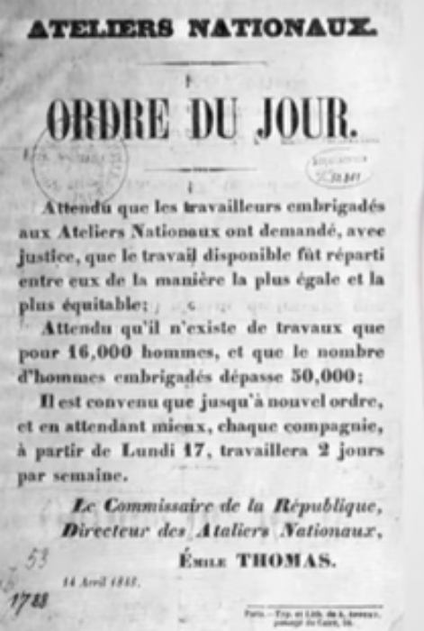

Et il s'est rendu compte qu'au fond, rien n'avait vraiment changé. On disposait des biens des autres par le vote, par la loi, ce qu'il a appelé la spoliation légale. Et ce phénomène de la spoliation légale a été au centre de son œuvre et notamment de ce petit texte qu'il a écrit à la fin de sa vie, La loi, où il oppose la spoliation légale et la propriété, le droit de propriété. Et il montre qu'au fond, la véritable solution du problème social, c'est la liberté, c'est-à-dire la propriété, la disposition de soi et du fruit de son travail.

Dans ce cours, nous allons donc voyager ensemble à travers la pensée de Frédéric Bastiat, en partant des influences de ses auteurs qui l'ont formé très tôt dès sa jeunesse, puis nous intéresserons à ses sophismes économiques, et enfin nous terminerons avec ce grand texte qui est La loi et qui nous introduira à l'analyse du marché politique, à l'analyse de la société.

## La Vie et le Contexte Historique

<chapterId>e9d92b63-83dd-552c-84e1-dd535608c109</chapterId>

En 1844, Frédéric Bastiat fait un voyage d’affaires en Espagne. Après avoir séjourné à Madrid, à Séville, à Cadix et à Lisbonne, il décide de s’embarquer pour Southampton, et d’aller visiter l'Angleterre. À Londres, il a l'occasion d'assister à des meetings de la Ligue contre les lois sur les céréales (corn laws) dont il suivait de loin les travaux. Il fait la connaissance des principaux chefs de cette Association, dont Richard Cobden, qui deviendra son ami.

C’est là que le cours de sa vie va radicalement changer. Il raconte lui-même que sa vocation d’économiste s’est décidée à ce moment-là. En rentrant en France il n’a plus qu’une seule idée en tête : faire connaître à la France le mouvement libéral qui agite l’Angleterre.

Frédéric Bastiat est né à Bayonne le 30 juin 1801. Orphelin à l’âge de 9 ans, il fait ses études au collège catholique de Sorèze. Il est doué pour les langues et apprend l’anglais, l’espagnol et même le basque. Mais il est peu motivé par les études et renonce à passer le Baccalauréat pour aller travailler dans l’entreprise d’import-export de son oncle à Bayonne.

En 1825, il hérite de son grand-père d’un domaine agricole qu’il gère comme un « gentleman-farmer », selon son expression. Il découvre alors, sur le terrain, les problèmes engendrés par l’absence de définition claire des droits de propriété. Il décide de s’engager comme juge de paix de sa ville de Mugron, au cœur des Landes, un carrefour fluvial et donc commercial, entre les ports de Bordeaux et de Bayonne. Puis il sera élu membre du Conseil général des Landes.

Très vite, il se passionne pour l’économie politique et étudie les œuvres d’Adam Smith, Jean-Baptiste Say, Destutt de Tracy, Charles Dunoyer et Charles Comte. Il lit les journaux anglais et c’est là qu’il apprend l’existence d’une ligue anglaise pour le libre-échange.

_(Say, Cobden, Smith, Chevalier, Dunoyer, Destutt de Tracy)_

À son retour d'Angleterre, il écrit un article intitulé : « De l'influence des tarifs anglais et français sur l'avenir des deux peuples », qu'il envoie au Journal des Économistes à Paris. L'article parait dans le numéro d'octobre 1844, et il obtint un succès complet. Tout le monde admire son argumentation puissante et incisive, son style sobre et élégant.

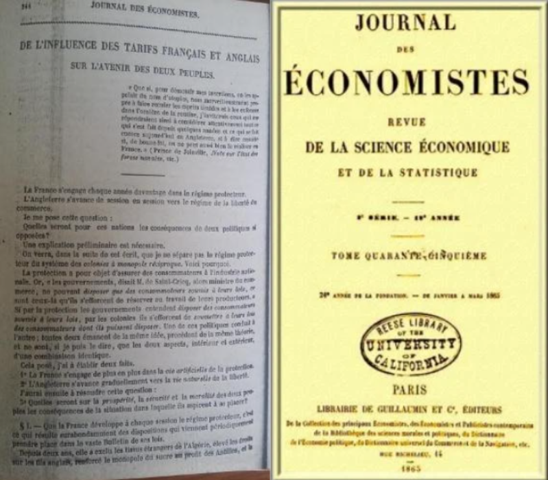

Le Journal des Économistes lui demande alors de nouveaux articles et plusieurs membres de la Société d'économie politique, notamment Horace Say, le fils de Jean-Baptiste Say et Michel Chevalier, professeur renommé, lui adressent leurs félicitations, en l'engageant à poursuivre avec eux l'œuvre de diffusion des vérités économiques. C’est le début d’une nouvelle vie, à Paris.

Il publie d'abord la première série des Sophismes économiques, dans lesquels il s’attaque aux protectionnistes avec une verve pleine d'audace et d’ironie. A Paris, il commence même un cours d'économie politique dans une salle privée, suivi avec empressement par l'élite étudiante.

L’année suivante, il créé en France l’« Association pour le libre-échange », et se jette dans le combat contre le protectionnisme en France. Il lève des fonds, crée une revue hebdomadaire et donne des conférences dans tout le pays.

Une première réunion a lieu à Bordeaux, le 23 février 1846, dans laquelle l'Association bordelaise pour la liberté des échanges est constituée. Bientôt le mouvement se propage dans toutes la France. A Paris, un premier noyau est formé parmi les membres de la Société des Économistes, auxquels s'adjoignent des députés, des industriels et des négociants. Des groupes importants se forment aussi à Marseille, à Lyon et au Havre.

La Révolution de février 1848 renverse la monarchie de Louis-Philippe, appelée monarchie de Juillet (1830-1848) et voit l’avènement de la Seconde république. Bastiat est alors élu membre de l’assemblée législative comme député des Landes. Il siège au centre-gauche, avec Alexis de Tocqueville, entre les monarchistes et les socialistes. Là, il s’emploie à défendre les libertés individuelles comme les libertés civiles et s’oppose à toutes les politiques restrictives, qu’elles viennent de droite ou de gauche. Il est élu vice-président du Comité des finances et s’efforce de rappeler constamment à ses collègues députés cette vérité simple, mais souvent oubliée dans les parlements :

> On ne peut rien donner aux uns, par une loi, sans être obligés de prendre aux autres par une autre loi.

La quasi-totalité de ses livres et de ses essais seront écrits au cours des six dernières années de sa vie, de 1844 à 1850. En 1850, Bastiat écrit deux de ses œuvres les plus célèbres : La Loi et une série de pamphlets intitulée Ce qu’on voit et ce qu’on ne voit pas. La Loi a été traduite en de nombreuses langues étrangères, dont l’anglais, l’allemand, l’espagnol, le russe et l’italien.

Il meurt à Rome en 1850, des suites d’une tuberculose. Il est enterré à l’église Saint Louis de Français à Rome.

# Les influences

<partId>4d312b17-5740-5d33-8309-015e2b59b6dd</partId>

## Adam Smith et Jean-Baptiste Say

<chapterId>bcc7a12a-6cc4-5061-85e3-0e31fb1f0a49</chapterId>

En économie Bastiat a toujours témoigné de sa dette envers Adam Smith et Jean-Baptiste Say. A 26 ans, il écrit à l’un de ses amis « je n’ai jamais lu sur ces matières que ces quatre ouvrages, Smith, Say, Destutt, et le Censeur».

_(Jean-Baptiste Say et Adam Smith)_

L'économie politique, telle que l’ont conçue Adam Smith et J.-B. Say tient tout entière dans un mot : liberté. Liberté du commerce, liberté de l'individu, libre-échange et libre initiative. Le libre-échange avait d’abord été défendu par les physiocrates, tels que François Quesnay
ou Vincent de Gournay, puis par Adam Smith qui fait la synthèse de leurs idées et de ses propres observations. Enfin, Jean-Baptiste Say, à la fin du XVIIIe siècle, va clarifier la doctrine de son maître Adam Smith et la corriger sur certains points dans son magistral Traité d’Économie politique.

_(Say, Destutt de Tracy, Quesnay, de Gournay)_

Adam Smith s’intéresse à la prospérité, non comme une fin en soi mais comme un moyen pour l’élévation morale des individus. Pour lui, la richesse des nations est faite de la richesse des individus. Si vous voulez une nation prospère, dit Adam Smith, laissez les individus agir librement. Et le marché fonctionne parce qu’il permet à chacun d’exprimer ses préférences et de poursuivre son intérêt.

La grande nouveauté des économistes modernes, à l’aube du XVIIIe siècle, est qu’ils s’intéressent à chaque individu avec la volonté de lui rendre sa capacité d’action tout en réfléchissant à la manière de contenir les passions et les conflits. L’homme veut naturellement améliorer son sort et celui de ses proches par l’échange de biens et de services.

Ce que montre Adam Smith, c’est qu’on ne peut servir son propre intérêt qu’en servant l’intérêt des autres

> Donnez-moi ce dont j'ai besoin, et vous aurez de moi ce dont vous avez besoin vous-mêmes. (…) Ce n'est pas de la bienveillance du boucher, du marchand de bière ou du boulanger, que nous attendons notre dîner, mais bien du soin qu'ils apportent à leurs intérêts.

L’échange est un jeu à somme positive. Ce que l’un gagne, l’autre le gagne aussi. Il se distingue ainsi de la redistribution politique où il y a toujours un gagnant et un perdant. Si l’on considère l’école anglaise, pour Smith, pour Ricardo et pour Locke avant eux, la valeur est liée au travail. Pour Marx il en va de même.

_(Marx, Richardo, Smith, Locke)_

En revanche, Bastiat admettra avec Jean-Baptiste Say que l'utilité est le véritable fondement de la valeur. Le travail ne fait pas la valeur. La rareté non plus. Tout découle de l’utilité. En effet nul ne consent à rémunérer un service que, parce ce qu’il le juge utile. On ne produit jamais que de l'utilité.

Mais Bastiat va également nuancer Say sur ce point. Il ne s'agit pas de l'utilité qui est dans les choses, il s’agit de l'utilité relative des services. « La valeur, c’est le rapport de deux services échangés », selon ses propres mots. La valeur est donc subjective et la seule façon d’appréhender les préférences des individus c’est d’observer leurs comportements sur un marché libre. Le marché est révélateur des préférences individuelles et le grand régulateur de la société grâce à l’échange.

L’économie obéit à un certain nombre de lois simples tirées du comportement humain. L’une d’elles, appelée « loi de Say », est la suivante : « Les produits et les services s’échangent contre des produits et des services ». Son idée c’est que les nations et les personnes profitent de la hausse du niveau de production car elle offre des possibilités accrues d’échanges mutuellement bénéfiques.

En effet, les produits ne sont achetés qu’en vue des services qu’en escompte l’acheteur : j’achète un disque pour la musique que j’écouterai, j’achète un ticket de cinéma pour le film que j’irai voir. Et dans un échange, chaque partie se décide parce qu’elle juge pouvoir tirer, de ce qu’elle acquiert, plus de services que ce qu’elle cède. Dans ce cadre, la monnaie n’est qu’une marchandise intermédiaire, elle rémunère un service rendu et ouvre sur d’autres services.

Pour Bastiat, l’économie d’échanges, c’est-à-dire de services mutuels librement offerts et acceptés, est ce qui fonde la paix et la prospérité, ce qui permet l’harmonie des intérêts.

Mais de Jean-Baptiste Say, Frédéric Bastiat hérite également d’un concept-clé, celui de spoliation. Car, dit-il en reprenant les termes de Say:

> Il n’y a que deux moyens de se procurer les choses nécessaires à la conservation, l’embelllissement et au perfectionnement de la vie : la production et la spoliation.

Les producteurs ont recours à la persuasion, à la négociation et au contrat, tandis que les spoliateurs ont recours à la force et à la ruse. Il appartient donc à la loi de réprimer la spoliation et de sécuriser le travail ainsi que la propriété. Comme l’avait déjà énoncé Adam Smith, garantir la sûreté des citoyens est la mission principale de l’autorité publique et c’est elle qui légitime le prélèvement de l’impôt.

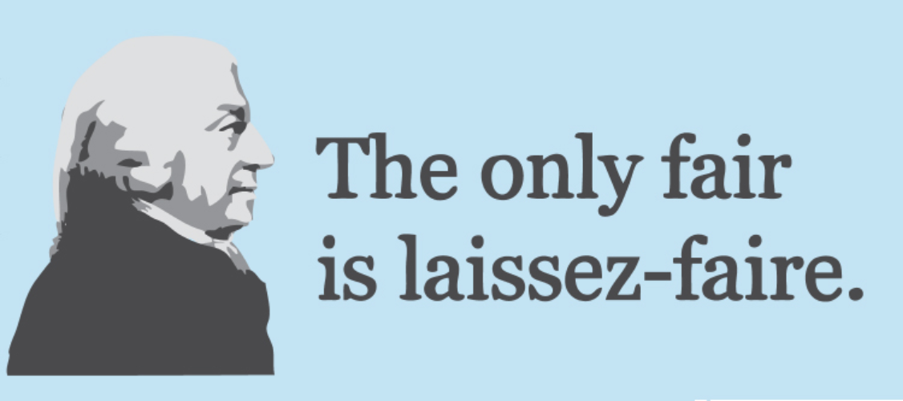

## Antoine Destutt de Tracy

<chapterId>ddf64e9f-2ce0-5651-8eb8-bae578eb0b9b</chapterId>

On le sait peu mais Destutt de Tracy a exercé une influence décisive sur le futur président des États-Unis Thomas Jefferson, alors ambassadeur à Paris dans les années 1780.

> Pour tout homme, le premier pays est sa patrie, et le second, c'est la france" & " La tyrannie, c'est lorsque le peuple a peur de son gouvernement; la liberté c'est le gouvernement qui a peur du peuple.
>  
> Thomas Jefferson

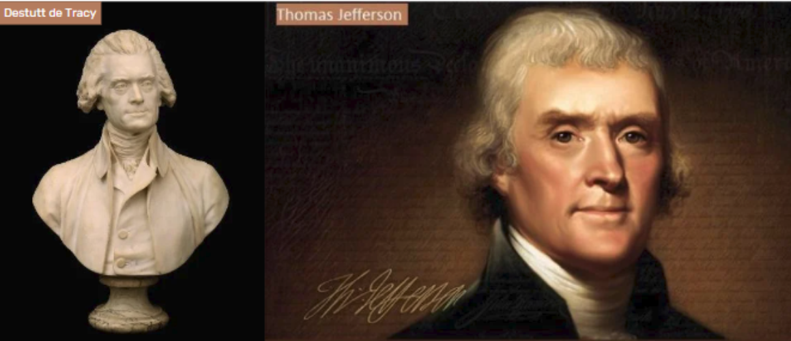

En effet, son Traité d'économie politique condamnait le protectionnisme et l'expansion napoléonienne. Il fut donc interdit de publication en France par Bonaparte. En revanche, il a été traduit en anglais et publié aux États-Unis par Jefferson lui-même. Il fera de ce texte le premier manuel d’économie politique de l’université de Virginie, qu’il venait de fonder à Charlottesville. Le Traité ne fut publié en France qu’en 1819 !

Destutt de Tracy, philosophe et économiste, fut le chef de file de l'école dite des « Idéologues », qui rassemblait des gens comme Cabanis, Condorcet, Constant, Daunou, Say et Germaine de Staël. Ils sont les héritiers des Physiocrates et les disciples directs de Turgot

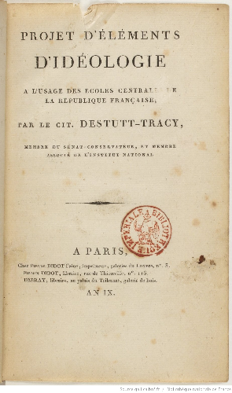

Par idéologie Tracy entendait simplement la science qui a pour objet l'étude des idées, de leur origine, de leurs lois, de leur rapport avec le langage, c’est-à-dire, en termes plus contemporains, l’épistémologie. Le terme « idéologie » n’a pas la connotation péjorative que lui conférera Marx par la suite pour jeter le discrédit sur les économistes du « laissez-faire ». La revue du mouvement des idéologues s’appelait La Décade philosophique et littéraire

Elle domina la période révolutionnaire et fut dirigée par Jean-Baptiste Say. Destutt de Tracy fut élu membre de l’Académie française en 1808 et de l’Académie des sciences morales et politiques en 1832. Sa fille épousa Georges Washington de La Fayette (le fils du premier président américain) en 1802, ce qui montre la grande proximité qui existait encore entre la France et la jeune Amérique à cette époque.

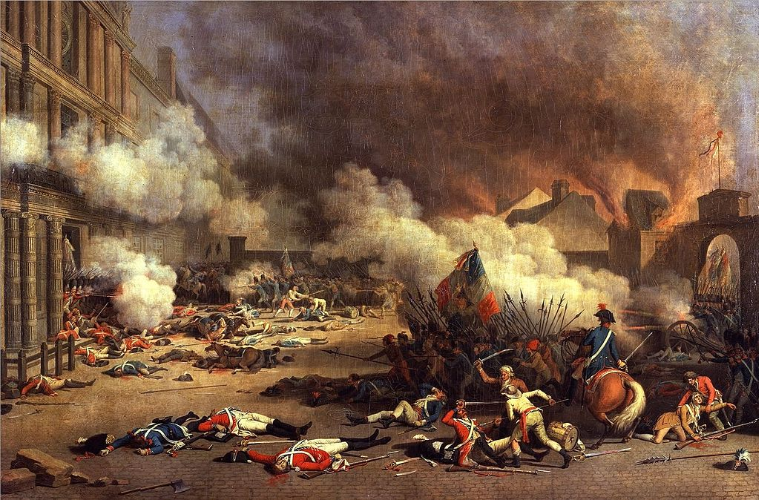

L'objet de son Traité d'économie politique est d’« examiner la meilleure manière d'employer toutes nos facultés physiques et intellectuelles à la satisfaction de nos divers besoins ». Son idée est que le commerce est la source de tout bien humain, il est la force civilisatrice, rationalisatrice et pacificatrice du monde. La grande maxime de l’économie politique se formule chez lui de la manière suivante : « le commerce est toute la société, comme le travail est toute la richesse ». Il envisage en effet la société comme « une série continue d'échanges dans lesquels les deux contractants gagnent toujours ». Le marché est donc le contraire de la prédation. Il enrichit les uns, sans appauvrir les autres. Comme on le dira plus tard, il n'est pas un « jeu à somme nulle », mais un jeu à somme positive.

Notre auteur n'ira pas jusqu'à définir l'économie politique comme la science des échanges. Mais ce même raisonnement sera repris et conduit jusqu’au bout par Bastiat. La vente est un échange d'objets, la location est un échange de services et le prêt n'est qu'un échange différé. L'économie politique devient dès lors chez Bastiat « la théorie de l’échange ».

Selon Destutt de Tracy, la propriété découle nécessairement de notre nature, de notre faculté de vouloir. Si l’homme ne voulait rien, il n’aurait ni droits ni devoirs. Pour subvenir à ses besoins et remplir ses devoirs, l’homme doit employer des moyens qu’il acquiert par son travail. Et la forme d’organisation sociale conforme à cette fin est la propriété privée. C’est pourquoi l’unique objet du gouvernement est de protéger la propriété et de permettre l’échange pacifique.

Pour lui les impôts les meilleurs sont les plus modérés et il souhaite que les dépenses de l'État soient aussi restreintes que possible. Il condamne la spoliation des richesses de la société par le gouvernement sous forme de dette publique, d’impôts, de monopoles bancaires et de dépenses. Encore une fois, la loi ne doit servir qu’à protéger la liberté, elle ne doit jamais spolier.

Enfin il ajoute cette recommandation qui n’a pas perdu de son actualité :

> Que le gouvernement ne fasse et ne puisse faire des dettes qui engagent les générations ultérieures et conduisent toujours les États à leur ruine.

En conclusion, les Idéologues ont eu une intuition profonde, à savoir que la production et les échanges sont la vraie solution aux problèmes politiques et la véritable alternative aux guerres. Les guerres sont toujours prédatrices qu'elles soient intérieures, comme sous la Révolution ou extérieures, comme celles menées par les anciens rois et par Napoléon.

## Charles Comte et Charles Dunoyer

<chapterId>80bc5c4e-ac07-52c8-9dd7-e224ac291bda</chapterId>

L'histoire de toutes les civilisations est celle du combat entre les classes spoliatrices et les classes productives. Tel est le crédo des deux auteurs dont nous allons parler. Ils sont à l’origine d’une théorie libérale de la lutte des classes qui a inspiré Frédéric Bastiat autant que Karl Marx, bien que ce dernier l’ait déformée.

Pour Comte et Dunoyer, la spoliation, c'est-à-dire toutes les formes de violence exercées dans la société par les forts sur les faibles, est la grande clé qui permet de comprendre l'histoire humaine. Elle est à l’origine de tous les phénomènes d’exploitation d’une classe par une autre.

Si Frédéric Bastiat doit sa formation économique à Smith, Destutt de Tracy et Say, il doit sa formation politique aux leaders du journal Le Censeur, Charles Comte et Charles Dunoyer.

Cette revue (1814-1819), rebaptisée Le Censeur européen après les Cent Jours, diffusera les idées libérales qui triomphèrent en 1830 avec l’insurrection des 3 Glorieuses et l’arrivée au pouvoir du duc d’Orléans, Louis-Philippe 1er

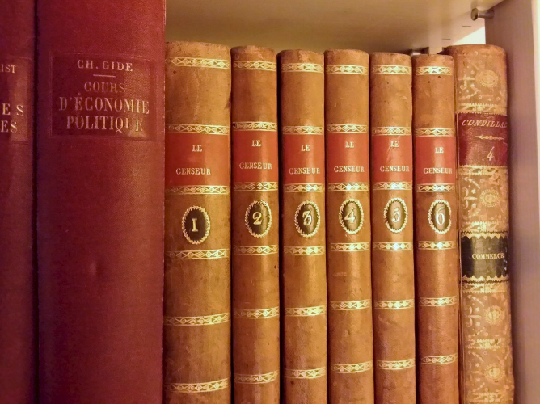

Charles Comte, cousin d’Auguste Comte et gendre de Say, est le fondateur de la revue. Il sera bientôt rejoint par Charles Dunoyer, un juriste comme lui, puis par un jeune historien, Augustin Thierry, ancien secrétaire de Saint Simon. Leur devise sur la une de chaque numéro de la revue était « Paix et Liberté ».

Quel est le but de la revue ? Le titre parle de lui-même : censurer le gouvernement. Lutter contre l’arbitraire du pouvoir en éclairant l’opinion publique, défendre la liberté de la presse.

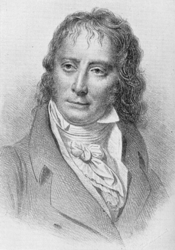
_(Benjamin Constant)_

Ils retiennent de Benjamin Constant la distinction entre les Anciens et les Modernes, caractérisée par la guerre d'une part, le commerce et l'industrie de l'autre. Mais ils ajoutent avec Say que l’économie politique fournit la meilleure explication des phénomènes sociaux. Ils comprennent en particulier que les nations atteignent la paix et la prospérité lorsque les droits de propriété et le libre-échange sont respectés. Désormais, pour eux l'économie politique est le véritable et unique fondement de la politique. A la philosophie, qui se cantonne dans la critique abstraite des formes de gouvernement, il faut substituer une théorie fondée sur la connaissance des intérêts économiques :

> L'économie politique, en faisant voir comment les peuples prospèrent et dépérissent, a posé les véritables fondements de la politique.
>  
> Dunoyer

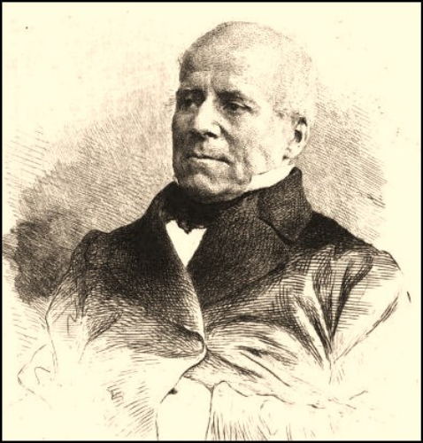

Cette nouvelle théorie sociale contient l’un des éléments qui deviendra la pierre angulaire du socialisme scientifique de Marx et Engels : la lutte des classes. Mais en quoi consiste la théorie libérale de la lutte des classes et en quoi diffère-t-elle du marxisme ?

Elle prend comme point de départ l'homme qui agit en vue de subvenir à ses besoins et désirs. Du moment qu'on crée, c’est-à-dire qu'on augmente l'utilité des choses, qu’on augmente leur valeur, on exerce une industrie. Ici un industriel n’est pas un patron d’industrie, comme pourrait le laisser penser la langue actuelle, mais un producteur, quel que soit le domaine dans lequel il exerce son métier. C’est pourquoi leur théorie s’appelle l'industrialisme. Elle pose que l'objectif de la société est la création d'utilité au sens large, c'est-à-dire des biens et des services utiles à l'homme.

Sur ce point, l'homme a le choix entre deux alternatives fondamentales : il peut piller la richesse produite par d'autres ou il peut travailler pour produire lui-même des richesses Dans toute société, on peut clairement distinguer ceux qui vivent du la spoliation, de ceux qui vivent de la production. Sous l'Ancien Régime, la noblesse, s'attaquait directement aux plus industrieux pour vivre d’une nouvelle forme de tribut : l'impôt. A la noblesse rapace a succédé les hordes de fonctionnaires-bureaucrates, non moins rapaces.

Alors que pour Marx, l’antagonisme de classe se situe au sein même de l’activité productive, entre les salariés et les patrons, pour Comte et Dunoyer les classes en conflits, sont, d’un côté les producteurs de la société, qui paient l’impôt (y compris les capitalistes, ouvriers, paysans, savants etc.) et de l’autre, les non-producteurs, qui vivent de rentes financées par l’impôt, « la classe oisive et dévorante » (bureaucrates, fonctionnaires, politiciens, bénéficiaires de subventions ou de protections).

Ensuite, à la différence de Marx, les auteurs du Censeur Européen ne prônent pas la guerre des classes. Ils militent au contraire pour la paix sociale. Et celle-ci, selon eux, ne passera que par la dépolitisation de la société. Pour cela, il importe de réduire d’abord le prestige et les avantages des fonctions publiques. Il importe ensuite de donner dans le corps politique l’influence aux producteurs.

Finalement, la seule manière de débarrasser le monde de l’exploitation d’une classe par une autre consiste à détruire le mécanisme même qui rend cette exploitation possible : le pouvoir de l’État de distribuer et de contrôler la propriété et la répartition des avantages qui y sont liés (les « places »).

Leurs idées, profondément novatrices, marqueront définitivement Frédéric Bastiat qui deviendra lui-même un profond penseur des crises politiques.

## Cobden et la Ligue

<chapterId>7181435c-5eae-56e4-8e55-02a24273fdd6</chapterId>

Nous sommes en 1838, à Manchester, un petit nombre d’hommes, peu connus jusqu’alors, se réunissent pour chercher le moyen de renverser le monopole des propriétaires de terres à blé par les voies légales et pour accomplir, comme le racontera Bastiat par la suite,

> Sans effusion de sang, par la seule puissance de l’opinion, une révolution aussi profonde, plus profonde peut-être que celle qu’ont opérée nos pères en 1789.

De cette réunion va sortir la Ligue contre les lois sur les blés, les corn-laws, ou les lois-céréales, selon l’expression de Bastiat. Mais très vite, cet objectif deviendra celui de l'abolition totale et unilatérale du protectionnisme.

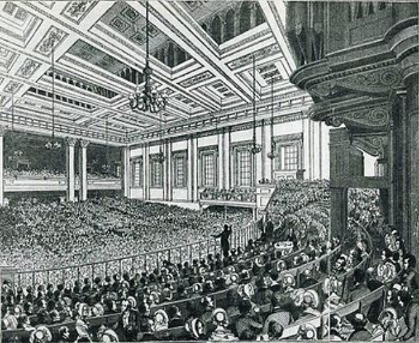

Cette bataille économique pour la liberté des échanges va occuper toute l’Angleterre jusqu’en 1846. En France, on ne soupçonne absolument pas, en dehors d’un petit nombre d’initiés, l’existence de ce vaste mouvement. C'est en lisant un journal anglais, auquel il s'est abonné par hasard, que Frédéric Bastiat apprend l'existence de la Ligue en 1843. Enthousiasmé, il traduit les discours de Cobden, de Fox et de Bright. Puis il correspond avec Cobden et finalement, en 1845, il part à Londres assister aux gigantesques meetings de la Ligue.

C'est cette campagne d’agitation pour le libre-échange, à travers tout le royaume, avec des dizaines de milliers d’adhérents, qui a mis le feu à la plume de Bastiat et qui a changé radicalement et définitivement le cours de son existence.

On peut comparer la Ligue à une université itinérante, faisant, dans tout le pays l’éducation économique de ceux qui assistent à ses réunions, petites gens, industriels, cultivateurs et fermiers, tous ceux dont la Ligue avait pris en main la défense et dont les lois-céréales opprimaient les intérêts. Richard Cobden était l’âme du mouvement et un agitateur hors pair.

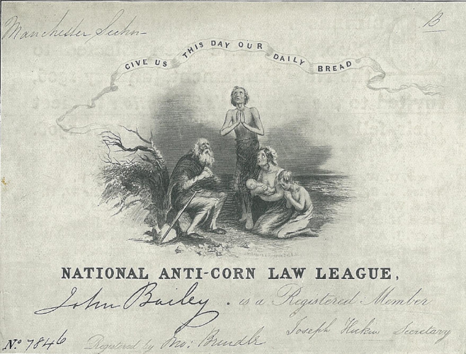

Orateur fascinant et redoutable, il avait un don prodigieux pour inventer des formules saisissantes et concises, loin des discours abstraits des économistes.

> Qu’est-ce que le monopole du pain? s’écriait-il. C’est la pénurie du pain. Vous êtes surpris d’apprendre que la législation de ce pays, à ce sujet, n’a pas d’autre objet que de produire la plus grande pénurie de pain possible. Et cependant ce n’est pas autre chose. La législation ne peut atteindre le but qu’elle poursuit que par la pénurie.

En 1845, Bastiat fait paraître à Paris son livre Cobden et la Ligue, avec ses traductions accompagnées de commentaires. Le livre s'ouvre par une introduction sur la situation économique de l'Angleterre, sur l’histoire de l’origine et des progrès de la Ligue. Depuis 1815, le protectionnisme était très développé en Angleterre. Il existait en particulier des lois limitant les importations de grains qui avaient des conséquences très dures pour le peuple. En effet, le blé était nécessaire à la fabrication du pain, denrée vitale à l'époque. Par ailleurs ce système favorisait l'aristocratie, c’est-à-dire les grands propriétaires terriens, qui en tiraient des rentes.

> Ce qui coexiste en Angleterre, écrit Bastiat, c’est un petit nombre de spoliateurs et un grand nombre de spoliés, et il ne faut pas être un grand économiste pour en conclure l’opulence des uns et la misère des autres.

L’objectif de la Ligue était de mobiliser l'opinion publique pour faire pression sur le parlement afin de supprimer la loi sur les grains. À terme, Cobden et ses amis espéraient :

- Augmenter les débouchés industriels
- Accroître l'emploi
- Diminuer le prix du pain
- Rendre l'agriculture et l'industrie plus efficaces grâce à la concurrence
- Promouvoir la paix entre les nations

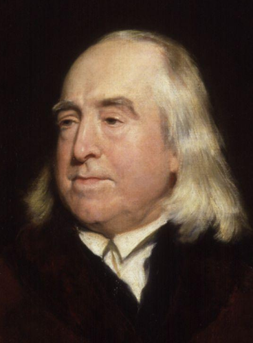
_(Jeremy Bentham)_

Disciple de l’utilitarisme de Bentham, la conviction de Cobden était que la liberté du travail et des échanges servait directement l’intérêt des masses les plus nombreuses, les plus pauvres, les plus souffrantes de la société. Au contraire, les douanes comme instrument de prohibitions arbitraires et de privilèges ne pouvaient que profiter à certaines industries les plus puissantes.

Aux élections de 1841, cinq membres de la ligue, dont Cobden, sont élus au parlement. Le 26 mai 1846, le libre-échange unilatéral devint la loi du royaume. Dès lors le Royaume-Uni va connaître une éclatante période de liberté et de prospérité.

Ce qui est intéressant, c'est que Bastiat s'est approprié une partie de leur méthode, il s'est assimilé leur langage et l'a transposé dans le contexte français. Le livre sur Cobden et la Ligue obtint un rapide succès et Bastiat fit une entrée fracassante dans le monde des économistes. Il fonda à Bordeaux une association en faveur de la liberté commerciale puis l’installa à Paris. On lui offrit la direction du Journal des Économistes. Le mouvement était né, il se poursuivra jusqu'en 1848.

C’est seulement après la mort de Bastiat, en 1866, que Napoléon III signera un traité de libre-échange avec l’Angleterre, sorte de victoire posthume pour celui qui avait consacré les 6 dernières années de sa courte vie à cette grande idée.

_(Michel Chevalier)_

La question du libre-échange continue de se poser aujourd’hui. Les manuels de géographie dans les écoles prétendent que la mondialisation est coupable et que les pays pauvres auraient besoin de l'aide occidentale pour s'en sortir. Pourtant, l'extrême pauvreté a reculé de moitié en 20 ans. C’est en faisant le choix de l’ouverture que des pays comme l’Inde, la Chine ou Taïwan, ont pu sortir de la pauvreté, alors que la stagnation caractérise des pays fermés comme la Corée du Nord ou le Vénézuela. Selon l'ONU, 36% de l'humanité vivait dans le dénuement total en 1990. Ils ne sont plus « que » 18% en 2010. L'extrême pauvreté reste un défi majeur, mais elle recule.

# Les Adversaires

<partId>f902ed30-269e-5e44-a76d-8efd1a4e4085</partId>

## Rousseau

<chapterId>c3926110-e0b2-503c-96d9-5d3a6a661484</chapterId>

Frédéric Bastiat, qui s'est exprimé dans les années 1840, est l'héritier d'une génération de philosophes des Lumières qui se sont battus contre la censure et pour la liberté de débattre. Pensons ici à Montesquieu, Diderot Voltaire, Condorcet mais aussi à Rousseau .

Pour eux, l'idée était simple : plus on laisse les idées s'exprimer, plus la vérité progresse et plus les erreurs se réfutent facilement. La science progresse d'ailleurs toujours de cette manière.

_(Montesquieu, Diedrot, Voltaire, Condorcet, Rousseau)_

En revanche, peu ont compris que ce qui était vrai pour les idées, l'était également pour les biens et les services. La liberté d'échanger avec autru i a en effet deux vertus, celle d'être efficace et celle de conduire à une plus juste répartition. Non seulement Rousseau ne l’a pas compris mais il a combattu cette liberté au nom d’une fausse idée de la loi et du droit. L’une des sources majeures du socialisme, note Bastiat, c'est l'opinion de Rousseau selon laquelle l’ordre social tout entier découle de la loi.

Bastiat considère en effet Rousseau comme le véritable précurseur du socialisme et du collectivisme. On trouve chez l’auteur du Contrat social une phrase qui résume assez bien sa philosophie : : « nous ne commençons à devenir hommes qu’après avoir été citoyens ».

Au départ, l’homme n’est qu’un bourgeois. Or le bourgeois est un calculateur, il veut son plaisir immédiat, il est asservi à ses sens, à ses désirs, à son intérêt particulier. Bref il n’est pas rationnel, donc il n’est pas libre. Il a besoin d’être éduqué, de comprendre que son véritable intérêt est l’intérêt général. C’est pourquoi écrit Rousseau dans le Contrat Social.
:

> Quiconque refusera d’obéir à la volonté générale y sera contraint par tout le corps: ce qui ne signifie autre chose sinon qu’on le forcera d’être libre.

Selon cette doctrine, l’homme a deux volontés en lui : une volonté qui tend à l’intérêt personnel, celle du bourgeois et une volonté qui tend à l’intérêt général, celle du citoyen. Conduire les hommes, y compris par la force, à vouloir une fin rationnelle, l’intérêt général, c’est conduire les hommes à devenir libres. Ce qu’ils veulent vraiment, c’est une fin rationnelle, même s’ils ne le savent pas.

Il est donc parfaitement légitime, selon Rousseau, de contraindre des hommes au nom d’une fin qu’eux-mêmes, s’ils avaient été plus éclairés, auraient poursuivie, mais qu’ils ne poursuivent pas parce qu’ils sont aveugles, ignorants ou corrompus. La société est fondée à les forcer à faire ce qu’ils devraient désirer spontanément s’ils étaient éclairés. Et ce faisant, on ne leur fait pas violence puisqu’on les conduit à être « libres », c’est-à-dire à faire les bons, choix, les choix conformes à leur moi véritable.

Convaincu que la bonne société est une création de la loi, Rousseau accorde donc un pouvoir sans limite au législateur. C’est à lui de transformer les personnes en hommes accomplis, en citoyens.

Mais, c’est également à la loi de faire exister la propriété. Selon Rousseau, la propriété ne peut être légitime que si elle est réglementée par le législateur. En effet le mal réside dans l'inégalité et la servitude, qui proviennent toutes deux de la propriété. Celle-ci est une invention des forts qui a conduit à la mauvaise société, à la société bourgeoise, aux rapports de domination

Dans son Discours sur l’origine et les fondements de l’inégalité, il écrit ce passage célèbre

> Le premier qui ayant enclos un terrain s’avisa de dire : Ceci est à moi, et trouva des gens assez simples pour le croire, fut le vrai fondateur de la société civile. Que de crimes, de guerres, de meurtres, que de misères et d’horreurs n’eût point épargnés au genre humain celui qui, arrachant les pieux ou comblant le fossé, eût crié à ses semblables : “Gardez-vous d’écouter cet imposteur ; vous êtes perdus si vous oubliez que les fruits sont à tous et que la terre n’est à personne!.

La propriété naturelle est donc la source du mal. Et Marx, grand lecteur de Rousseau, s’en souviendra. Comment combattre ce mal ? Par le contrat social, répond Rousseau. En effet la bonne société est celle qui résulte d'un contrat qui stipule l’aliénation de l’individu avec tous ses droits à la communauté. Dès lors, c’est à la communauté de concéder à l’individu des droits par l’intermédiaire de la loi.

A l'opposé de Rousseau, Frédéric Bastiat dit que « l'homme naît propriétaire. » Pour lui, la propriété est une conséquence nécessaire de la nature de l'homme, de sa constitution. Il écrit que « l'homme naît propriétaire, parce qu'il naît avec des besoins dont la satisfaction est indispensable à la vie, avec des organes et des facultés dont l'exercice est indispensable à la satisfaction de ces besoins ». Or les facultés ne sont que le prolongement de la personne et la propriété n'est que le prolongement des facultés. Autrement dit, c’est l’usage de nos facultés dans le travail qui légitime la propriété.

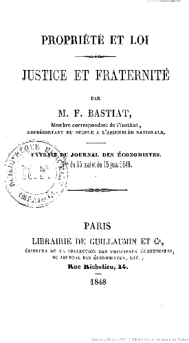

Selon Bastiat, la société, les personnes et les propriétés existent antérieurement aux lois, et il a cette phrase fameuse : « Ce n'est pas parce qu'il y a des lois qu'il y a des propriétés, mais parce qu'il y a des propriétés qu'il y a des lois ». C’est pourquoi la loi doit être négative : elle doit empêcher qu’on empiète sur les personnes et leurs biens. La propriété est la raison d’être de la loi et non l’inverse.

## L’Éducation Classique

<chapterId>87d9a8c9-2352-5cb2-8b93-678118a8145c</chapterId>

Le 24 février 1848, au terme de trois jours d'émeutes à Paris le roi Louis-Philippe 1er quitte le pouvoir. C'est la naissance de la seconde République.

Bastiat est à Paris, il assiste en direct aux événements. Un peu plus tard, il écrira :

> Au 24 février, j'ai pu craindre, comme bien d'autres, que la nation ne fût pas préparée à se gouverner elle-même. Je redoutais, je l'avoue, l'influence des idées grecques et romaines qui nous sont imposées à tous par le monopole universitaire.

On est surpris à la lecture de ce passage. Que viennent faire ici l’Antiquité grecque et romaine ?

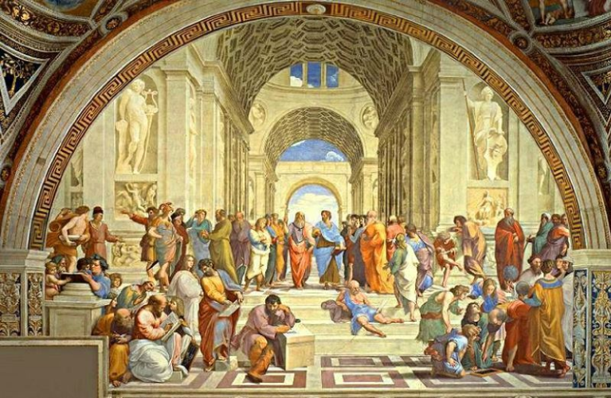

Bastiat fait allusion à la République de Platon et à sa théorie du philosophe-roi, mais aussi à Sparte, que Rousseau admirait tant, à l’empire romain, dont Napoléon était si nostalgique. Malheureusement, ces idées grecques et romaines reposent sur une idée fausse selon Bastiat : l’idée de l’omnipotence du législateur, de la souveraineté absolue de la loi.

Il suffit d’ouvrir à peu près au hasard, un livre de philosophie, de politique ou d'histoire pour trouver cette idée, enracinée dans notre culture, que l'humanité est une matière inerte recevant du pouvoir politique la vie, l'organisation, la moralité et la prospérité. Livrée à elle-même, l'humanité tendrait vers l’anarchie et ne serait sauvée de ce désastre que par la main mystérieuse et omnipotente du Législateur. Or cette idée, dit Bastiat, a été longuement mûrie et préparée par des siècles d’éducation classique.

En premier lieu, dit-il, les Romains considéraient la propriété comme un fait purement conventionnel, comme une création artificielle de la loi écrite. Pourquoi ? Simplement, explique Bastiat, parce qu’ils vivaient de l’esclavage et du pillage. Pour eux toutes les propriétés étaient le fruit de la spoliation. Ils ne pouvaient donc introduire dans la législation l’idée que le fondement de la propriété légitime était le travail sans détruire les fondements de leur société.

Ils avaient bien une définition empirique de la propriété, « jus utendi et abutendi » (le droit d’user et d’abuser). Mais cette définition ne concernait que les effets et non les causes, autrement dit les origines éthiques de la propriété. Pour établir la propriété correctement, il faut remonter jusqu'à la constitution même de l'homme, et comprendre le rapport et l'enchaînement nécessaire qui existent entre les besoins, les facultés, le travail et la propriété. Les Romains, qui étaient propriétaires d'esclaves, pouvaient-ils concevoir l'idée que « tout homme se possède lui-même, et par conséquent son travail, et, en conséquence, le produit de son travail » ? se demande Bastiat.

> Ne soyons donc pas surpris, conclut Bastiat, de voir se reproduire, dans le dix-huitième siècle, cette idée romaine que la propriété est un fait conventionnel et d'institution légale; que, bien loin que la Loi soit un corollaire de la Propriété, c'est la Propriété qui est un corollaire de la Loi.

On retrouve en effet chez Rousseau cette idée commune des juristes de faire reposer la propriété sur la loi. Rousseau attribue à la loi, et par suite au peuple, une puissance absolue sur les personnes et les propriétés.

Et dans cette conception, qui constitue l’idée même de république depuis la révolution française, le législateur doit organiser la société, comme un architecte social, comme un mécanicien qui invente une machine à partir d’une matière inerte, ou comme un potier qui façonne de l’argile. Le législateur se place ainsi en dehors de l’humanité, au-dessus d’elle, pour l’arranger à sa guise, selon des plans conçus par sa lumineuse intelligence.

Au contraire, pour Bastiat, le droit de propriété est antérieur à la loi. C’est ce qu’il appelle le principe des économistes, par opposition au principe des juristes. Alors que « le principe des juristes renferme virtuellement l'esclavage, dit Bastiat, celui des économistes contient la liberté.

Qu’est-ce donc que la liberté ? C’est la propriété, le droit de jouir du fruit de son travail, le droit de travailler, de se développer, d'exercer ses facultés, comme on l'entend, sans que l'État intervienne autrement que par son action protectrice.

Il est triste de penser que notre philosophie sociale et politique en est restée à l’idée que la solution à tous nos problèmes devait venir d’en haut, de la loi, de l’Etat. Mais cela s'explique. Ces idées sont inculquées tous les jours à la jeunesse dans les écoles et les universités, via le monopole de l’enseignement.

Or, comme le rappelle Bastiat, le monopole exclut le progrès.

## Le Protectionnisme et le Socialisme

<chapterId>ce6cb8a8-7dc9-5ef7-939d-9a559b4d2c74</chapterId>

_(Richard Cobden)_

Nous l’avons déjà vu, c’est d’abord le combat de Cobden contre le protectionnisme avec la ligue anglaise pour l’abolition des lois sur le blé qui amena Bastiat à écrire des articles puis des livres.

Le protectionnisme est en réalité, une forme de nationalisme économique. Il vise à écarter la concurrence des étrangers tout en prétextant la « défense des intérêts nationaux » Ils tentent alors de faire admettre aux pouvoirs publics un ensemble de contre-vérités purement démagogiques, présentées comme vertueuses : la défense des emplois, de la compétitivité etc. Bien entendu les élus cèdent à la pression des producteurs, parce ce que c’est pour eux une occasion rêvée de consolider leur clientèle et d’élargir leur pouvoir.

L’argument de la protection des emplois est ce que Bastiat appelle un sophisme. Car en réalité c’est l’équivalent d’un impôt. Elle a pour effet de rendre les produits plus chers. Prenons l’exemple que donne Bastiat lui-même.

Imaginons un couteau anglais qui se vend dans notre pays pour 2 euros, et qu’un couteau fabriqué en France en vaut 3. Si on laisse le consommateur libre d’acheter le couteau qu’il veut, il gagne un franc, qu’il peut investir ailleurs (dans un livre, ou un crayon).

Si on interdit le produit anglais, le consommateur paiera un franc de plus son couteau. Le protectionnisme se traduit donc par un profit, pour une industrie nationale et par deux pertes, l’une pour une autre industrie (celle des crayons) et l’autre pour le consommateur. Au contraire, l’échange libre fait deux heureux gagnants.

Le protectionnisme est également une forme de lutte des classes. Selon Bastiat, c’est un système fondé sur l’égoïsme et l’avidité des producteurs. Pour augmenter leur rémunération, les agriculteurs ou les industriels réclament des taxes pour fermer le marché aux produits étrangers, contraignant ainsi les consommateurs à payer leurs produits plus chers.

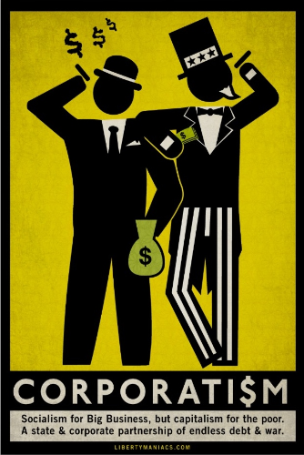

Bastiat se place résolument du côté des consommateurs. A l’intérêt de classe, il oppose l’intérêt général qui est l’intérêt du consommateur, c’est-à-dire l’intérêt de tous. C’est toujours au point de vue du consommateur que l’État devrait se placer, lorsqu’il agit.

Avec la révolution de Février 1848 et ses barricades, un ennemi plus redoutable que le protectionnisme va surgir, avec lequel il a pourtant de nombreuses affinités :

le socialisme. De quoi s’agit-il ? D’un mouvement politique qui réclame l’organisation du travail par la loi, la nationalisation des industries et des banques, la redistribution des richesses par la fiscalité. Bastiat va désormais concentrer toute son énergie, tout son talent, tous ses écrits, contre cette nouvelle doctrine qui ne peut aboutir qu’à la croissance exponentielle du pouvoir et à la lutte des classes perpétuelle. Ainsi, dès les premiers jours de la révolution, il apporte son concours à un journal éphémère nommé « La République Française », qui va passer très vite pour un journal contre-révolutionnaire. C'est l'époque où il écrit ses pamphlets sur la propriété, sur l'État, sur la spoliation et sur la loi.

Le 27 juin 1848, au lendemain d’une nouve lle sanglante insurrection à Paris, dans une longue lettre à Richard Cobden, il s’attarde sur les causes qui ont pu conduire à ces événements.

- 1° La première de ces causes, c’est l’ignorance économique. C’est elle qui prépare les esprits à recevoir les utopies du socialisme et du faux républicanisme. Je renvoie sur ce point à la vidéo précédente, sur les tendances de l'éducation classique et universitaire.

- 2° La nation s'est entichée de l'idée qu'on pouvait introduire la fraternité et la solidarité dans la loi. C’est-à-dire qu’on a exigé de l'État qu'il fasse directement le bonheur des citoyens. Ici Bastiat aperçoit les débuts de l’État providence.

Et il ne cessera par la suite d’en analyser les effets pervers. En voici un par exemple, cité dans la lettre à Cobden :

> En vertu des penchants naturels du cœur humain, chacun s'est mis à réclamer pour lui, de l'État, une plus grande part de bien-être. C'est-à-dire que l'État ou le trésor public a été mis au pillage. Toutes les classes ont demandé à l'État, comme en vertu d'un droit, les moyens d'existence. Les efforts faits dans ce sens par l'État n'ont abouti qu'à des impôts et des entraves, et à l'augmentation de la misère.

- 3° Bastiat ajoute qu’à ses yeux, le protectionnisme a été la première manifestation de ce désordre. Les capitalistesont commencé par demander l'intervention de la loi pour accroître leur part de richesse. Fatalement les ouvriers ont voulu faire de même.

Pour conclure, protectionnistes et socialistes ont un point commun, selon Bastiat : ce qu'ils demandent à la loi, ce n’est pas d'assurer à chacun le libre exercice de ses facultés et la juste rétribution de ses efforts, mais de favoriser, au contraire, l'exploitation plus ou moins complète d'une classe de citoyens par une autre. Avec le protectionnisme, c’est la minorité qui exploite la majorité. Avec le socialisme, c'est la majorité qui exploite la minorité. Dans les deux cas, la justice est violée et l'intérêt général compromis. Bastiat les renvoie dos-à-dos.

> L'État, c'est la grande fiction à travers laquelle tout le monde s'efforce de vivre aux dépens de tout le monde.

## Proudhon

<chapterId>96902abd-6915-5b25-a187-a4790162b86c</chapterId>

Pierre-Joseph Proudhon est l’un des grands représentants du socialisme français au milieu du XIXe siècle . Il est resté célèbre notamment pour cette phrase : « La propriété c’est le vol » dans "Qu'est-ce que la propriété ?" en 1840.

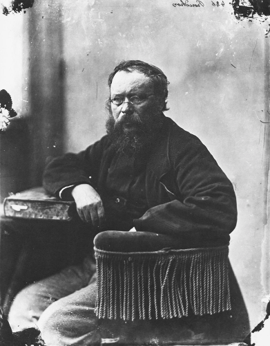

Il y a quelque chose de logiquement absurde dans cette affirmation. Car s'il n'y avait pas de propriété acquise légitimement, il ne pourrait logiquement pas y avoir d'acte tel que le vol. C’est pourquoi Proudhon précisera par la suite que c'est la répartition effective de la propriété qu'il considère comme un vol et non la propriété elle-même qu'il qualifie de force révolutionnaire fondatrice de la société anarchiste.

Mais Proudhon est un anarchiste individualiste. Il ne voit pas le prolétariat, ni l'État, comme les sources légitimes du pouvoir. Il critique sévèrement le communisme et plaide pour un mutualisme ouvrier, une forme de solidarité coopérative structurée, qui reposerait sur la mise en commun volontaire de ressources dans un but d’entraide. On le sait peu mais Bastiat n’était pas du tout opposé à cette idée sur le principe. Simplement il craignait que l’État ne le transforme de fait en service public monopolistique. L’histoire lui donnera raison.

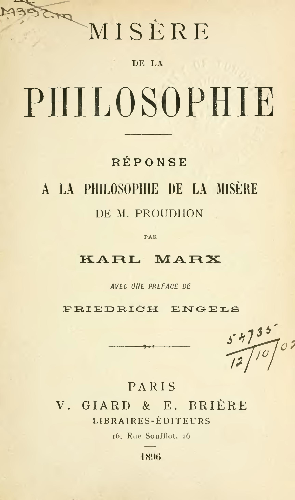

En revanche, on sait plus que dans La Misère de la philosophie, Marx s’en prendra violemment à Proudhon et à son socialisme qu’il appellera « utopique », pour lui préférer un socialisme dit « scientifique ».

En juin 1848, Proudhon se fait élire, en même temps que Bastiat, à l’Assemblée nationale. Ils se côtoient et s’estiment. Mais en 1849, dans une polémique retentissante, Bastiat va échanger quatorze lettres avec lui dans les colonnes de la Voix du Peuple. Dans cet échange musclé, il précise sa position sur les questions monétaires et bancaires. La querelle se résume dans l’alternative suivante : gratuité du crédit ou liberté du crédit ?

Proudhon voit dans l’intérêt du capital la cause initiale du paupérisme et de l’inégalité des conditions. Il défend la création monétaire illimitée par une banque d’État (la Banque d’échange ou Banque du peuple), et voit dans la « gratuité du crédit » la solution du problème social. De son côté, Bastiat est partisan de la liberté des banques, c’est-à-dire la régulation de la circulation monétaire par la liberté d’accès à la profession, assortie d’une nécessaire responsabilité sur ses fonds propres, et la liberté de la concurrence.

Bastiat réfute son adversaire en plusieurs temps. D’abord il analyse les effets pervers de la gratuité du crédit et de la création monétaire. Un tel système ne peut qu’inciter les actions les plus risquées et les plus folles des banques et des acteurs privés car ils se savent couverts par l'État, c’est-à-dire par l'argent des contribuables : « C'est une chose grave que de placer tous les hommes en situation de se dire : Tentons la fortune avec le bien d'autrui; si je réussis, tant mieux pour moi; si j'échoue, tant pis pour les autres ». Phrase prémonitoire tant elle pourrait s’appliquer à notre époque.

La politique des taux bas pratiquée par les banques centrales, est une façon de créer artificiellement de la monnaie Et les crises successives du système financier depuis un siècle, avec l’endettement des États, en sont les conséquences directes.

Ensuite Bastiat montre qu’il est possible d’améliorer le pouvoir d’achat des classes ouvrières, mais par d’autres moyens, plus justes et plus efficaces. Pour lui la baisse des taux d’intérêt est également le but d’une politique libérale. Mais c’est par la libération et l’accumulation des capitaux qu’on y parvient et non par l’abolition de l’intérêt, c’est-à-dire la gratuité du crédit.

En effet, selon Bastiat, le progrès de l'humanité coïncide avec la formation des capitaux. Dans son pamphlet intitulé Capital et rente, Bastiat nous le fait comprendre avec Robinson Crusoë sur son île.

Sans capital accumulé, sans matériaux, Robinson serait voué à la mort. Il explique ensuite que le capital est deux fois l’enrichissement du travailleur :

- Il augmente la production, donc diminue le prix du bien à la consommation
- Ce qui a pour effet d’augmenter le salaire.

Dans la société moderne, le capital est une force égalisatrice. En effet, dit Bastiat:

> « quand les capitaux se multiplient, ils se font concurrence entre eux ; leur rémunération diminue, ou, en d’autres termes, l’intérêt baisse. »

En conclusion, Proudhon et Bastiat ont vu tous les deux l'importance de l'accumulation du capital, et la tendance de certains hommes à en exploiter d’autres. Mais ils n'en ont pas tiré les mêmes conclusions. Proudhon, comme Marx, prévoyait une paupérisation croissante des masses dans les pays capitalistes. Bastiat pensait que le capitalisme engendrerait une prospérité sans précédent dans toutes les classes, et le développement d'une classe moyenne de plus en plus importante. C'est effectivement ce qui s'est passé.

# Les Sophismes Économiques

<partId>59686d1d-58c6-59a8-9fc4-74a10d24cdbe</partId>

## Ce qu’On Voit et ce qu’On ne Voit Pas

<chapterId>25fb02a9-5d68-5c58-bd0f-d4b8e1fd91f9</chapterId>

Dans ce chapitre, je vais vous dévoiler une toute nouvelle technologie, une technologie révolutionnaire. Un chercheur a mis au point une paire de lunettes bioniques avec une mini-caméra ultra puissante implantée en façade. Cette technologie permet de voir des détails impossibles à voir à l’œil nu. Dans les branches vous avez une puce électronique qui transmet les images directement dans le cloud via mon smartphone.

L’inventeur du premier prototype de ces lunettes c’est Frédéric Bastiat en 1850 dans un célèbre pamphlet : Ce qu’on voit et ce qu’on ne voit pas. Ces lunettes, ce sont celle de l’économiste. Elles permettent de mesurer les conséquences des décisions prises par le pouvoir sur nos vies. Ce sont les lunettes qui « permettent de voir ce qu’on ne voit pas » : les destructions que causent les politiques clientélistes et les fausses théories économiques. Souvent on ne voit pas leurs victimes, ni leurs bénéficiaires, en somme leurs véritables effets par opposition aux prétentions affichées dans les discours officiels, ce que Bastiat appelle « Les sophismes économiques ».

Le bon économiste, selon Bastiat, doit décrire les effets des décisions politiques sur la société. Mais il doit être attentif, non pas à ses effets à court terme sur un groupe particulier, mais plutôt à ses conséquences à long terme pour la société dans son ensemble. Quelles sont les victimes et quels sont les bénéficiaires de ces politiques? Quels sont les coûts cachés de telle ou telle loi ou décision politique ? Qu’auraient fait les contribuables à la place du gouvernement, avec l’argent qu’on leur a enlevé en impôts ? Telles sont les questions posées par le bon économiste selon Bastiat.

Ainsi dans Travaux publics, Bastiat écrit :

> L'État ouvre un chemin, bâtit un palais, redresse une rue, perce un canal; par-là, il donne du travail à certains ouvriers, c'est ce qu'on voit; mais il prive de travail certains autres, c'est ce qu'on ne voit pas.

L’un des sophismes les plus connus est le sophisme de la vitre cassée. Certains prétendent que le bris d’une vitre dans une maison ne nuit pas à l’économie puisqu’il profite au vitrier. Mais Bastiat va montrer que la destruction n’est pas conforme à notre intérêt car elle ne créé pas de richesse. Elle coûte plus qu’elle ne rapporte. Le jeune garçon qui brise la fenêtre d'un voisin donne du travail au verrier. Mais voici que ses amis le consolent :

> « À quelque chose malheur est bon. De tels accidents font aller l’industrie. Il faut que tout le mo nde vive. Que deviendraient les vitriers si on ne cassait jamais de vitres ».

Ainsi, selon Keynes, la destruction de la propriété, en forçant à la dépense, stimulerait l’économie et aurait un « effet multiplicateur » revigorant sur la production et l’emploi. C'est seulement ce qu’on voit.

Mais ce qu’on ne voit pas, c’est ce que le propriétaire aurait acheté avec cet argent, mais auquel il doit maintenant renoncer, avec ce qu’il doit dépenser pour réparer sa fenêtre. Ce qu’on ne voit pas c’est l’opportunité perdue du propriétaire de la vitre cassée. Il aurait pu allouer la somme donnée au vitrier à autre chose. S’il n’avait pas eu à dépenser pour réparer la vitre, il aurait pu dépenser l’argent pour sa propre consommation, employant ainsi du monde pour la production.

Ainsi, il n’y aura pas plus de « relance » de l’économie avec le bris de la vitre que sans. En revanche, il y aura eu une perte nette dans le premier cas : la valeur de la vitre.

La première leçon à retenir, c’est qu’une « bonne » décision ou une « bonne » politique est une politique qui coûte moins à la société que ce qu'une autre allocation des ressources aurait pu lui coûter. Il faut juger l’efficacité d’une politique non seulement sur la base de ses effets, mais aussi sur la base des alternatives qui auraient pu se produire. C’est la notion de « coût d’opportunité », chère à Bastiat.

La seconde leçon est qu’une destruction ne stimule pas l’économie comme le pensent les keynésiens mais conduit à l'appauvrissement. La destruction de biens matériels n'a pas d'effet positif sur l'économie, contrairement à une idée reçue. Pour reprendre les mots de conclusion du texte de Frédéric Bastiat : « la société perd la valeur des objets inutilement détruits »

Prenons un exemple actuel. Dès que l’industrie automobile se porte mal, les politiques imaginent des primes à la casse pour la « relancer ». Ce qu’on voit, c’est l’augmentation des ventes de Renault et de Peugeot. Ce qu’on ne voit pas, c’est le manque à gagner pour d’autres secteurs économiques et c’est que des autos en parfait état de marche sont détruites.

Mais il y a d’autres moyens de relancer l’économie. Si l’État engage de grands chantiers ou investit des fonds dans certains secteurs industriels pour soutenir l’emploi, n’est-ce pas une bonne nouvelle pour la croissance ? Pas davantage, répondrait Bastiat. Car par quoi la dépense publique serait-elle financée ? Par la hausse des impôts ou par la dette, c’est-à-dire, par des coûts invisibles mais bien réels, qui vont impacter la croissance. De plus, le gouvernement ne produit rien, il détourne simplement des ressources de leur usage privé. Et ce qu’on ne voit pas, ce sont les nombreuses choses qui auraient pu être produites si le capital avait pas été retirée du secteur privé pour financer les programmes gouvernementaux.

Finalement, près d'un siècle avant Keynes, on peut dire que Bastiat a réfuté les sophismes keynésiens qui prétendent que l'endettement de l'État encourage l'économie et que la dépense publique produit de la croissance.

La grande leçon de cette série de textes, c’est que l'intervention de l'État a des effets pervers que l’on ne voit pas. Seul le bon économiste est capable de les prévoir. La politique, c’est ce qu’on voit. L’économie, c’est ce qu’on ne voit pas.

## La Pétition des Fabricants de Chandelles

<chapterId>f4e759ed-1cb2-55c7-885e-0a60244758a4</chapterId>

En 1840, la Chambre des députés vota une loi augmentant les taxes à l’importation afin de protéger l’industrie française. C’est le fameux patriotisme économique, qu’on retrouve encore de nos jours .

Bastiat composa alors un texte satirique qui est devenu par la suite l’un de ses textes les plus célèbres : "la pétition des fabricants de chandelles". Il montre comment certains groupes de pression bien organisés de producteurs obtiennent de l'État des privilèges indus, au détriment des citoyens. En même temps, il démontre le caractère absurde et destructeur des législations protectionnistes.

Les fabricants de chandelles, dans cette pétition, demandent aux députés la protection de la loi contre un dangereux rival :

> Nous subissons l'intolérable concurrence d'un rival étranger placé, à ce qu'il paraît, dans des conditions tellement supérieures aux nôtres pour la production de la lumière, qu'il en inonde notre marché national à un prix fabuleusement réduit.

Quel est donc ce concurrent étranger et déloyal ? Il n’est autre que le soleil. Les producteurs mettent alors en avant l’opportunité qu’il y aurait à réserver « le marché national au travail national », en ordonnant par une loi de fermer « toutes fenêtres, lucarnes, abat-jour, contre-vents, volets, rideaux, vasistas, oeils de bœuf, stores en un mot toutes ouverture, trous, fentes et fissures par lesquelles la lumière du soleil a coutume de pénétrer dans les maisons ».

Autrement dit, les fabricants de chandelles tentent de démontrer les effets nuisibles d’un « concurrent étranger » (le soleil) sur l’économie de la France. Car non seulement le soleil peut fournir le même « produit » que les bougies, mais il le fait gratuitement. Deux cents ans après, cette histoire a gardé une incroyable actualité. Pensons aux chauffeurs de taxis qui demandent à la loi l’interdiction des VTC et de Uber. Pensons aux libraires qui veulent faire interdire Amazon.

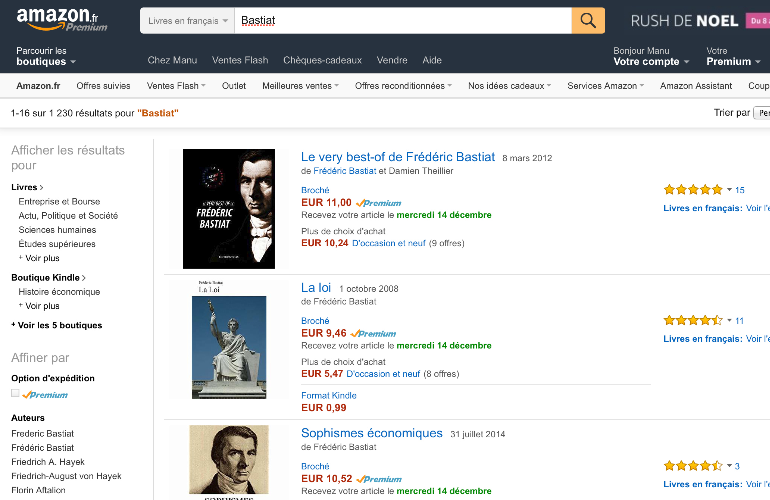

Le véritable adversaire de Bastiat dans cette fiction c’est le protectionnisme politique et électoral, celui qui repose uniquement sur l’avidité des producteurs et la naïveté des consommateurs. Il dévoile la connivence qu’il y a entre le mauvais capitaliste de l’époque et l’État. Au lieu d’innover et de s’adapter au marché, le mauvais capitaliste est celui qui cherche à obtenir un avantage politique par le protectionnisme. Il en résulte toujours une spoliation pour le consommateur, c’est-à-dire une injustice.

Bref, le protectionnisme, c’est une politique délibérée en faveur des producteurs contre les consommateurs. Or, selon Bastiat, les véritables représentants de l’intérêt général sont les consommateurs, car nous sommes tous des consommateurs. Par ailleurs, le but de l’économie est de subvenir à nos besoins, pas de travailler.

Le protectionnisme repose également sur un syllogisme caché qui s’avère être un sophisme :

- Plus on travaille, plus on est riche ;
- Plus on a de difficultés à vaincre les obstacles, plus on travaille ;
- Donc, plus on a de difficultés à vaincre, plus on est riche.

Illustrons cette absurdité avec quelques petites histoires que nous raconte encore Bastiat. Dans le chapitre III de la seconde série des Sophismes Économiques, il imagine un charpentier qui écrit au ministre une pétition pour lui demander une législation protectionniste. Le charpentier formule ainsi sa requête : Monsieur le ministre, faites une loi qui stipule que « Nul ne pourra se servir que de poutres et solives produits de haches obtuses ». Autrement dit, faites une loi qui interdit en France l’usage des haches aiguisées. Ainsi, là où l’on donne habituellement 100 coups de hache, il faudra en donner 300. Les charpentiers seront très demandés et donc mieux payés .

Au chapitre XVI, on trouve un autre texte très ironique, intitulé : La main droite et la main gauche. À la suite d’une enquête, un envoyé du roi rédige un rapport dans lequel il propose au roi de couper, ou au moins d’attacher toutes les mains droites des ouvriers. Ainsi, poursuit-il, on augmentera le travail et par conséquent, les richesses. La production deviendra beaucoup plus difficile, ce qui nécessitera l’embauche massive de main d’œuvre complémentaire et une hausse des salaires. Le paupérisme disparaîtra du pays.

En suivant cette logique de création d’emplois à tout prix, pourquoi ne pas remplacer aussi les camions côté grossissement par des brouettes et les pelles par des petites cuillères ? Tous ces sophismes ont un point commun : ils confondent le moyen avec le but. Pour Bastiat, le but de l’économie, ce n’est pas la sauvegarde des emplois. Il ne faut pas juger de l’utilité d’un travail par sa durée et son intensité mais par ses résultats : la satisfaction des besoins, l’utilité.

On retrouve cette confusion du moyen et du but dans ce slogan « l’argent, c’est la richesse ».

Tel est l’axiome qui commande la politique monétaire de la plupart des États. En effet, l’augmentation artificielle de la quantité de monnaie permet aux banques de prêter de l’argent aux particuliers et aux États de rembourser facilement leur dette, c’est « ce qu’on voit ». Mais « ce qu’on ne voit pas », c’est que cette création de monnaie ne reposant sur aucune création de richesse réelle entraînera l’inflation et la ruine des épargnants.

La véritable richesse, selon Bastiat, c’est donc l'ensemble des choses utiles que nous produisons par le travail pour la satisfaction de nos besoins. La monnaie n’est donc qu’un moyen d’échange communément utilisé, elle ne joue qu’un rôle d’intermédiaire.

## La Spoliation par l’Impôt

<chapterId>551fc499-2119-5a52-9114-412d29434c22</chapterId>

> Quand les gros maigrissent, les maigres meurent.

Cette citation, attribuée à Lao-Tseu, décrit la conséquence inévitable d’une fiscalité qui consiste à frapper les riches plus fortement que les autres.

Pourtant, ne vous est-il jamais arrivé d'entendre dire :

> L'impôt, c'est le meilleur placement : c'est une rosée fécondante ! Voyez combien de familles il fait vivre, et suivez, par la pensée, ses ricochets sur l'industrie : c'est l'infini, c'est la vie.

En France, où il est admis que la dépense publique est un bienfait, les impôts sont plus élevés que dans d’autres pays. Mais Bastiat nous avertit d’emblée : "Dans toute dépense publique, derrière le bien apparent il y a un mal plus difficile à discerner."

De quoi s’agit-il ?

L’économie décrit les effets, bons ou mauvais, des décisions politiques sur nos vies. Or, selon Bastiat, l’économiste doit être attentif, non pas seulement à leurs effets à court terme sur un groupe particulier mais plutôt à leurs conséquences à long terme pour la société dans son ensemble.

> "Ce qu'on voit, c'est le travail et le profit permis par la cotisation sociale. Ce qu'on ne voit pas, ce sont les travaux auxquels donnerait lieu cette même cotisation si on la laissait aux contribuables. Ce qu'on voit c'est le travail et le profit permis par la cotisation sociale. Ce qu'on ne voit pas, ce sont les travaux auxquels donnerait lieu cette même cotisation si on la laissait aux contribuables."
>  
> F.Bastiat

Dès lors, il réfute l’argument, toujours actuel, qui veut que les dépenses publiques financées par l’impôt créent de l’emploi. En effet, l’impôt ne crée rien puisque ce qui est dépensé par l’État n’est plus dépensé par les contribuables.

Or l’État est plus dispendieux que les particuliers. En effet, rappelle-t-il, l’État n’a rien, il ne produit aucune richesse. La dépense publique est donc souvent une source de gaspillage parce que les sommes immenses qui sont confisquées aux individus, échappent à la responsabilité de leurs propriétaires et sont dépensées à leur place par des bureaucrates, soumis à des groupes de pression.

Bien sûr, comme paiement d’un service public équivalent reçu en échange, l’impôt est tout à fait défendable. Mais en France l’État a assigné plusieurs rôles à l’impôt.

Au départ, il devait seulement couvrir les dépenses communes. Puis on a également donné à l’impôt un rôle de régulation de l’économie. Dans ce cas les politiciens et les bureaucrates ont un pouvoir qui n’est limité que par leur bon vouloir. Tout à leurs constructions artificielles ils modèlent l’économie en taxant et réglementant plus ou moins les secteurs selon que leur caprice veut les favoriser ou les défavoriser.

Enfin on a assigné à l’impôt un rôle social à remplir. On en a fait un instrument de la justice sociale. Ainsi l’impôt ne doit pas frapper tout le monde de la même manière. L’impôt doit être redistributif, de ceux « qui ont le plus » vers ceux « qui ont moins ».

Le problème c’est que l’impôt ainsi conçu est soumis à l’arbitraire de celui qui détient le pouvoir. Il favorise ou défavorise telle ou telle catégorie sociale selon que le pouvoir en attend des voix ou pas. De plus les taux progressifs rapportent peu au trésor public. En revanche ils permettent à la majorité d’exproprier une minorité et deviennent naturellement confiscatoires.

C’est pourquoi Bastiat avait déjà comprisla courbe de Laffer. Arthur Laffer est un économiste américain connu pour sa fameuse « courbe » (une ellipse), publiée en 1974, qui montre que le rendement de l’impôt augmente avec la baisse du taux d’imposition. C’est la théorie du rendement décroissant de l'impôt abusif.

Les politiciens supposent naïvement qu'il existe une relation automatique et fixe entre les taux d'imposition et les recettes fiscales. Ils pensent qu'ils peuvent doubler les recettes fiscales en doublant le taux d’imposition. Selon Laffer, une telle approche néglige le fait que les contribuables peuvent modifier leur comportement en réponse à de nouvelles incitations.

La courbe de Laffer montre que le gouvernement ne perçoit aucun revenu lorsque les taux d'imposition est de 100%. A l'opposé, toute diminution de l'impôt a pour effet de stimuler l'activité économique et donc les recettes de l’État. En effet, la réduction des taux marginaux d'imposition, stimule l'investissement, le travail, la créativité et favorise ainsi la croissance économique. Une réduction suffisante pourrait produire suffisamment de relance économique et accroître les recettes publiques en élargissant considérablement l'assiette fiscale.

Bastiat pourrait ajouter qu’on doit accorder autant d'importance aux diminutions des dépenses de l’État qu'à celles des impôts. Quoi qu’il en soit, comme le disait si bien Margaret Thatcher, une disciple de Frédéric Bastiat :

> L'idéal n'est pas de rendre les riches pauvres, mais de rendre les pauvres riches ».

Et elle disait cela en s’adressant à des socialistes.

## Les Deux Morales

<chapterId>c518e449-f638-553c-9a49-15da48023d41</chapterId>

Tout le monde connaît Tartuffe ou l’Imposteur, la comédie de Molière dans laquelle un dévot rusé tente de séduire Elmire et de dépouiller son mari Orgon. Comment se prémunir contre les tromperies d’un homme aussi hypocrite qui prétend faire votre bien tout en complotant contre vous ?

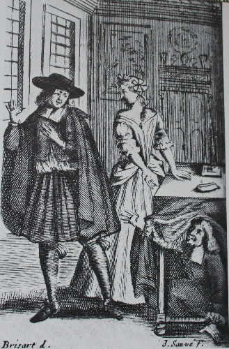

Bastiat fait observer que, pour faire cesser ce genre d’imposture, il y a deux moyens : corriger Tartuffe ou déniaiser Orgon. Bien sûr il y aura toujours des Tartuffes mais leur pouvoir de nuisance serait beaucoup plus réduit s’il y avait moins d’Orgon pour les écouter.

La faiblesse de la raison humaine est à l’origine du mauvais usage de la liberté. Elle est la principale limite des hommes et la cause de beaucoup de maux. Il s’agit donc d’éclairer les consciences sur le caractère utile ou nuisible, et donc juste ou injuste, des actes humains, qu’ils soient individuels ou collectifs.

Or il y a deux manières complémentaires d’éclairer le jugement des citoyens, que Bastiat expose dans un chapitre de la seconde série des Sophismes Économiques intitulé « Deux morales » .

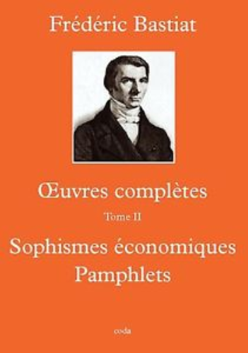

- Il y a d’abord une « morale philosophique ou religieuse » qui agit par purification et correction de l’action humaine » (l’homme en tant qu'agent)
- Il y a ensuite une « morale économique », qui agit en montrant à l'homme « les conséquences nécessaires de ses actes » (l’homme en tant que patient)

En fait, ce sont deux morales parfaitement complémentaires.

1. L’une s’adresse au cœur et incite l’homme à faire le bien, c’est la morale religieuse ou philosophique. C’est la plus noble. Elle enracine dans le cœur de l’homme la conscience de son devoir. Elle lui dit:

> Corrige-toi; épure-toi; cesse de faire le mal; fais le bien, dompte tes passions; sacrifie tes intérêts; n'opprime pas ton prochain que ton devoir est d'aimer et soulager; sois juste d'abord et charitable ensuite.

Bref, elle enseigne la vertu, l’acte désintéressé. Cette morale dit Bastiat sera éternellement la plus belle et la plus touchante, car elle montre ce qu’il y a de meilleur en l’homme.

2. L’autre contribue à dénoncer et à combattre le mal par la connaissance de ses effets, c’est la morale économique. Elle s’adresse à l’intelligence et non au cœur, elle vise à éclairer la victime sur les effets négatifs d’un comportement. Elle vient renforcer les leçons de l’expérience. Elle s'efforce de diffuser aux masses opprimées le bon sens, la connaissance et la méfiance qui rend l’oppression plus difficile.

Cette morale économique aspire au même résultat que la morale religieuse, mais en partant des effets des actions humaines. Elle nous apprend à réagir contre les actions injustes ou nuisibles et à défendre celles qui sont justes ou utiles.

Bastiat met ici en valeur le rôle de la science et en particulier de la science économique. Bien que différent de celui de la morale traditionnelle, son rôle n'en est pas moins nécessaire pour combattre la spoliation sous toutes ses formes. La morale attaque le vice dans son intention, elle éduque la volonté. De son côté la science attaque le vice par la compréhension de ses effets, et facilite ainsi le triomphe de la vertu.

Concrètement, la science économique, qualifiée par Bastiat de morale défensive, consiste à réfuter les sophismes économiques afin de les discréditer complètement, et ainsi dépouiller la classe spoliatrice de sa justification et de son pouvoir.

L'Économie politique a donc une utilité pratique évidente. Elle dévoile la spoliation dans les coûts cachés, les obstacles à la concurrence et toutes les formes de protectionnisme.

Encore, une fois, il y aurait moins de Tartuffe s’il y avait moins d’Orgon pour les écouter. Voici ce que dit Bastiat à ce propos :

> Que la morale religieuse touche donc le cœur, si elle le peut, des Tartuffes. La tâche de l'économie politique est d'éclairer leurs dupes. De ces deux procédés, quel est celui qui travaille le plus efficacement au progrès social ? Faut-il le dire ? Je crois que c'est le second. Je crains que l'humanité ne puisse échapper à la nécessité d'apprendre d'abord la morale défensive.

Bien sûr l'économie politique n’est pas la science universelle, elle n’exclut pas l’approche philosophique et religieuse. « Mais qui donc a jamais affiché, en son nom, une prétention aussi exorbitante ? » se demande Bastiat.

Une chose est sûre, ce n’est pas le politique qui peut changer le cours des choses, et perfectionner l’homme. Au contraire, il faut borner le politique et le cantonner au strict rôle qui est le sien, la sûreté. C’est plutôt dans le champ culturel, familial, religieux et associatif, par le travail sur les idées, par l’éducation et l’instruction, bref par la société civile, qu’on peut renforcer la responsabilité et la solidarité.

# Les Harmonies Économiques

<partId>db04dfa4-a53e-5d3e-a307-a68ebc36dc4f</partId>

## Le Miracle du Marché

<chapterId>895ccd1d-7b52-5a8b-8b2c-6ec0056cf632</chapterId>

Une société harmonieuse peut-elle se passer de lois écrites, de règles, de mesures répressives ? Si on laisse libres les hommes, ne va-t-on pas assister au désordre, à l’anarchie, à la désorganisation ? Comment éviter de créer une pure juxtaposition d’individus agissant en dehors de tout concert, si ce n’est par des lois et une organisation politique centralisée ?

Tel est l’argument souvent invoqué de ceux qui réclament une régulation du marché ou de la société seule capable de coordonner les individus dans un ensemble cohérent et harmonieux.

Tel n’est pas le point de vue de Bastiat. Selon lui, le mécanisme social, comme le mécanisme céleste, ou le mécanisme du corps humain, obéit à des lois générales. Autrement dit, il s’agit d’un ensemble déjà harmonieusement organisé. Et le moteur de cette organisation, c’est le libre marché.

Le miracle du marché libre, nous dit-il, c’est qu’il utilise des connaissances qu’aucune personne ne peut posséder à lui tout seul et qu’il procure des satisfactions bien supérieures à tout ce qu’une organisation artificielle pourrait faire.

Bastiat prend quelques exemples pour illustrer les bienfaits de ce marché. L’habitude nous a tellement familiarisés avec ce phénomène, que nous n’y faisons plus attention.

Prenons un menuisier dans un village, dit-il et observons tous les services qu’il rend à la société et tous ceux qu’il en reçoit :

> Tous les jours, en se levant il s’habille, et il n’a personnellement fait aucun de ses vêtements. Or, pour que ces vêtements soient à sa disposition, il faut qu’une énorme quantité de travail, d’industrie, de transports, d’inventions ingénieuses, ait été accomplie dans le monde entier.
>  
> Ensuite il déjeune. Pour que lepain qu’il mange arrive tous les matins sur sa table, il faut que des terres aient été défrichées, labourées; il faut que le fer, l’acier, le bois, la pierre aient été convertis en instruments de travail ; toutes choses dont chacune, prise isolément, suppose une masse incalculable de travail mise en jeu, non-seulement dans l’espace, mais dans le temps.
>  
> Cet homme enverra son fils à l’école, pour y recevoir une instruction qui suppose des recherches, de longues années d’études antérieures.
> Il sort dehors : il trouve une rue pavée et éclairée.
>  
> On lui conteste une propriété : il trouvera des avocats pour défendre ses droits, des juges pour l’y maintenir, des officiers de justice pour faire exécuter la sentence; toutes choses qui supposent encore des connaissances acquises, par conséquent des lumières et des moyens d’existence.

Bastiat décrit le marché comme un outil de coopération décentralisé et invisible. Par le système des prix, il transmet des informations sur les besoins et les compétences de chacun, il met en relation les hommes qui veulent coopérer en vue d’améliorer leur existence.

Ce qui est frappant, conclut Bastiat, c’est la disproportion immense qui existe entre les bienfaits que cet homme puise dans la société et ceux qu’il se donnerait à lui-même, s’il était réduit à ses propres forces. En une seule journée, il consomme des biens qu’il ne pourrait produire lui-même

En 1958, l’écrivain américain Leonard Read (Foundation for Economic Education) publie dans la revue The Freeman un petit essai, écrit à la manière de Bastiat, devenu très célèbre : "I, pencil", ( Moi, le crayon)Ce texte est une métaphore de ce qu’est un marché libre. Il commence ainsi :

> Je suis un crayon à mine, un crayon ordinaire en bois, familier à tous les garçons et les filles et les adultes qui savent lire et écrire. Il est l’un des objets les plus simples dans la civilisation humaine. Et pourtant pas une seule personne sur cette terre ne sait comment me produire.

Il reprend l’idée de Bastiat d’une coopération invisible entre des millions d’individus qui ne se connaissent pas pour aboutir à la construction d’un objet aussi banal qu’un crayon. Personne ne sait faire seul un crayon. Mais des millions d’êtres humains participent sans le savoir à la création de ce simple crayon, échangent et coordonnent leur savoir et leur savoir-faire dans le cadre d’un système de prix sans qu’aucune autorité supérieure ne leur dicte leur conduite.

Cette histoire montre que des hommes libres travaillant dans la poursuite de leur légitime intérêt agissent davantage pour le bénéfice de la société que n’importe quelle stratégie économique planifiée et centralisée.

Le prix Nobel d’économie 1976 Milton Friedman a également repris cette histoire du crayon pour expliquer au grand public le fonctionnement de l’économie de marché.

Dans un épisode de sa série télévisée Free to Choose, il analyse les différents com­po­sants d’un objet aussi banal et simple qu’un crayon et il met en lumière le miracle de l’ordre spontané, généré par les milliers d’interactions économiques à travers le monde. Des personnes qui ne se connaissent pas, qui n’ont pas la même religion ni les mêmes coutumes, réussissent pourtant à se coordonner pour produire cet objet. Il conclut le fait que le libre marché est essentiel pour garantir non seulement la prospérité mais aussi l’harmonie et la paix.

Friedrich Hayek, dans son essai « L’utilisation de la connaissance dans la société » en 1945, expliquait déjà pourquoi l’économie de marché et la décentralisation des décisions sont vitales pour la prospérité. Selon Hayek, aucun planificateur central ou bureaucrate ne pourrait jamais avoir une connaissance suffisante de la manière de guider avec succès l’ensemble des actions économiques. Seul le système des prix sur un marché libre permet à des millions d’acteurs indépendants de décider pour eux-mêmes comment répartir efficacement les ressources.

La planification économique, qui prétend faire mieux que le marché, conduit non seulement à une mauvaise allocation des ressources, mais aussi à l’hégémonie d’une classe sur une autre. C’est pourquoi le socialisme est non seulement une erreur intellectuelle, mais une erreur qui finit par engendrer une immense injustice.

## La Liberté et la Responsabilité Sont la Clé du Problème Social

<chapterId>78baa7ef-2c80-5fc7-8881-c1be4662b96f</chapterId>

Dans une lettre à Alphonse de Lamartine en 1845, Bastiat écrit que toute sa philosophie tient dans un seul et unique principe :

> La liberté est la meilleure des organisations sociales.

Mais il ajoute cependant une condition

> Que la loi ne vienne pas supprimer les conséquences, positives ou négatives, des actions de chacun. C’est le principe corollaire de la responsabilité ».: « que la loi ne vienne pas supprimer les conséquences, positives ou négatives, des actions de chacun. C’est le principe corollaire de la responsabilité.

Autrement dit liberté et responsabilité ne peuvent être séparées, elles sont indissociables. Le libéralisme pour lui se distingue du socialisme par la conviction que la liberté ne peut exister sans responsabilité. Mais quelles réalités recouvrent exactement les mots de liberté et de responsabilité ?

La liberté se définit essentiellement d'une manière négative : être libre c'est agir sans coercition extérieure dans l'exercice de ses propres droits. Pourtant cela ne veut pas dire absence de toute contrainte. Car la liberté appelle la réciprocité : elle nous impose également d’agir sans porter atteinte à la propriété d’autrui et donc de réparer les préjudices commis, le cas échéant. C’est la responsabilité.

La responsabilité représente donc en quelque sorte le versant positif de la liberté : dans la mesure où l'on agit librement, on doit supporter les conséquences de nos propres actes, bonnes ou mauvaises.

Or la responsabilité individuelle est à la fois un grand vecteur de créativité et une incitation à la prudence et à la prévoyance.

Quand on dépense son propre argent, on fait attention à ne pas trop s’endetter, à vérifier la qualité des produits, la fiabilité de ses fournisseurs, au risque de se voir lourdement puni. Telle est la puissance de la responsabilité, alliée à la liberté elle est le véritable moteur du progrès social.

Mais d’où vient alors le phénomène de l’irresponsabilité ou de la déresponsabilisation ? Frédéric Bastiat nous indique une réponse à cette question, une réponse d’ordre politique. Il dit, je le cite :

> L’intervention de l’État nous enlève le gouvernement de nous-même.

En effet, l’étatisme réduit sans cesse l’initiative privée et le libre choix des gens. Il fait à leur place ce que les personnes pourraient faire elles-mêmes et bien mieux. Il soustrait ainsi les individus aux conséquences de leurs actes. Il détruit la responsabilité.

Selon Bastiat, l’hypertrophie des lois et l’intervention excessive de l’État ont pour conséquence d’engendrer la lutte pour le pouvoir, la spoliation, les privilèges, les monopoles, les guerres, bref, tout ce fait obstacle au progrès de la civilisation.

Le risque qu’il y a à vouloir trop favoriser la voie de la loi ou du contrôle bureaucratique, c’est de décourager toute motivation en imposant une avalanche de contraintes et ainsi de se priver des multiples progrès que permettent l’initiative privée et le libre choix.

Illustrons cette question avec quelques grands sujets d’actualité. Premier exemple, la crise de 2008.

_(Alan Greenspan, président de la FED, la banque centrale américaine, de 1987 à 2006)_

Pendant des années, les dirigeants de la politique monétaire ont expliqué que si les gains sont privatisés lorsque tout va bien, les pertes seront mutualisées en cas de faillite (renflouements, plans de sauvetage, manipulation des taux d’intérêts, planche à billet etc.). Ce faisant, ils ont créé un aléa moral, ils ont facilité la prise de risque déraisonnable et ils ont incité le monde de la finance à se comporter de façon irresponsable. Ils ont donc précipité la finance dans la crise que nous avons connue.

Et le phénomène se répètera indéfiniment tant que les banques resteront sous la domination d’autorités centrales censées les protéger en leur retirant toute autonomie de décision et de fonctionnement.

Un autre exemple : les services publics

Chaque service public impose les préférences d’une élite bureaucratique, au détriment du libre choix individuel. Ceci conduit à deux conséquences selon Bastiat : Le citoyen « cesse d’exercer un libre contrôle sur ses propres satisfactions, et, n’en ayant plus la responsabilité, naturellement il cesse d’en avoir l’intelligence. » La raison en est simple : toute loi écrite est coercitive et elle est la même pour tous, elle ne tient aucun compte des situations particulières, des besoins et des préférences des citoyens.

Enfin, le service public est une cause d’immobilisme. En effet, quand les services privés deviennent publics, ils échappent à la concurrence. Par conséquent, dit Bastiat, je le cite : « le fonctionnaire est dénué de ce stimulant qui pousse au progrès. »

Quand on observe le service public de l’éducation nationale, on comprend ce que veut dire Bastiat. Il décharge la grande majorité des parents du poids de l’éducation de leurs enfants, réduisant l’école à une garderie. Il n’incite pas les professeurs à l’innovation et à la prise de risque car dans un tel système ils ne sont plus que des exécutants d’uan programme conçu sans eux, par des bureaucrates. Enfin, il ignore la réalité des besoins particulier de chaque individu.

Nous le verrons dans un autre cours, les seuls services publics légitimes d’un État selon Bastiat sont au nombre de trois : l’armée, la police et la justice. Mais pour conclure sur la responsabilité, le problème de l’intervention de l’État, c’est que ceux qui prennent des décisions ne sont pas ceux qui en subissent les conséquences.

Autrement dit, les choix collectifs ne sont pas des choix responsables puisque d’une part ils n’entrainent aucune prise de risque pour les décideurs et que d’autre part ils forcent les autres à en subir certaines conséquences, ce qui est aussi désastreux qu’immoral.

## La Puissance de la Responsabilité

<chapterId>0c078806-6c58-53f9-a720-5fb62386e56b</chapterId>

Dans le cours précédent, nous avons vu pourquoi la liberté et la responsabilité sont la clé du problème social. Nous allons maintenant approfondir ce point en montrant comment Frédéric Bastiat envisage les maux dont souffrent les sociétés et leur solution.

On a parfois reproché aux libéraux d’ignorer le mal et de construire l’utopie d’une liberté pure et parfaite dans un monde idéal. Ce reproche n’est absolument pas fondé en ce qui concerne notre auteur.

Nul ne peut ignorer le mal qui règne dans l’histoire des sociétés humaines : les injustices, les guerres et les souffrances. Nous aimerions pouvoir supprimer ces maux. C’est d’ailleurs l’objet d’une grande partie des philosophies modernes, de Rousseau à Heidegger, en passant par Hegel et Marx.

Le mal est non seulement une réalité définitive mais il a un rôle à jouer dans l’histoire et dans l’action humaine, nous dit Frédéric Bastiat. On peut le réduire mais certainement pas l’éradiquer complètement car cela supposerait de tuer la liberté et la responsabilité. Alors d’où vient le mal, quel est son rôle et comment le prévenir ?

Pour répondre à ces questions, Bastiat va procéder à l’analyse de l’action humaine. Celle-ci, en effet, peut conduire au bien comme au mal.

Le mal provient d’abord de notre imperfection. Choisir librement c'est courir le risque de faire un mauvais choix, dit Bastiat. En effet, nous pouvons être trompés à bien des égards, même sur nos propres besoins et intérêts. L’homme est faillible, il est sujet à se tromper à méconnaître le jeu des lois économiques ou à les détourner de leur fin.

C’est donc l’imperfection de la raison qui est la principale limite des hommes et qui demeure à l'origine de nos souffrances.

Si le mal vient de la faiblesse humaine et non de la liberté elle-même, ni du libre-échange, le remède n’est pas dans la suppression de la liberté ni de l’échange mais dans la responsabilité elle-même, puisqu’elle est la source de toute expérience.

Ce principe de responsabilité est le suivant, je cite Bastiat :

> Tout homme qui agit reçoit la récompense ou la punition de ses actes.

Par cette sanction naturelle, l’homme apprend, découvre, se corrige, progresse et s’améliore. Autrement dit, la responsabilité est un principe de perfectibilité et de progrès comme nous l’avons vu dans le cours précédent.

Si l’homme supporte les conséquences, bonnes ou mauvaises, de ses décisions, il tendra à s’améliorer en tirant les leçons de l’expérience. Il faut donc laisser agir la responsabilité individuelle, qui est la grande éducatrice des peuples, selon Bastiat, le principe fondamental de toute régulation des comportements et des sociétés.

Le mal engendre la souffrance et la souffrance nous fait comprendre la faute ou l’erreur, elle nous ramène dans le droit chemin. C’est par la connaissance du mal que nous progressons.

C’est parce que l’homme risque de se tromper ou de mal agir et d’en subir les conséquences, qu’il est incité à être responsable. Il s’efforcera alors d'anticiper les aléas qui pourront le frapper afin de s’en prémunir.

On le voit donc, Bastiat est loin d’être aveugle. Il ne nie pas l'existence du mal. L’homme est faible, sujet à l’erreur et à la faute. Nulle part on ne verra Bastiat nier le fait qu’à l’exercice de la liberté individuelle est associée la possibilité de l’erreur, la possibilité d’un choix déraisonnable ou insensé.

Il affirme simplement que si la source du mal est dans l'absence de liberté, le remède est dans la liberté même, et plus particulièrement dans l’exercice plein et entier de la responsabilité personnelle.

Mais si le mauvais usage de la liberté est à l'origine de nos maux, son bon usage est le remède, c’est-à-dire l’exercice plein et entier de la responsabilité personnelle, fondée sur le droit de propriété. La régulation sociale passe donc par la responsabilité, non par l’intervention de l’État dans tous les domaines, qui est une des grandes sources de spoliation et donc de maux.

A l'opposé de Rousseau qui veut éradiquer le mal par les institutions collectives, Frédéric Bastiat défend la possibilité du mal et de l'erreur, sans lesquels il n'est pas de liberté ni de responsabilité individuelle. Car c’est elle qui permet seule, par un processus de découverte, de progresser et de réduire les maux sociaux.

Encore faut-il préciser que ce développement du progrès par la responsabilité n’est en rien automatique. Il ne s’agit nullement, comme chez Hegel ou Marx, d’une sorte de déterminisme naturel ou historique, qui conduirait miraculeusement ou mécaniquement à l’harmonie et au progrès. Il s’agit d’une réduction graduelle et indéfinie du mal et jamais d’une suppression définitive.

## Vraie et Fausse Solidarité

<chapterId>fa2172e9-22fa-5c01-a3c8-1e8316c064a4</chapterId>

Frédéric Bastiat, dans son fameux pamphlet « La loi », dénonce la perversion du droit qui consiste à légaliser, sous le nom de « solidarité », ce qu'il faut bien appeler la spoliation. Il y a en effet une contradiction à vouloir imposer la fraternité par la loi, ce qu’on appellerait aujourd’hui « justice sociale » ou solidarité.

Car la moralité se définit comme un comportement volontaire. Quand un individu est contraint de donner quelque chose qu’il ne veut pas donner, il est toujours la victime d’un vol.

En effet, lorsqu’un don est rendu obligatoire par la loi, ce n’est plus une attitude morale. L’attitude morale du don est remplacée par la revendication « de droits à », qui sont des revendications sur le travail d’autrui. La fausse solidarité c’est l’appel à vivre aux dépens d’autrui.

C’est que Bastiat appelle « le sophisme de la fraternité légale ». Citons-le sur ce point :

> La fraternité est spontanée, ou n'est pas. La décréter, c'est l'anéantir.

Et encore:

> Les Gouvernements n'exercent jamais qu'une action qui a pour sanction la Force. Or, il est permis de forcer quelqu'un d'être juste, non de le forcer d'être charitable. La Loi, quand elle veut faire par la force ce que la morale fait faire par la persuasion, bien loin de s'élever à la région de la Charité, tombe dans le domaine de la Spoliation.

Or cette perversion du droit a un nom, c’est le socialisme, c’est-à-dire l’idéologie de la redistribution forcée des richesses par l’État. Le socialisme selon Bastiat, se caractérise par l'idéologie de la spoliation légale. Mais la ruse de cette idéologie c’est qu’elle masque sa violence sous un abus de langage : l’appel à la solidarité ou à la fraternité.

Toutefois selon Bastiat, il existe une alternative à la solidarité obligatoire d’État : “société de secours mutuel”, l’entraide mutuelle et spontanée des hommes entre eux grâce aux sociétés de secours mutuel. Mais il avait aussi prévu que l'État finirait par s'emparer de ces mutuelles pour en faire un organisme unique et centralisé, incitant à la dépense et au gaspillage.

Dans un pamphlet nommé "Justice et Fraternité", Bastiat explore aussi l’idée d’un système fiscal simplifié et équitable pour le financement des besoins collectifs (police, justice, armée) : les revenus et les bénéfices seraient soumis à un taux d’imposition unique et proportionnel. C'est ce qu'on appelle aujourd'hui la « Flat Tax ».

De fait, la solidarité intrafamiliale, la solidarité locale ou la philanthropie organisée sont beaucoup plus développées dans les pays qui connaissent un système fiscal léger et un degré relativement élevé de liberté économique, comme la Suisse et les États-Unis, alors qu'elle est largement étouffée dans les pays où l'État s'est en grande partie substitué à la responsabilité individuelle, comme la France ou l'Allemagne.

Il est souvent de bon ton de déplorer « l'égoïsme » qui prévaudrait dans les sociétés libérales. Mais c’est exactement l’inverse qui est vrai. Quand une société est écrasée d’impôts et que les individus ne sont plus propriétaires de leurs biens, ils ne sont pas incités à donner mais plutôt à se replier sur eux-mêmes.

En réalité, la société civile libre ne repose pas sur l'égoïsme : l'économie de marché fonctionne sur la base du service à son prochain et sur la réciprocité. On ne peut servir son propre intérêt qu’en servant l’intérêt d’autrui, en offrant à l'autre une contrepartie qui conduit à un échange mutuellement bénéfique. Autrement dit c’est l’échange volontaire qui crée la vraie solidarité.

La redistribution forcée n’a donc rien à voir avec la solidarité humaine authentique, qui est d’ordre privée ou volontaire et qu’on voit à l’intérieure des familles, ou bien entre les membres d’une association.

C'est donc sur le rôle de la loi que Bastiat s’oppose ici aux socialistes. Il écrit :

> La loi peut forcer l'homme à rester juste, elle ne peut le forcer à être dévoué.

La fausse solidarité des socialistes supprime le dévouement au profit de la coercition étatique pure, qui forme la base du totalitarisme.

# La Loi

<partId>653cbe58-60e1-5401-8f91-4d9843ac6045</partId>

## Le Droit de Propriété

<chapterId>a48a0616-2105-5520-8312-e21a0b6489c7</chapterId>

Par propriété, il ne faut pas entendre ici le foncier. Il faut donc entendre « le droit qu'a le travailleur sur la valeur qu'il a créée par son travail ». Bastiat précise :

> Je considère que le droit de propriété consiste dans la liberté de disposer d'abord sa propre personne, puis de son travail, et enfin, des produits de son travail - ce qui prouve, d'ailleurs, que, à partir d'un certain point de vue, la liberté et le droit de propriété ne peuvent être distingués les uns des autres.

Ce point étant posé, pour comprendre le fondement moral de la propriété, Bastiat part d’un principe anthropologique simple que en partant du début l’homme doit travailler pour vivre et que le fruit de son travail est le prolongement de ses facultés, c’est-à-dire de sa personne.

> Personnalité, Liberté, Propriété, — voilà l’homme. C’est de ces trois choses qu’on peut dire, en dehors de toute subtilité démagogique, qu’elles sont antérieures et supérieures à toute législation humaine.

Entendu en ce sens, le droit de Propriété fait partie de ces droits qui ne dérivent pas de la loi positive, mais la précèdent et sont sa raison d'être. En effet,

> La loi est l’organisation collective du droit individuel de légitime défense.
> La loi

Elle a pour mission de défendre la personne et ses biens.

_(François Quesnay, chef de file des Physiocrates)_

Le droit n’est donc pas la même chose que la loi. Le droit ne s’identifie pas avec la parole du souverain, ni ne dépend exclusivement de sa légitimité. Il est le produit d’une tradition, d’un ordre juridique antérieur et supérieur à la loi, qui s’impose au législateur autant qu’à n’importe lequel des citoyens ordinaires.

Le droit « ne se crée pas ». Il ne s’invente pas à partir d’une vision idéale de ce que devraient être les lois de la société, il se découvre dans la nature de l’homme et dans les règles de la civilité, transmises par la sagesse des coutumes.

Ainsi les individus ont des droits naturels qui préexistent à la loi les individus ont des droits naturels qui préexistent à la loi : la Propriété, la Liberté, la Personnalité. Le rôle de la Loi doit être de préserver ces droits naturels de l’individu. Par conséquent l’État doit être limité. Nous dirions aujourd’hui que Bastiat est un adepte de l’État minimum.

Dans le système de Rousseau, dont nous avons parlé dans un cours précédent, le législateur a pour mission d'organiser, modifier, supprimer même la propriété, s'il le trouve bon. Pour Rousseau, la propriété n’est pas naturelle mais conventionnelle, comme la société elle-même. Cette idée provient du droit romain, dont Rousseau était imbu.

À son tour Robespierre pose le principe que « La propriété est le droit qu'a chaque citoyen de jouir et de disposer de la portion de biens qui lui est garantie par la loi ».

Chez Rousseau, la propriété n’est pas antérieure au droit, elle n’est qu’une convention instituée par la volonté générale et dans les limites décidée par elle. De ce fait, il n’y a pas de liberté ni de droit indépendamment de la société et du bon vouloir des législateurs. Or si l’on dissocie le droit de la propriété, on en vient facilement à justifier de faux droits, qui ne sont acquis que par la violation des droits d’autrui.

Par exemple : le droit au travail ou le droit au logement.

Pour que je puisse acquérir gratuitement il faut bien que quelqu’un paie pour moi. Et si c’est l’État qui paie, puisqu’il ne produit pas de richesses, il ne peut le faire qu’en prenant un logement à quelqu’un, ou son équivalent, pour me le donner.

Cette idée que le droit de propriété est une création de la loi a donc pour conséquence selon Bastiat d'ouvrir un champ sans limite aux utopistes qui souhaitent modeler la société d’après leurs plans.

Dans le système de la liberté naturelle, il existe donc une loi naturelle, indépendante du bon plaisir des législateurs. Elle est valable pour tous les hommes et antérieure à toute société. Et il est du devoir du gouvernement d'assurer les droits naturels de chaque individu. Une société juste est une société dans laquelle les droits de propriété sont intégralement respectés, c'est-à-dire protégés contre toute ingérence de la part d’autrui.

Ici Bastiat s’inscrit ici dans l’héritage des Physiocrates, et par-delà, dans la tradition de la philosophie du droit de Cicéron et d’Aristote. La loi ne crée pas le droit. Elle a pour mission de le défendre et donc de défendre la propriété, aussi bien la propriété de soi, l’intégrité de la personne, que la propriété du fruit de son travail.

_(Cicéron)_

## La Spoliation Légale: Une Perversion de la Loi

<chapterId>b4122847-e477-578e-ba34-d35844ac4715</chapterId>

L’idée principale de Bastiat dans "La Loi", son célèbre pamphlet daté de 1850, c’est de montrer pourquoi et comment la loi est devenue spoliatrice, c’est-à-dire une source de privilèges, de rentes de situation et d’arbitraire fiscal.

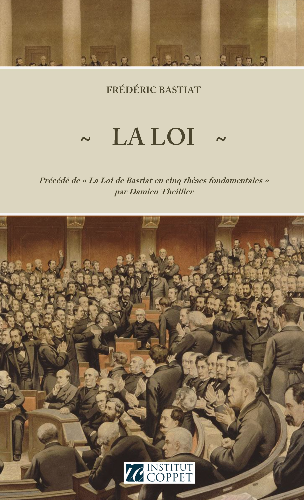

Quelle est la vraie nature de la loi ?

Bastiat commence par poser les fondements anthropologiques naturels de la loi : la vie, la liberté et la propriété.

Le système institutionnel de la liberté naturelle, est celui pour lequel la société, les personnes et les propriétés existent antérieurement aux lois. Dans ce système, ajoute Bastiat:

> Ce n'est pas parce qu'il y a des lois qu'il y a des propriétés, mais parce qu'il y a des propriétés qu'il y a des lois.
> Propriété et Loi

Chaque homme est autorisé à défendre sa vie et à faire usage de ses facultés. Et la loi est l’organisation collective de cette légitime défense. La loi défend la justice. Non une justice positive qui organiserait la fraternité et la solidarité, mais une justice négative qui se borne à empêcher que le droit de l'un n'usurpe le droit de l'autre.

Or quand la loi cesse d’être négative pour devenir positive, le sentiment d’inégalité s’accroît dans la société et génère les conflits. Si on élargi indéfiniment le domaine de la Loi, c'est-à-dire la responsabilité du gouvernement, on ouvre la porte à ANIM 1 PE « une série sans fin de plaintes, de haines, de troubles et de révoltes », écrit-il.

La fausse philanthropie dit Bastiat est l’une des grandes causes de la perversion de la loi. Certains hommes se considèrent au-dessus du reste de l’humanité et capables de faire de meilleurs choix que les autres.

Ils savent mieux ce qui est bon pour les autres et vont imposer à tous leur conception du bien, ce sont les philanthropes. Ils ont créé de faux droits que l’on nomme aujourd’hui des droits sociaux. Les droits sociaux ne sont que des droits sur le travail d’autrui, des droits à disposer de sa propriété, fruit de son travail : droit au logement, droit à la santé, à l’éducation, au travail, au salaire minimum etc.

Qu’est-ce que la spoliation ? Elle est l’exacte opposée de la propriété, nous dit Bastiat. Spolier vient du latin spoliarer, qui veut dire dépouiller. Nous avons vu que l’homme ne peut vivre qu’en s’appropriant les choses, qu’en appliquant ses facultés sur les choses, c’est-à-dire en travaillant. Hélas, il peut aussi bien s’approprier le produit des facultés de son semblable, c’est-à-dire le spolier.

Toute la mission de la loi est d’empêcher cette spoliation extra-légale, c’est-à-dire de défendre la propriété et la liberté, deux choses inséparables.

Dès que l’on admet en principe que la loi peut être détournée de sa vraie mission, qu'elle peut violer les propriétés au lieu de les garantir, il s’ensuit nécessairement une lutte des classes, soit pour se défendre contre la spoliation, soit pour l'organiser aussi à son profit.

Au lieu de défendre les droits naturels, la loi se transforme en protection des intérêts corporatifs et catégoriels. La spoliation est organisée par la loi, au profit des classes qui la font et de leurs amis ou de leurs clients. Bastiat anticipe ainsi l'école des choix publics au XXe siècle pour laquelle la loi est le résultat d'un « marché politique » par lequel des groupes d'individus cherchent à satisfaire leurs intérêts au détriment des autres.

Pour lui le but de la Loi doit être simplement de « mettre fin à toutes les spoliations ». Si l’État n’intervient pas dans la vie privée, les individus sont effectivement propriétaires et responsables de leur vie. Ils font leur bonheur eux-mêmes. Ils assument les conséquences bonnes ou mauvaises de leurs actions.

Ils ont la certitude que leurs Droits naturels sont garantis et intouchables. Des droits de propriété sûrs donnent aux gens la possibilité de faire des projets sur le long terme, parce qu’ils savent que leur patrimoine est à l’abri de la spoliation.

> Absence de Spoliation, — c’est le principe de justice, de paix, d’ordre, de stabilité, de conciliation, de bon sens que je proclamerai de toute la force, hélas ! bien insuffisante, de mes poumons, jusqu’à mon dernier souffle

Ecrit Bastiat dans La Loi, quelques temps avant de mourir.

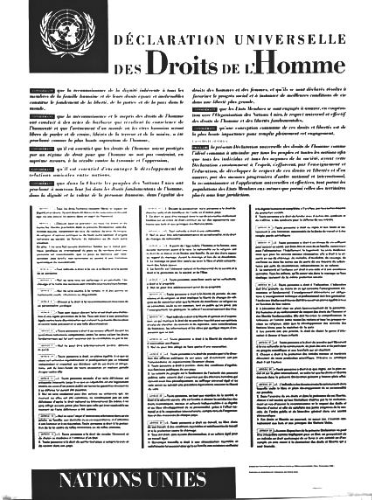

Un siècle après la mort de Frédéric Bastiat, la spoliation légale apparaît en clair dans la Déclaration universelle des droits de l'homme de 1948, notamment dans ses articles 22 (« toute personne a droit à la sécurité sociale »), 23 (« toute personne a droit au travail »), 24 (« toute personne a droit au repos et aux loisirs »), 25 (« toute personne a droit à un niveau de vie suffisant »), 26 (« toute personne a droit à l'éducation »).

## Le Rôle de la Loi et de l’État

<chapterId>52258229-7c7c-592b-aa27-203b03aa41c9</chapterId>

En 1848, Bastiat est député. Il est nommé vice-président de la commission des finances. Il est donc particulièrement bien placé pour répondre à cette question : qu'est-ce que l'État ? Nous nous adressons à l'État pour assurer notre bien-être. Mais Bastiat rappelle que l'État ne peut rien donner aux citoyens qu'il ne leur ait d'abord pris.

Bastiat commence par renverser une équation souvent admise : c’est l’État qui fait vivre la nation. Mais l'État ne peut pas faire vivre les citoyens car il ne produit pas de richesses, il ne fait que les déplacer, les redistribuer. Au contraire ce sont les citoyens qui font vivre l'État par la création de richesses.

Par ailleurs, l’État en soi n’existe pas, il n’y a que des hommes qui constituent l’État, qui dirigent, administrent, qui vivent de l’État directement ou indirectement. Dès lors les hommes qui administrent l’État sont comme les autres, ils cherchent à satisfaire leurs intérêts personnels.

Et puisque l’action de l’État est purement redistributive, elle est soumise à la pression des groupes d’intérêts particuliers. En effet, certains groupes d'intérêts particuliers ont compris qu’il était plus facile de gagner de l’argent par l’engagement politique que par des comportements productifs. Ils cherchent à voler l'argent des autres sous l'égide de l'État, sapant la capacité de production du marché par la multiplication des lois, des taxes et des contraintes bureaucratiques.

Autrement dit l’État ne poursuit que des objectifs clientélistes et la notion d’intérêt général est dénuée de sens. Tout gain obtenu par certains se fait aux dépens des autres : ce n’est pas un jeu à somme nulle mais un jeu à somme négative.

Bastiat anticipe ainsi avec un siècle d’avance les analyses du fonctionnement du marché politique qui émergeront à la fin des années 50 avec l’école dite du Public Choice de James Buchanan, prix Nobel d’économie et son collègue Gordon Tullock.

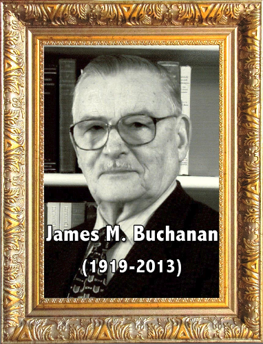

De plus, affirme Bastiat, l’État n’a aucun droit qui ne préexiste d’abord dans l’individu. Pourquoi l'État a-t-il le droit de garantir, même par la force, la propriété de chacun ? Simplement parce que ce droit préexiste dans l'individu. On ne peut contester aux individus le droit de légitime défense, le droit d'employer la force au besoin pour repousser les atteintes dirigées contre leurs personnes, leurs facultés et leurs biens. Ce droit naturel de légitime défense qui réside en tous les citoyens, peut prendre une forme collective et légitimer la force commune.

Donc, pour savoir si l'État est légitimement investi d'un droit, il faut se demander si ce droit réside dans l'individu en vertu de son organisation et en l'absence de tout gouvernement.

C’est pourquoi l’État ne peut en aucun cas porter atteinte aux droits naturels, il doit au contraire les garantir.

Il assure la Sécurité, intérieure et extérieure, et la Justice. Il peut être fort et efficace dans son domaine. Mais la loi ne peut sortir de ce rôle très strict car elle devient alors un instrument de spoliation des uns au profit des autres. Quand la Loi est pervertie elle se comporte en instrument d’injustice. La perversion de la loi aboutit toujours à la spoliation comme nous l’avons vu dans le cours précédent. C’est immédiat, automatique, inévitable et certain. Sortir la loi de son domaine ne peut que porter atteinte aux droits naturels. La société civile est alors dépouillée de son pouvoir (institutions naturelles, contrats, échanges, associations) au profit d’une gestion étatique, c’est-à-dire technocratique et bureaucratique.

En conséquence, les seuls services publics légitimes d’un État selon Bastiat sont ! au nombre de trois : l’armée, la police et la justice. En d’autres termes, l’État doit assurer la protection intérieure et extérieure des personnes, de leur liberté et de leur propriété. Il est donc normal que chacun contribue à cette protection. Mais, au-delà de ces fonctions légitimes, toute autre contribution à un autre service rendu par l’Etat est sujette à caution.

> En dehors de ce cercle, écrit Bastiat, religion, éducation, association, travail, échanges, tout appartient au domaine de l’activité privée, sous l’œil de l’autorité publique, qui ne doit avoir qu’une mission de surveillance et de répression.

Concernant les services publics, il énonce un principe simple :

> Si vous voulez créer une fonction, prouvez son utilité. Démontrez qu’elle vaut par les services qu’elle rend, l’équivalent de ce qu’elle coûte.

D’où il suit, conclut-il, qu’il est raisonnable de ne confier à la fonction publique que ce que le secteur privé ne peut absolument pas accomplir.

En résumé, lorsqu’un gouvernement outrepasse sa mission de défense des personnes et des biens, il incite les groupes d’intérêt à rechercher des privilèges et à influer sur le pouvoir pour obtenir des avantages au détriment des contribuables et des consommateurs.

> L'État, c'est la grande fiction à travers laquelle tout le monde s'efforce de vivre aux dépens de tout le monde.

Ecrit Frédéric Bastiat dans un court pamphlet intitulé L'État.

## La Postérité de Frédéric Bastiat

<chapterId>2a2a181a-e477-5be1-ba1f-af59490c364e</chapterId>

L’influence de Bastiat a commencé à décliner vers la fin du XIXe siècle, avec la montée en puissance du socialisme et en particulier du marxisme au sein des universités et dans les instituts de recherche, financés sur fonds publics.

Avec le XXe siècle la connaissance et la popularité de Bastiat ont disparu. On ne parle plus de lui dans les manuels d’économie. Il faudra attendre la fin de la deuxième guerre mondiale pour voir un intérêt nouveau renaître pour les idées de la liberté, si manifestement oubliées avec Roosevelt et les régimes totalitaires en Europe. Un des artisans de ce renouveau sera l’économiste autrichien Ludwig von Mises, un de ces nombreux intellectuels européens ayant fui l’Europe en passant par l’Espagne et le Portugal pour rejoindre l’Amérique.

Installé à New York en 1943, Mises organise des séminaires qui attirent des esprits remarquables : George Stigler, Milton Friedman, tous deux futurs prix Nobel, ou bien Murray Rothbard, alors étudiant à Columbia. C’est au cours de ces séminaires qu’il parle de Bastiat pour la première fois comme l’une des références majeures du libéralisme classique. Il expose à ses auditeurs les pamphlets de Bastiat, La Loi, et L’État, non encore traduits en anglais. En 1953, l’un des participants à ces séminaires, Leonard Read, va faire traduire en anglais "La Loi" de Bastiat et va se charger de diffuser le livre à travers tout le pays par le biais de sa fondation : la Foundation for Economic Education.

Mais celui qui va également populariser les thèses de Frédéric Bastiat est un chroniqueur économique du New York Times, Henry Hazlitt, dans un petit livre nommé : "L'économie en une seule leçon", publié en 1946. S’inspirant explicitement des idées de Bastiat, il entend démontrer que le problème des solutions économiques étatistes est de ne pas se préoccuper de leurs conséquences désastreuses à long terme.

Hazlitt commence son livre en racontant l'histoire de la fenêtre cassée de Bastiat. Il résume l'histoire en une simple et unique leçon :

> L'art de l'économie consiste à comprendre non seulement l'immédiat mais aussi les effets à long terme de tout acte ou de toute politique ; il consiste à tracer les conséquences de cette politique non seulement pour un groupe, mais pour tous les groupes.

Hazlitt applique ensuite cette leçon à une grande variété de problèmes économiques : le contrôle des loyers, les lois sur le salaire minimum, les avantages présumés de la guerre, les travaux publics et le déficit budgétaire, l'inflation monétaire, les droits de douane et enfin l'épargne.

Bastiat était l’un des économistes favoris de Ronald Reagan et ce déjà bien avant qu’il soit élu président. On le sait peu mais pendant huit ans, Reagan a travaillé pour la compagnie General Electric en tant qu’animateur de son émission de télévision sur CBS, et en tant que chargé de la formation du personnel de l’entreprise. Son programme de formation était construit autour de textes d'initiation à l'économie de marché. Les œuvres choisies sont celles de deux Autrichiens, Hayek et Mises, de deux Anglais, Cobden et Bright, et d’un Français, Frédéric Bastiat.

La leçon que Reagan enseignait à ses employés, à la suite de Bastiat, est qu'il n'est pas de plus grand mythe que celui de la relance de la croissance et de l’emploi par les dépenses publiques.

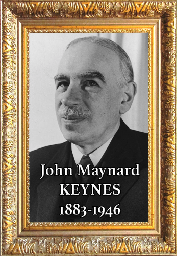

C’est notamment John Maynard Keynes qui suggérait que les dépenses publiques augmentaient la production en raison d'un multiplicateur : si le gouvernement construit un pont, les travailleurs de ce pont pourront acheter du pain, puis le boulanger pourra acheter des chaussures, etc. Si l'industrie privée est en repli, on peut y remédier par les grands travaux. S’il y a du chômage, l’Etat peut créer des emplois publics.

Mais comme l’a bien montré Bastiat, l’intervention de l’État a des effets pervers que l’on ne voit pas. Seul le bon économiste est capable de les prévoir. Prenons un exemple : C’est une illusion de croire que le gouvernement peut « créer des emplois » car pour chaque emploi public créé il détruit un emploi sur le marché. En effet, les emplois publics sont payés par les impôts. Les emplois publics ne sont pas créés, ils sont perçus. Tout centime dépensé par l'État doit nécessairement être obtenu par un centime d'impôt ou de dette.

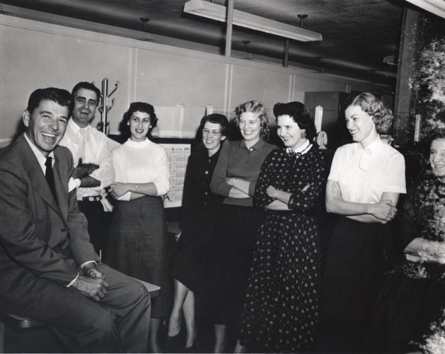

Si nous envisageons les choses sous cet angle, expliquait Reagan aux employés de GE, les soi-disant miracles des dépenses de l'État nous apparaissent sous un tout autre jour. Car les impôts découragent la production et les richesses créées par les dépenses publiques ne peuvent compenser pleinement celles qu'auront empêché de naître les impôts prélevés pour payer ces dépenses.

En substance, Reagan a retenu de Bastiat quelques éléments clés d’une vision libérale de la société de et de l’homme : le primat de la société civile sur l’État, la valeur du choix et de la responsabilité individuelle, l’importance de l’entrepreneur dans création de richesses, l’importance d’un cadre légal souple et minimal, qui permette la confiance et le respect des contrats, la loi fondamentale qui veut que la richesse soit créée avant d’être répartie, la volonté de donner à chacun sa chance sur des marchés concurrentiels…

# Conclusion

<partId>3b62de5c-5d4a-5182-ab14-f7ef13c97e28</partId>

## Avis & Notes

<chapterId>db20170d-ceb6-56cd-b4e5-c690942f8b29</chapterId>
<isCourseReview>true</isCourseReview>

## Examen final

<chapterId>7e2285c9-d7f4-4e30-a1f5-f78aae06b7b3</chapterId>
<isCourseExam>true</isCourseExam>

## Conclusion

<chapterId>a3e98f2f-a072-4696-9553-5d24c6d236c9</chapterId>
<isCourseConclusion>true</isCourseConclusion>
