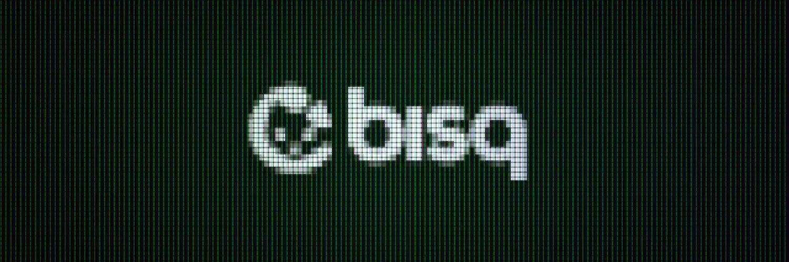
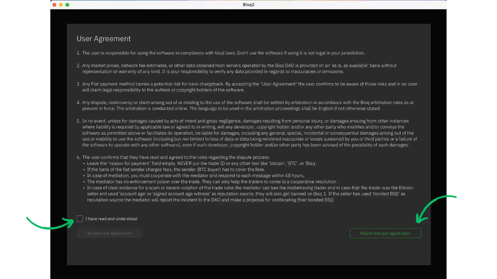
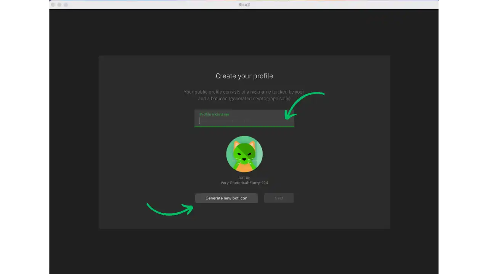
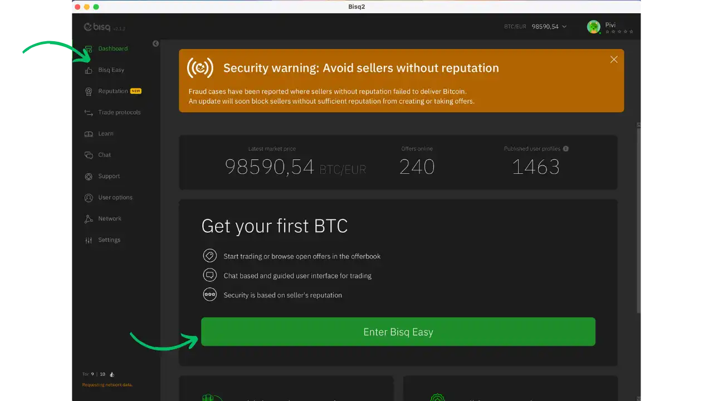
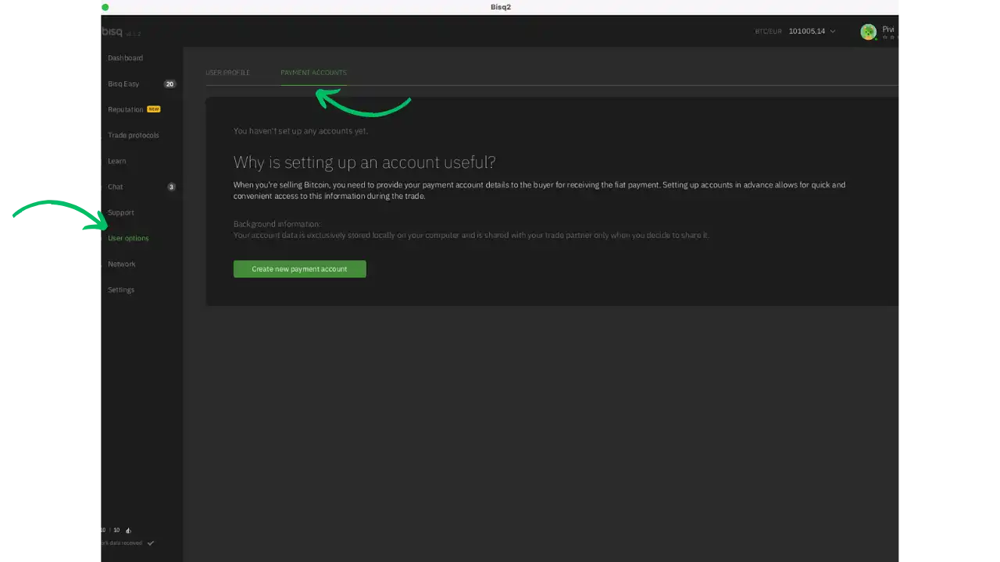
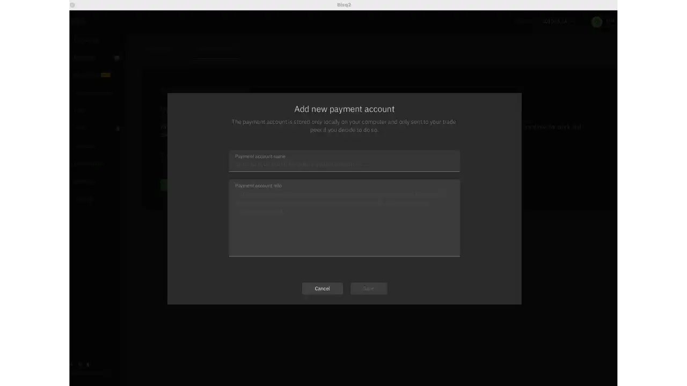
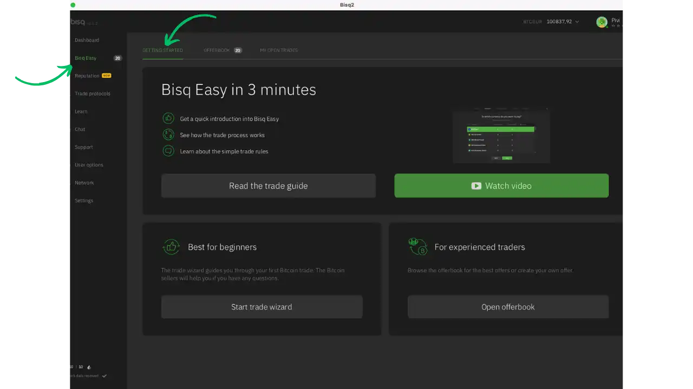
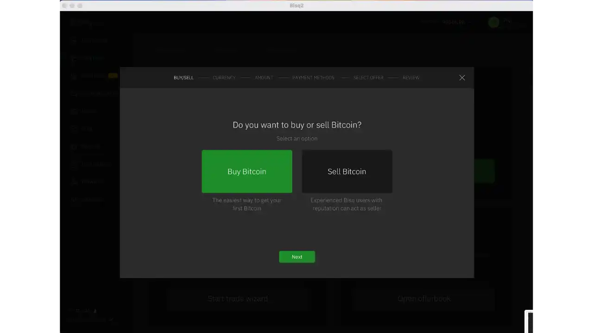
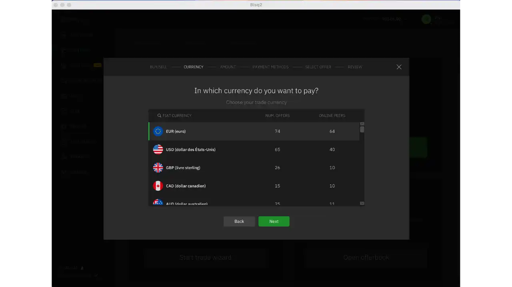

## Introduction

Les échanges de pair-à-pair (P2P) sans KYC sont essentiels pour préserver la confidentialité et l'autonomie financière des utilisateurs. Ils permettent des transactions directes entre individus sans nécessiter de vérification d'identité, ce qui est crucial pour ceux qui valorisent la vie privée. Pour une compréhension plus approfondie des concepts théoriques, consultez le cours BTC204 :

https://planb.network/courses/btc204

### Qu'est-ce que Bisq 2 ?

Bisq 2 est la nouvelle version du célèbre échange décentralisé Bisq. Contrairement à sa version précédente, Bisq 2 a été développé pour supporter plusieurs protocoles d'échange, offrant ainsi plus de flexibilité aux utilisateurs. Le premier protocole disponible est "Bisq Easy", conçu spécialement pour les nouveaux utilisateurs de Bitcoin.

**Caractéristiques principales :**
- Application de bureau multi-plateforme
- Plusieurs protocoles d'échange disponibles
- Réseau P2P décentralisé
- Focus sur la confidentialité (pas de KYC, utilisation de Tor)
- Auto-custodial (vous gardez le contrôle de vos fonds)
- Open source (AGPL)

### Différences avec Bisq 1

**Pour les acheteurs :**
- Pas de dépôt de garantie requis
- Pas de frais de trading
- Pas de frais miniers
- Sécurité basée sur la réputation des vendeurs
- Limites de trading plus basses (équivalent à 600 USD)

**Pour les vendeurs :**
- Pas de dépôt de garantie requis
- Construction d'une réputation nécessaire
- Possibilité de brûler des BSQ ou de créer des obligations BSQ
- Prime de vente potentiellement plus élevée (10-15% au-dessus du marché)

## Installation et Configuration

### 1. Télécharger et Vérifier Bisq 2

- Rendez-vous sur [bisq.network](https://bisq.network)
- Téléchargez la version correspondant à votre système d'exploitation
- Vérifiez l'authenticité du fichier téléchargé (recommandé)

**Pour Linux et MacOS :**
Pour vérifier la signature, importez la clé publique et vérifiez le binaire avec GPG.

**Pour Windows :**
Utilisez Kleopatra pour importer la clé et vérifier l'installateur.

### 2. Installation selon votre système

**MacOS :**
- En raison de l'absence de notarisation Apple, des étapes supplémentaires sont nécessaires
- Sur macOS Ventura (13.0+), utilisez la commande xattr pour autoriser l'application

**Windows :**
- Ignorez l'avertissement Windows après avoir vérifié l'installateur
- Attention aux logiciels antivirus qui peuvent interférer avec Bisq ou Tor

**Linux :**
- Pour Debian/Ubuntu, utilisez le fichier .deb
- Pour d'autres distributions, suivez les instructions d'extraction manuelle

### 3. Premier Démarrage

- Lancez Bisq 2
- Choisissez si vous souhaitez partager des données d'utilisation
- Créez un nouveau profil ou restaurez une sauvegarde existante
- Configurez votre portefeuille (optionnel au démarrage)

### 4. Configuration des Méthodes de Paiement

- Accédez aux paramètres
- Sélectionnez "Payment Accounts"
- Ajoutez vos méthodes de paiement :
  - SEPA (virements européens)
  - Revolut
  - Wise
  - PayPal
  - Et bien d'autres...

### 5. Sécurisation du Compte

**Sauvegarde du fichier de compte :**
- Accédez aux paramètres
- Sélectionnez "Backups"
- Créez une nouvelle sauvegarde
- Définissez un mot de passe fort
- Stockez le fichier dans un endroit sûr

**Sauvegarde des identités :**
- Bisq 2 permet de créer plusieurs identités
- Chaque identité peut être utilisée pour différents types de transactions
- Sauvegardez chaque identité séparément

## Acheter et Vendre des Bitcoins

### Comment Acheter des Bitcoins

- Sur l'écran principal, cliquez sur "Buy BTC"
- Sélectionnez votre méthode de paiement
- Choisissez le montant à acheter
- Parcourez les offres disponibles
- Sélectionnez une offre avec un vendeur réputé

- Effectuez le paiement selon la méthode convenue
- Marquez le paiement comme envoyé
- Attendez la confirmation du vendeur
- Recevez vos bitcoins

### Comment Vendre des Bitcoins

- Cliquez sur "Sell BTC"
- Configurez votre offre :
  - Montant à vendre
  - Prix (fixe ou % du marché)
  - Méthodes de paiement acceptées
- Publiez votre offre

- Attendez qu'un acheteur prenne votre offre
- Vérifiez la réception du paiement
- Libérez les bitcoins
- Évaluez la transaction

## Bonnes Pratiques et Sécurité

### Conseils de Sécurité

- Commencez par de petits montants
- Vérifiez la réputation des vendeurs
- Utilisez uniquement les méthodes de paiement suggérées
- Conservez les preuves de paiement
- N'envoyez jamais d'informations sensibles

### Construction de la Réputation (pour les vendeurs)

- Effectuez des transactions régulières
- Maintenez une communication professionnelle
- Envisagez de créer une obligation BSQ
- Répondez rapidement aux acheteurs

### Résolution des Litiges

- Contactez votre contrepartie via le chat
- Si nécessaire, ouvrez un litige
- Fournissez toutes les preuves demandées
- Suivez les instructions du médiateur

## Avantages et Inconvénients

### Avantages de Bisq 2

- **Confidentialité maximale** : Pas de KYC, utilisation de Tor
- **Décentralisation** : Pas de serveur central
- **Sécurité** : Code open source, auto-custodial
- **Interface intuitive** : Plus simple que Bisq 1
- **Flexibilité** : Multiple protocoles d'échange

### Inconvénients de Bisq 2

- **Liquidité limitée** : Nouveau protocole en phase de démarrage
- **Limites de trading** : Maximum de 600 USD par transaction
- **Desktop uniquement** : Pas d'application mobile
- **Connexion requise** : Nécessite une connexion internet stable

## Ressources Utiles

- Site officiel : [bisq.network](https://bisq.network)
- Documentation : [Bisq Wiki](https://bisq.wiki)
- Support : [Forum Bisq](https://bisq.community)
- Code source : [GitHub](https://github.com/bisq-network)
