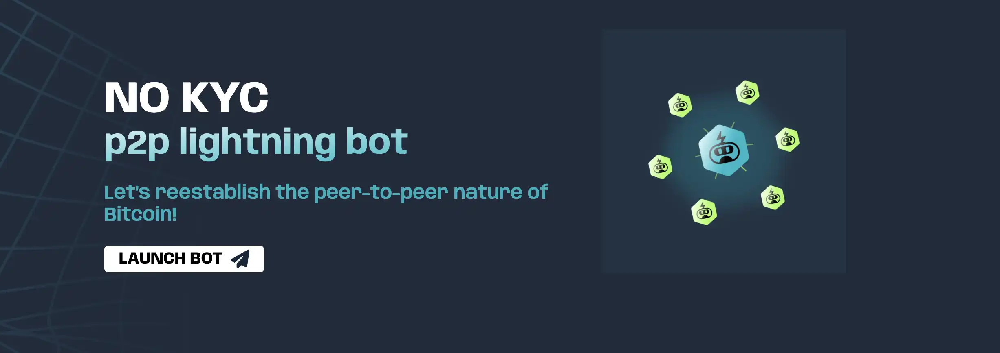

# Introduction

Bitcoin est avant tout une technologie permettant d'échanger de la valeur directement entre individus, sans intermédiaire. Le réseau Lightning étend cette capacité en permettant des transactions instantanées et à très faible coût, tout en préservant les propriétés fondamentales de Bitcoin.

L'achat et la vente de bitcoin de pair-à-pair (P2P) est l'une des méthodes les plus privées pour acquérir ou céder des bitcoins. LNP2PBot est un bot Telegram qui facilite les échanges P2P sur le réseau Lightning, permettant des transactions rapides, à faible coût et sans KYC.

## Pourquoi utiliser LNP2PBot ?

- Pas de KYC requis
- Transactions rapides sur Lightning Network
- Faibles frais 
- Interface simple via Telegram, une application de messagerie populaire et accessible partout dans le monde
- Système de réputation intégré
- Escrow automatique pour sécuriser les échanges
- Support multidevises
- Communauté active et grandissante

## Prérequis

Pour utiliser LNP2PBot, vous aurez besoin :

1. Un portefeuille Lightning Network (Breez, Phoenix ou Blixt recommandés)
2. L'application Telegram installée
3. Un compte Telegram avec un nom d'utilisateur défini

# Installation et Configuration

## 1. Configurer votre portefeuille Lightning

Commencez par installer un portefeuille Lightning compatible. Voici nos recommandations détaillées :

### Portefeuilles recommandés

- **[Breez](https://breez.technology)** : 
  - Excellent pour les débutants
  - Interface intuitive et moderne
  - Non-custodial (vous gardez le contrôle de vos fonds)
  - Parfaitement compatible avec LNP2PBot
  - Disponible sur iOS et Android

- **[Phoenix](https://phoenix.acinq.co)** : 
  - Simple et fiable
  - Configuration automatique des canaux
  - Support natif des factures BOLT11
  - Excellent pour les transactions quotidiennes
  - Disponible sur iOS et Android

- **[Blixt](https://blixtwallet.github.io)** : 
  - Plus technique mais très complet
  - Options de configuration avancées
  - Parfait pour les utilisateurs expérimentés
  - Open source
  - Disponible sur Android

### Notes importantes sur d'autres portefeuilles

> ⚠️ **Avant de vendre des sats** : Assurez-vous que votre portefeuille supporte les factures "hold" (factures en attente), qui sont utilisées par le bot comme système d'escrow.

- **Wallet of Satoshi** : Fonctionne bien pour recevoir des sats, mais peut avoir des délais de mise à jour du solde en cas d'annulation d'une vente.
  
- **Muun** : Non recommandé car les paiements peuvent échouer en raison des limites de frais de routage du bot (maximum 0.2%).
  
- **Aqua** : Fonctionne pour recevoir des sats, mais peut avoir des délais importants (jusqu'à 48h) pour la mise à jour du solde en cas d'annulation d'une vente.

> 💡 **Conseil** : Pour une expérience optimale, privilégiez les portefeuilles recommandés (Breez, Phoenix ou Blixt).

> ⚠️ N'oubliez pas de sauvegarder vos phrases de récupération dans un endroit sûr.

## 2. Démarrer avec LNP2PBot

1. Ouvrez Telegram
2. Recherchez "@lnp2pBot" dans la barre de recherche
3. Cliquez sur "Start" ou envoyez la commande "/start"
4. Le bot vous guidera à travers la configuration initiale

## 3. Rejoindre la communauté

- Rejoignez le canal principal : @lnp2pbot_marketplace
- Pour les francophones : @lnp2pbot_fr
- Canal des annonces : @lnp2pbot_exchange

# Comment Acheter des Bitcoins

## 1. Trouver une offre de vente

Deux méthodes sont possibles :

1. **Parcourir les offres existantes** :
   - Utilisez la commande `/p2p` pour voir les offres actives
   - Filtrez par devise avec `/p2p EUR` (exemple pour l'euro)

2. **Créer votre propre ordre d'achat** :
   - Utilisez `/buy [montant] [devise]`
   - Exemple : `/buy 100 EUR`

## 2. Répondre à une offre

1. Cliquez sur le bouton "TAKE OFFER" sous l'annonce
2. Suivez les instructions du bot
3. Confirmez les détails de la transaction
4. Le vendeur recevra une notification

## 3. Processus de paiement

1. Attendez que le vendeur verrouille les bitcoins en escrow
2. Effectuez le paiement via la méthode convenue
3. Confirmez le paiement dans le chat
4. Les bitcoins seront automatiquement envoyés à votre portefeuille

# Comment Vendre des Bitcoins

## 1. Créer une offre de vente

1. Utilisez la commande `/sell [montant] [devise]`
   Exemple : `/sell 50 EUR`
2. Spécifiez vos méthodes de paiement acceptées
3. Définissez votre prime (pourcentage au-dessus/en dessous du prix du marché)

## 2. Gérer une vente

1. Lorsqu'un acheteur répond, vérifiez son profil et sa réputation
2. Verrouillez les bitcoins en escrow
3. Attendez la confirmation du paiement
4. Vérifiez la réception du paiement
5. Confirmez la transaction

# Bonnes Pratiques et Sécurité

## Conseils de sécurité

- Commencez par de petits montants
- Vérifiez toujours la réputation des utilisateurs
- Utilisez uniquement les méthodes de paiement suggérées
- Gardez toutes les communications dans le chat du bot
- Ne partagez jamais d'informations sensibles

## Système de réputation

- Chaque utilisateur a un score de réputation
- Les transactions réussies augmentent votre score
- Privilégiez les utilisateurs avec une bonne réputation
- Signalez tout comportement suspect aux modérateurs

## Résolution des litiges

1. En cas de problème, restez calme et professionnel
2. Utilisez la commande `/dispute` pour ouvrir un ticket
3. Fournissez toutes les preuves nécessaires
4. Attendez l'intervention d'un modérateur

# Ressources Utiles

- Site officiel : https://lnp2pbot.com/
- Documentation : https://lnp2pbot.com/learn/
- GitHub : https://github.com/lnp2pBot/bot
- Support : @lnp2pbot_support

> 💡 Pour une expérience optimale, commencez par de petites transactions pour vous familiariser avec le système.
