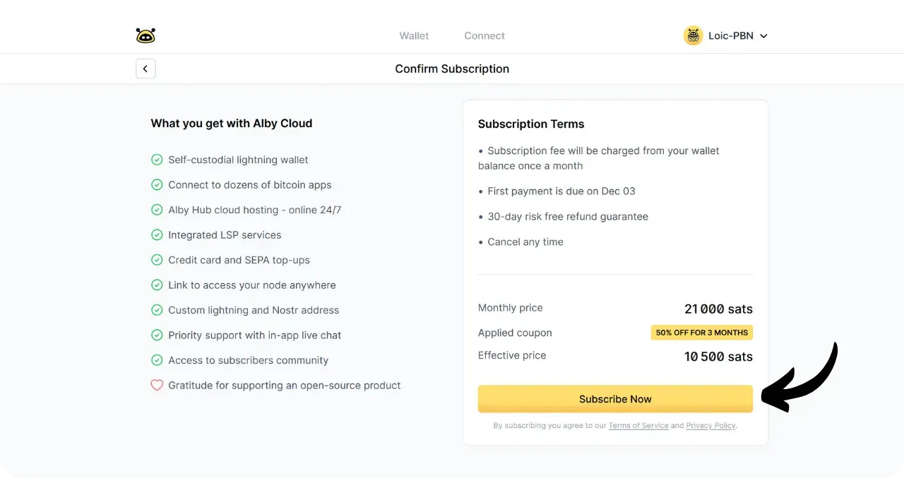
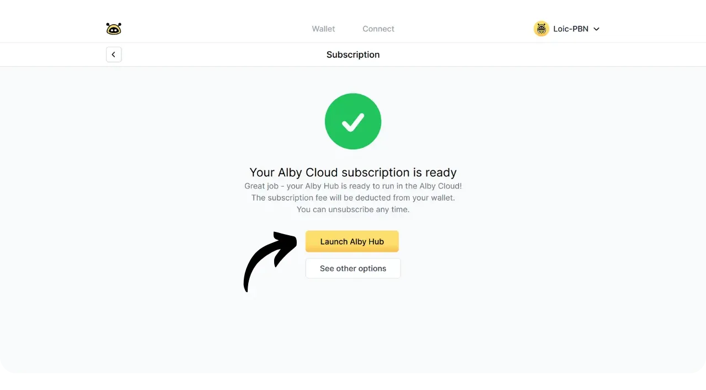
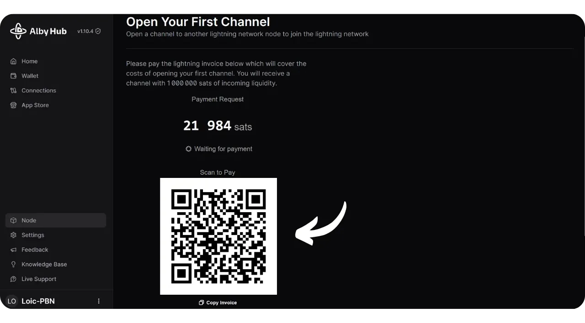
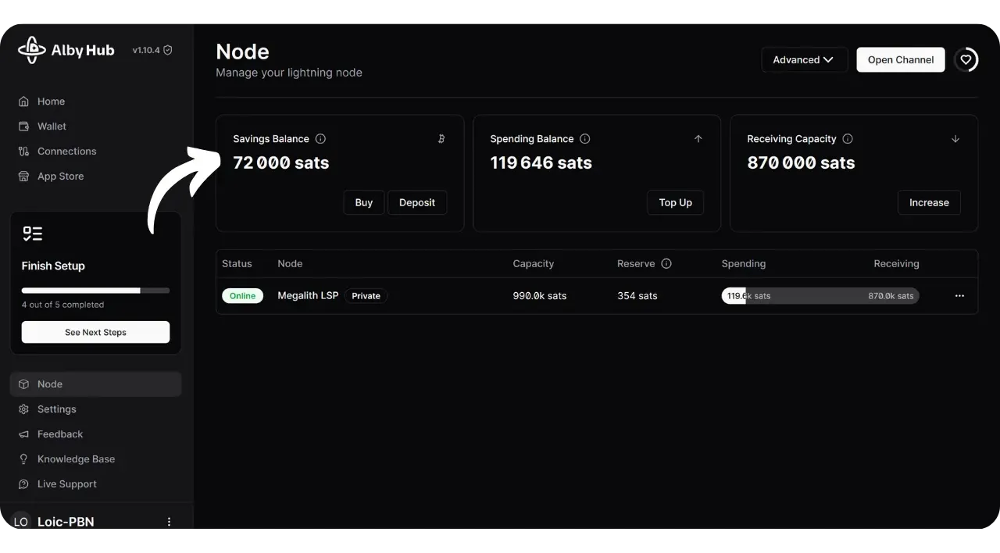
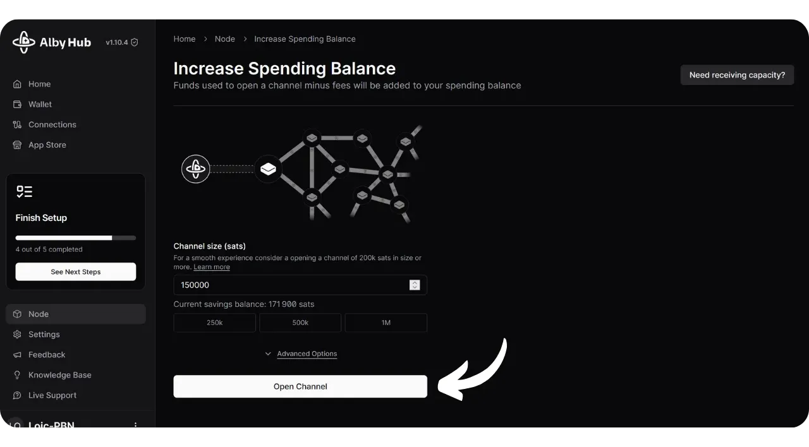
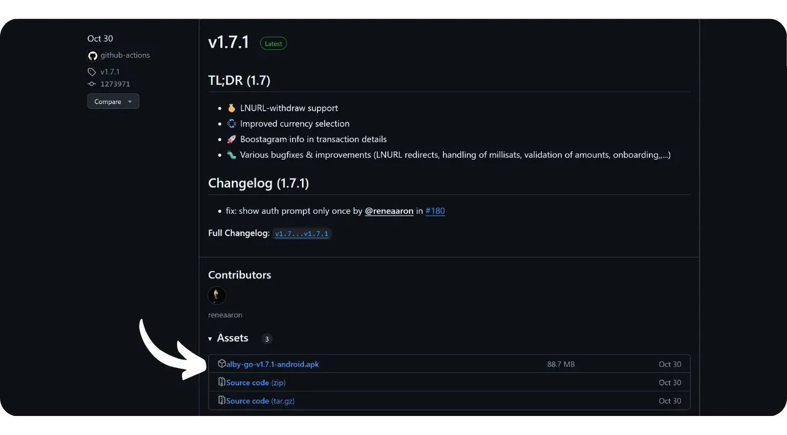
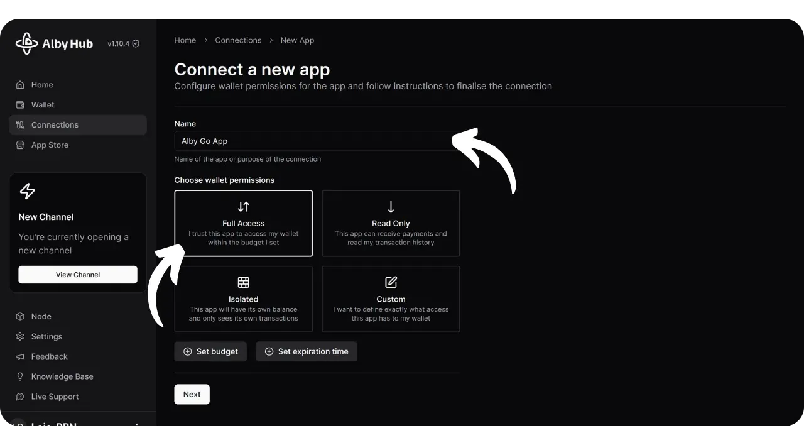
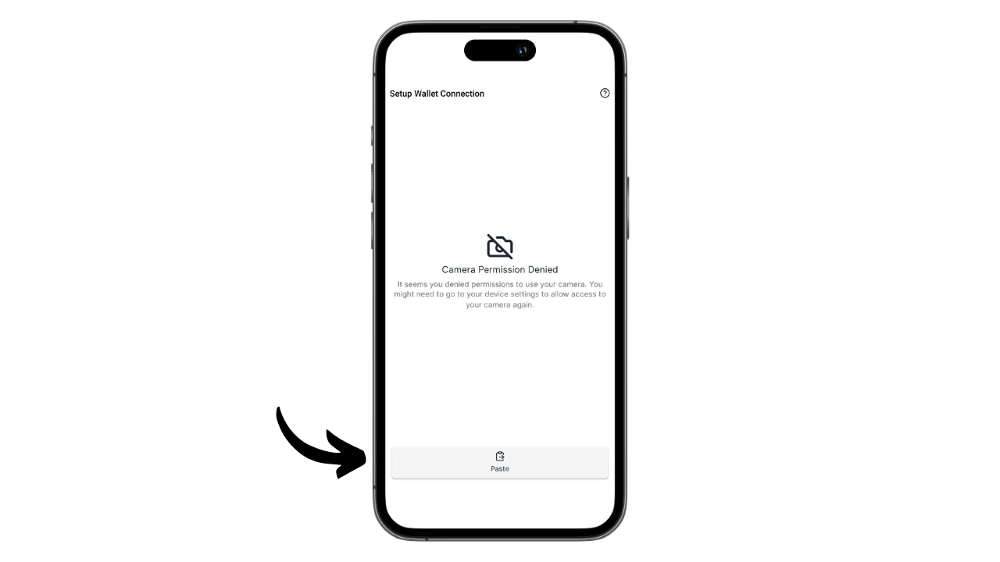
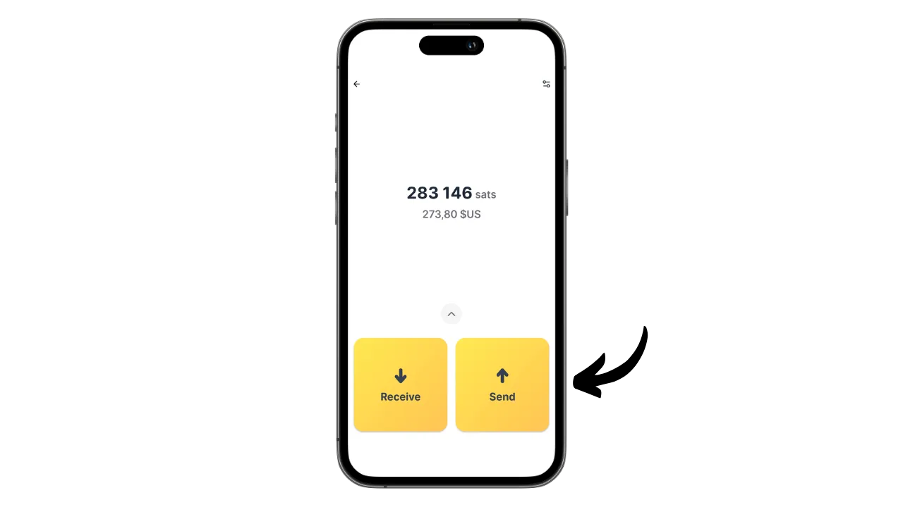

Alby Hub ist die neueste Software von Alby, dem Unternehmen hinter der beliebten Lightning-Web-Erweiterung. Alby Hub ist eine einfach zu bedienende Schnittstelle für die Verwaltung von Lightning-Knoten.

In diesem Tutorial werden wir uns verschiedene Möglichkeiten ansehen, wie Sie Alby Hub nutzen können, um Ihren eigenen Lightning-Knoten zu verwalten, und wie Sie ihn mit Alby Go, der mobilen App von Alby, verbinden können. So können Sie Ihre Sats unterwegs ausgeben und gleichzeitig Ihren Knoten autonom verwalten.

## Was ist Alby Hub?

Im Jahr 2024 hat Alby einen strategischen Wechsel vollzogen. Seit Jahren bietet das Unternehmen eine Reihe von Tools im Zusammenhang mit Bitcoin und dem Lightning Network an, darunter die ikonische Alby-Erweiterung, mit der Sie eine Lightning-Wallet betreiben können, ob mit oder ohne Verwahrung. Für das Jahr 2025 ist jedoch geplant, den Service für gemeinsam verwahrte Wallets einzustellen und sich ausschließlich auf Lösungen zur Selbstverwahrung zu konzentrieren. Alby Hub wird das neue Flaggschiff im Alby-Ökosystem sein. Diese Software ermöglicht es den Nutzern, ihren eigenen Lightning-Knoten zu verwalten und gleichzeitig das Eigentum an ihren Schlüsseln zu behalten (Selbstverwahrung).

Alby Hub ist ein äußerst anpassungsfähiges Werkzeug. Es kann sowohl die Bedürfnisse von Anfängern als auch von fortgeschrittenen Nutzern erfüllen. Einsteiger können damit einen echten Lightning-Knoten problemlos selbst betreiben, ohne sich mit der zugrundeliegenden Komplexität auseinandersetzen zu müssen. Für erfahrenere Benutzer kann Alby Hub als vollständige Schnittstelle für die erweiterte Verwaltung eines bestehenden Lightning-Knotens verwendet werden.

Je nach Bedarf ist der Alby Hub in 4 Konfigurationen erhältlich:

- Alby Hub Cloud :**

Die erste Option ist die Alby-Cloud-Option, die sich ideal für Einsteiger eignet. Sie ermöglicht es Ihnen, einen Lightning-Knoten direkt auf einem von Alby verwalteten Server einzurichten, auf den Sie über Ihre Alby Hub-Schnittstelle zugreifen können. Obwohl Alby den Server verwaltet, behalten Sie die Hoheit über Ihre Mittel, da Ihre Schlüssel mit einem nur Ihnen bekannten Passwort verschlüsselt werden. Allerdings müssen Ihre Schlüssel im RAM entschlüsselt bleiben, damit der Knoten funktioniert, was theoretisch ein Risiko darstellt, wenn jemand physisch auf den Server zugreift. Es ist ein interessanter Kompromiss für Anfänger, aber es ist wichtig, sich der Risiken bewusst zu sein.

Der große Vorteil dieser Option ist, dass Sie einen Lightning-Knoten rund um die Uhr betreiben können, ohne das Hosting selbst verwalten zu müssen. Darüber hinaus sind die Backups Ihres Lightning-Knotens vereinfacht und automatisiert, im Vergleich zu selbst gehosteten Optionen, bei denen Sie die Channel-Backups selbst verwalten müssen.

Alby bietet diesen Dienst für 21.000 Sats pro Monat an (Tarif vom Dezember 2024, Änderungen vorbehalten, [prüfen Sie die Preise] (https://albyhub.com/#pricing)). Die Gebühr wird automatisch von Ihrem Knotenpunkt über eine von Alby ausgestellte Lightning-Rechnung abgebucht. Dies geschieht über eine NWC-Verbindung, die Ihren Knoten so konfiguriert, dass er die Rechnungen von Alby für Ihr Abonnement automatisch bezahlt.

- Alby Hub mit einem bestehenden Knotenpunkt :**

Wenn Sie bereits einen Knoten haben, der z.B. auf Umbrel oder Start9 gehostet wird, kann Alby Hub als erweiterte Verwaltungsschnittstelle verwendet werden, genau wie ThunderHub oder RTL.

- Alby Hub lokal :**

Es ist auch möglich, Alby Hub und Ihren Knoten direkt auf Ihrem PC zu installieren, obwohl diese Option weniger praktisch ist, da Ihr PC immer aktiv bleiben muss, um auf den Lightning-Knoten aus der Ferne zugreifen zu können. Diese Alternative kann jedoch für Ihre speziellen Anforderungen geeignet sein.

- Alby Hub auf einem persönlichen Server :**

Für fortgeschrittene Benutzer kann Alby Hub mit einem einfachen Befehl auf einem persönlichen Server installiert werden. Diese Option wird in diesem Lernprogramm nicht behandelt, aber Sie können eine spezielle Anleitung [auf Alby's GitHub] finden (https://github.com/getAlby/hub?tab=readme-ov-file#docker).

Dieses Tutorial konzentriert sich hauptsächlich auf die Schnittstelle, die unabhängig von der gewählten Option gleich ist. Wir werden uns auch ansehen, wie man Alby Hub mit der kostenpflichtigen Cloud-Option und dann mit der Node-in-Box-Option (Umbrel oder Start9) einsetzt.

Für eine lokale Installation auf Ihrem PC, [laden Sie die Software entsprechend Ihrem Betriebssystem herunter und installieren Sie sie] (https://github.com/getAlby/hub/releases), und folgen Sie dann den Anweisungen auf der Benutzeroberfläche.

## Ein Alby-Konto erstellen

Der erste Schritt besteht darin, ein Alby-Konto zu erstellen. Dies ist zwar für die Nutzung von Alby Hub nicht unbedingt erforderlich, aber es ermöglicht Ihnen, alle verfügbaren Optionen zu nutzen, einschließlich der Möglichkeit, eine Lightning-Adresse zu erhalten.

Gehen Sie auf [die offizielle Alby-Website] (https://getalby.com/) und klicken Sie auf die Schaltfläche "*Konto erstellen*".

Geben Sie einen Spitznamen und eine E-Mail-Adresse ein und klicken Sie dann auf "*Anmelden*". Mit dieser E-Mail-Adresse melden Sie sich später bei Ihrem Konto an.

Geben Sie den Verifizierungscode ein, den Sie per E-Mail erhalten haben.

Sobald Sie in Ihrem Online-Konto eingeloggt sind, klicken Sie auf die Schaltfläche "*Fortfahren*".

Klicken Sie erneut auf "*Fortfahren*".

## Die Option des Cloud-Hostings

Sie haben dann die Wahl zwischen einer selbst gehosteten Option, bei der Sie einen Lightning-Knoten auf Ihrer eigenen Hardware hosten, oder der kostenpflichtigen Option, bei der Sie die Cloud von Alby nutzen. Ich erkläre Ihnen zunächst, wie Sie bei der Cloud-Option vorgehen (beachten Sie, dass es sich hierbei um eine kostenpflichtige Option handelt, siehe Details im vorherigen Abschnitt).

Klicken Sie auf "*Upgrade*".

Bestätigen Sie mit einem Klick auf "*Jetzt anmelden*".

Klicken Sie auf "*Launch Alby Hub*".

Warten Sie einige Augenblicke, während Ihr Knoten erstellt wird.

Und das war's, Ihr Alby Hub ist jetzt konfiguriert. Im nächsten Abschnitt zeige ich Ihnen, wie Sie Alby Hub auf einem bestehenden Knoten installieren. Wenn Sie das nicht brauchen, können Sie zum nächsten Abschnitt übergehen, um Ihren Knoten zu konfigurieren.

## Die Option des Selbsthostings

Wenn Sie Alby Hub als Schnittstelle für Ihren bestehenden Lightning-Knoten verwenden möchten, haben Sie mehrere Möglichkeiten: Installieren Sie es auf einem Server, lokal auf Ihrem Computer oder über einen Node-in-Box (Umbrel oder Start9). Die Nutzung von Alby Hub in diesen Konfigurationen ist kostenlos. Wir werden uns auf die Node-in-Box-Option konzentrieren, da ich finde, dass die Server-Option ohne physischen Zugang ähnliche Risiken wie die Cloud-Version birgt und die lokale Installation auf einem PC oft ungeeignet ist.

Um dies auf Umbrel einzurichten (die Schritte für Start9 sind identisch), müssen Sie zunächst einen LND-Knoten konfiguriert haben.

Loggen Sie sich in Ihr Umbrel-Interface ein und gehen Sie in den Application Store.

Suchen Sie nach der Anwendung "*Alby Hub*".

Installieren Sie es auf Ihrem Knoten.

Ihre Alby Hub-Schnittstelle ist nun fertig. Sie können dem Rest des Tutorials folgen, als ob Sie die Cloud-Schnittstelle verwenden würden, aber ohne die Optionen der kostenpflichtigen Version. Außerdem werden Ihre Schlüssel, anders als bei der Cloud-Version, lokal auf Ihrem Knoten gespeichert und nicht auf den Servern von Alby.

## Start Alby Hub

Klicken Sie auf die Schaltfläche "*Get Started*".

Alby Hub wird Sie dann auffordern, ein Passwort zu wählen. Dieses Passwort ist sehr wichtig, da es zur Verschlüsselung Ihrer Brieftasche verwendet wird. In der kostenpflichtigen Cloud-Version werden Ihre Schlüssel auf dem Alby-Server gespeichert, mit diesem Passwort, das nur Sie kennen, verschlüsselt und dann entschlüsselt und nur im RAM gespeichert, um Transaktionen bei Bedarf zu signieren.

Es ist daher wichtig, ein sicheres Passwort zu wählen. Jeder, der dieses Passwort kennt, könnte sich Zugang zu Ihrem Knoten verschaffen. Stellen Sie sicher, dass Sie auch eine oder mehrere physische Sicherungen dieses Passworts auf einem Stück Papier oder besser noch auf einem Stück Metall für zusätzliche Sicherheit machen. **Wenn Sie dieses Passwort verlieren, ist es unmöglich, den Zugang zu Ihren Bitcoins wiederzuerlangen**, da Alby keine Möglichkeit hat, es zurückzusetzen. Der Verlust dieses Passworts bedeutet den Verlust Ihrer Bitcoins.

Nachdem Sie Ihr Passwort sorgfältig ausgewählt und gespeichert haben, klicken Sie auf "*Passwort erstellen*".

Sie haben nun Zugriff auf Ihren Lightning-Knoten.

Die erste Maßnahme, die Sie ergreifen müssen, ist das Speichern Ihrer Wiederherstellungsphrase, von der Ihre Schlüssel abgeleitet sind. Mit dieser Phrase können Sie den Zugang zu Ihrer Onchain-Brieftasche und, mit dem neuesten Stand Ihrer Kanäle, Ihre Sats auf Lightning wiederherstellen. Klicken Sie dazu auf "*Einstellungen*".

Gehen Sie dann auf die Registerkarte "*Backup*". Geben Sie Ihr Passwort ein, um darauf zuzugreifen.

Sie haben dann Zugang zu Ihrer 12-Wort-Wiederherstellungsphrase. Machen Sie eine oder mehrere Sicherungskopien dieser Phrase auf Papier oder Metall und bewahren Sie sie an einem sicheren Ort auf.

Wenn Sie die Phrase gespeichert haben, markieren Sie das Kästchen, um zu bestätigen, dass Sie sie gespeichert haben, und klicken Sie auf "*Fortfahren*".

## Wie kann ich den Zugriff auf meine Bitcoins wiederherstellen?

Bevor Sie Gelder an Ihren Knotenpunkt senden, sollten Sie sich darüber informieren, wie Sie diese im Falle eines Problems zurückerhalten können und welche Informationen für diese Rückerstattung erforderlich sind. Das Verfahren variiert je nach Art der wiederherzustellenden Mittel und dem Hosting-Modus Ihres Knotens.

Für zahlende Cloud-Nutzer sind für die vollständige Wiederherstellung ihrer Bitcoins drei wesentliche Elemente erforderlich:

- Ihre Genesungsphrase;
- Ihr Passwort (das für Ihren Knoten verwendete) ;
- Zugang zu Ihrem Alby-Konto, um den aktuellen Status Ihrer Lightning-Kanäle abzurufen.

Das Fehlen einer dieser 3 Informationen würde es unmöglich machen, Ihre Bitcoins in vollem Umfang wiederzuerlangen.

Für diejenigen, die ihren eigenen Knoten hosten, ist der Wiederherstellungsprozess identisch mit dem für jeden Lightning-Knoten. Sie benötigen :

- Ihre Genesungsphrase;
- Der aktuelle Status deiner Lightning-Kanäle. Um diese Informationen zu sichern, bietet Umbrel [eine Option](https://github.com/getumbrel/umbrel/blob/2b266036f62a1594aa60a8a3be30cfb8656e755f/scripts/backup/README.md), um sie zu verschlüsseln und dynamisch und anonym über Tor zu speichern.

## Kaufen Sie Ihren ersten Lightning-Kanal

Sie können nun den Anweisungen von Alby Hub folgen. Klicken Sie auf die Schaltfläche, um Ihren ersten Kanal für eingehendes Geld zu öffnen.

Wählen Sie "*Kanal öffnen*". Wenn Sie nicht vorhaben, ein Routing-Knotenpunkt zu werden, und keinen speziellen Bedarf haben, empfehle ich Ihnen, sich für private Kanäle zu entscheiden.

Alby Hub erstellt eine Rechnung, die Sie bezahlen müssen. Diese Zahlung deckt die Transaktionsgebühren ab, die für die Eröffnung Ihres Kanals erforderlich sind, sowie die Servicegebühren des LSP (*Lightning Service Provider*), der einen Kanal zu Ihrem Knotenpunkt öffnen wird, so dass Sie sofort Zahlungen erhalten können.

Sobald die Rechnung bezahlt und die Transaktion bestätigt wurde, wird Ihr erster Lightning-Kanal eingerichtet.

Auf der Registerkarte "*Knoten*" können Sie sehen, dass Sie jetzt über eingehende Barmittel verfügen, die es Ihnen ermöglichen, Zahlungen über Lightning zu empfangen.

Um eine Zahlung zu erhalten, klicken Sie auf die Registerkarte "*Wallet*" und dann auf "*Empfangen*".

Geben Sie einen Betrag ein und fügen Sie ggf. eine Beschreibung hinzu, und klicken Sie dann auf "*Rechnung erstellen*".

Ich habe meine erste Zahlung von 120.000 Sats erhalten.

Wenn Sie zur Registerkarte "*Brieftasche*" zurückkehren, können Sie den Kontostand Ihrer Brieftasche überprüfen. Beachten Sie, dass Alby Hub automatisch 354 Sats reserviert, wenn Sie Ihre erste Zahlung leisten. Für jeden Lightning-Kanal, den Sie danach öffnen, legt Alby Hub automatisch eine Reserve in Höhe von 1 % der Kapazität des Kanals zurück. Diese Reserve ist eine Sicherheitsmaßnahme, die es Ihrem Knotenpunkt ermöglicht, die Gelder des Kanals im Falle eines Betrugsversuchs durch Ihren Peer zurückzuholen. Das ist der Grund, warum, obwohl ich 120.000 Sats gesendet habe, nur 119.646 Sats auf meinem Kontostand angezeigt werden.

## Bitcoins onchain einzahlen

Wenn Sie über ausgehendes Bargeld verfügen möchten, um Zahlungen zu tätigen, können Sie auch selbst einen Kanal eröffnen. Dazu benötigen Sie Onchain-Bitcoins in Ihrer Brieftasche.

Klicken Sie auf der Registerkarte "*Knoten*" auf "*Einzahlung*".

Senden Sie Bitcoins an die angezeigte Adresse. Diese Adresse wird von Ihrer zuvor gespeicherten Wiederherstellungsphrase abgeleitet.

Ich habe 72.000 Sats gesendet. Sie sind jetzt unter "*Sparguthaben*" sichtbar, das alle Gelder enthält, die ich auf der Kette besitze, und nicht auf Lightning.

## Öffnen Sie einen Lightning-Kanal

Da Sie nun über Onchain-Guthaben verfügen, können Sie einen neuen Lightning-Kanal eröffnen. Es ist ratsam, mehrere Kanäle mit ausreichenden Beträgen zu eröffnen, um sicherzustellen, dass Sie immer Zahlungen ohne Einschränkungen vornehmen können. Die meisten LSPs (*Lightning Service Provider*) verlangen ein Minimum von 150.000 Sats, um einen Kanal mit Ihnen zu eröffnen.

Klicken Sie auf der Registerkarte "*Knoten*" auf "*Kanal öffnen*".

Wählen Sie die Größe Ihres Channels. Ich empfehle Ihnen, keine zu kleinen Kanäle zu eröffnen, da es sich um einen Lightning-Knoten handelt und der Rechner, auf dem Ihre Schlüssel gespeichert sind, nicht das gleiche Sicherheitsniveau wie eine Hardware-Wallet bietet. Seien Sie also vorsichtig mit den Beträgen, die Sie blockieren wollen.

Im Menü "*Erweiterte Optionen*" können Sie auswählen, mit welchem LSP Ihr Kanal geöffnet werden soll, oder Sie können manuell einen anderen Lightning-Knoten eingeben.

Klicken Sie dann auf "*Kanal öffnen*".

Warten Sie, bis Ihr Kanal in der Kette bestätigt ist.

Ihr neuer Kanal wird nun auf der Registerkarte "*Knoten*" angezeigt.

## Verbinden Sie eine Kostenanwendung

Jetzt, wo Sie einen funktionierenden Lightning-Knoten haben, können Sie ihn nutzen, um täglich Sats zu empfangen und auszugeben. Die Weboberfläche von Alby Hub ist zwar praktisch für die Verwaltung Ihres Knotens, aber nicht ideal, um unterwegs schnelle Transaktionen durchzuführen. Hierfür werden wir eine Lightning-Wallet-App verwenden, die auf unserem Smartphone installiert ist.

In diesem Tutorial empfehle ich Ihnen, sich für Alby Go zu entscheiden, das sehr einfach zu bedienen ist, aber Sie können auch andere kompatible Anwendungen wie Zeus verwenden.

Um Alby Go zu installieren, rufen Sie den Anwendungsspeicher Ihres Geräts auf:

- [Für Android] (https://play.google.com/store/apps/details?id=com.getalby.mobile);
- [Für Apple] (https://apps.apple.com/us/app/alby-go/id6471335774).

Android-Benutzer können die App auch über die `.apk`-Datei [verfügbar auf Alby's GitHub] (https://github.com/getAlby/go/releases) installieren.

Wenn die Anwendung gestartet wird, klicken Sie auf "*Connect Wallet*".

Klicken Sie in Ihrem Alby Hub unter der Registerkarte "*Verbindungen*" auf "*Verbindung hinzufügen*".

Benennen Sie diese Verbindung, um sie in Ihrem Hub leicht identifizieren zu können, und wählen Sie die Berechtigungen, die Sie der Anwendung gewähren möchten. In meinem Fall wähle ich "*Voller Zugriff*", um von meinem Smartphone aus vollen Zugriff auf die Gelder meines Lightning-Knotens zu haben. Sie können den Zugriff aber auch durch ein maximales Budget begrenzen, die erlaubten Funktionen auswählen oder ein Ablaufdatum für diese Berechtigungen festlegen. Nach der Konfiguration klicken Sie auf "*Weiter*".

Alby Hub generiert dann ein Geheimnis, um die Verbindung herzustellen.

Gehen Sie zurück zur Anwendung Alby Go, scannen Sie den QR-Code oder fügen Sie das Geheimnis ein.

Klicken Sie auf "Fertigstellen*".

Sie haben jetzt von Ihrem Smartphone aus Fernzugriff auf Ihren Lightning-Knoten, so dass Sie jeden Tag unterwegs Sats ausgeben und empfangen können.

Falls erforderlich, können Sie die Berechtigungen für diese Verbindung direkt auf Alby Hub verwalten, indem Sie darauf klicken.

Um Sats zu empfangen, klicken Sie einfach auf "*Empfangen*".

Ändern Sie den Rechnungsbetrag und die Beschreibung, indem Sie auf "*Rechnung*" klicken.

Laden Sie die Rechnung für den Empfang von sats.

Um eine Sats zu senden, klicken Sie auf "*Senden*".

Scannen Sie die Rechnung, die Sie bezahlen möchten.

Klicken Sie dann auf "*Bezahlen*".

Ihre Transaktion ist bestätigt.

Wenn Sie auf den kleinen Pfeil klicken, können Sie auf Ihre Transaktionshistorie zugreifen.

Diese Transaktionen sind auch in Ihrem Alby Hub sichtbar.

## Passen Sie Ihre Lightning-Adresse an

Alby bietet Ihnen die Möglichkeit einer Lightning-Adresse. Damit können Sie Zahlungen auf Ihrem Knotenpunkt empfangen, ohne jedes Mal manuell eine Rechnung erstellen zu müssen. Standardmäßig weist Alby Ihnen eine Lightning-Adresse zu, aber Sie können sie anpassen. Loggen Sie sich in Ihr Alby Online-Konto ein, klicken Sie auf Ihren Namen in der oberen rechten Ecke und wählen Sie dann "*Einstellungen*".

Navigieren Sie zum Menü "*Blitzadresse*".

Ändern Sie Ihre Adresse und bestätigen Sie dann mit einem Klick auf "*Blitzadresse aktualisieren*".

Bitte beachten Sie, dass Ihre Adresse nicht mehr Ihnen gehört, sobald sie geändert worden ist. Stellen Sie also sicher, dass Sie nie wieder Sats an diese Adresse schicken.

Und das war's. Sie wissen jetzt, wie Sie Lightning mit Ihrem eigenen Knotenpunkt unter Verwendung des Alby-Hub-Tools verwenden können. Wenn Sie dieses Tutorial nützlich fanden, wäre ich Ihnen sehr dankbar, wenn Sie unten einen grünen Daumen setzen würden. Sie können diesen Artikel auch gerne in Ihren sozialen Netzwerken teilen. Herzlichen Dank dafür!

Um alle Lightning-Mechanismen, die wir in diesem Tutorial behandelt haben, im Detail zu verstehen, empfehle ich Ihnen dringend, unsere kostenlose Schulung zu diesem Thema zu besuchen:

https://planb.network/courses/lnp201