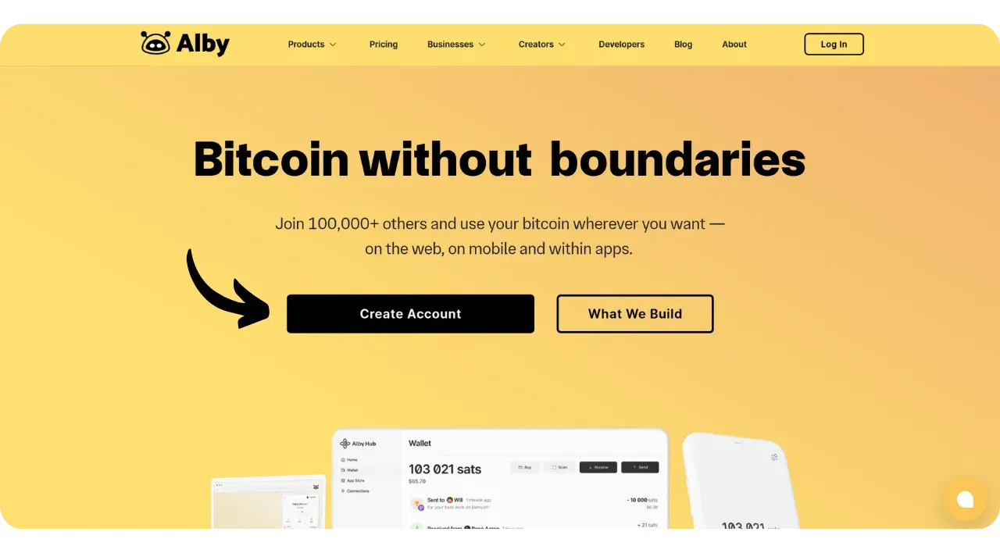
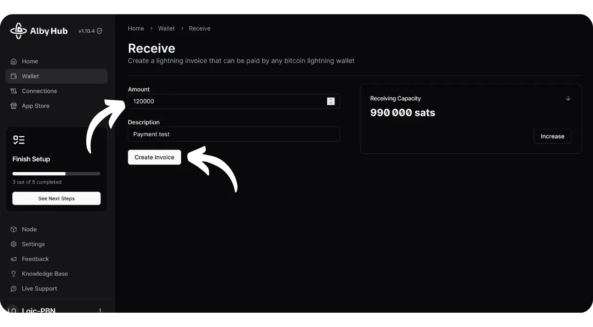
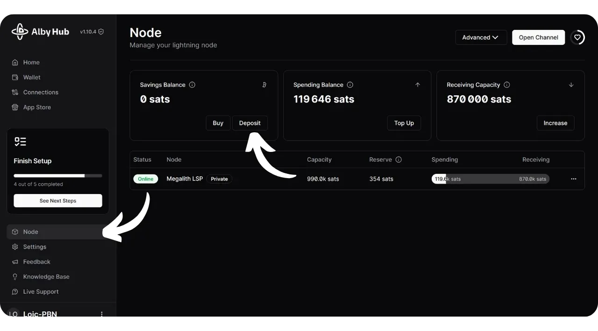
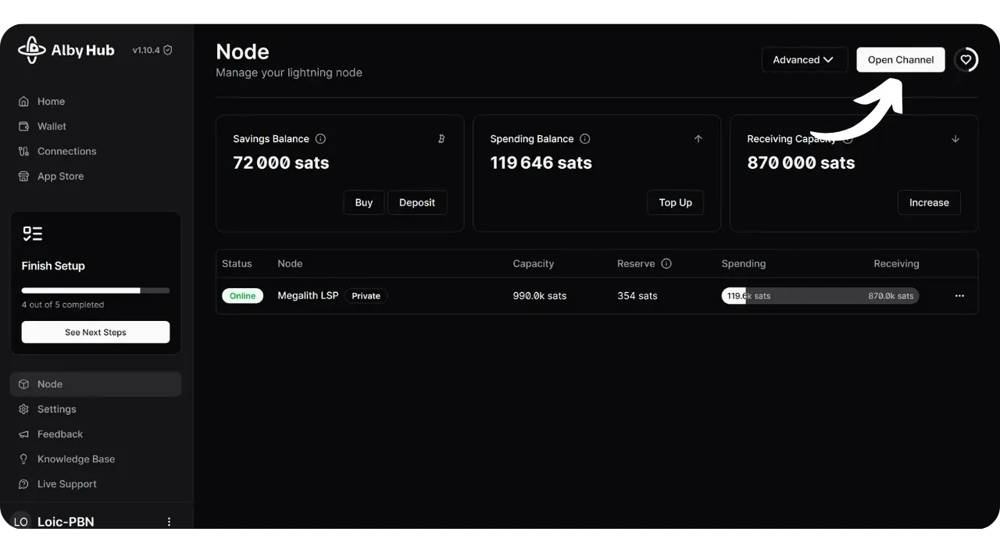
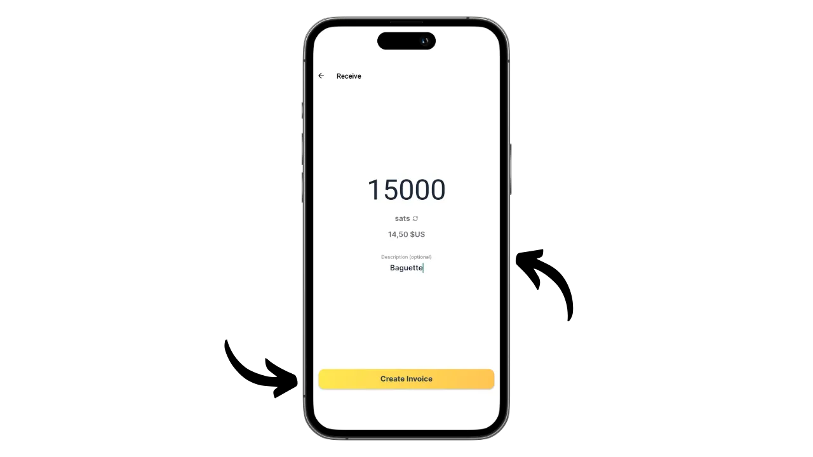

Alby Hub is the latest software from Alby, the company behind the popular Lightning web extension. Alby Hub is an easy-to-use interface for managing Lightning nodes.

In this tutorial, we'll look at different ways of using Alby Hub to manage your own Lightning node, and how to connect it to Alby Go, Alby's mobile app. This will enable you to spend your sats on the move while being autonomous in the management of your node.

## What is Alby Hub?

In 2024, Alby marked a strategic shift. For years, they've offered a variety of tools associated with Bitcoin and the Lightning Network, including the iconic Alby extension, which allows you to operate a Lightning wallet, custodial or otherwise. However, in 2025, they plan to discontinue their shared custodial wallet service and focus exclusively on self-custody solutions. Alby Hub is set to be the new flagship tool in the Alby ecosystem. This software enables users to easily manage their own Lightning node, while retaining ownership of their keys (self-custody).

Alby Hub is a highly adaptable tool. It can meet the needs of both beginners and advanced users. Novices will use it to easily operate a real Lightning node on their own, without having to deal with the underlying complexity. For more experienced users, Alby Hub can be used as a complete interface for advanced management of an existing Lightning node.

Depending on your needs, Alby Hub is available in 4 configurations:

- Alby Hub Cloud :**

Ideal for novices, this first option is the Alby cloud option. It allows you to deploy a Lightning node directly on an Alby-managed server, accessible via your Alby Hub interface. Although Alby manages the server, you retain sovereignty over your funds, as your keys are encrypted using a password known only to you. However, your keys must remain decrypted in RAM for the node to operate, which theoretically exposes them to risk if someone physically accesses the server. It's an interesting compromise for beginners, but it's important to be aware of the risks.

The major advantage of this option is that you get a Lightning node up and running 24/7, without having to manage the hosting yourself. What's more, backups of your Lightning node are simplified and automated, compared with self-hosted options where you have to manage channel backups yourself.

Alby offers this service for 21,000 sats per month (December 2024 rate, subject to change, [check their pricing](https://albyhub.com/#pricing)). The fee is automatically deducted from your node via a Lightning invoice issued by Alby. This is done via a NWC connection that configures your node to automatically pay Alby invoices related to your subscription.

- Alby Hub with an existing node :**

If you already have a node hosted, for example on Umbrel or Start9, Alby Hub can be used as an advanced management interface, in the same way as ThunderHub or RTL.

- Alby Hub local :**

It's also possible to install Alby Hub and your node directly on your PC, although this option is less practical, as your PC must remain active at all times to remotely access the Lightning node. However, this alternative may be suitable for your specific needs.

- Alby Hub on a personal server :**

For advanced users, Alby Hub can be deployed on a personal server with a simple command. This option is not covered in this tutorial, but you can find dedicated instructions [on Alby's GitHub](https://github.com/getAlby/hub?tab=readme-ov-file#docker).

This tutorial focuses mainly on the interface, which will be the same regardless of the option chosen. We'll also look at how to deploy Alby Hub with the paid cloud option, then with the node-in-box option (Umbrel or Start9).

For local installation on your PC, [download and install the software according to your operating system](https://github.com/getAlby/hub/releases), then follow the same instructions on the interface.

## Create an Alby account

The first step is to create an Alby account. Although this is not essential for using Alby Hub, it does allow you to take full advantage of the options available, including the possibility of obtaining a Lightning address.

Go to [the official Alby website](https://getalby.com/) and click on the "*Create Account*" button.

Enter a nickname and an email address, then click on "*Sign up*". This email address will be used to log in to your account later.

Enter the verification code you received by email.

Once logged into your online account, click on the "*Continue*" button.

Click "*Continue*" again.

## The cloud hosting option

You'll then have to choose between a self-hosted option, where you host a Lightning node on your own hardware, or the paid option using Alby's cloud. I'll start by explaining how to proceed with the Cloud option (note that this is a paid option, see details in the previous section).

Click on "*Upgrade*".

Confirm by clicking on "*Subscribe Now*".

Click on "*Launch Alby Hub*".

Wait a few moments while your node is created.

And that's it, your Alby Hub is now configured. In the next section, I'll show you how to install Alby Hub on an existing node. If you don't need to, you can skip ahead to the next section to configure your node.

## The self-hosting option

If you prefer to use Alby Hub as an interface for your existing Lightning node, you have several options: install it on a server, locally on your computer, or via a node-in-box (Umbrel or Start9). Using Alby Hub in these configurations is free of charge. We're going to concentrate on the node-in-box option, as I find that the server option, without physical access, presents similar risks to the cloud version, and local installation on a PC is often unsuitable.

To set this up on Umbrel (the steps for Start9 are identical), you must first have an LND node already configured.

Log in to your Umbrel interface and go to the application store.

Look for the "*Alby Hub*" application.

Install it on your node.

Your Alby Hub interface is now ready. You can follow the rest of the tutorial as if you were using the cloud interface, but without the options of the paid version. What's more, unlike the cloud version, your keys are stored locally on your node, not on Alby's servers.

## Launch Alby Hub

Click on the "*Get Started*" button.

Alby Hub will then prompt you to choose a password. This password is very important, as it will be used to encrypt your wallet. In the paid cloud version, your keys are stored on the Alby server, encrypted with this password that only you know, then decrypted and stored only in RAM to sign transactions when necessary.

It is therefore essential to choose a strong password. Anyone with this password could potentially gain access to your node. Make sure you also make one or more physical backups of this password on a piece of paper, or better still, on a piece of metal for added security. **If you lose this password, it will be impossible to recover access to your bitcoins**, as Alby has no way of resetting it. The loss of this password means the loss of your bitcoins.

Once you have carefully chosen and saved your password, click on "*Create Password*".

You now have access to your Lightning node.

The first action to take is to save your recovery phrase, from which your keys are derived. This phrase allows you to recover access to your onchain wallet and, with the latest state of your channels, your sats on Lightning. To do this, click on "*Settings*".

Then go to the "*Backup*" tab. Enter your password to access it.

You will then have access to your 12-word recovery phrase. Make one or more physical back-ups of this phrase on paper or metal, and store it in a safe place.

Once you've saved the phrase, check the box to confirm that you've saved it and click "*Continue*".

## How can I recover access to my bitcoins?

Before sending funds to your node, it's important to understand how to recover them in the event of a problem, as well as what information is required for this recovery. The process varies according to the nature of the funds to be recovered and the hosting mode of your node.

For paid cloud users, complete recovery of your bitcoins requires three essential elements:

- Your recovery phrase;
- Your password (the one used for your node) ;
- Access to your Alby account, to retrieve the latest status of your Lightning channels.

The absence of any of these 3 pieces of information would make it impossible to recover your bitcoins in full.

For those hosting their own node, the recovery process is identical to that for any Lightning node. You'll need :

- Your recovery phrase;
- The latest status of your Lightning channels. To secure this information, Umbrel offers [an option](https://github.com/getumbrel/umbrel/blob/2b266036f62a1594aa60a8a3be30cfb8656e755f/scripts/backup/README.md) to encrypt it and save it dynamically and anonymously via Tor.

## Buy your first Lightning channel

You can now follow the instructions provided by Alby Hub. Click on the button to open your first channel for incoming cash.

Select "*Open Channel*". If you don't intend to become a routing node and don't specifically need one, I recommend you opt for private channels.

Alby Hub will generate an invoice for you to pay. This payment covers the transaction fees needed to open your channel, as well as the service fees of the LSP (*Lightning Service Provider*) who will open a channel to your node, allowing you to receive payments immediately.

Once the invoice has been paid and the transaction confirmed, your first Lightning channel is established.

In the "*Node*" tab, you can see that you now have incoming cash, enabling you to receive payments via Lightning.

To receive payment, click on the "*Wallet*" tab and then on "*Receive*".

Enter an amount and add a description if necessary, then click on "*Create Invoice*".

I received my first payment of 120,000 sats.

By returning to the "*Wallet*" tab, you can check your wallet balance. Note that Alby Hub automatically sets aside 354 sats when you make your first payment. For each Lightning channel you open thereafter, Alby Hub will automatically set aside a reserve equivalent to 1% of the channel's capacity. This reserve is a security measure that enables your node to recover the channel's funds in the event of attempted fraud by your peer. That's why, although I've sent 120,000 sats, only 119,646 sats are shown on my balance.

## Depositing bitcoins onchain

If you want to have outgoing cash to make payments, you can also open a channel yourself. To do this, you'll need onchain bitcoins in your wallet.

From the "*Node*" tab, click on "*Deposit*".

Send bitcoins to the address displayed. This address is derived from your previously saved recovery phrase.

I sent 72,000 sats. They are now visible in "*Savings Balance*", which includes all the funds I own onchain, and not on Lightning.

## Open a Lightning channel

Now that you have onchain funds, you can open a new Lightning channel. It's advisable to open several channels, with sufficient amounts to ensure that you can always make payments without constraint. Most LSPs (*Lightning Service Providers*) require a minimum of 150,000 sats to open a channel with you.

In the "*Node*" tab, click on "*Open Channel*".

Select the size of your channel. I recommend that you don't open channels that are too small, bearing in mind that this is a Lightning node and the machine hosting your keys doesn't offer the same level of security as a hardware wallet. So be careful with the amounts you choose to block.

In the "*Advanced Options*" menu, you can choose which LSP to open your channel with, or manually enter another Lightning node.

Then click on "*Open Channel*".

Wait while your channel is confirmed onchain.

Your new channel will now appear in the "*Node*" tab.

## Connect an expense application

Now that you have a working Lightning node, you can use it to receive and spend sats on a daily basis. While Alby Hub's web interface is handy for managing your node, it's not ideal for making quick transactions on the move. For this, we're going to use a Lightning wallet app installed on our smartphone.

In this tutorial, I recommend you opt for Alby Go, which is very easy to use, but you can also use other compatible applications such as Zeus.

To install Alby Go, go to your device's application store:

- [For Android](https://play.google.com/store/apps/details?id=com.getalby.mobile);
- [For Apple](https://apps.apple.com/us/app/alby-go/id6471335774).

Android users can also install the app via the `.apk` file [available on Alby's GitHub](https://github.com/getAlby/go/releases).

When the application is launched, click on "*Connect Wallet*".

In your Alby Hub, under the "*Connections*" tab, click on "*Add Connection*".

Name this connection to identify it easily in your Hub, and select the permissions you wish to grant to the application. In my case, I choose "*Full Access*" to have full access to my Lightning node's funds from my smartphone, but you can also limit access by a maximum budget, select the features allowed, or set an expiry date for these permissions. Once configured, click on "*Next*".

Alby Hub will then generate a secret to establish the connection.

Go back to the Alby Go application, scan the QR code or paste the secret.

Click on "Finish*".

You now have remote access to your Lightning node from your smartphone, making it easy to spend and receive sats on the move every day.

If necessary, you can manage the permissions for this connection directly on Alby Hub by clicking on it.

To receive sats, simply click on "*Receive*".

Modify the invoice amount and description by clicking on "*Invoice*".

Charge the invoice to receive sats.

To send sats, click on "*Send*".

Scan the invoice you wish to pay.

Then click on "*Pay*".

Your transaction is confirmed.

By clicking on the small arrow, you can access your transaction history.

These transactions are also visible on your Alby Hub.

## Customize your Lightning address

Alby offers you the option of a Lightning address. This allows you to receive payments on your node without having to manually generate an invoice each time. By default, Alby assigns you a Lightning address, but you can customize it. Log in to your Alby online account, click on your name in the top right-hand corner, then select "*Settings*".

Navigate to the "*Lightning Address*" menu.

Modify your address, then confirm by clicking on "*Update your lightning address*".

Please note that once your address has been changed, it no longer belongs to you. So make sure you never send sats to it again.

And that's it, you now know how to use Lightning with your own node using the Alby Hub tool. If you found this tutorial useful, I'd be very grateful if you put a green thumb below. Please feel free to share this article on your social networks. Thank you very much!

To understand in detail all the Lightning mechanisms that we have manipulated in this tutorial, I strongly advise you to discover our free training on the subject :

https://planb.network/courses/lnp201