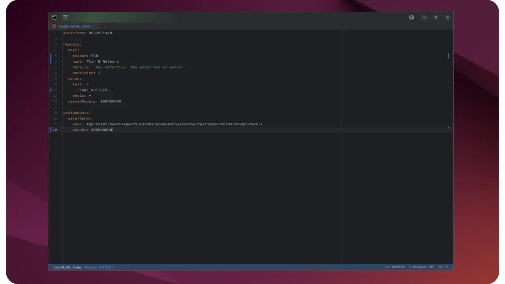
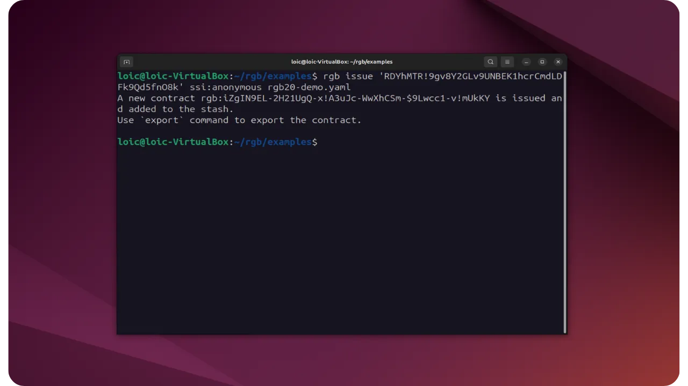
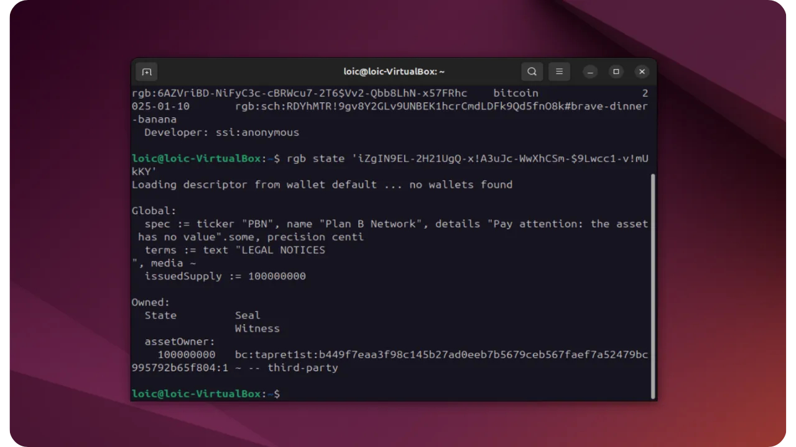

In questo tutorial, seguiremo il processo passo-passo di scrittura di un contratto, utilizzando lo strumento a riga di comando `rgb` creato dall'associazione LNP/BP. L'obiettivo è mostrare come installare e manipolare la CLI, compilare uno Schema, importare l'Interfaccia e l'Implementazione dell'Interfaccia e quindi emettere una risorsa RGB. Verrà inoltre esaminata la logica sottostante, compresa la compilazione e la convalida dello stato. Alla fine di questo tutorial, dovreste essere in grado di riprodurre il processo e creare i vostri contratti RGB.

## Promemoria protocollo RGB

RGB è un protocollo che gira sopra Bitcoin ed emula le funzionalità dei contratti intelligenti e la gestione degli asset digitali, senza sovraccaricare la blockchain su cui si basa. A differenza degli smart contract on-chain convenzionali (come ad esempio su Ethereum), RGB si basa su un sistema di "*convalida lato cliente*": la maggior parte dei dati e delle cronologie di stato sono scambiati e memorizzati esclusivamente dai partecipanti coinvolti, mentre la blockchain Bitcoin ospita solo piccoli impegni crittografici (tramite meccanismi come *Tapret* o *Opret*). Nel protocollo RGB, la blockchain Bitcoin funge quindi solo da server di marcatura temporale e da sistema di protezione contro le doppie spese.

Un contratto RGB è strutturato come una macchina a stati evolutiva. Inizia con una Genesi che definisce lo stato iniziale (che descrive, ad esempio, l'offerta, il ticker o altri metadati) secondo uno Schema rigorosamente tipizzato e compilato. Le transizioni di stato e, se necessario, le estensioni di stato vengono quindi applicate per modificare o estendere questo stato. Ogni operazione, sia che trasferisca beni fungibili (RGB20) sia che crei beni unici (RGB21), comporta *Sigilli a uso singolo*. Questi collegano gli UTXO Bitcoin agli Stati fuori catena e impediscono la doppia spesa, garantendo al contempo riservatezza e scalabilità.

Per saperne di più sul funzionamento del protocollo RGB, vi consiglio di seguire questo corso di formazione completo:

https://planb.network/courses/csv402
La logica interna di RGB si basa su librerie Rust che voi, come sviluppatori, potete importare nei vostri progetti per gestire la parte di *convalida lato cliente*. Inoltre, il team di LNP/BP sta lavorando a legami per altre lingue, ma non sono ancora stati finalizzati. Inoltre, altre entità come Bitfinex stanno sviluppando i propri stack di integrazione, ma ne parleremo in un altro tutorial. Per il momento, la CLI `rgb` è il riferimento ufficiale, anche se rimane relativamente poco rifinita.

## Installazione e presentazione dello strumento rgb CLI

Il comando principale si chiama semplicemente `rgb`. È stato progettato per ricordare `git`, con una serie di sottocomandi per manipolare i contratti, invocarli, emettere beni e così via. Bitcoin Wallet non è attualmente integrato, ma lo sarà in una prossima versione (0.11). Questa prossima versione consentirà agli utenti di creare e gestire i loro portafogli (tramite descrittori) direttamente da `rgb`, compresa la generazione di PSBT, la compatibilità con l'hardware esterno (ad esempio un portafoglio hardware) per la firma e l'interoperabilità con software come Sparrow. Questo semplificherà l'intero scenario di emissione e trasferimento degli asset.

### Installazione tramite Cargo

Installiamo lo strumento in Rust con :

```bash
cargo install rgb-contracts --all-features
```

(Nota: il crate si chiama `rgb-contracts` e il comando installato si chiamerà `rgb`. Se esisteva già un crate chiamato `rgb`, potrebbe esserci stata una collisione, da cui il nome)

L'installazione compila un gran numero di dipendenze (ad esempio, parsing dei comandi, integrazione di Electrum, gestione delle prove a conoscenza zero, ecc.)

Una volta completata l'installazione, il file :

```bash
rgb
```

L'esecuzione di `rgb` (senza argomenti) visualizza un elenco di sottocomandi disponibili, come `interfacce`, `schema`, `importazione`, `esportazione`, `emissione`, `fattura`, `trasferimento`, ecc. È possibile modificare la directory di archiviazione locale (una riserva che contiene tutti i log, gli schemi e le implementazioni), scegliere la rete (testnet, mainnet) o configurare il server Electrum.


### Prima panoramica dei controlli

Eseguendo il seguente comando, si noterà che un'interfaccia `RGB20` è già integrata per impostazione predefinita:

```bash
rgb interfaces
```

Se questa interfaccia non è integrata, clonare il file :

```bash
git clone https://github.com/RGB-WG/rgb-interfaces
```

Compilare:

```bash
cargo run
```

Importare quindi l'interfaccia scelta:

```bash
rgb import interfaces/RGB20.rgb
```


Tuttavia, ci viene detto che nessuno schema è stato ancora importato nel software. Non c'è nemmeno un contratto nella scorta. Per vederlo, eseguire il comando :

```bash
rgb schemata
```

È quindi possibile clonare il repository per recuperare determinati schemi:

```bash
git clone https://github.com/RGB-WG/rgb-schemata
```


Questo repository contiene, nella sua directory `src/`, diversi file Rust (per esempio `nia.rs`) che definiscono gli schemi (NIA per "*Non Inflatable Asset*", UDA per "*Unique Digital Asset*", ecc.) Per la compilazione, è possibile eseguire :

```bash
cd rgb-schemata
cargo run
```

Questo genera diversi file `.rgb` e `.rgba` corrispondenti agli schemi compilati. Ad esempio, si trova `NonInflatableAsset.rgb`.

### Importazione dello schema e dell'implementazione dell'interfaccia

Ora è possibile importare lo schema in `rgb` :

```bash
rgb import schemata/NonInflatableAssets.rgb
```


Questo lo aggiunge allo stash locale. Se si esegue il comando seguente, si vede che ora lo schema appare:

```bash
rgb schemata
```

## Creazione del contratto (emissione)

Esistono due approcci per creare una nuova risorsa:


- Si utilizza uno script o del codice in Rust che costruisce un Contratto popolando i campi dello schema (stato globale, stati posseduti, ecc.) e produce un file `.rgb` o `.rgba`;
- Oppure si può usare direttamente il sottocomando `issue`, con un file YAML (o TOML) che descrive le proprietà del token.

Nella cartella `examples` si possono trovare degli esempi in Rust, che illustrano come costruire un `ContractBuilder`, compilare lo `stato globale` (nome dell'asset, ticker, fornitura, data, ecc.), definire lo Stato di proprietà (a quale UTXO è assegnato), quindi compilare il tutto in una *partita di contratto* che si può esportare, convalidare e importare in uno stash.

L'altro modo è quello di modificare manualmente un file YAML per personalizzare il `ticker`, il `nome`, la `fornitura` e così via. Supponiamo che il file si chiami `RGB20-demo.yaml`. È possibile specificare :


- `spec`: ticker, nome, precisione ;
- `terms`: un campo per le note legali ;
- `issuedSupply` : la quantità di token emessi;
- `assegnazioni`: indica il sigillo monouso (*definizione del sigillo*) e la quantità sbloccata.

Ecco un esempio di file YAML da creare:

```yaml
interface: RGB20Fixed
globals:
spec:
ticker: PBN
name: Plan B Network
details: "Pay attention: the asset has no value"
precision: 2
terms:
text: >
SUBJECT TO, AND WITHOUT IN ANY WAY LIMITING, THE REPRESENTATIONS AND WARRANTIES OF ANY SELLER. PROPERTY IS BEING SOLD “AS IS”...
media: ~
issuedSupply: 100000000
assignments:
assetOwner:
seal: tapret1st:b449f7eaa3f98c145b27ad0eeb7b5679ceb567faef7a52479bc995792b65f804:1
amount: 100000000 # this is 1 million (we have two digits for cents)
```



Quindi è sufficiente eseguire il comando :

```bash
rgb issue '<SchemaID>' ssi:<Issuer> rgb20-demo.yaml
```



Nel mio caso, l'identificatore unico dello schema (da racchiudere tra virgolette singole) è `RDYhMTR!9gv8Y2GLv9UNBEK1hcrCmdLDFk9Qd5fnO8k` e non ho inserito alcun emittente. Quindi il mio ordine è :

```txt
rgb issue 'RDYhMTR!9gv8Y2GLv9UNBEK1hcrCmdLDFk9Qd5fnO8k' ssi:anonymous rgb20-demo.yaml
```

Se non si conosce l'ID dello schema, eseguire il comando :

```bash
rgb schemata
```

La CLI risponde che un nuovo contratto è stato emesso e aggiunto allo stash. Se digitiamo il comando seguente, vediamo che ora c'è un contratto aggiuntivo, corrispondente a quello appena emesso:

```bash
rgb contracts
```


Quindi, il comando successivo visualizza gli stati globali (nome, ticker, fornitura...) e l'elenco degli Stati posseduti, cioè delle allocazioni (ad esempio, 1 milione di gettoni `PBN` definiti in UTXO `b449fea3f98c145b27ad0eeb7b5679ceb567faef7a52479bc995792b65f804:1`).

```bash
rgb state '<ContractId>'
```



## Esportazione, importazione e convalida

Per condividere questo contratto con altri utenti, è possibile esportarlo dallo stash in un file :

```bash
rgb export '<ContractId>' myContractPBN.rgb
```


Il file `myContractPBN.rgb` può essere passato a un altro utente, che può aggiungerlo alla sua scorta con il comando :

```bash
rgb import myContractPBN.rgb
```

Al momento dell'importazione, se si tratta di una semplice *partita di contratto*, si otterrà un messaggio "Importazione della partita rgb". Se si tratta di una partita *di transizione di stato* più grande, il comando sarà diverso (`rgb accept`).

Per garantire la validità, si può anche utilizzare la funzione di validazione locale. Ad esempio, si può eseguire :

```bash
rgb validate myContract.rgb
```

### Utilizzo, verifica e visualizzazione dello Stash

Come promemoria, lo stash è un inventario locale di schemi, interfacce, implementazioni e contratti (Genesis + transizioni). Ogni volta che si esegue "import", si aggiunge un elemento allo stash. Questo stash può essere visualizzato in dettaglio con il comando :

```bash
rgb dump
```


Questo genererà una cartella con i dettagli dell'intera scorta.

## Trasferimento e PSBT

Per effettuare un trasferimento, è necessario manipolare un portafoglio Bitcoin locale per gestire gli impegni `Tapret` o `Opret`.

### Generare una fattura

Nella maggior parte dei casi, l'interazione tra i partecipanti a un contratto (ad esempio, Alice e Bob) avviene tramite la generazione di una fattura. Se Alice vuole che Bob esegua qualcosa (un trasferimento di token, una riemissione, un'azione in un DAO, ecc.), Alice crea una fattura che dettaglia le sue istruzioni a Bob. Quindi abbiamo :


- Alice** (l'emittente della fattura) ;
- Bob** (che riceve ed esegue la fattura).

A differenza di altri ecosistemi, una fattura RGB non si limita alla nozione di pagamento. Può incorporare qualsiasi richiesta legata al contratto: revocare una chiave, votare, creare un'incisione (*incisione*) su un NFT, ecc. L'operazione corrispondente può essere descritta nell'interfaccia del contratto. L'operazione corrispondente può essere descritta nell'interfaccia del contratto.

Il comando seguente genera una fattura RGB:

```bash
$ rgb invoice $CONTRACT -i $INTERFACE $ACTION $STATE $SEAL
```

Con :


- `$CONTRATTO`: Identificatore contratto (*ContractId*) ;
- `$INTERFACE`: l'interfaccia da utilizzare (ad es. `RGB20`) ;
- `$ACTION`: il nome dell'operazione specificata nell'interfaccia (per un semplice trasferimento di token fungibili, potrebbe essere "Transfer"). Se l'interfaccia fornisce già un'azione predefinita, non è necessario inserirla di nuovo qui;
- `$STATE`: i dati di stato da trasferire (ad esempio, una quantità di gettoni se viene trasferito un gettone fungibile);
- `$SEAL`: il sigillo monouso del beneficiario (Alice), cioè un riferimento esplicito a un UTXO. Bob utilizzerà queste informazioni per costruire la transazione testimone e l'output corrispondente apparterrà ad Alice (in forma *blindata UTXO* o non criptata).

Ad esempio, con i seguenti comandi

```bash
alice$ CONTRACT='iZgIN9EL-2H21UgQ-x!A3uJc-WwXhCSm-$9Lwcc1-v!mUkKY'
alice$ MY_UTXO=4960acc21c175c551af84114541eace09c14d3a1bb184809f7b80916f57f9ef8:1
alice$ rgb invoice $CONTRACT -i RGB20 --amount 100 $MY_UTXO
```

La CLI genererà una fattura come :

```bash
rgb:iZgIN9EL-2H21UgQ-x!A3uJc-WwXhCSm-$9Lwcc1-v!mUkKY/RGB20/100+utxob:zlVS28Rb-...
```

Può essere trasmesso a Bob tramite qualsiasi canale (testo, codice QR, ecc.).

### Effettuare un trasferimento

Per trasferire da questa fattura :


- Bob (che detiene i token nella sua scorta) ha un portafoglio Bitcoin. Deve preparare una transazione Bitcoin (sotto forma di PSBT, ad esempio `tx.psbt`) che spende gli UTXO in cui si trovano i token RGB richiesti, più un UTXO per la valuta (scambio);
- Bob esegue il seguente comando:

```bash
bob$ rgb transfer tx.psbt $INVOICE consignment.rgb
```


- Questo genera un file `consignment.rgb` che contiene :
 - La storia della transizione dimostra ad Alice che i gettoni sono autentici;
 - La nuova transizione che trasferisce i gettoni al Sigillo monouso di Alice ;
 - Una transazione testimone (non firmata).
- Bob invia questo file `consignment.rgb` ad Alice (tramite e-mail, un server di condivisione o un protocollo RGB-RPC, Storm, ecc;)
- Alice riceve `consignment.rgb` e lo accetta nel proprio stash :

```bash
alice$ rgb accept consignment.rgb
```


- La CLI controlla la validità della transizione e la aggiunge allo stash di Alice. Se non è valido, il comando fallisce con messaggi di errore dettagliati. Altrimenti, ha successo e segnala che la transazione campione non è ancora stata trasmessa sulla rete Bitcoin (Bob sta aspettando il via libera di Alice);
- A titolo di conferma, il comando `accept` restituisce una firma (*pagina*) che Alice può inviare a Bob per dimostrargli di aver convalidato l'*incarico* ;
- Bob può quindi firmare e pubblicare (`-publish`) la sua transazione Bitcoin:

```bash
bob$ rgb check <sig> && wallet sign --publish tx.psbt
```


- Non appena la transazione viene confermata sulla catena, la proprietà dell'asset viene considerata trasferita ad Alice. Il portafoglio di Alice, che sta monitorando il mining della transazione, vede apparire il nuovo Stato di proprietà nella sua scorta.

Ora sapete come emettere e trasferire un contratto RGB. Se avete trovato utile questa esercitazione, vi sarei molto grato se metteste un pollice verde qui sotto. Non esitate a condividere questo articolo sui vostri social network. Grazie mille!

Vi consiglio anche quest'altro tutorial in cui spiego come lanciare un nodo Lightning compatibile con RGB per scambiare gettoni quasi istantaneamente:

https://planb.network/tutorials/node/rgb/rln-ffc02528-329b-4e16-bd83-873d0299feea