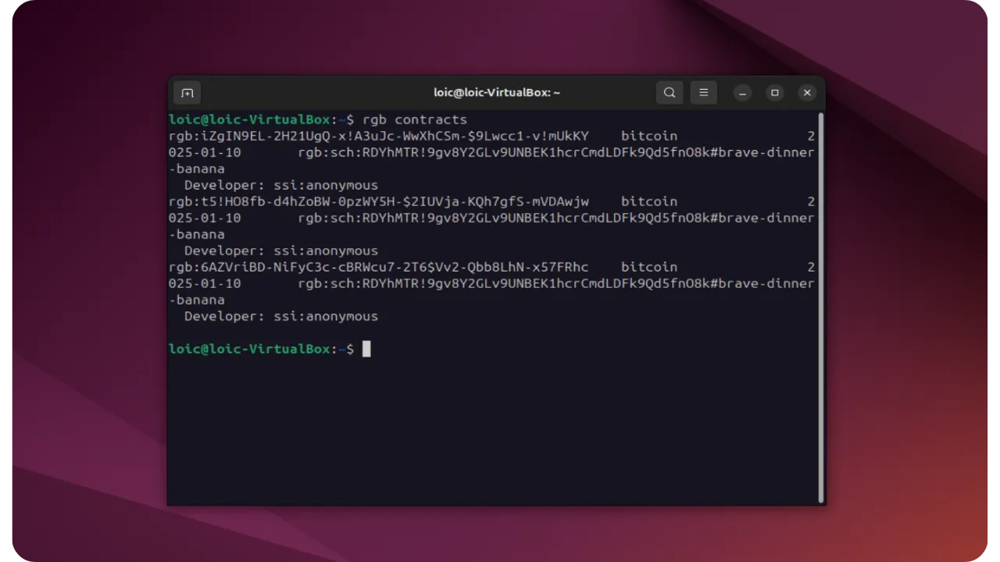
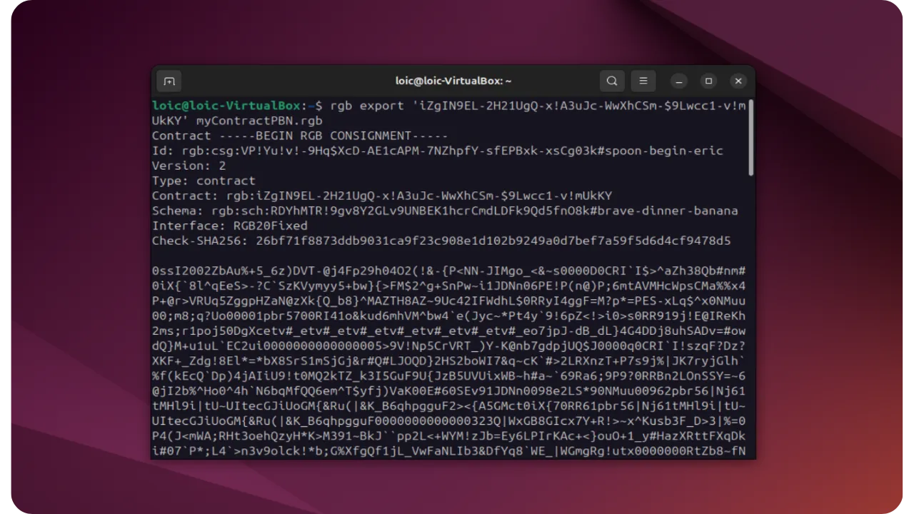

このチュートリアルでは、LNP/BP協会が作成したコマンドラインツール `rgb` を使って、コントラクトを作成するプロセスを段階的に追っていきます。CLIのインストールと操作、スキーマのコンパイル、インターフェイスとインターフェイス実装のインポート、そしてRGBアセットの発行方法を紹介するのが目的です。また、コンパイルや状態の検証など、基本的なロジックについても見ていきます。このチュートリアルの最後には、プロセスを再現し、独自のRGBコントラクトを作成できるようになっているはずです。

## RGBプロトコルのリマインダー

RGBはビットコインの上で動作し、スマートコントラクトの機能とデジタル資産管理をエミュレートするプロトコルであり、ベースとなるブロックチェーンに過度の負荷をかけることはない。例えばイーサリアム上のような）従来のオンチェーン・スマートコントラクトとは異なり、RGBは「*クライアント側の検証*」システムに依存しています。データおよびステータス履歴の大部分は、関係する参加者によってのみ交換され保存されるのに対し、ビットコイン・ブロックチェーンは（*Tapret*や*Opret*などのメカニズムを介して）小さな暗号コミットメントのみをホストします。したがって、RGBプロトコルでは、ビットコインのブロックチェーンはタイムスタンプサーバーと二重支出保護システムとしての役割しか果たしません。

RGBコントラクトは、進化型ステートマシンのような構造になっている。それは、厳密に型付けされコンパイルされたスキーマに従って、初期状態（例えば、供給、ティッカー、またはその他のメタデータを記述する）を定義するジェネシスから始まる。その後、状態遷移と、必要に応じて状態拡張が、この状態を変更または拡張するために適用される。各操作は、カビ可能なアセット（RGB20）の転送であれ、ユニークなアセット（RGB21）の作成であれ、*シングルユースシール*を伴います。これらはビットコインUTXOをオフチェーンステートにリンクし、機密性とスケーラビリティを確保しながら、二重支出を防ぎます。

RGBプロトコルがどのように機能するかについてもっと学ぶには、この包括的なトレーニングコースを受講することをお勧めする：

https://planb.network/courses/csv402
RGBの内部ロジックはRustライブラリに基づいており、開発者はプロジェクトにインポートして*クライアント側検証*部分を管理することができる。加えて、LNP/BPチームは他の言語用のバインディングに取り組んでいるが、これはまだ確定していない。さらに、Bitfinexのような他のエンティティも独自の統合スタックを開発していますが、これらについては別のチュートリアルでお話しします。今のところ、`rgb` CLI が公式のリファレンスです。

## rgb CLIツールのインストールと表示

メインコマンドは単純に `rgb` と呼ばれる。このコマンドは `git` を彷彿とさせるように設計されており、コントラクトの操作、起動、アセットの発行などを行うサブコマンドのセットを備えている。ビットコイン・ウォレットは現在統合されていないが、近いバージョン（0.11）で統合される予定である。この次のバージョンでは、PSBTの生成、署名のための外部ハードウェア（ハードウェアウォレットなど）との互換性、Sparrowのようなソフトウェアとの相互運用性を含め、`rgb`から直接ウォレットを（記述子を介して）作成・管理できるようになります。これにより、資産の発行と移転のシナリオ全体が簡素化される。

### カーゴ経由での設置

私たちは.NET Frameworkを使ってRustにツールをインストールする：

```bash
cargo install rgb-contracts --all-features
```

(注意: クレートは `rgb-contracts` という名前で、インストールされるコマンドは `rgb` という名前になる。rgb`という名前のクレートが既に存在していた場合、衝突する可能性があるため、この名前になった)

インストールでは、多数の依存関係（コマンドの解析、Electrumの統合、ゼロ知識証明の管理など）がコンパイルされる。

インストールが完了すると、.NET Frameworkが起動します：

```bash
rgb
```

引数なしで`rgb`を実行すると、`interfaces`, `schema`, `import`, `export`, `issue`, `invoice`, `transfer`などのサブコマンドの一覧が表示されます。ローカルストレージディレクトリ（すべてのログ、回路図、実装を保存するスタッシュ）の変更、ネットワーク（testnet、mainnet）の選択、Electrumサーバーの設定を行うことができます。


### コントロールの最初の概要

以下のコマンドを実行すると、`RGB20`インターフェースがデフォルトですでに統合されていることがわかる：

```bash
rgb interfaces
```

このインターフェイスが統合されていない場合は、.NET Frameworkをクローンしてください：

```bash
git clone https://github.com/RGB-WG/rgb-interfaces
```

それをコンパイルする：

```bash
cargo run
```

次に、お好みのインターフェイスをインポートする：

```bash
rgb import interfaces/RGB20.rgb
```


しかし、スキーマはまだソフトにインポートされていないと聞いている。隠し場所には契約書もない。これを見るには、：

```bash
rgb schemata
```

その後、リポジトリをクローンして特定の回路図を取り出すことができる：

```bash
git clone https://github.com/RGB-WG/rgb-schemata
```


このリポジトリの `src/` ディレクトリには、スキーマ（NIA は "*Non Inflatable Asset*"、UDA は "*Unique Digital Asset*"など）を定義するいくつかの Rust ファイル（`nia.rs` など）が含まれています。コンパイルするには、：

```bash
cd rgb-schemata
cargo run
```

これにより、コンパイルされた回路図に対応するいくつかの `.rgb` ファイルと `.rgba` ファイルが生成されます。例えば、`NonInflatableAsset.rgb`があります。

### スキーマとインターフェース実装のインポート

これで回路図を `rgb` にインポートできる：

```bash
rgb import schemata/NonInflatableAssets.rgb
```


これでローカル・スタッシュに追加される。以下のコマンドを実行すると、スキーマが表示される：

```bash
rgb schemata
```

## 契約書作成（発行）

新しいアセットを作るには2つのアプローチがある：


- スキーマ・フィールド（グローバル状態、所有状態など）を入力してコントラクトを構築し、`.rgb`または`.rgba`ファイルを生成するスクリプトかRustのコードを使用する；
- または、トークンのプロパティを記述した YAML (または TOML) ファイルを指定して `issue` サブコマンドを直接使用します。

examples`フォルダにRustのサンプルがあり、`ContractBuilder`を構築し、`Global State`（アセット名、ティッカー、供給量、日付など）を記入し、Owned State（どのUTXOに割り当てられるか）を定義し、これらすべてを*契約委託*にまとめ、エクスポート、検証、隠し場所にインポートする方法を説明しています。

もう1つの方法は、手動でYAMLファイルを編集して、`ticker`、`name`、`supply`などをカスタマイズすることである。ファイル名を `RGB20-demo.yaml` とする。ファイル名に ：


- spec`: ティッカー、名前、精度 ；
- terms`：法的通知用のフィールド；
- issuedSupply` : トークンの発行量；
- assignments`：シングルユースシール（*シールの定義*）とロック解除された数量を示す。

以下に作成するYAMLファイルの例を示します：

```yaml
interface: RGB20Fixed
globals:
spec:
ticker: PBN
name: Plan B Network
details: "Pay attention: the asset has no value"
precision: 2
terms:
text: >
SUBJECT TO, AND WITHOUT IN ANY WAY LIMITING, THE REPRESENTATIONS AND WARRANTIES OF ANY SELLER. PROPERTY IS BEING SOLD “AS IS”...
media: ~
issuedSupply: 100000000
assignments:
assetOwner:
seal: tapret1st:b449f7eaa3f98c145b27ad0eeb7b5679ceb567faef7a52479bc995792b65f804:1
amount: 100000000 # this is 1 million (we have two digits for cents)
```


その後、：

```bash
rgb issue '<SchemaID>' ssi:<Issuer> rgb20-demo.yaml
```


私の場合、一意なスキーマ識別子（一重引用符で囲む）は`RDYhMTR!9gv8Y2GLv9UNBEK1hcrCmdLDFk9Qd5fnO8k`で、発行者は書いていません。だから私の注文は：

```txt
rgb issue 'RDYhMTR!9gv8Y2GLv9UNBEK1hcrCmdLDFk9Qd5fnO8k' ssi:anonymous rgb20-demo.yaml
```

スキーマIDがわからない場合は、 ：

```bash
rgb schemata
```

CLIは、新しいコントラクトが発行され、スタッシュに追加されたと返答する。次のコマンドを入力すると、先ほど発行されたコントラクトに対応するコントラクトが追加されていることがわかる：

```bash
rgb contracts
```



次のコマンドは、グローバルな状態(名前、ティッカー、供給量...)と所有状態のリスト、つまり割り当て(例えば、UTXO `b449f7eaa3f98c145b27ad0eeb7b5679ceb567faef7a52479bc995792b65f804:1` で定義された100万 `PBN` トークン)を表示します。

```bash
rgb state '<ContractId>'
```


## エクスポート、インポート、検証

この契約書を他のユーザーと共有するには、隠し場所から.NETファイルにエクスポートします：

```bash
rgb export '<ContractId>' myContractPBN.rgb
```



myContractPBN.rgb`ファイルは他のユーザーに渡すことができ、そのユーザーは ：

```bash
rgb import myContractPBN.rgb
```

インポート時、それが単純な*契約委託*であれば、"`Importing consignment rgb`"というメッセージが表示される。より大きな*状態遷移委託*であれば、コマンドは異なるものになる（`rgb accept`）。

妥当性を保証するために、ローカル・バリデーション関数を使うこともできる。たとえば、：

```bash
rgb validate myContract.rgb
```

### スタッシュの使用、検証、表示

注意点として、スタッシュはスキーマ、インターフェース、実装、コントラクト（ジェネシス＋トランジション）のローカルインベントリである。import "を実行するたびに、stashに要素が追加されます。この隠し場所は、：

```bash
rgb dump
```


これで、隠し場所全体の詳細が入ったフォルダが生成される。

## 移籍とPSBT

送金を実行するには、`Tapret`または`Opret`のコミットメントを管理するために、ローカルのビットコインウォレットを操作する必要があります。

### 請求書の作成

ほとんどの場合、契約の参加者（例えばアリスとボブ）間のやり取りは、インボイスの生成を通じて行われる。アリスがボブに何か（トークンの移動、再発行、DAOのアクションなど）の実行を望む場合、アリスはボブへの指示を詳細に記したインボイスを作成する。つまり、：


- アリス**（請求書の発行者）；
- ボブ**（請求書を受け取り、実行する人）。

他のエコシステムと異なり、RGBインボイスは支払いという概念に限定されない。鍵の失効、投票、NFTへの刻印（*engraving*）の作成など、契約に関連するあらゆる要求を埋め込むことができる。対応する操作は、契約インターフェースに記述することができる。対応する操作は、契約インターフェイスに記述することができる。

次のコマンドはRGBインボイスを生成する：

```bash
$ rgb invoice $CONTRACT -i $INTERFACE $ACTION $STATE $SEAL
```

と：


- 契約識別子 (*ContractId*) ;`$CONTRACT`：契約識別子 (*ContractId*) ；
- INTERFACE`：使用するインターフェース（例：`RGB20`） ；
- ACTION`：インターフェイスで指定された操作の名前（単純なカンジタブルトークンの転送の場合、"Transfer "となる）。インターフェースが既にデフォルトのアクションを提供している場合は、ここで改めて入力する必要はない；
- STATE`: 転送されるステータスデータ (例えば、カンジブルトークンが転送される場合はトークンの量)；
- SEAL`: 受取人(Alice)のSingle-use Seal、すなわちUTXOへの明示的な参照。Bobはこの情報を使って証人のトランザクションを構築し、対応する出力はAliceに帰属する(*blinded UTXO*または暗号化されていない形で)。

例えば、次のようなコマンド

```bash
alice$ CONTRACT='iZgIN9EL-2H21UgQ-x!A3uJc-WwXhCSm-$9Lwcc1-v!mUkKY'
alice$ MY_UTXO=4960acc21c175c551af84114541eace09c14d3a1bb184809f7b80916f57f9ef8:1
alice$ rgb invoice $CONTRACT -i RGB20 --amount 100 $MY_UTXO
```

CLIは以下のような請求書を作成する：

```bash
rgb:iZgIN9EL-2H21UgQ-x!A3uJc-WwXhCSm-$9Lwcc1-v!mUkKY/RGB20/100+utxob:zlVS28Rb-...
```

どのようなチャンネル（テキスト、QRコードなど）でもボブに送信できる。

### 移籍する

この請求書から移行するには ：


- トークンを隠し持つ）Bobはビットコインウォレットを持っている。彼は、必要なRGBトークンがあるUTXOと通貨（交換）用の1つのUTXOを消費するビットコイン取引（PSBTの形式、例えば`tx.psbt`）を準備する必要がある；
- ボブは次のコマンドを実行する：

```bash
bob$ rgb transfer tx.psbt $INVOICE consignment.rgb
```


- これは.NET Frameworkを含む`consignment.rgb`ファイルを生成する：
 - 移行履歴は、トークンが本物であることをアリスに証明する；
 - アリスのシングル・ユース・シールにトークンを転送する新しいトランジション；
 - 証人トランザクション（符号なし）。
- Bobはこの`consignment.rgb`ファイルをAliceに送る（電子メール、共有サーバー、RGB-RPCプロトコル、Stormなどで）；
- アリスは`consignment.rgb`を受け取り、自分の隠し場所に置く：

```bash
alice$ rgb accept consignment.rgb
```


- CLIはトランジションの有効性をチェックし、アリスの隠し場所に追加します。無効な場合、コマンドは詳細なエラーメッセージとともに失敗する。そうでなければ成功し、サンプル取引がまだビットコインネットワークにブロードキャストされていない（ボブはアリスのグリーンライトを待っている）ことを報告する；
- 確認のために、`accept`コマンドは署名(*payslip*)を返します；
- その後、Bobは自分のBitcoin取引に署名して公開することができる：

```bash
bob$ rgb check <sig> && wallet sign --publish tx.psbt
```


- このトランザクションがオンチェーンで確認されるとすぐに、アセットの所有権はAliceに移ったとみなされます。Aliceのウォレットはトランザクションのマイニングを監視しており、新しいOwned Stateがキャッシュに表示されるのを確認します。

これでRGB契約の発行と移籍の方法はお分かりいただけたと思います。このチュートリアルが役に立ったと思ったら、以下に緑のサムネイルを付けていただけるとありがたいです。この記事をあなたのソーシャルネットワークでシェアしてください。ありがとうございました！

また、RGB互換のLightningノードを起動し、ほぼ瞬時にトークンを交換する方法を説明した別のチュートリアルもお勧めする：

https://planb.network/tutorials/node/rgb/rln-ffc02528-329b-4e16-bd83-873d0299feea