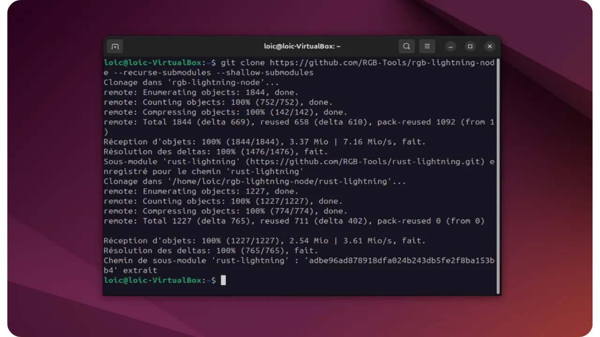
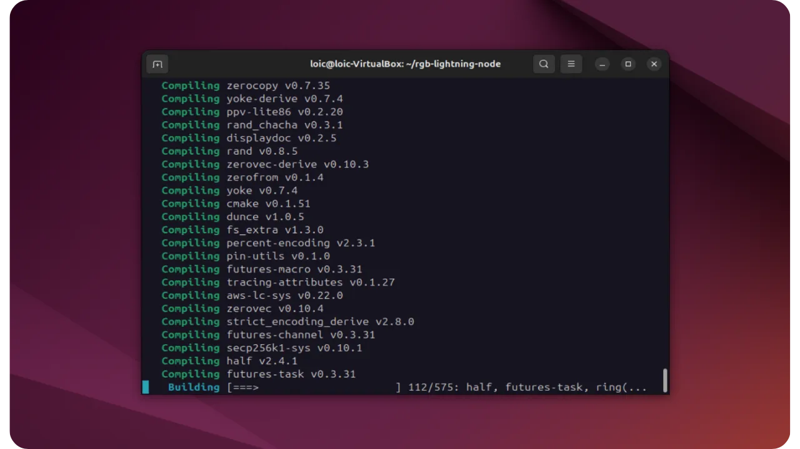
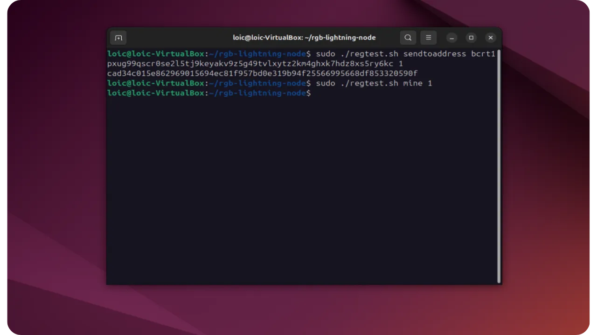
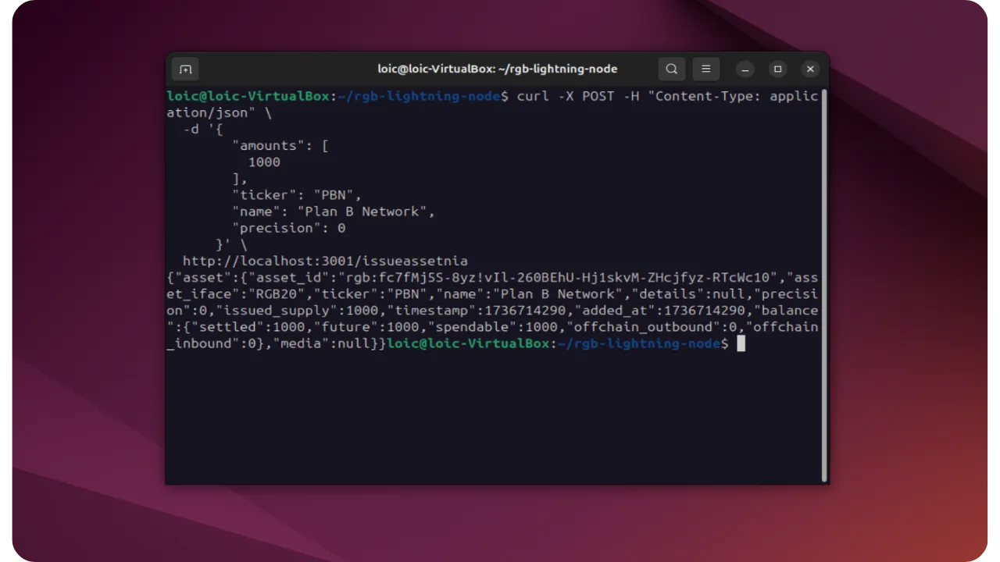
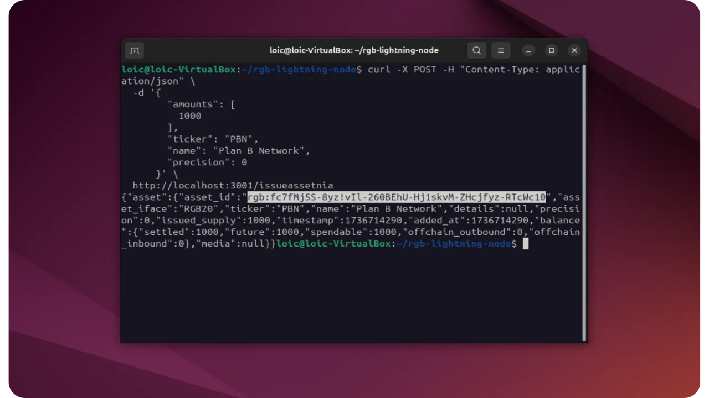
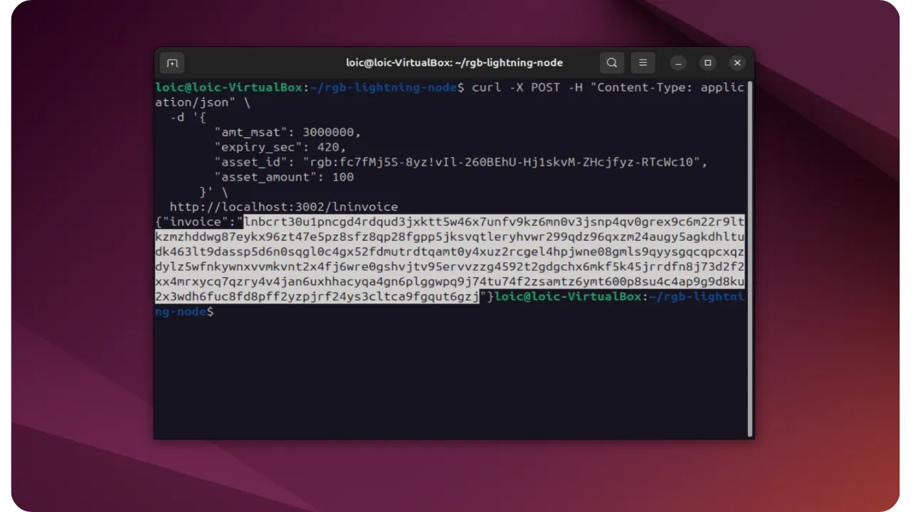

In diesem Tutorial lernen Sie Schritt für Schritt, wie Sie einen Lightning-RGB-Knoten in einer Regtest-Umgebung einrichten. Wir werden sehen, wie Sie RGB-Token erstellen und in Kanälen zirkulieren lassen.

## Das RLN-Projekt

Das RGB-Team von Bitfinex arbeitet seit 2022 daran, das RGB-Ökosystem durch die Entwicklung eines kompletten Technologie-Stacks zu bereichern. Anstatt ein einzelnes kommerzielles Produkt anzustreben, konzentrieren sich die Bemühungen darauf, Open-Source-Softwarebausteine verfügbar zu machen, zu den RGB-Protokollspezifikationen beizutragen und Implementierungsreferenzen zu erstellen.

Zu den bemerkenswerten Beiträgen von Bitfinex zum RGB-Ökosystem gehört [die *RGBlib*-Bibliothek] (https://github.com/RGB-Tools/rgb-lib), die in Rust geschrieben und über Bindungen in Kotlin und Python zugänglich ist und die Entwicklung von RGB-Anwendungen durch die Kapselung komplexer Validierungs- und Engagement-Mechanismen erheblich vereinfacht.

Das Bitfinex-Team hat auch eine mobile RGB-Wallet mit dem Namen "[*Iris Wallet*](https://iriswallet.com/)" entwickelt, die auf Android verfügbar ist. Diese Wallet integriert die Verwendung eines RGB-Proxy-Servers, um den Off-Chain-Datenaustausch (*Consignments*) für die *Client-side Validation* auf RGB einfach zu verwalten.

Bitfinex hat auch das Projekt `rgb-lightning-node` (RLN) entwickelt. Dabei handelt es sich um einen Rust-Daemon, der auf einem Fork von "Rust-Lightning" (LDK) basiert und so modifiziert wurde, dass er das Vorhandensein von RGB-Assets in einem Kanal berücksichtigt. Wenn ein Kanal geöffnet wird, kann das Vorhandensein von RGB-Token angegeben werden, und jedes Mal, wenn der Kanalstatus aktualisiert wird, wird ein Zustandsübergang erstellt, der die Verteilung der Token in Lightning-Ausgängen widerspiegelt. Dies ermöglicht :


- Öffnen Sie Lightning-Kanäle in USDT, zum Beispiel;
- Leiten Sie diese Token durch das Netzwerk, vorausgesetzt, die Routing-Pfade sind ausreichend liquide;
- Nutzen Sie die Bestrafungs- und Timelock-Logik von Lightning ohne Änderungen: Verankern Sie den RGB-Übergang einfach in einem zusätzlichen Ausgang der Commitment-Transaktion.

Der RLN-Code befindet sich noch im Alpha-Stadium: Wir empfehlen, ihn nur in **regtest** oder im **testnet** zu verwenden.

## RGB-Protokoll-Erinnerung

RGB ist ein Protokoll, das auf Bitcoin läuft und Smart-Contract-Funktionen sowie die Verwaltung digitaler Vermögenswerte emuliert, ohne die Blockchain, auf der es basiert, zu überlasten. Im Gegensatz zu herkömmlichen On-Chain-Smart-Contracts (wie z. B. bei Ethereum) beruht RGB auf einem "*Client-side validation*"-System: Die meisten Daten und Statusverläufe werden ausschließlich von den beteiligten Teilnehmern ausgetauscht und gespeichert, während die Bitcoin-Blockchain nur kleine kryptografische Verpflichtungen (über Mechanismen wie *Tapret* oder *Opret*) enthält. Im RGB-Protokoll dient die Bitcoin-Blockchain daher nur als Zeitstempel-Server und als System zum Schutz vor Doppelausgaben.

Ein RGB-Vertrag ist wie eine evolutionäre Zustandsmaschine aufgebaut. Er beginnt mit einer Genesis, die den Ausgangszustand (der z. B. das Angebot, den Ticker oder andere Metadaten beschreibt) nach einem streng typisierten und kompilierten Schema definiert. Zustandsübergänge und, falls erforderlich, Zustandserweiterungen werden dann angewandt, um diesen Zustand zu ändern oder zu erweitern. Jede Operation, sei es die Übertragung vertretbarer Vermögenswerte (RGB20) oder die Erstellung einzigartiger Vermögenswerte (RGB21), beinhaltet *Single-use Seals*. Diese verknüpfen Bitcoin UTXOs mit Off-Chain-States und verhindern doppelte Ausgaben, während sie gleichzeitig Vertraulichkeit und Skalierbarkeit gewährleisten.

Um mehr über die Funktionsweise des RGB-Protokolls zu erfahren, empfehle ich Ihnen diesen umfassenden Schulungskurs:

https://planb.network/courses/csv402
## RGB-kompatible Lightning-Knoten-Installation

Um die Binärdatei `rgb-lightning-node` zu kompilieren und zu installieren, beginnen wir mit dem Klonen des Repositorys und seiner Untermodule, dann führen wir das :

```bash
git clone https://github.com/RGB-Tools/rgb-lightning-node --recurse-submodules --shallow-submodules
```




- Die Option `--recurse-submodules` klont auch die notwendigen Subdevices (einschließlich der modifizierten Version von `rust-lightning`);
- Die Option `--shallow-submodules` schränkt die Tiefe des Klons ein, um das Herunterladen zu beschleunigen, während der Zugang zu den wesentlichen Übertragungen erhalten bleibt.

Führen Sie im Stammverzeichnis des Projekts den folgenden Befehl aus, um die Binärdatei zu kompilieren und zu installieren:

```bash
cargo install --locked --debug --path .
```




- die Option `--locked` stellt sicher, dass die Version der Abhängigkeiten beachtet wird;
- `--debug` ist nicht obligatorisch, kann aber helfen, sich zu konzentrieren (Sie können `--release` verwenden, wenn Sie es vorziehen);
- `--path .` weist `cargo install` an, aus dem aktuellen Verzeichnis zu installieren.

Am Ende dieses Befehls wird eine ausführbare Datei `rgb-lightning-node` in Ihrem `$CARGO_HOME/bin/` verfügbar sein. Stellen Sie sicher, dass dieser Pfad in Ihrem `$PATH` ist, damit Sie den Befehl von jedem Verzeichnis aus aufrufen können.

## Voraussetzungen

Um zu funktionieren, benötigt der "rgb-lightning-node"-Daemon das Vorhandensein und die Konfiguration von :


- Ein `bitcoind`**-Knoten

Jede RLN-Instanz muss mit `bitcoind` kommunizieren, um ihre On-Chain-Transaktionen zu übertragen und zu überwachen. Die Authentifizierung (Login/Passwort) und die URL (Host/Port) müssen dem Daemon mitgeteilt werden.


- Ein Indexierer** (Electrum oder Esplora)

Der Daemon muss in der Lage sein, On-Chain-Transaktionen aufzulisten und zu untersuchen, insbesondere um den UTXO zu finden, auf dem ein Vermögenswert verankert wurde. Sie müssen die URL Ihres Electrum-Servers oder Esplora angeben.


- Ein RGB**-Proxy

Der Proxyserver ist eine Komponente (optional, aber sehr empfehlenswert), die den Austausch von RGB *Zuordnungen* zwischen Lightning-Peers vereinfacht. Auch hier muss eine URL angegeben werden.

IDs und URLs werden eingegeben, wenn der Daemon über die API *entsperrt* wird.

## Regtest-Start

Für den einfachen Gebrauch gibt es ein `regtest.sh`-Skript, das über Docker automatisch eine Reihe von Diensten startet: `bitcoind`, `electrs` (Indexer), `rgb-proxy-server`.


Damit können Sie eine lokale, isolierte, vorkonfigurierte Umgebung starten. Bei jedem Neustart werden Container und Datenverzeichnisse erstellt und vernichtet. Wir beginnen mit dem Start der :

```bash
./regtest.sh start
```

Dieses Skript wird :


- Erstellen Sie ein Verzeichnis `docker/` zum Speichern von ;
- Führen Sie `bitcoind` in regtest aus, ebenso wie den Indexer `electrs` und den `rgb-proxy-server` ;
- Warten Sie, bis alles fertig ist, um es zu verwenden.


Als nächstes werden wir mehrere RLN-Knoten starten. Führen Sie in separaten Shells z. B. (um 3 RLN-Knoten zu starten) :

```bash
# 1st shell
rgb-lightning-node dataldk0/ --daemon-listening-port 3001 \
--ldk-peer-listening-port 9735 --network regtest
# 2nd shell
rgb-lightning-node dataldk1/ --daemon-listening-port 3002 \
--ldk-peer-listening-port 9736 --network regtest
# 3rd shell
rgb-lightning-node dataldk2/ --daemon-listening-port 3003 \
--ldk-peer-listening-port 9737 --network regtest
```


- Der Parameter `--network regtest` zeigt die Verwendung der regtest-Konfiguration an;
- die Option "-daemon-listening-port" gibt an, an welchem REST-Port der Lightning-Knoten auf API-Aufrufe (JSON) warten soll;
- der Parameter `--ldk-peer-listening-port` gibt an, auf welchem Lightning p2p-Port gelauscht werden soll;
- `dataldk0/`, `dataldk1/` sind die Pfade zu den Speicherverzeichnissen (jeder Knoten speichert seine Daten separat).

Dank der API können Sie nun von Ihrem Browser aus Befehle auf Ihren RLN-Knoten ausführen. Insbesondere können Sie hier Daemons *freischalten*. Öffnen Sie einfach einen Browser auf demselben Computer wie Ihre Knoten, und geben Sie die URL :

```url
https://rgb-tools.github.io/rgb-lightning-node/
```

Damit ein Knoten einen Kanal öffnen kann, muss er zunächst Bitcoins auf einer Adresse haben, die mit dem folgenden Befehl erzeugt wurde (zum Beispiel für Knoten Nr. 1):

```bash
curl -X POST http://localhost:3001/address
```

In der Antwort wird Ihnen eine Adresse mitgeteilt.


Mit dem `bitcoind` Regtest werden wir ein paar Bitcoins schürfen. Ausführen:

```bash
./regtest.sh mine 101
```


Senden Sie das Geld an die oben angegebene Adresse des Knotens:

```bash
./regtest.sh sendtoaddress <address> <amount>
```


Dann bauen Sie einen Block ab, um die Transaktion zu bestätigen:

```bash
./regtest.sh mine 1
```



## Testnet-Start (ohne Docker)

Wenn Sie ein realistischeres Szenario testen möchten, können Sie RLN-Knoten im Testnetz statt in Regtest starten, die auf öffentliche Dienste oder von Ihnen kontrollierte Dienste verweisen:

```bash
rgb-lightning-node dataldk0/ --daemon-listening-port 3001 \
--ldk-peer-listening-port 9735 --network testnet
rgb-lightning-node dataldk1/ --daemon-listening-port 3002 \
--ldk-peer-listening-port 9736 --network testnet
rgb-lightning-node dataldk2/ --daemon-listening-port 3003 \
--ldk-peer-listening-port 9737 --network testnet
```

Wenn keine Konfiguration gefunden wird, versucht der Daemon standardmäßig, die Datei :


- bitcoind_rpc_host": "electrum.iriswallet.com"
- bitcoind_rpc_port`: `18332`
- indexer_url`: `ssl://electrum.iriswallet.com:50013`
- proxy_endpoint": "rpcs://proxy.iriswallet.com/0.2/json-rpc"

Mit Anmeldung:


- bitcoind_rpc_username": "Benutzer
- bitcoind_rpc_username": "passwort

Sie können diese Elemente auch über die API `init`/`unlock` anpassen.

## Ausgabe eines RGB-Tokens

Um einen Token auszugeben, beginnen wir mit der Erstellung "färbbarer" UTXOs:

```bash
curl -X POST -H "Content-Type: application/json" \
-d '{
"up_to": false,
"num": 4,
"size": 2000000,
"fee_rate": 4.2,
"skip_sync": false
}' \
http://localhost:3001/createutxos
```


Sie können die Bestellung natürlich anpassen. Um die Transaktion zu bestätigen, erhalten Sie eine :

```bash
./regtest.sh mine 1
```

Wir können nun ein RGB-Asset erstellen. Der Befehl hängt von der Art des Assets, das Sie erstellen möchten, und seinen Parametern ab. Hier erstelle ich ein NIA (*Non Inflatable Asset*) Token mit dem Namen "PBN" und einem Vorrat von 1000 Einheiten. Mit der `Präzision` können Sie die Teilbarkeit der Einheiten festlegen.

```bash
curl -X POST -H "Content-Type: application/json" \
-d '{
"amounts": [
1000
],
"ticker": "PBN",
"name": "Plan B Network",
"precision": 0
}' \
http://localhost:3001/issueassetnia
```



Die Antwort enthält die Kennung des neu erstellten Assets. Vergessen Sie nicht, sich diese Kennung zu merken. In meinem Fall lautet sie :

```txt
rgb:fc7fMj5S-8yz!vIl-260BEhU-Hj1skvM-ZHcjfyz-RTcWc10
```



Sie können es dann auf die Kette übertragen oder in einem Lightning-Kanal zuweisen. Genau das werden wir im nächsten Abschnitt tun.

## Öffnen eines Kanals und Übertragen eines RGB-Assets

Sie müssen Ihren Knoten zunächst mit einem Peer im Lightning-Netzwerk verbinden, indem Sie den Befehl `/connectpeer` verwenden. In meinem Beispiel kontrolliere ich beide Nodes. Ich rufe also den öffentlichen Schlüssel meines zweiten Lightning-Knotens mit diesem Befehl ab:

```bash
curl -X 'GET' \
'http://localhost:3002/nodeinfo' \
-H 'accept: application/json'
```

Der Befehl gibt den öffentlichen Schlüssel meines Knotens Nr. 2 zurück:

```txt
031e81e4c5c6b6a50cbf5d85b15dad720fec92c62e84bafb34088f0488e00a8e94
```


Als Nächstes öffnen wir den Kanal, indem wir das entsprechende Asset (`PBN`) angeben. Mit dem Befehl `/openchannel` können Sie die Größe des Kanals in Satoshis festlegen und entscheiden, ob das RGB-Asset einbezogen werden soll. Es hängt davon ab, was Sie erstellen wollen, aber in meinem Fall lautet der Befehl :

```bash
curl -X POST -H "Content-Type: application/json" \
-d '{
"peer_pubkey_and_opt_addr": "031e81e4c5c6b6a50cbf5d85b15dad720fec92c62e84bafb34088f0488e00a8e94@localhost:9736",
"capacity_sat": 1000000,
"push_msat": 10000000,
"asset_amount": 500,
"asset_id": "rgb:fc7fMj5S-8yz!vIl-260BEhU-Hj1skvM-ZHcjfyz-RTcWc10",
"public": true,
"with_anchors": true,
"fee_base_msat": 1000,
"fee_proportional_millionths": 0,
"temporary_channel_id": "a8b60c8ce3067b5fc881d4831323e24751daec3b64353c8df3205ec5d838f1c5"
}' \
http://localhost:3001/openchannel
```

Weitere Informationen finden Sie hier:


- peer_pubkey_and_opt_addr": Kennung der Gegenstelle, mit der wir eine Verbindung herstellen wollen (der öffentliche Schlüssel, den wir zuvor gefunden haben);
- kapazität_sat": Gesamtkapazität des Kanals in Satoshis ;
- push_msat`: Menge in Millisatoshis, die zunächst an den Peer übertragen wird, wenn der Kanal geöffnet wird (hier übertrage ich sofort 10.000 Sats, damit er später eine RGB-Übertragung vornehmen kann);
- menge der Mittel": Menge der RGB-Assets, die dem Kanal zugewiesen werden sollen;
- asset_id": Eindeutiger Bezeichner des RGB-Assets, das in den Kanal eingebunden ist;
- öffentlich": Gibt an, ob der Kanal für die Weiterleitung im Netz öffentlich gemacht werden soll.


Um die Transaktion zu bestätigen, werden 6 Blöcke geschürft:

```bash
./regtest.sh mine 6
```


Der Lightning-Kanal ist nun offen und enthält auch 500 PBN-Token auf der Seite des Knotens Nr. 1. Wenn Knoten Nr. 2 "PBN"-Token erhalten möchte, muss er eine Rechnung erstellen. So geht's:

```bash
curl -X POST -H "Content-Type: application/json" \
-d '{
"amt_msat": 3000000,
"expiry_sec": 420,
"asset_id": "rgb:fc7fMj5S-8yz!vIl-260BEhU-Hj1skvM-ZHcjfyz-RTcWc10",
"asset_amount": 100
}' \
http://localhost:3002/lninvoice
```

Mit :


- `amt_msat`: Rechnungsbetrag in Millisatoshis (mindestens 3000 sats) ;
- expiry_sec` : Verfallszeit der Rechnung in Sekunden ;
- asset_id": Kennung des RGB-Vermögenswertes, der der Rechnung zugeordnet ist;
- vermögenswert_Betrag": Betrag der mit dieser Rechnung zu übertragenden RGB-Anlage.

Als Antwort erhalten Sie eine RGB-Rechnung:

```txt
lnbcrt30u1pncgd4rdqud3jxktt5w46x7unfv9kz6mn0v3jsnp4qv0grex9c6m22r9ltkzmzhddwg87eykx96zt47e5pz8sfz8qp28fgpp5jksvqtleryhvwr299qdz96qxzm24augy5agkdhltudk463lt9dassp5d6n0sqgl0c4gx52fdmutrdtqamt0y4xuz2rcgel4hpjwne08gmls9qyysgqcqpcxqzdylz5wfnkywnxvvmkvnt2x4fj6wre0gshvjtv95ervvzzg4592t2gdgchx6mkf5k45jrrdfn8j73d2f2xx4mrxycq7qzry4v4jan6uxhhacyqa4gn6plggwpq9j74tu74f2zsamtz6ymt600p8su4c4ap9g9d8ku2x3wdh6fuc8fd8pff2yzpjrf24ys3cltca9fgqut6gzj
```



Wir werden diese Rechnung nun vom ersten Knoten bezahlen, der das nötige Bargeld mit dem "PBN"-Token besitzt:

```bash
curl -X POST -H "Content-Type: application/json" \
-d '{
"invoice": "lnbcrt30u1pncgd4rdqud3jxktt5w46x7unfv9kz6mn0v3jsnp4qv0grex9c6m22r9ltkzmzhddwg87eykx96zt47e5pz8sfz8qp28fgpp5jksvqtleryhvwr299qdz96qxzm24augy5agkdhltudk463lt9dassp5d6n0sqgl0c4gx52fdmutrdtqamt0y4xuz2rcgel4hpjwne08gmls9qyysgqcqpcxqzdylz5wfnkywnxvvmkvnt2x4fj6wre0gshvjtv95ervvzzg4592t2gdgchx6mkf5k45jrrdfn8j73d2f2xx4mrxycq7qzry4v4jan6uxhhacyqa4gn6plggwpq9j74tu74f2zsamtz6ymt600p8su4c4ap9g9d8ku2x3wdh6fuc8fd8pff2yzpjrf24ys3cltca9fgqut6gzj"
}' \
http://localhost:3001/sendpayment
```


Die Zahlung ist erfolgt. Dies kann durch Ausführen des Befehls überprüft werden:

```bash
curl -X 'GET' \
'http://localhost:3001/listpayments' \
-H 'accept: application/json'
```


Hier erfahren Sie, wie Sie einen Lightning-Knoten einrichten, der für den Transport von RGB-Assets modifiziert wurde. Diese Demonstration basiert auf :


- Eine regtest-Umgebung (über `./regtest.sh`) oder testnet ;
- Ein Lightning-Knoten (`rgb-lightning-node`) basiert auf einem `bitcoind`, einem Indexer und einem `rgb-proxy-server`;
- Eine Reihe von JSON REST APIs für das Öffnen/Schließen von Kanälen, die Ausgabe von Token, die Übertragung von Vermögenswerten über Lightning, usw.

Dank dieses Prozesses :


- Lightning Engagement Transaktionen beinhalten einen zusätzlichen Ausgang (OP_RETURN oder Taproot) mit der Verankerung eines RGB-Übergangs;
- Überweisungen werden genauso durchgeführt wie herkömmliche Lightning-Zahlungen, allerdings mit dem Zusatz eines RGB-Tokens;
- Mehrere RLN-Knoten können miteinander verbunden werden, um Zahlungen über mehrere Knoten zu leiten und mit ihnen zu experimentieren, vorausgesetzt, es ist genügend Liquidität sowohl in Bitcoins als auch im Vermögenswert RGB auf dem Pfad vorhanden.

Wenn Sie diese Anleitung nützlich fanden, wäre ich Ihnen sehr dankbar, wenn Sie unten einen grünen Daumen setzen würden. Sie können diesen Artikel auch gerne in Ihren sozialen Netzwerken teilen. Ich danke Ihnen sehr!

Ich empfehle auch diesen anderen Lehrgang, in dem ich erkläre, wie man das von der LNP/BP-Vereinigung entwickelte RGB-CLI-Tool zur Erstellung eines RGB-Vertrags verwendet:

https://planb.network/tutorials/node/rgb/rgb-cli-1f8a28d4-fa99-4261-9d80-48275b496fd4