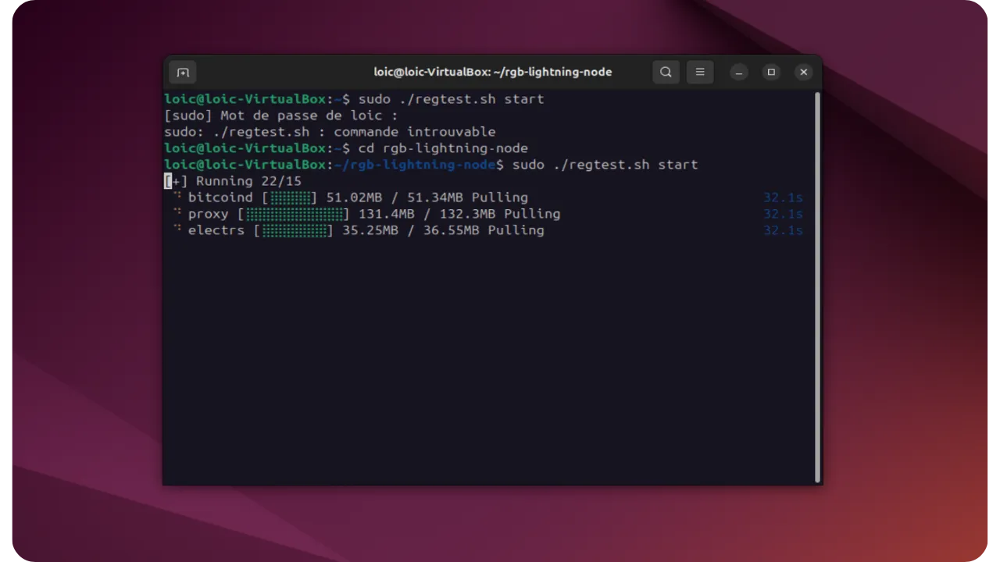
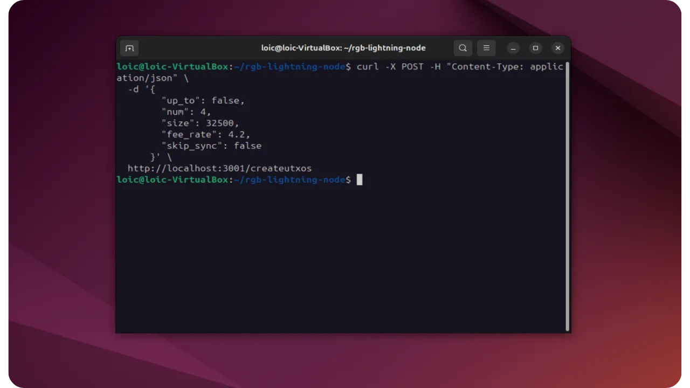

在本教程中，您将逐步了解如何在 Regtest 环境中设置 Lightning RGB 节点。我们将了解如何创建 RGB 代币并在通道中流通。

## 区域联络网项目

Bitfinex 的 RGB 团队自 2022 年以来一直致力于通过开发完整的技术栈来丰富 RGB 生态系统。该团队的目标不是开发单一的商业产品，而是专注于提供开源软件砖，为 RGB 协议规范做出贡献，并创建实施参考。

Bitfinex 对 RGB 生态系统的显著贡献之一是 [*RGBlib* 库](https://github.com/RGB-Tools/rgb-lib)，该库由 Rust 编写，可通过 Kotlin 和 Python 绑定访问，通过封装复杂的验证和参与机制，大大简化了 RGB 应用程序的开发。

Bitfinex 团队还设计了一款 RGB 移动钱包，名为"[*Iris Wallet*](https://iriswallet.com/)"，可在 Android 上使用。该钱包集成了 RGB 代理服务器的使用，可轻松管理链外数据交换（*交割*），以便在 RGB 上进行*客户端验证*。

Bitfinex 还开发了 `rgb-lightning-node` (RLN) 项目。这是一个基于 `rust-lightning` (LDK) 分支的 Rust 守护进程，经过修改后可将通道中存在的 RGB 资产考虑在内。打开通道时，可以指定是否存在 RGB 代币，每次更新通道状态时，都会创建一个状态转换，以反映代币在 Lightning 输出中的分布情况。这样就能实现.NET Framework 2.0：


- 例如，在 USDT 中打开闪电通道；
- 只要路由路径有足够的流动性，就可以通过网络路由这些代币；
- 无需修改即可利用 Lightning 的惩罚和时间锁定逻辑：只需在承诺事务的额外输出中固定 RGB 转换即可。

RLN 代码仍处于开发阶段：我们建议仅在 **regtest** 或 **testnet** 上使用。

## RGB 协议提醒

RGB 是一个运行于比特币之上的协议，可模拟智能合约功能和数字资产管理，而不会对其所基于的区块链造成过载。与传统的链上智能合约（如以太坊上）不同，RGB 依赖于 "*客户端验证*"系统：大部分数据和状态历史记录都由参与方独自交换和存储，而比特币区块链只承载小规模的加密承诺（通过*Tapret*或*Opret*等机制）。因此，在 RGB 协议中，比特币区块链只充当时间戳服务器和双重消费保护系统。

RGB 合约的结构类似于一个进化状态机。它以 "创世纪 "开始，"创世纪 "根据严格类型化和编译的 "模式 "定义初始状态（例如，描述供应、行情或其他元数据）。然后进行状态转换，必要时进行状态扩展，以修改或扩展该状态。无论是转移可替代资产（RGB20）还是创建独一无二的资产（RGB21），每一项操作都涉及*一次性封印*。这些封印将比特币UTXO与链外状态连接起来，防止重复消费，同时确保保密性和可扩展性。

要了解有关 RGB 协议工作原理的更多信息，我建议您参加这个综合培训课程：

https://planb.network/courses/csv402
## 兼容 RGB 的 Lightning 节点安装

要编译和安装 `rgb-lightning-node` 二进制文件，我们首先要克隆软件源及其子模块，然后运行 .NET Framework：

```bash
git clone https://github.com/RGB-Tools/rgb-lightning-node --recurse-submodules --shallow-submodules
```


- 子模块 "选项也会克隆必要的子设备（包括修改版的 "rust-lightning"）；
- shallow-submodules "选项限制了克隆的深度，以加快下载速度，同时仍可访问重要提交。

在项目根目录下运行以下命令，编译并安装二进制 .NET 文件：

```bash
cargo install --locked --debug --path .
```


- 锁定 "可确保依赖项的版本得到尊重；
- debug "不是必须的，但可以帮助你集中注意力（如果你愿意，也可以使用"--release"）；
- `--path .` 告诉 `cargo install` 从当前目录安装。

命令结束后，您的 `$CARGO_HOME/bin/` 目录中将出现一个 `rgb-lightning-node` 可执行文件。请确保该路径位于您的 `$PATH` 中，这样您就可以从任何目录调用该命令。

## 先决条件

rgb-lightning-node "守护进程需要 .NET Framework 2.0 的存在和配置才能运行：


- 一个 `bitcoind`** 节点

每个 RLN 实例都需要与 `bitcoind` 通信，以广播和监控其链上交易。需要向守护进程提供身份验证（登录名/密码）和 URL（主机/端口）。


- 索引器**（Electrum 或 Esplora）

守护进程必须能够列出并探索链上交易，尤其是找到资产锚定的UTXO。您需要指定 Electrum 服务器或 Esplora 的 URL。


- RGB** 代理

代理服务器是一个组件（可选，但强烈建议使用），用于简化 Lightning 对等设备之间的 RGB 分配交换。同样，必须指定一个 URL。

当守护进程通过应用程序接口（API）*解锁*时，就会输入 ID 和 URL。

## 启动 Regtest

对于简单的使用，有一个 `regtest.sh` 脚本可以通过 Docker 自动启动一组服务：bitcoind"、"electrs"（索引器）、"rgb-proxy-server"。



它允许你启动一个本地、隔离、预配置的环境。每次重启时，它都会创建并销毁容器和数据目录。首先，我们将启动 .NET Framework：

```bash
./regtest.sh start
```

该脚本将 ：


- 创建一个 `docker/` 目录来存储 ；
- 在 regtest 中运行 `bitcoind` 以及索引器 `electrs` 和 `rgb-proxy-server` ；
- 等待一切准备就绪后再使用。


接下来，我们将启动几个 RLN 节点。在不同的 shell 中运行，例如（启动 3 个 RLN 节点） ：

```bash
# 1st shell
rgb-lightning-node dataldk0/ --daemon-listening-port 3001 \
--ldk-peer-listening-port 9735 --network regtest
# 2nd shell
rgb-lightning-node dataldk1/ --daemon-listening-port 3002 \
--ldk-peer-listening-port 9736 --network regtest
# 3rd shell
rgb-lightning-node dataldk2/ --daemon-listening-port 3003 \
--ldk-peer-listening-port 9737 --network regtest
```


- 网络 regtest "参数表示使用 regtest 配置；
- daemon-listening-port "表示 Lightning 节点将在哪个 REST 端口监听 API 调用（JSON）；
- ldk--peer-listening-port "指定要监听的 Lightning p2p 端口；
- dataldk0/"、"dataldk1/"是存储目录的路径（每个节点单独存储信息）。

借助 API，您现在可以通过浏览器在 RLN 节点上执行命令。特别是，您可以在这里*解锁*守护进程。只需在与节点相同的计算机上打开浏览器，然后输入 URL ：

```url
https://rgb-tools.github.io/rgb-lightning-node/
```

节点要打开通道，首先必须在用以下命令生成的地址上有比特币（以节点 n°1 为例）：

```bash
curl -X POST http://localhost:3001/address
```

答案将为您提供一个地址。


在 `bitcoind` Regtest 中，我们将挖掘一些比特币。运行 ：

```bash
./regtest.sh mine 101
```


将资金发送到上述生成的节点地址：

```bash
./regtest.sh sendtoaddress <address> <amount>
```


然后开采一个区块来确认交易：

```bash
./regtest.sh mine 1
```


## 测试网启动（无 Docker）

如果您想测试更真实的场景，可以在 Testnet 而不是 Regtest 中启动 RLN 节点，指向公共服务或您控制的服务：

```bash
rgb-lightning-node dataldk0/ --daemon-listening-port 3001 \
--ldk-peer-listening-port 9735 --network testnet
rgb-lightning-node dataldk1/ --daemon-listening-port 3002 \
--ldk-peer-listening-port 9736 --network testnet
rgb-lightning-node dataldk2/ --daemon-listening-port 3003 \
--ldk-peer-listening-port 9737 --network testnet
```

默认情况下，如果找不到配置，守护进程将尝试使用 .NET Framework：


- bitcoind_rpc_host`: `electrum.iriswallet.com`.
- `bitcoind_rpc_port`: `18332`
- indexer_url`: `ssl://electrum.iriswallet.com:50013`.
- `proxy_endpoint`: `rpcs://proxy.iriswallet.com/0.2/json-rpc`

登录 ：


- `bitcoind_rpc_username`: `user`.
- `bitcoind_rpc_username`: `password`.

您还可以通过 `init`/`unlock` API 自定义这些元素。

## 发行 RGB 令牌

要发行令牌，我们首先要创建 "可着色 "的 UTXO：

```bash
curl -X POST -H "Content-Type: application/json" \
-d '{
"up_to": false,
"num": 4,
"size": 2000000,
"fee_rate": 4.2,
"skip_sync": false
}' \
http://localhost:3001/createutxos
```



当然，您也可以调整订单。为了确认交易，我们会在您的.NET 账号上显示一个".NET "字样：

```bash
./regtest.sh mine 1
```

现在我们可以创建一个 RGB 资产。命令取决于您要创建的资产类型及其参数。在这里，我要创建一个名为 "PBN "的 NIA（*非充气资产*）令牌，供应量为 1000 个单位。精度 "允许您定义单位的可分割性。

```bash
curl -X POST -H "Content-Type: application/json" \
-d '{
"amounts": [
1000
],
"ticker": "PBN",
"name": "Plan B Network",
"precision": 0
}' \
http://localhost:3001/issueassetnia
```


响应包括新创建资产的 ID。请记住这个标识符。在我的例子中，它是 ：

```txt
rgb:fc7fMj5S-8yz!vIl-260BEhU-Hj1skvM-ZHcjfyz-RTcWc10
```


然后，您可以在链上传输，或在闪电通道中分配。这正是我们下一节要做的。

## 打开通道并传输 RGB 资产

首先，你必须使用`/connectpeer`命令将你的节点连接到闪电网络上的一个对等节点。在我的例子中，我控制着两个节点。因此，我要用这条命令获取第二个闪电节点的公钥：

```bash
curl -X 'GET' \
'http://localhost:3002/nodeinfo' \
-H 'accept: application/json'
```

命令返回我的节点 n°2 的公钥：

```txt
031e81e4c5c6b6a50cbf5d85b15dad720fec92c62e84bafb34088f0488e00a8e94
```


接下来，我们将通过指定相关资产（`PBN`）来打开通道。通过 `/openchannel` 命令，您可以用 satoshis 为单位定义通道的大小，并选择是否包含 RGB 资产。这取决于你想创建什么，但在我的情况下，命令是 ：

```bash
curl -X POST -H "Content-Type: application/json" \
-d '{
"peer_pubkey_and_opt_addr": "031e81e4c5c6b6a50cbf5d85b15dad720fec92c62e84bafb34088f0488e00a8e94@localhost:9736",
"capacity_sat": 1000000,
"push_msat": 10000000,
"asset_amount": 500,
"asset_id": "rgb:fc7fMj5S-8yz!vIl-260BEhU-Hj1skvM-ZHcjfyz-RTcWc10",
"public": true,
"with_anchors": true,
"fee_base_msat": 1000,
"fee_proportional_millionths": 0,
"temporary_channel_id": "a8b60c8ce3067b5fc881d4831323e24751daec3b64353c8df3205ec5d838f1c5"
}' \
http://localhost:3001/openchannel
```

点击此处了解更多信息：


- peer_pubkey_and_opt_addr`：我们希望连接的对等节点的标识符（我们之前找到的公钥）；
- capacity_sat`：频道总容量（以卫星为单位）；
- push_msat`：通道打开时最初传输给对等设备的数量（单位：毫萨特）（这里我立即传输 10,000 萨特，以便他稍后进行 RGB 传输）；
- `asset_amount`：将投入通道的 RGB 资产数量；
- asset_id`：通道中 RGB 资产的唯一标识符；
- public`：表示通道是否应在网络上公开路由。


为了确认交易，需要开采 6 个区块：

```bash
./regtest.sh mine 6
```


现在，"闪电 "通道已打开，节点 n°1 一侧也包含 500 个 "PBN "代币。如果节点 n°2 希望接收 `PBN` 代币，则必须生成一张发票。具体方法如下

```bash
curl -X POST -H "Content-Type: application/json" \
-d '{
"amt_msat": 3000000,
"expiry_sec": 420,
"asset_id": "rgb:fc7fMj5S-8yz!vIl-260BEhU-Hj1skvM-ZHcjfyz-RTcWc10",
"asset_amount": 100
}' \
http://localhost:3002/lninvoice
```

与 ：


- amt_msat`：发票金额（单位：毫萨托希）（最少 3000 萨特）；
- expiry_sec`：发票到期时间，以秒为单位；
- asset_id`：与发票相关联的 RGB 资产的标识符；
- 资产金额：与此发票一起转移的 RGB 资产金额。

作为回应，您将收到一张 RGB 发票：

```txt
lnbcrt30u1pncgd4rdqud3jxktt5w46x7unfv9kz6mn0v3jsnp4qv0grex9c6m22r9ltkzmzhddwg87eykx96zt47e5pz8sfz8qp28fgpp5jksvqtleryhvwr299qdz96qxzm24augy5agkdhltudk463lt9dassp5d6n0sqgl0c4gx52fdmutrdtqamt0y4xuz2rcgel4hpjwne08gmls9qyysgqcqpcxqzdylz5wfnkywnxvvmkvnt2x4fj6wre0gshvjtv95ervvzzg4592t2gdgchx6mkf5k45jrrdfn8j73d2f2xx4mrxycq7qzry4v4jan6uxhhacyqa4gn6plggwpq9j74tu74f2zsamtz6ymt600p8su4c4ap9g9d8ku2x3wdh6fuc8fd8pff2yzpjrf24ys3cltca9fgqut6gzj
```


现在，我们将从第一个节点支付这张发票，该节点持有必要的`PBN`令牌现金：

```bash
curl -X POST -H "Content-Type: application/json" \
-d '{
"invoice": "lnbcrt30u1pncgd4rdqud3jxktt5w46x7unfv9kz6mn0v3jsnp4qv0grex9c6m22r9ltkzmzhddwg87eykx96zt47e5pz8sfz8qp28fgpp5jksvqtleryhvwr299qdz96qxzm24augy5agkdhltudk463lt9dassp5d6n0sqgl0c4gx52fdmutrdtqamt0y4xuz2rcgel4hpjwne08gmls9qyysgqcqpcxqzdylz5wfnkywnxvvmkvnt2x4fj6wre0gshvjtv95ervvzzg4592t2gdgchx6mkf5k45jrrdfn8j73d2f2xx4mrxycq7qzry4v4jan6uxhhacyqa4gn6plggwpq9j74tu74f2zsamtz6ymt600p8su4c4ap9g9d8ku2x3wdh6fuc8fd8pff2yzpjrf24ys3cltca9fgqut6gzj"
}' \
http://localhost:3001/sendpayment
```


已付款。执行命令 ：

```bash
curl -X 'GET' \
'http://localhost:3001/listpayments' \
-H 'accept: application/json'
```


下面介绍如何部署一个经过修改的 Lightning 节点，以携带 RGB 资产。本演示基于 .NET Framework 3.0：


- regtest 环境（通过 `./regtest.sh`）或 testnet ；
- 一个 Lightning 节点（`rgb-lightning-node`），基于一个`bitcoind`、一个索引器和一个`rgb-proxy-server`；
- 一系列 JSON REST API，用于打开/关闭通道、发行令牌、通过 Lightning 传输资产等。

多亏了这一过程 ：


- 闪电啮合事务包括一个附加输出（OP_RETURN 或 Taproot），锚定 RGB 转换；
- 转账方式与传统的闪电支付完全相同，但增加了一个 RGB 令牌；
- 只要路径上的比特币和资产 RGB 有足够的流动性，就可以连接多个 RLN 节点，在多个节点之间进行路由和支付试验。

如果您觉得本教程有用，请在下面写上 "绿色拇指"，我将不胜感激。欢迎在您的社交网络上分享本文。非常感谢！

我还推荐另一篇教程，其中介绍了如何使用 LNP/BP 协会开发的 RGB CLI 工具来创建 RGB 合同：

https://planb.network/tutorials/node/rgb/rgb-cli-1f8a28d4-fa99-4261-9d80-48275b496fd4