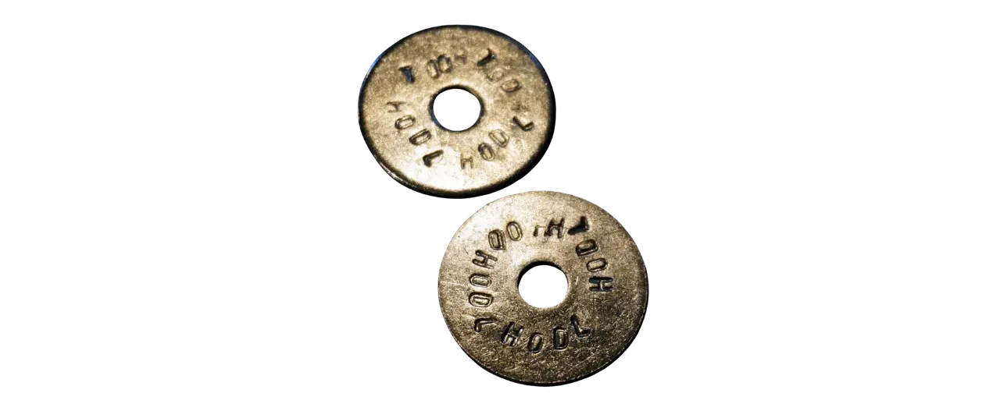
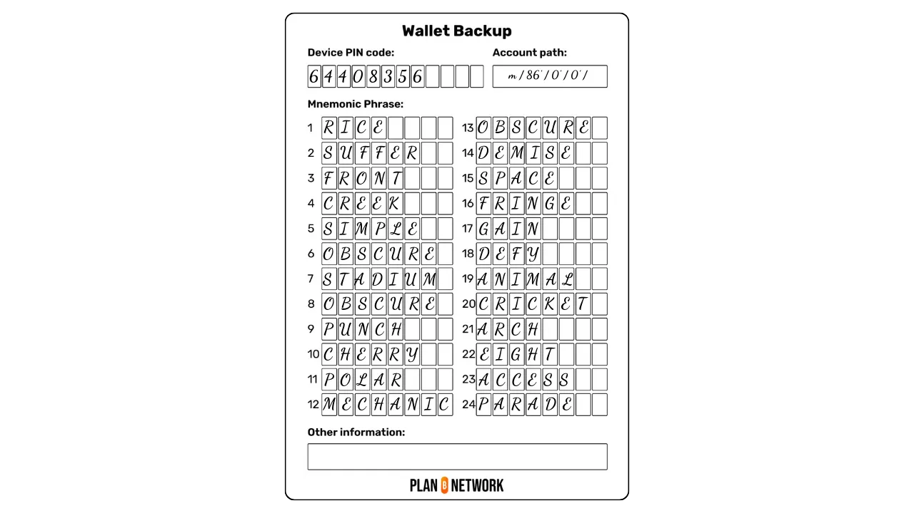

При создании нового кошелька Bitcoin, будь то программный или аппаратный кошелек, вы получаете мнемоническую фразу, состоящую из 12 или 24 слов. Эта фраза очень важна, поскольку она является источником получения всех закрытых ключей, обеспечивающих безопасность ваших биткоинов. Поэтому ее необходимо тщательно хранить, чтобы гарантировать восстановление ваших средств в случае поломки, кражи или потери носителя кошелька.

В этом руководстве мы рассмотрим лучшие методы безопасного сохранения мнемонической фразы, чтобы не потерять доступ к своим биткоинам.

## Осведомленность о рисках

Эта мнемоника дает вам полный, неограниченный доступ ко всем вашим биткоинам. Любой человек, владеющий этой фразой, может украсть ваши средства, даже не имея физического доступа к носителю, на котором хранится ваш кошелек.

Это означает, что, например, если вы используете кошелек Bitcoin на Ledger, любой человек, имеющий доступ к вашей мнемонической фразе, может украсть все ваши биткоины, даже не имея доступа к самому Ledger. Вот почему **вы никогда не должны делиться своей мнемонической фразой**, в какой бы ситуации это ни происходило.

Таким образом, эта фраза является уникальной информацией, позволяющей восстановить доступ к вашим биткоинам в случае потери, кражи или повреждения носителя кошелька. Давайте снова рассмотрим пример с Ledger: если вы потеряете устройство, вы сможете восстановить свои средства, введя свою мнемоническую фразу в новый Ledger или любой другой совместимый кошелек, будь то программный или аппаратный.

Поэтому важно сохранять эту фразу с особой осторожностью и держать ее в надежном месте, о чем мы расскажем в следующих разделах.

**Таким образом, ваша мнемоническая фраза подвергается двум основным рискам: краже и потере**

Кража может происходить двумя основными способами:


- Кто-то получил физический доступ к вашей резервной копии, например, во время кражи со взломом или через друга;
- Вы вольно или невольно поделились своим приговором с другим человеком.

Чтобы избежать физической кражи резервной копии мнемонической фразы, важно хранить ее в надежном месте. Мы подробно рассмотрим этот момент в следующих разделах.

Когда речь идет о попытках удаленного воровства, всегда помните, что никогда не стоит делиться своей мнемонической фразой, в какой бы ситуации это ни происходило. Часто встречаются попытки фишинга: мошеннические электронные письма, сайты, имитирующие официальные кошельки, или прямые запросы по различным каналам связи. Если кто-то просит вас ввести кодовую фразу, это мошенничество, даже в экстренных случаях! Часто воры выдают себя за сотрудников производителя вашего аппаратного кошелька, но имейте в виду, что эти компании никогда не попросят вас ввести кодовую фразу, в какой бы ситуации это ни произошло. Поэтому будьте предельно бдительны при любых сообщениях, полученных по электронной почте, телефону, почте, в социальных сетях или даже при личной встрече.

Когда вам нужно ввести свою фразу в аппаратный кошелек или в программное обеспечение для восстановления доступа к кошельку после проблем с первоначальной поддержкой, найдите время, чтобы проверить подлинность и целостность используемого оборудования или программного обеспечения. Не паникуйте и действуйте методично.

Кроме того, будьте осторожны при обращении с мнемонической фразой. Убедитесь, что за вами не наблюдают другие люди или камера.

Что касается риска потери, то он может возникнуть по трем основным причинам: потеря носителя резервной копии, его порча или ошибка в его оценке. В следующих разделах мы подробно рассмотрим, как избежать или минимизировать эти три риска.

## Поддержка

Чтобы сохранить фразу для восстановления, вам нужно записать ее на физическом носителе, например на бумаге или металле. Никогда не используйте цифровой носитель: не сохраняйте ее в текстовом файле, не фотографируйте ее и не храните в менеджере паролей. Эти методы значительно увеличивают площадь атаки по сравнению с физическими носителями. Поэтому правило очевидно: используйте бумагу, картон или металл для сохранения своих фраз.

Запись фразы на простом листе бумаги уже является хорошей практикой, но выбор металлического держателя, например из нержавеющей стали, обеспечивает дополнительную безопасность. Такой держатель защитит вашу мнемоническую фразу от риска пожара, наводнения или обрушения, которые могут повлиять на место хранения.

Для тех, кто ищет экономичный вариант подкрепления своих фраз на металле, [метод "сделай сам" от "*SAFU Ninja*"](https://jlopp.github.io/metal-bitcoin-storage-reviews/reviews/safu-ninja/) - отличное решение. Все, что вам нужно сделать, это купить в магазинах металлические шайбы, винт и гайку. Затем вы гравируете слова предложения на каждой шайбе, обязательно пронумеровав их, и собираете их на винт с гайкой. Этот недорогой метод уже обеспечивает хорошую стойкость.



Image credit: [*SAFU Ninja Review*, Jameson Lopp](https://jlopp.github.io/metal-bitcoin-storage-reviews/reviews/safu-ninja/).

Если вы предпочитаете инвестировать в готовое устройство для резервного копирования металла, рекомендую вам взглянуть на [тесты на стойкость Джеймсона Лоппа](https://jlopp.github.io/metal-bitcoin-storage-reviews/), в которых оценивается большинство решений, представленных на рынке. Я бы посоветовал вам выбрать цельные кронштейны, например металлическую пластину для гравировки, штамповки или перфорации. Такие устройства обычно обладают гораздо большей стойкостью, чем системы, использующие независимые буквы для сборки.

Если вы решили сделать бумажный кошелек, у вас есть несколько вариантов: простой чистый лист бумаги, картонный кошелек, который часто поставляется вместе с аппаратным кошельком, или наш шаблон, который вы можете распечатать [нажав здесь] (https://github.com/PlanB-Network/bitcoin-educational-content/blob/dev/resources/bet/wallet-backup-sheet/assets/mnemonic-sheet.pdf).


## Резервное копирование

Теперь, когда вы выбрали физический носитель, пришло время записать фразу для восстановления! Чтобы не потерять свои биткоины, следуйте следующим рекомендациям.

Прежде всего, убедитесь, что за вами не наблюдают ни другие люди, ни камеры, пока вы записываете свое предложение.

Затем найдите время, чтобы четко и разборчиво написать каждое слово. Возможно, вам придется перечитывать свое предложение через несколько лет, а кому-то другому - в рамках наследства. Поэтому аккуратный почерк крайне важен.

Теоретически можно записать только первые 4 буквы каждого слова, потому что в списке из 2048 слов в BIP39 нет двух слов с одинаковыми первыми 4 буквами, расположенными в одинаковом порядке. Однако, если на вашем носителе достаточно места, я рекомендую сохранять каждое слово целиком. Это может быть полезно в случае частичной порчи носителя. Например, если вы записали только `accu` для слова `accuse`, а буква `u` исчезла, вам придется выбирать между `accuse`, `access`, `accident` или `account`. С другой стороны, если слово целиком, то даже если одна буква пропадет, вы все равно легко узнаете правильное слово.

Также важно написать слова в правильном порядке. Если у вас есть 24 слова, но вы не знаете их точной последовательности, восстановить кошелек будет невозможно. Не менее важна и нумерация слов: если носитель будет поврежден или слова окажутся беспорядочными, пронумеровав их, вы сможете легко вернуть их в нужный порядок.


Кроме того, важно понимать, что теоретически одной мнемонической фразы не всегда достаточно, чтобы восстановить доступ к своим биткоинам. Также необходимо знать пути деривации, используемые для генерации ключей. Если вы используете кошелек SingleSig со стандартным путем, восстановить ключи будет относительно просто. Однако при использовании нестандартного пути это может стать невозможным, даже при наличии мнемонической фразы. Чтобы избежать этой проблемы, я настоятельно рекомендую записать на вашем носителе путь к деривации используемого аккаунта. Эту информацию можно найти в настройках программного обеспечения вашего кошелька. Например, для стандартного кошелька Taproot путь деривации по умолчанию будет :

```txt
m / 86' / 0' / 0' /
```


Если вы используете многосиговый кошелек или кошелек со сложными скриптами, включающими ключи восстановления, как, например, в программе Liana, очень важно сохранить **Описания выходных скриптов**. Эти дескрипторы содержат всю информацию, необходимую вам, помимо фраз восстановления, для восстановления доступа к вашим биткоинам.

Вы также можете дополнить свою резервную копию дополнительной информацией, связанной с поддержкой вашего кошелька. Например, укажите PIN-код, используемый для разблокировки аппаратного кошелька, или слова антифишинга, если вы используете COLDCARD.



С другой стороны, если вы используете парольную фразу, убедитесь, что вы не записываете ее на том же носителе, что и мнемоническую фразу. Цель парольной фразы - защитить ваш кошелек в случае кражи. Чтобы узнать больше о том, как использовать кодовую фразу, ознакомьтесь с этим дополнительным руководством:

https://planb.network/tutorials/wallet/backup/passphrase-a26a0220-806c-44b4-af14-bafdeb1adce7
После того как вы сохранили мнемоническую фразу на физическом носителе, настоятельно рекомендуется провести тест на восстановление, пока ваш только что созданный кошелек еще пуст. Этот тест заключается в том, что вы записываете примерный фрагмент информации, намеренно удаляете пустой кошелек, а затем пытаетесь восстановить его, используя только физическую резервную копию мнемонической фразы. Это позволит вам убедиться в том, что резервная копия является полной и не содержит ошибок ввода. Кроме того, вы сможете ознакомиться с процессом восстановления. Таким образом, если в будущем вам понадобится восстановление, вы будете лучше подготовлены и избежите стресса, связанного с первой попыткой в реальной ситуации. Подробнее о том, как провести этот тест, читайте в другом руководстве:

https://planb.network/tutorials/wallet/backup/recovery-test-5a75db51-a6a1-4338-a02a-164a8d91b895
Наконец, возникает вопрос о количестве резервных копий. Этот выбор полностью зависит от вашей личной ситуации. Ограничение количества копий, например, запись мнемонической фразы только один раз на носителе, снижает риск кражи, но повышает риск потери. И наоборот, создание нескольких копий снижает риск потери, но повышает риск кражи. Таким образом, вам предстоит найти правильный баланс, отвечающий вашим потребностям, и определить количество копий, которое вы считаете наиболее подходящим.

## Хранение

Теперь, когда вы тщательно создали резервную копию своей мнемонической фразы, пришло время выбрать подходящее место для хранения. Это зависит от вашей стратегии безопасности. В любом случае, выбирайте место, которое находится вне поля зрения, где вряд ли кто-то наткнется на него, но при этом доступное для периодических проверок. Убедитесь, что оно защищено от внешних воздействий, чтобы не повредить подложку.

Я бы также не советовал хранить мнемонику в местах, где вы не являетесь сувереном, например, в сейфе у нотариуса или в банке. Эти варианты могут показаться безопасными, но они подразумевают, что вы зависите от третьей стороны в вопросе доступа к вашей резервной копии, что противоречит фундаментальным принципам Биткойна.

Для дополнительной безопасности я рекомендую использовать пластиковый пакет с защитой от вскрытия или аналогичную систему запечатывания. Это позволит вам убедиться, что никто не получил доступ к вашей фразе. Например, если вы храните свою фразу дома и принимаете гостей, может оказаться, что никто не видел, не запомнил и не сфотографировал ее. Чехол с защитой от вскрытия упрощает такую проверку: если он цел, вы можете быть уверены, что ваша фраза осталась в тайне. Такие полностью непрозрачные чехлы можно приобрести онлайн или в специализированных магазинах биткоинов.


Наконец, если ваша фраза хранится в защищенном от вскрытия конверте, не забудьте записать уникальный идентификатор конверта. Это позволит вам проверить его подлинность при проверке.

## Управление временем

Теперь, когда ваша фраза бережно хранится, важно наладить регулярный контроль. Периодически проверяйте, что ваша фраза все еще находится в месте хранения и что ее непрозрачный конверт не был вскрыт.

Во время этих проверок вы также можете открыть конверт, чтобы осмотреть состояние подложки. Убедитесь, что она не повреждена и что предложение по-прежнему хорошо читаемо. Если вы заметили какие-либо признаки повреждения, лучше всего создать новую копию из аппаратного кошелька. Убедитесь, что новая копия работоспособна, а затем уничтожьте поврежденную резервную копию, чтобы избежать риска утечки.

Наконец, управление мнемоническими фразами также поднимает вопрос о наследовании. Эта тема будет подробно рассмотрена в одном из следующих уроков.

## Идем дальше

Чтобы сделать еще один шаг вперед и еще больше укрепить свою стратегию безопасности, я рекомендую вам изучить техническую работу вашего биткойн-кошелька. Понимая, как взаимодействуют различные элементы, а также их важность и последствия, вы сможете точно настроить свою стратегию безопасности, полностью осознавая связанные с ней риски. В частности, если вы поймете на техническом уровне, что позволяет мнемоническая фраза, вы сможете со временем скорректировать способы ее записи, хранения и управления.

Именно поэтому я приглашаю вас пройти бесплатный учебный курс CYP201, предлагаемый Plan ₿ Network. Этот курс подробно объясняет все принципы работы кошельков Bitcoin, позволяя вам освоить технические аспекты, необходимые для эффективной защиты ваших средств:

https://planb.network/courses/cyp201
Если вы нашли этот урок полезным, я буду благодарен, если вы оставите свой отзыв о нем ниже. Не стесняйтесь поделиться этой статьей в своих социальных сетях. Большое спасибо!