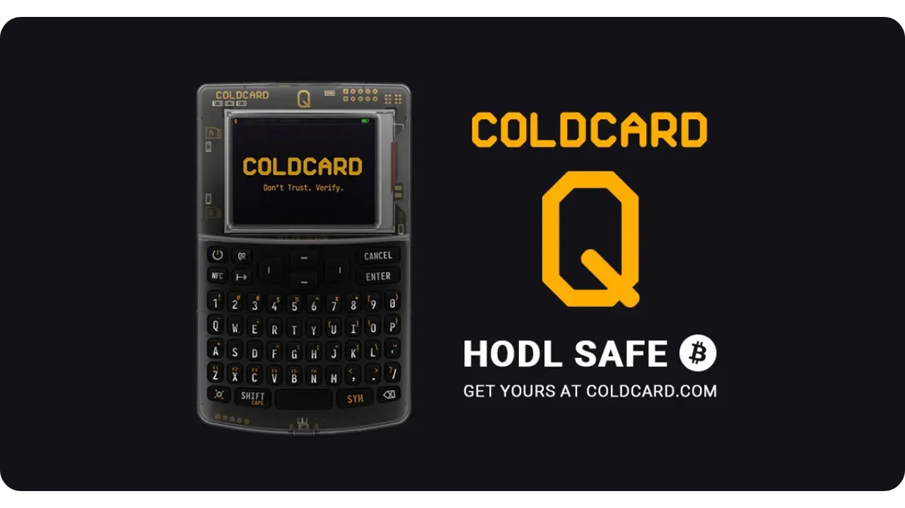
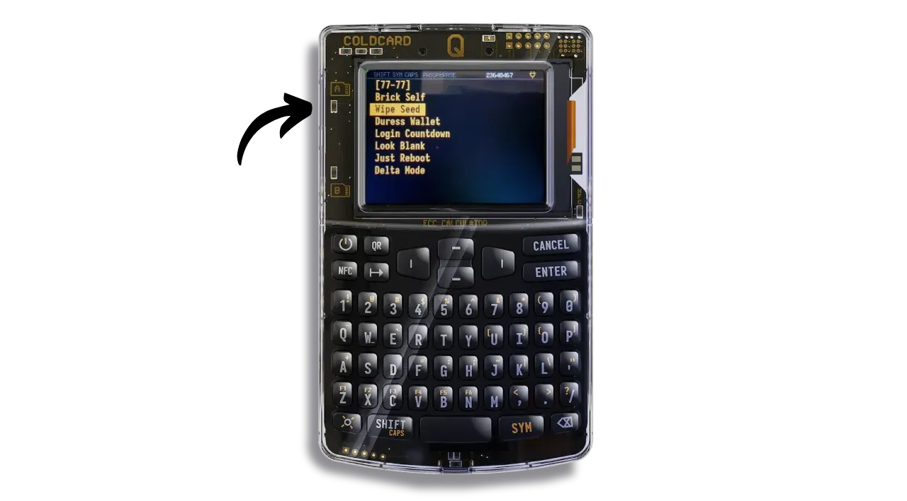
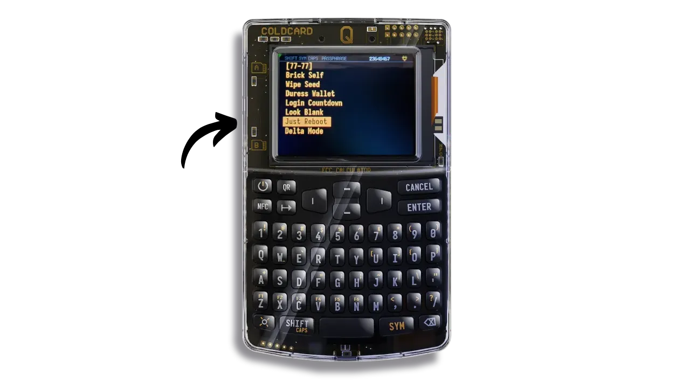
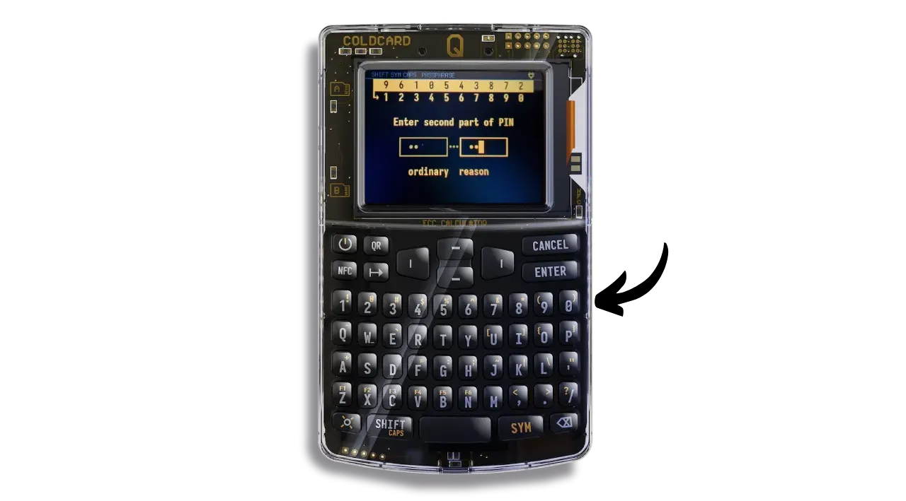
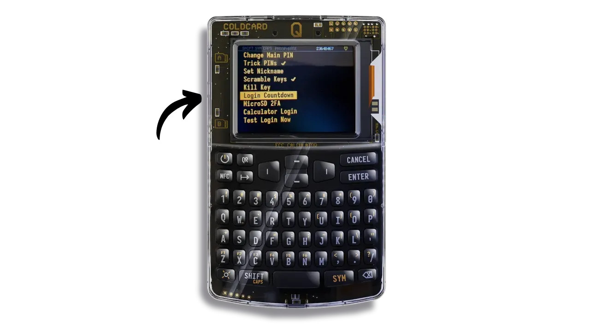

In einem früheren Tutorial haben wir die Erstkonfiguration der COLDCARD Q und ihre Grundfunktionen für Anfänger beschrieben. Wenn Sie Ihre COLDCARD Q gerade erst erhalten haben und sie noch nicht eingerichtet haben, empfehle ich Ihnen, mit diesem Tutorial zu beginnen, bevor Sie hier fortfahren:

https://planb.network/tutorials/wallet/hardware/coldcard-q-73e86d1a-6fe6-4d8b-bb15-8690298020e3
Dieses neue Tutorial ist den fortgeschrittenen Optionen der COLDCARD Q gewidmet, die für fortgeschrittene und paranoide Benutzer entwickelt wurden. In der Tat unterscheiden sich COLDCARDs von anderen Hardware-Geldbörsen durch ihre vielen erweiterten Sicherheitsfunktionen. Natürlich müssen Sie nicht alle diese Optionen nutzen. Wählen Sie einfach die Optionen aus, die zu Ihrer Sicherheitsstrategie passen.

**Warnung**, die falsche Verwendung einiger dieser erweiterten Optionen kann zum Verlust Ihrer Bitcoins oder zur Zerstörung Ihrer Hardware-Wallet führen. Ich empfehle Ihnen daher dringend, die Hinweise und Erklärungen zu jeder Option sorgfältig zu lesen.

Bevor Sie beginnen, vergewissern Sie sich, dass Sie Zugang zu einer physischen Sicherungskopie Ihrer mnemotechnischen Phrase mit 12 oder 24 Wörtern haben, und überprüfen Sie deren Gültigkeit über das folgende Menü: erweitert/Tools > Gefahrenzone > Saatgutfunktionen > Saatgutwörter anzeigen".

## Die Passphrase BIP39

Wenn Sie nicht wissen, was eine BIP39-Passphrase ist, oder wenn Ihnen nicht ganz klar ist, wie sie funktioniert, empfehle ich Ihnen dringend, vorher einen Blick auf dieses Tutorial zu werfen, das die theoretischen Grundlagen abdeckt, um die mit der Verwendung einer Passphrase verbundenen Risiken zu verstehen:

https://planb.network/tutorials/wallet/backup/passphrase-a26a0220-806c-44b4-af14-bafdeb1adce7
Denken Sie daran, dass Ihre Mnemonik allein nicht ausreicht, um wieder Zugang zu Ihren Bitcoins zu erhalten, sobald Sie die Passphrase in Ihrer Wallet eingerichtet haben. Sie benötigen sowohl die Eselsbrücke als auch die Passphrase. Außerdem müssen Sie die Passphrase jedes Mal eingeben, wenn Sie Ihre COLDCARD Q entsperren. Dies erhöht die Sicherheit, da der physische Zugriff auf die COLDCARD und die Kenntnis der PIN ohne die Passphrase unzureichend sind.

Bei COLDCARDs haben Sie zwei Möglichkeiten zur Verwaltung Ihrer Passphrase:

1. **Klassische Eingabe:** Sie geben die Passphrase jedes Mal manuell ein, wenn Sie Ihre Hardware-Geldbörse verwenden, genau wie bei anderen Hardware-Geldbörsen. Die COLDCARD Q vereinfacht diese Aufgabe mit ihrer vollständigen Tastatur.

2. **Sie können Ihre Passphrase auch verschlüsseln und auf einer microSD-Karte speichern. In diesem Fall müssen Sie die microSD-Karte jedes Mal in die COLDCARD Q einlegen, wenn Sie sie verwenden. Beachten Sie, dass diese microSD-Karte nur auf Ihrer COLDCARD Q funktioniert und nicht als Backup dient. Es ist daher sehr wichtig, dass Sie auch eine Kopie Ihrer Passphrase auf einem physischen Medium aufbewahren, z. B. auf Papier oder Metall.

Um Ihre BIP39-Passphrase einzustellen, rufen Sie das Menü "*Passphrase*" auf.

Geben Sie Ihre Passphrase über die Tastatur ein. Achten Sie darauf, eine starke Passphrase zu wählen (lang und zufällig) und ein physisches Backup zu erstellen.

Sobald Sie Ihre Passphrase festgelegt haben, zeigt Ihnen COLDCARD Q den Fingerabdruck des Hauptschlüssels der neuen Brieftasche an, die mit dieser Passphrase verknüpft ist. Achten Sie darauf, diesen Fingerabdruck zu speichern. Wenn Sie Ihre Passphrase in Zukunft erneut eingeben, können Sie überprüfen, ob der angezeigte Fingerabdruck mit dem von Ihnen gespeicherten übereinstimmt. Diese Überprüfung stellt sicher, dass Sie bei der Eingabe Ihrer Passphrase keinen Fehler gemacht haben.

Sie können nun "*ENTER*" drücken, um diese Passphrase auf Ihre mnemonische Phrase anzuwenden und die neue Brieftasche zu aktivieren. Wenn Sie diese Passphrase lieber auf einer microSD-Karte speichern möchten, stecken Sie die Karte in den entsprechenden Steckplatz und drücken Sie "*1*".

Ihre Passphrase wird nun angewendet. Der Schlüsselaufdruck erscheint auf dem Startbildschirm und oben auf dem Bildschirm.

Jedes Mal, wenn Sie Ihre COLDCARD Q entsperren, müssen Sie das Menü "*Passphrase*" aufrufen und Ihre Passphrase wie oben beschrieben eingeben, um sie auf die im Gerät gespeicherte Mnemonik anzuwenden und auf die richtige Bitcoin-Wallet zuzugreifen.

Wenn Sie die Passphrase auf einer microSD-Karte gespeichert haben, legen Sie diese bei jeder Verwendung in die COLDCARD ein und rufen das Menü "*Passphrase*" auf. Ihre COLDCARD lädt die Passphrase direkt von der microSD-Karte, so dass Sie sie nicht manuell eingeben müssen. Klicken Sie auf "*Gespeichertes wiederherstellen*".

Überprüfen Sie, ob die Länge und der erste Buchstabe der geladenen Passphrase korrekt sind.

Vergewissern Sie sich, dass der angezeigte Fingerabdruck mit dem Ihrer Brieftasche übereinstimmt, und klicken Sie auf "*Wiederherstellen*".

Denken Sie daran, dass die Verwendung einer Passphrase bedeutet, dass Sie einen neuen Satz von Schlüsseln, der aus der Kombination Ihrer mnemonischen Phrase und Passphrase abgeleitet ist, in Ihre Wallet-Verwaltungssoftware (wie Sparrow Wallet) importieren müssen. Um dies zu tun, folgen Sie dem Schritt "*Konfigurieren Sie eine neue Wallet auf Sparrow*" in diesem anderen Tutorial:

https://planb.network/tutorials/wallet/hardware/coldcard-q-73e86d1a-6fe6-4d8b-bb15-8690298020e3
## Entriegelungsoptionen

COLDCARDs profitieren auch von einer Vielzahl von Optionen für die Entsperrung des Geräts. Hier erfahren Sie mehr über diese erweiterten Optionen.

### Trick-PINs

Eine Trick-PIN ist ein zweiter PIN-Code, der sich von dem bei der Erstkonfiguration des Geräts festgelegten unterscheidet. Dieser Code wird verwendet, um bestimmte vorkonfigurierte Aktionen auszulösen, sobald er beim Einschalten der COLDCARD eingegeben wird. Sie können mehrere Trick-PINs konfigurieren, die jeweils mit einer anderen Aktion verbunden sind. Diese Funktionen ermöglichen es Ihnen, Ihre COLDCARD an Ihre persönliche Sicherheitsstrategie anzupassen. Sie sind besonders nützlich in Fällen von physischem Zwang, wie z. B. bei einem Raubüberfall (in der Bitcoin-Community gemeinhin als "*$5-Schraubenschlüssel-Angriff*" bezeichnet).

Um eine Trick-PIN zu aktivieren und sie mit einer Aktion zu verknüpfen, rufen Sie das Menü "Einstellungen > Anmeldeeinstellungen > Trick-PINs" auf.

Wählen Sie "*Neuen Trick hinzufügen*".

Legen Sie den PIN-Code fest, der mit der Aktion verknüpft werden soll, und vergessen Sie nicht, ihn zu speichern.

Wählen Sie dann die Aktion aus, die jedes Mal automatisch ausgeführt werden soll, wenn Sie diese Trick-PIN eingeben. Hier finden Sie die Liste der für eine PIN verfügbaren Aktionen:

- "*Brick Self*: Diese Aktion zerstört beide COLDCARD Q-Chips, wenn die Trick-PIN eingegeben wird, wodurch das Gerät völlig unbrauchbar wird. Es ist dann nicht mehr möglich, es weiterzuverkaufen, wiederzuverwenden oder gar an Coinkite zurückzugeben. Das Gerät wird unwiederbringlich unbrauchbar. Diese Funktion kann im Falle eines Überfalls genutzt werden, um einen Angreifer davon zu überzeugen, dass er niemals an Ihre Bitcoins herankommen wird. **Bitte beachten Sie**: ohne ein physisches Backup Ihrer mnemonischen Phrase und jeder Passphrase sind Ihre Bitcoins dauerhaft verloren.

- "*Saatgut löschen*": Dieses Menü bietet mehrere Aktionen zum Löschen des Seeds, d.h. zum Zurücksetzen der COLDCARD, ohne sie zu zerstören. Im Gegensatz zur Option "*Brick Self*" ist es möglich, das Gerät mit einem Backup Ihrer mnemonischen Phrase neu zu konfigurieren. Ohne diese Sicherung sind Ihre Bitcoins jedoch verloren. Hier sind die verfügbaren Optionen:
 - "*Löschen & Neustart* : Entfernt den Seed und startet die COLDCARD neu, ohne dass Informationen auf dem Bildschirm angezeigt werden.
 - "*Lautloses Löschen*": Wischt leise den Seed und entsperrt die COLDCARD auf einer zufälligen gefälschten Brieftasche, als ob nichts passiert wäre.
 - "*Wipe -> Wallet*": Entfernt den Seed diskret und entsperrt die COLDCARD auf einer vorkonfigurierten zweiten Wallet, die als Köder gedacht ist. Diese Wallet kann einen kleinen Teil Ihrer Bitcoin-Ersparnisse enthalten, um einen Angreifer zu befriedigen.
 - *Sagen Sie "Gewischt, Stopp*": Löscht das Saatgut und zeigt die Meldung "Saatgut ist gelöscht, Stopp" auf dem Bildschirm an.

- "*Duress Wallet*": Bei dieser Aktion wird mit dem Trick-PIN-Code eine vom Seed abgeleitete Wallet mit dem BIP85 entsperrt. Diese sekundäre Brieftasche kann als Köder verwendet werden, um einen Angreifer zu überlisten. Die COLDCARD verhält sich so, als wäre sie die echte Brieftasche, aber ohne die Master-PIN (die sich von der Trick-PIN unterscheidet) kann der Angreifer niemals auf die echte Brieftasche zugreifen. Mit dieser Strategie soll den Leuten vorgegaukelt werden, dass die mit der Trick-PIN verknüpfte Geldbörse die einzige existierende ist.

- "*Login Countdown*": In diesem Menü werden Aktionen mit einem Countdown zusammengefasst, bevor sie ausgeführt werden. **Warnung**, einige von ihnen können Ihr Gerät zerstören oder zum Verlust Ihrer Bitcoins führen. Hier sind die verfügbaren Unteraktionen:
 - "*Löschen & Countdown* : Löscht den Seed aus dem Speicher der COLDCARD und startet dann einen einstündigen Countdown. Ohne Ihre Mnemonik oder Passphrase zu speichern, sind Ihre Bitcoins verloren. Diese Option soll einem Angreifer vorgaukeln, dass das Gerät am Ende des Countdowns entsperrt wird, während es in Wirklichkeit auf die Werkseinstellungen zurückgesetzt wird.
 - "*Countdown & Brick*": Startet einen einstündigen Countdown, an dessen Ende die COLDCARD ihre beiden Sicherheitschips zerstört und damit dauerhaft unbrauchbar macht. Ohne Backup sind Ihre Bitcoins dann verloren. Diese Aktion dient dazu, einen Angreifer zu täuschen, der denkt, dass er auf eine Entsperrung wartet, während sich das Gerät in Wirklichkeit selbst zerstört.
 - "*Just Countdown* : Löst einen einfachen einstündigen Countdown aus, nach dem die COLDCARD ohne weitere Maßnahmen neu startet. Der Seed wird nicht gelöscht und das Gerät bleibt intakt. Verwechseln Sie diese Aktion nicht mit der in den folgenden Abschnitten besprochenen Option "*Login Countdown*", die einen Countdown zur Haupt-PIN hinzufügt und gleichzeitig den Zugriff auf die eigentliche Brieftasche ermöglicht.

- "*Leer aussehen*": Diese Aktion lässt die COLDCARD leer erscheinen, so dass der Eindruck entsteht, das Saatgut sei gelöscht worden. In Wirklichkeit passiert nichts, und das Saatgut bleibt intakt. Dies simuliert eine unbenutzte oder zurückgesetzte COLDCARD.

- "*Neustart* : Wenn die Trick-PIN verwendet wird, wird die COLDCARD einfach neu gestartet. Es wird keine weitere Aktion durchgeführt.

- "*Delta-Modus*": Diese komplexe Aktion, die erfahrenen Benutzern vorbehalten ist, wurde entwickelt, um hochentwickelte Nötigungsangriffe abzuwehren, sei es von einem Staat oder einem Verwandten mit privilegierten Informationen. Wenn der Delta-Modus aktiviert ist, bietet COLDCARD Zugriff auf die echte Brieftasche, so dass ein Angreifer darin navigieren und überprüfen kann, ob es sich um die richtige Brieftasche handelt. Allerdings werden die Transaktionssignaturen blockiert, so dass kein Bitcoin-Transfer möglich ist. Darüber hinaus ist der Zugriff auf die mnemonische Phrase deaktiviert, und jeder Versuch, sie abzurufen, führt zu ihrer Löschung. Um die Glaubwürdigkeit zu erhöhen, muss die Trick-PIN, die mit dem Delta-Modus verwendet wird, den gleichen Präfix wie die echte PIN haben (um die gleichen Anti-Phishing-Wörter anzuzeigen), aber der Suffix muss anders sein.

Sobald Sie eine Aktion ausgewählt haben, bestätigen Sie Ihre Wahl.

Sie können dann alle konfigurierten Trick-PINs in dem entsprechenden Menü anzeigen.

Wenn Sie eine vorhandene Trick-PIN auswählen, können Sie die zugehörige Aktion überprüfen. Sie können sie auch mit "*Trick ausblenden*" ausblenden, so dass sie im Menü "Trick-PIN" nicht mehr sichtbar ist. Sie können ihn löschen, indem Sie auf "*Trick löschen*" klicken, oder den PIN-Code unter Beibehaltung der zugehörigen Aktion mit "*PIN ändern*" ändern.

Mit der Option "*Wenn falsch*", die im Menü "*Trick-PIN*" verfügbar ist, können Sie eine bestimmte Aktion konfigurieren, die automatisch nach einer bestimmten Anzahl von falschen Versuchen, den Master-PIN-Code einzugeben, ausgelöst wird. Die Anzahl der zulässigen Versuche kann während der Konfiguration eingestellt werden.

### Scramble-Tasten

Mit der Option Tasten verschlüsseln können Sie die Ziffern verschlüsseln, die bei der Eingabe Ihres PIN-Codes auf den Tasten des Tastenfelds angezeigt werden. Diese Funktion schützt die Vertraulichkeit Ihres PIN-Codes, selbst im Falle einer Überwachung durch Personen oder Kameras.

Um diese Option zu aktivieren, rufen Sie das Menü "Einstellungen > Anmeldeeinstellungen > Verschlüsselungstasten" auf.

Wählen Sie die Option "*Scramble Keys*".

Wenn Sie Ihre COLDCARD Q entsperren, werden den Tasten auf dem Tastenfeld von nun an bei jeder Benutzung neue Nummern nach dem Zufallsprinzip zugewiesen.

### Anmelde-Countdown

Mit dieser Option können Sie jedes Mal, wenn Sie versuchen, Ihre COLDCARD zu entsperren, einen systematischen Countdown einrichten. Sie kann in Ihre Sicherheitsstrategie integriert werden, indem Sie den Zugriff auf das Gerät im Falle eines Diebstahls verzögern oder eine Verzögerung vor der Unterzeichnung einer Transaktion festlegen, um sich zum Beispiel im Falle eines Überfalls zu schützen. Dieser Countdown gilt jedoch für alle Ihre Nutzungen, auch für die legitime Nutzung Ihrer COLDCARD, die Sie ebenfalls zur Geduld zwingt. Verwechseln Sie diese Option nicht mit der Aktion "*Just Countdown*", die nur aktiviert wird, wenn eine bestimmte Trick-PIN verwendet wird.

Um diese Option zu konfigurieren, öffnen Sie das Menü "Einstellungen > Login-Einstellungen > Login-Countdown".

Wählen Sie die Countdown-Zeit. Wenn Sie z. B. 1 Stunde wählen, müssen Sie bei jedem Versuch, die COLDCARD Q zu entsperren, 1 Stunde warten.

Bei jedem Entsperren werden Sie aufgefordert, Ihren PIN-Code einzugeben.

Warten Sie dann die Zeit ab, die der Countdown vorgibt.

Nach Ablauf des Countdowns müssen Sie Ihre PIN erneut eingeben, um auf das Gerät zuzugreifen.

### Rechner-Anmeldung

Mit dieser Option können Sie Ihre COLDCARD beim Freischalten als Taschenrechner tarnen. Um diese Funktion zu aktivieren, rufen Sie das Menü "Einstellungen > Login-Einstellungen > Rechner-Login" auf.

Aktivieren Sie die Option, indem Sie sie auswählen.

Von nun an wird bei jedem Einschalten des Geräts ein funktionierender Taschenrechner mit grundlegenden Befehlen angezeigt.

Sie können zum Beispiel den SHA256-Hash von "*Plan B Network*" berechnen.

Um die COLDCARD aus dem Taschenrechnermodus zu entsperren, geben Sie zunächst Ihren PIN-Code-Präfix gefolgt von einem Bindestrich ein. Wenn Ihr PIN-Code zum Beispiel "00-00" lautet (dieser Code ist schwach und nur ein Beispiel, wählen Sie also einen starken PIN-Code), geben Sie "00-" ein. COLDCARD zeigt dann Ihre beiden Anti-Phishing-Wörter an.

Geben Sie dann Ihren vollständigen PIN-Code ein, getrennt durch ein Leerzeichen oder einen Bindestrich, zum Beispiel: "00 00".

Die COLDCARD verlässt dann den Rechnermodus und wird normal entsperrt.

## Saubere Zerstörung Ihrer COLDCARD

Wenn Sie vorhaben, Ihre COLDCARD Q zu entsorgen, z. B. weil Sie jetzt eine andere Hardware-Geldbörse verwenden, ist es wichtig, das Gerät korrekt zu zerstören. Dadurch wird sichergestellt, dass keine Informationen über Ihre Geldbörse von Dritten wiederhergestellt werden können.

Es gibt drei Stufen der Informationsvernichtung, je nach Ihren Bedürfnissen. Bevor Sie beginnen, stellen Sie sicher, dass Ihre Brieftasche in eine andere Hardware-Brieftasche importiert wurde, dass Sie Zugriff auf alle Ihre Geldmittel haben und vor allem, dass Sie Ihre mnemonische Phrase und eine eventuelle Passphrase haben, die beide funktionieren. Ohne ein Wallet-Backup wird die Zerstörung Ihrer COLDCARD zum Verlust Ihrer Bitcoins führen.

Die erste Stufe der Zerstörung besteht darin, nur den Seed zu löschen. Diese Option löscht Ihre mnemonische Phrase aus dem Speicher der COLDCARD, lässt das Gerät aber funktionsfähig. Sie ist ideal, wenn Sie die COLDCARD Q zu einem späteren Zeitpunkt wieder verwenden möchten. Um den Seed aus dem Speicher zu löschen, rufen Sie das Menü "Erweitert/Werkzeuge > Gefahrenzone > Seed-Funktionen > Seed zerstören" auf.

Die zweite Stufe der Zerstörung besteht darin, die beiden Sicherheitschips der COLDCARD über die Software dauerhaft zu deaktivieren. Dadurch wird das Gerät vollständig unbrauchbar. Sie können es nicht weiterverkaufen, wiederverwenden oder an Coinkite zurückschicken: Es wird dauerhaft zerstört. Um fortzufahren, folgen Sie den Schritten, die im vorherigen Abschnitt bezüglich der "*Brick Me*" Beschrieben, und geben Sie diese PIN beim Entsperren der COLDCARD absichtlich ein.

Die dritte Stufe beinhaltet die physische Zerstörung der sicheren Komponenten Ihrer COLDCARD Q. Wie zuvor wird das Gerät dadurch unwiderruflich unbrauchbar gemacht. Dazu bohren Sie mit einem Bohrer ein Loch in die beiden Chips auf der rechten oberen Seite des Geräts (wenn es auf den Kopf gestellt ist), in der Nähe der Aufschrift "*SHOOT HERE*".

**Wichtige Vorsichtsmaßnahmen** :

- Um die Gefahr eines Stromschlags zu vermeiden, nehmen Sie die Batterien aus dem Gerät und trennen Sie es vom Stromnetz, bevor Sie es benutzen.
- Warten Sie nach dem Ausschalten des Geräts einige Minuten, bevor Sie mit dem Bohren beginnen.
- Tragen Sie isolierte Handschuhe und eine Schutzbrille, um Ihre Sicherheit zu gewährleisten.

Sobald die Chips gestanzt wurden, versuchen Sie nicht, die COLDCARD Q wieder anzuschließen.

Herzlichen Glückwunsch, jetzt sind Sie mit den erweiterten Optionen der COLDCARD Q bestens vertraut!

Wenn Sie diese Anleitung nützlich fanden, wäre ich Ihnen sehr dankbar, wenn Sie unten einen grünen Daumen hinterlassen würden. Sie können diese Anleitung auch gerne in Ihren sozialen Netzwerken teilen. Ich danke Ihnen sehr!

Ich empfehle auch dieses andere Tutorial, in dem wir die Verwendung eines direkten Konkurrenten von CCQ, Ledger Flex, diskutieren:

https://planb.network/fr/tutorials/wallet/hardware/ledger-flex-3728773e-74d4-4177-b39f-bd923700c76a