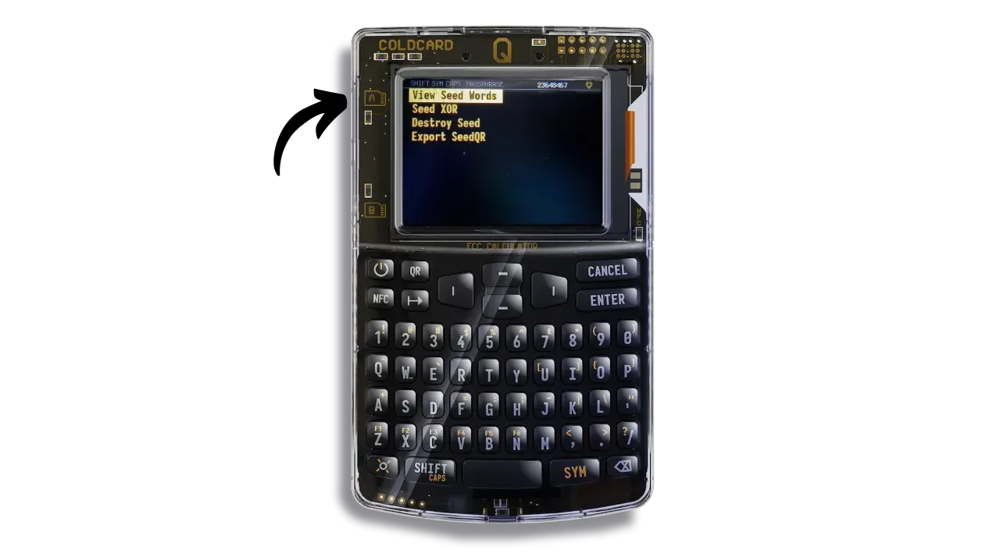
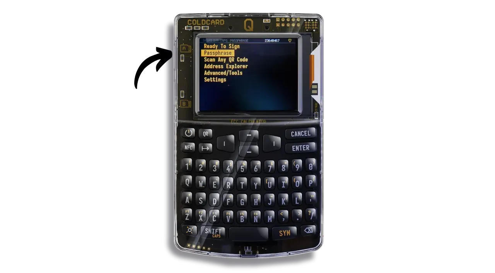
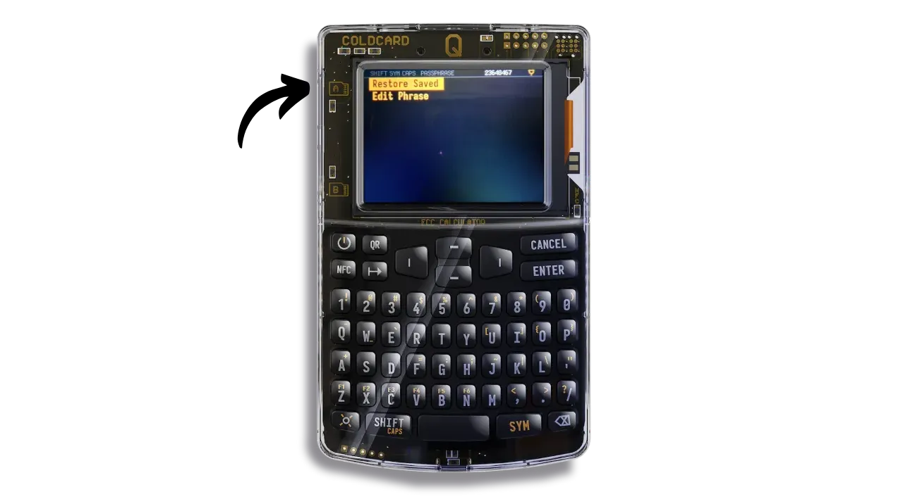
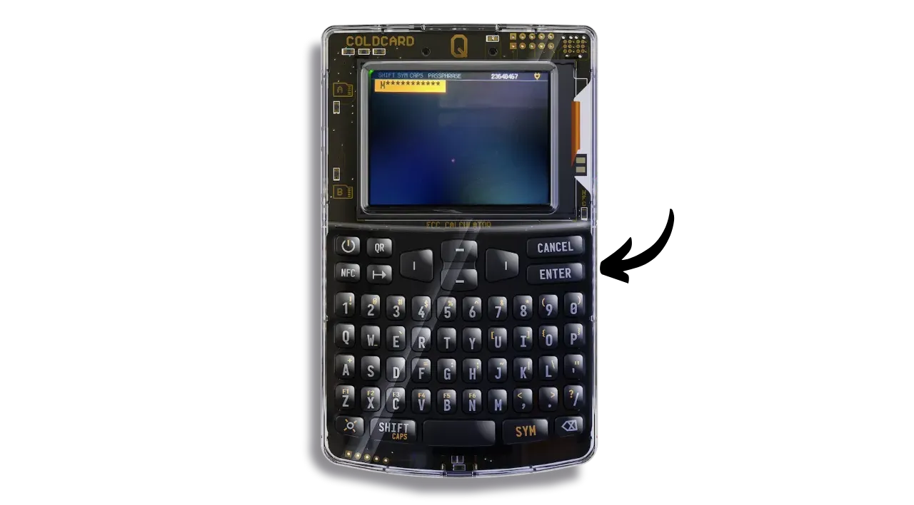
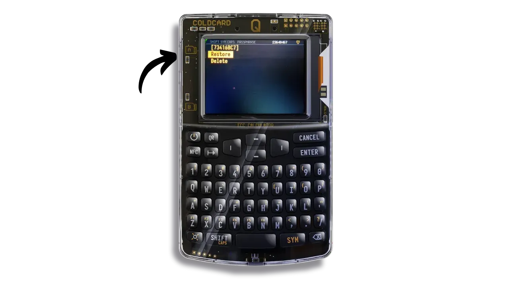
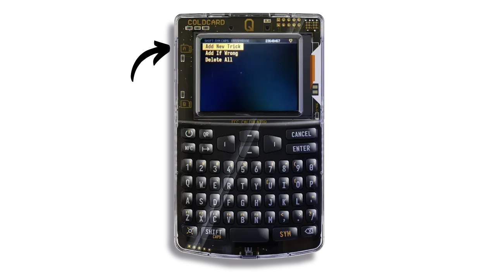
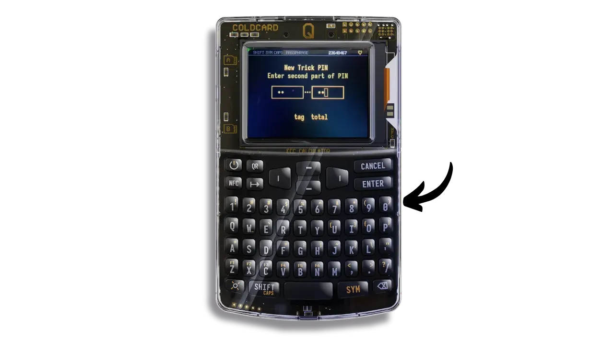
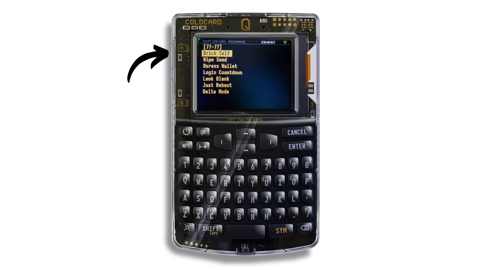
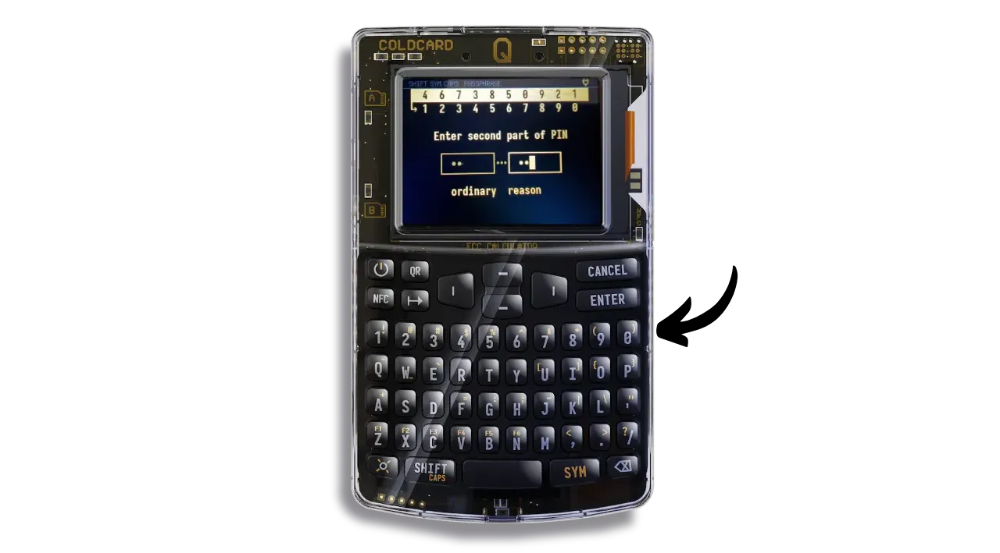
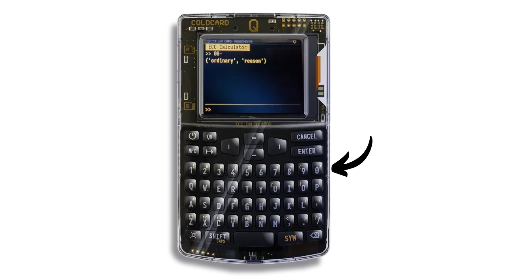

En un tutorial anterior, cubrimos la configuración inicial de la COLDCARD Q y sus funciones básicas para principiantes. Si acabas de recibir tu COLDCARD Q y aún no la has configurado, te recomiendo que empieces por ese tutorial antes de continuar aquí:

https://planb.network/tutorials/wallet/hardware/coldcard-q-73e86d1a-6fe6-4d8b-bb15-8690298020e3
Este nuevo tutorial está dedicado a las opciones avanzadas de COLDCARD Q, diseñadas para usuarios avanzados y paranoicos. De hecho, las COLDCARD se distinguen de otros monederos hardware por sus numerosas funciones de seguridad avanzadas. Por supuesto, no tiene por qué utilizar todas estas opciones. Sólo tiene que elegir las que se adapten a su estrategia de seguridad.

**Atención**, el uso incorrecto de algunas de estas opciones avanzadas puede provocar la pérdida de tus bitcoins o la destrucción de tu monedero hardware. Por ello, te recomiendo encarecidamente que leas atentamente los consejos y explicaciones de cada opción.

Antes de empezar, asegúrate de que tienes acceso a una copia de seguridad física de tu frase mnemotécnica de 12 o 24 palabras, y comprueba su validez a través del siguiente menú: `Avanzado/Herramientas > Zona de peligro > Funciones semilla > Ver palabras semilla`.

## La frase de contraseña BIP39

Si no sabes qué es una frase de contraseña BIP39, o si no te queda del todo claro cómo funciona, te recomiendo encarecidamente que eches un vistazo antes a este tutorial, que cubre las bases teóricas necesarias para entender los riesgos asociados al uso de una frase de contraseña :

https://planb.network/tutorials/wallet/backup/passphrase-a26a0220-806c-44b4-af14-bafdeb1adce7
Ten en cuenta que una vez que hayas configurado la frase de contraseña en tu monedero, tu mnemotécnica por sí sola no será suficiente para recuperar el acceso a tus bitcoins. Necesitarás tanto la mnemotecnia como la frase de contraseña. Es más, tendrá que introducir la frase de contraseña cada vez que desbloquee su COLDCARD Q. Esto refuerza la seguridad haciendo que el acceso físico a la COLDCARD y el conocimiento del PIN sean insuficientes sin la frase de contraseña.

En las COLDCARD, tiene dos opciones para gestionar su frase de contraseña:

1. **Entrada clásica:** Usted introduce la frase de contraseña manualmente cada vez que utiliza su monedero físico, al igual que hace con otros monederos físicos. COLDCARD Q simplifica esta tarea con su teclado completo.

2. **Puedes elegir encriptar tu frase de contraseña y almacenarla en una tarjeta microSD. En este caso, tendrá que insertar la microSD en la COLDCARD Q cada vez que la utilice. Tenga en cuenta que esta microSD sólo funcionará en su COLDCARD Q y no es una copia de seguridad. Por lo tanto, es muy importante que también guarde una copia de su frase de contraseña en un soporte físico, como papel o metal.

Para configurar su frase de contraseña BIP39, acceda al menú "*Frase de contraseña*".

Introduzca su contraseña con el teclado. Asegúrate de elegir una contraseña segura (larga y aleatoria) y haz una copia de seguridad física.

Una vez que haya establecido su frase de contraseña, COLDCARD Q le mostrará la huella digital de la clave maestra del nuevo monedero asociada a esta frase de contraseña. Asegúrese de guardar esta huella. Cuando vuelva a introducir su frase de contraseña al utilizar su dispositivo en el futuro, podrá comprobar que la huella digital mostrada coincide con la que guardó. Esta comprobación garantiza que no se ha equivocado al introducir la frase de contraseña.

Ahora puede pulsar "*ENTRAR*" para aplicar esta frase de contraseña a su frase mnemotécnica y activar el nuevo monedero. Si prefieres guardar esta frase de contraseña en una microSD, inserta la tarjeta en la ranura correspondiente y pulsa "*1*".

Su frase de contraseña ya está aplicada. La impresión de la clave aparece en la pantalla de inicio y en la parte superior de la pantalla.

Cada vez que desbloquee su COLDCARD Q, tendrá que acceder al menú "*Frase de acceso*" e introducir su frase de acceso de la misma forma que en el caso anterior, para aplicarla a la mnemotécnica almacenada en el dispositivo y acceder al monedero Bitcoin correcto.

Si ha guardado la frase de contraseña en una tarjeta microSD, cada vez que la utilice, insértela en la COLDCARD y acceda al menú "*Frase de contraseña*". La COLDCARD cargará la frase de contraseña directamente desde la microSD, por lo que no tendrá que introducirla manualmente. Haz clic en "*Restaurar guardado*".

Compruebe que la longitud y la primera letra de la frase de contraseña cargada son correctas.

Confirme que la huella digital mostrada coincide con la de su monedero y haga clic en "*Restaurar*".

Ten en cuenta que utilizar una frase de contraseña significa que tendrás que importar un nuevo conjunto de claves derivadas de la combinación de tu frase mnemotécnica y la frase de contraseña a tu software de gestión de monederos (como Sparrow Wallet). Para ello, sigue el paso "*Configurar un nuevo monedero en Sparrow*" en este otro tutorial :

https://planb.network/tutorials/wallet/hardware/coldcard-q-73e86d1a-6fe6-4d8b-bb15-8690298020e3
## Opciones de desbloqueo

Las COLDCARD también se benefician de una serie de opciones para el proceso de desbloqueo del dispositivo. Averigüemos más sobre estas opciones avanzadas.

### PIN trucados

Un Trick PIN es un código PIN secundario distinto del definido durante la configuración inicial del dispositivo. Este código se utiliza para activar acciones específicas preconfiguradas en cuanto se introduce al encender la COLDCARD. Puede configurar varios Trick PIN, cada uno vinculado a una acción diferente. Estas funciones le permiten adaptar su COLDCARD a su estrategia de seguridad personal. Son especialmente útiles en casos de coacción física, como durante un robo (comúnmente conocido en la comunidad Bitcoin como "ataque de llave inglesa de 5 dólares").

Para activar un Trick PIN y asociarlo a una acción, acceda al menú `Configuración > Configuración de inicio de sesión > Trick PINs`.

Selecciona "*Añadir nuevo truco*".

Establezca el código PIN que se asociará a la acción y recuerde guardarlo.

A continuación, elija la acción que se realizará automáticamente cada vez que introduzca este Trick PIN. Esta es la lista de acciones disponibles para un PIN:

- "Autodestruirse": Esta acción destruye los dos chips COLDCARD Q si se introduce el PIN Truco, inutilizando totalmente el dispositivo. Será imposible revenderlo, reutilizarlo o incluso devolverlo a Coinkite. El dispositivo quedará irremediablemente obsoleto. Esta función puede utilizarse en caso de robo para convencer al asaltante de que nunca podrá acceder a sus bitcoins. **Atención**: sin una copia de seguridad física de su frase mnemotécnica y de cualquier frase de contraseña, sus bitcoins se perderán definitivamente.

- "*Borrar semilla*": Este menú ofrece varias acciones para borrar la semilla, es decir, reiniciar la COLDCARD sin destruirla. A diferencia de la opción "*Brick Self*", será posible reconfigurar el dispositivo utilizando una copia de seguridad de tu frase mnemotécnica. Sin embargo, sin esta copia de seguridad, tus bitcoins se perderán. Estas son las opciones disponibles:
 - "*Wipe & Reboot* : Elimina la semilla y reinicia la COLDCARD sin mostrar ninguna información en la pantalla.
 - "Borrado Silencioso": Borra silenciosamente la semilla, y desbloquea la COLDCARD en una cartera falsa aleatoria como si nada hubiera pasado.
 - "*Wipe -> Wallet*": Elimina la semilla discretamente y desbloquea la COLDCARD en un monedero secundario preconfigurado, diseñado como cebo. Este monedero puede contener una pequeña parte de tus ahorros en bitcoins para satisfacer a un atacante.
 - "Semilla borrada, Stop*": Borra la semilla y muestra en pantalla el mensaje `Se ha borrado la semilla, Stop`.

- "*Billetera de despiste*": Con esta acción, el código Trick PIN desbloquea un monedero derivado de la semilla utilizando el BIP85. Este monedero secundario puede utilizarse como cebo para satisfacer a un atacante. Actúa como si fuera el monedero real, pero sin el PIN maestro (diferente del Trick PIN), el atacante nunca podrá acceder al monedero real. Esta estrategia está diseñada para hacer creer que el monedero vinculado al Trick PIN es el único que existe.

- "*Cuenta atrás de inicio de sesión*": Este menú agrupa acciones con una cuenta atrás antes de ser ejecutadas. **Atención**, algunas de ellas pueden destruir tu dispositivo o provocar la pérdida de tus bitcoins. Estas son las sub-acciones disponibles:
 - "Borrar y Cuenta Atrás" : Borra la semilla de la memoria de la COLDCARD, luego inicia una cuenta atrás de una hora. Sin guardar tu mnemónica o frase de contraseña, tus bitcoins se perderán. Esta opción está diseñada para engañar a un atacante haciéndole creer que el dispositivo se desbloqueará al final de la cuenta atrás, cuando en realidad se restablecerá a los valores de fábrica.
 - "*Cuenta atrás y ladrillo*": Inicia una cuenta atrás de una hora, al final de la cual la COLDCARD destruye sus dos chips seguros, inutilizándola permanentemente. Sin respaldo, tus bitcoins se perderán. Esta acción está diseñada para engañar a un atacante, que piensa que está esperando un desbloqueo, cuando en realidad el dispositivo se autodestruirá.
 - "Sólo Cuenta Atrás" : Activa una simple cuenta atrás de una hora, tras la cual la COLDCARD se reinicia sin más. La semilla no se borra y el dispositivo permanece intacto. Tenga cuidado de no confundir esta acción con la opción "*Login Countdown*", comentada en las siguientes secciones, que añade una cuenta atrás al PIN principal a la vez que da acceso al monedero real.

- "Aparecer en blanco": Esta acción hace que la COLDCARD aparezca vacía, dando la impresión de que la semilla ha sido borrada. En realidad, no ocurre nada y la semilla permanece intacta. Esto simula una COLDCARD no utilizada o restablecida.

- "Simplemente Reinicia" : Cuando se utiliza el Trick PIN, la COLDCARD simplemente se reinicia. No se realiza ninguna otra acción.

- "Modo Delta Esta compleja acción, reservada a usuarios experimentados, está diseñada para contrarrestar ataques de coacción muy sofisticados, ya provengan de un estado o de un familiar con información privilegiada. Cuando se activa el Modo Delta, COLDCARD proporciona acceso al monedero real, lo que permite a un atacante navegar y verificar que se trata del monedero correcto. Sin embargo, las firmas de las transacciones quedan bloqueadas, lo que impide cualquier transferencia de bitcoins. Además, el acceso a la frase mnemotécnica está deshabilitado y cualquier intento de recuperarla resultará en su borrado. Para aumentar la credibilidad, el Trick PIN utilizado con el Modo Delta debe compartir el mismo prefijo que el PIN real (para mostrar las mismas palabras antiphishing), pero el sufijo debe ser diferente.

Una vez que haya seleccionado una acción, confirme su elección.

A continuación, puede ver todos los Trick PIN configurados en el menú específico.

Al seleccionar un Trick PIN existente, puede comprobar la acción asociada. También puedes ocultarlo con "*Ocultar Truco*", haciéndolo invisible en el menú Truco PIN. Puedes borrarlo pulsando "*Borrar Truco*", o cambiar el código PIN conservando la acción asociada con "*Cambiar PIN*".

La opción "*Añadir si es incorrecto*", disponible en el menú "*Truco PIN*", permite configurar una acción específica que se activa automáticamente tras un determinado número de intentos incorrectos de introducir el código PIN maestro. El número de intentos permitidos puede establecerse durante la configuración.

### Teclas Scramble

La opción Teclas codificadas permite codificar los dígitos que aparecen en los botones del teclado al introducir el código PIN. Esta función protege la confidencialidad de su código PIN, incluso en caso de vigilancia por personas o cámaras.

Para activar esta opción, accede al menú `Configuración > Configuración de inicio de sesión > Teclas de codificación`.

Seleccione la opción "*Teclas de codificación*".

A partir de ahora, cuando desbloquee su COLDCARD Q, se asignarán nuevos números aleatoriamente a las teclas del teclado cada vez que las utilice.

### Cuenta atrás de inicio de sesión

Esta opción le permite imponer una cuenta atrás sistemática cada vez que intente desbloquear su COLDCARD. Puede integrarse en su estrategia de seguridad retrasando el acceso al dispositivo en caso de robo, o imponiendo un retraso antes de firmar una transacción, por ejemplo para protegerse en caso de atraco. Sin embargo, esta cuenta atrás se aplica a todos sus usos, incluso cuando utiliza legítimamente su COLDCARD, lo que también le obliga a ser paciente. Tenga cuidado de no confundir esta opción con la acción "*Sólo cuenta atrás*", que sólo se activa cuando se utiliza un PIN Trick específico.

Para configurar esta opción, acceda al menú `Configuración > Configuración de inicio de sesión > Cuenta atrás de inicio de sesión`.

Seleccione el tiempo de cuenta atrás. Por ejemplo, si selecciona 1 hora, tendrá que esperar 1 hora por cada intento de desbloqueo de la COLDCARD Q.

Cada vez que desbloquee, se le pedirá que introduzca su código PIN.

A continuación, espere a que transcurra el tiempo establecido por la cuenta atrás.

Al final de la cuenta atrás, tendrás que volver a introducir el PIN para acceder al dispositivo.

### Calculadora Login

Esta opción le permite disfrazar su COLDCARD de calculadora al desbloquearla. Para activar esta función, acceda al menú `Configuración > Configuración de inicio de sesión > Inicio de sesión con calculadora`.

Active la opción seleccionándola.

A partir de ahora, cada vez que se encienda el aparato, aparecerá una calculadora de trabajo con comandos básicos.

Por ejemplo, puede calcular el hash SHA256 de "*Red Plan B*".

Para desbloquear la COLDCARD desde el modo calculadora, empiece introduciendo el prefijo de su código PIN seguido de un guión. Por ejemplo, si su código PIN es `00-00` (este código es débil y sólo un ejemplo, así que elija un código PIN fuerte), escriba `00-`. COLDCARD mostrará entonces sus dos palabras antiphishing.

A continuación, introduzca su código PIN completo, separado por un espacio o un guión, por ejemplo: `00 00`.

La COLDCARD saldrá entonces del modo calculadora y se desbloqueará normalmente.

## Destruir limpiamente su COLDCARD

Si tiene previsto deshacerse de su COLDCARD Q, por ejemplo porque ahora utiliza otro monedero físico, es importante destruir el dispositivo correctamente. De este modo se asegurará de que ningún tercero pueda recuperar la información relativa a su monedero.

Existen tres niveles de destrucción de información, en función de sus necesidades. Antes de empezar, asegúrese de que su monedero se ha importado a otro monedero físico, de que tiene acceso a todos sus fondos y, sobre todo, de que dispone de su frase mnemotécnica y de cualquier frase de contraseña, ambas funcionales. Sin una copia de seguridad del monedero, la destrucción de su COLDCARD conllevará la pérdida de sus bitcoins.

El primer nivel de destrucción consiste en borrar sólo la semilla. Esta opción borra su frase mnemotécnica de la memoria de la COLDCARD, dejando el dispositivo funcional. Es ideal si desea volver a utilizar la COLDCARD Q más adelante. Para borrar la semilla de la memoria, acceda al menú `Avanzado/Herramientas > Zona de peligro > Funciones de la semilla > Destruir semilla`.

El segundo nivel de destrucción consiste en desactivar permanentemente los dos chips seguros de la COLDCARD a través del software. Esta acción inutiliza completamente el dispositivo. No podrá revenderla, reutilizarla o devolverla a Coinkite: será destruida definitivamente. Para proceder, siga los pasos descritos en el apartado anterior respecto al "*Brick Me*" PIN y, a continuación, introduzca intencionadamente este PIN al desbloquear la COLDCARD.

El tercer nivel implica la destrucción física de los componentes seguros de su COLDCARD Q. Al igual que antes, esto inutilizará irrevocablemente el dispositivo. Para ello, utiliza un taladro para hacer un agujero en los dos chips de la parte superior derecha del dispositivo (una vez puesto boca abajo), cerca de la inscripción "*SHOOT HERE*".

**Precauciones importantes** :

- Para evitar el riesgo de descarga eléctrica, retire las pilas del aparato y desenchúfelo de la red antes de manipularlo.
- Espere unos minutos después de apagar el aparato antes de empezar a taladrar.
- Utilice guantes aislantes y gafas de seguridad para garantizar su seguridad.

Una vez perforadas las fichas, no intente volver a conectar la COLDCARD Q.

Enhorabuena, ya conoce las opciones avanzadas de COLDCARD Q

Si este tutorial te ha resultado útil, te agradecería mucho que dejaras un pulgar verde a continuación. No dudes en compartir este tutorial en tus redes sociales. ¡Muchas gracias!

También recomiendo este otro tutorial, en el que se discute el uso de un competidor directo de CCQ, Ledger Flex :

https://planb.network/fr/tutorials/wallet/hardware/ledger-flex-3728773e-74d4-4177-b39f-bd923700c76a