Hardwarová peněženka je elektronické zařízení určené ke správě a zabezpečení soukromých klíčů peněženky Bitcoin. Na rozdíl od softwarových peněženek (neboli horkých peněženek) instalovaných na univerzálních počítačích často připojených k internetu umožňují hardwarové peněženky fyzickou izolaci soukromých klíčů, což snižuje riziko pirátství a krádeže.

Hlavním cílem hardwarové peněženky je co nejvíce omezit funkčnost zařízení, aby se minimalizovala plocha útoku. Menší povrch útoku znamená také méně potenciálních vektorů útoku, tj. méně slabých míst v systému, která by útočníci mohli využít k získání přístupu k bitcoinům.

K zabezpečení bitcoinů je vhodné používat hardwarovou peněženku, zejména pokud jich držíte velké množství, ať už v absolutní hodnotě, nebo v poměru k celkovému majetku.

Hardwarové peněženky se používají ve spojení se softwarem pro správu peněženek v počítači nebo chytrém telefonu. Ten řídí vytváření transakcí, ale kryptografický podpis potřebný k tomu, aby tyto transakce byly platné, se provádí výhradně v hardwarové peněžence. To znamená, že soukromé klíče nejsou nikdy vystaveny potenciálně zranitelnému prostředí.

Hardwarové peněženky poskytují uživateli dvojí ochranu: na jedné straně chrání bitcoiny před vzdálenými útoky tím, že uchovávají soukromé klíče v režimu offline, a na druhé straně obecně poskytují větší fyzickou odolnost proti pokusům o získání klíčů. A právě podle těchto dvou bezpečnostních kritérií můžeme posuzovat a klasifikovat různé modely na trhu.

V tomto tutoriálu bych vám rád představil jedno takové řešení: **COLDCARD Q**.

---
Protože karta COLDCARD Q nabízí velké množství funkcí, navrhuji rozdělit její používání do 2 výukových materiálů. V tomto prvním tutoriálu se budeme zabývat počáteční konfigurací a základními funkcemi zařízení. Ve druhém tutoriálu se pak podíváme na to, jak využít všechny pokročilé možnosti karty COLDCARD.

https://planb.network/tutorials/wallet/hardware/coldcard-q-advanced-b8cc3f29-eea9-48fe-a953-b003d5b115e0
---
## Představení karty COLDCARD Q

COLDCARD Q je hardwarová peněženka pouze pro bitcoiny vyvinutá kanadskou společností Coinkite, která je známá svými předchozími modely MK. Model Q představuje jejich dosud nejpokročilejší produkt, který je považován za ultimátní hardwarovou peněženku pro Bitcoiny.

Z hlediska hardwaru je karta COLDCARD Q vybavena všemi funkcemi potřebnými pro optimální uživatelský zážitek:

- Velký LCD displej usnadňuje navigaci a obsluhu;
- Plnohodnotná klávesnice QWERTY;
- Integrovaná kamera pro snímání kódů QR;
- Dva sloty pro karty microSD ;
- Možnost plně izolovaného napájení pomocí tří baterií AAA (nejsou součástí balení) nebo pomocí kabelu USB-C ;
- Dva prvky Secure Elements od dvou různých výrobců pro větší bezpečnost;
- Možnost komunikace prostřednictvím NFC.

Podle mého názoru má karta COLDCARD Q pouze dvě nevýhody. Zaprvé je kvůli mnoha funkcím poměrně objemná, měří téměř 13 cm na délku a 8 cm na šířku, což je téměř velikost malého smartphonu. Je také poměrně tlustý kvůli prostoru pro baterii. Pokud hledáte menší a mobilnější hardwarovou peněženku, může být mnohem kompaktnější model MK4 lepší volbou. Druhou nevýhodou je samozřejmě cena zařízení, která na oficiálních stránkách činí **239,99 USD**, tj. o 72 USD více než u modelu MK4, což staví model Q do přímé konkurence prémiových hardwarových peněženek, jako je Ledger Flex nebo Foundation's Passport.

Po softwarové stránce je COLDCARD Q stejně dobře vybavena jako ostatní zařízení Coinkite a disponuje řadou pokročilých funkcí:

- Hod kostkou pro vytvoření vlastní fráze pro obnovu ;
- PIN kód ;
- Odpočítávání do konečného uzamčení kódu PIN ;
- Přístupová fráze BIP39 ;
- Závěrečné uzamčení PIN kódu ;
- Odpočítávání připojení ;
- SeedXOR;
- BIP85...

Stručně řečeno, karta COLDCARD Q nabízí lepší uživatelské prostředí než karta MK4 a může být ideální pro středně pokročilé až pokročilé uživatele, kteří hledají snadnější používání.

Karta COLDCARD Q je k prodeji [na oficiálních webových stránkách společnosti Coinkite](https://store.coinkite.com/store/coldcard). Lze ji také zakoupit u prodejce.

## Příprava výukového programu

Po obdržení karty COLDCARD je třeba nejprve zkontrolovat obal a ujistit se, že nebyl otevřen. Pokud je obal poškozen, může to znamenat, že hardwarová peněženka byla poškozena a nemusí být pravá.

Po otevření krabice byste měli najít následující položky:

- Karta COLDCARD Q v zapečetěném sáčku;
- Karta pro záznam mnemotechnické fráze.

Ujistěte se, že sáček nebyl rozlepen nebo poškozen. Zkontrolujte také, zda se číslo na sáčku shoduje s číslem na papíru uvnitř sáčku. Toto číslo si uschovejte pro budoucí použití.

Pokud dáváte přednost napájení karty COLDCARD bez připojení k počítači (vzduchová mezera), vložte do zadní části zařízení tři baterie AAA. Případně ji můžete připojit k počítači pomocí kabelu USB-C.

Pro tento návod budete také potřebovat peněženku Sparrow Wallet, která vám umožní spravovat peněženku Bitcoin v počítači. Stáhněte si [Sparrow Wallet](https://sparrowwallet.com/download/) z oficiálních webových stránek. Důrazně doporučuji, abyste před pokračováním v instalaci zkontrolovali její pravost (pomocí GnuPG) i integritu (pomocí hashe). Pokud nevíte, jak to udělat, postupujte podle tohoto návodu:

https://planb.network/tutorials/others/general/integrity-authenticity-21d0420a-be02-4663-94a3-8d487f23becc
## Výběr kódu PIN

Nyní můžete kartu COLDCARD zapnout stisknutím tlačítka v levém horním rohu.

Stisknutím tlačítka "*ENTER*" přijmete podmínky používání.

Na displeji karty COLDCARD Q se pak v horní části obrazovky zobrazí číslo. Ujistěte se, že toto číslo odpovídá číslu na zapečetěném sáčku a na kousku plastu uvnitř sáčku. Tím zajistíte, že váš balíček nebyl otevřen mezi okamžikem, kdy byl zabalen společností Coinkite, a okamžikem, kdy jste jej otevřeli. Pro pokračování stiskněte tlačítko "*ENTER*".

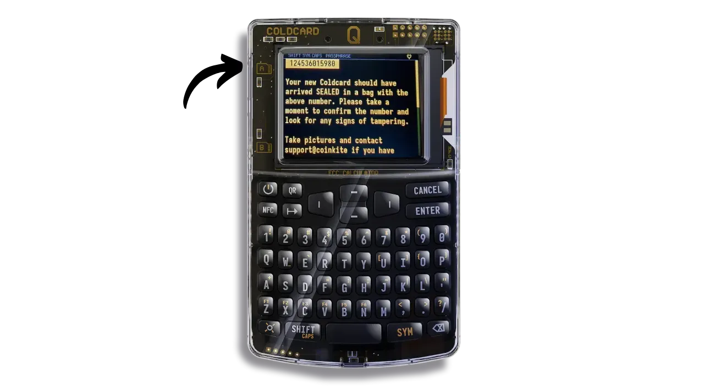

Přejděte do nabídky "*Zvolit kód PIN*" a potvrďte tlačítkem "*ENTER*".

Tento kód PIN slouží k odemknutí karty COLDCARD. Je tedy ochranou proti neoprávněnému fyzickému přístupu. Tento PIN kód se nepodílí na odvození kryptografických klíčů vaší peněženky. Takže i bez přístupu k tomuto kódu PIN vám vlastnictví vaší mnemotechnické fráze umožní znovu získat přístup k vašim bitcoinům.

PIN kódy COLDCARD se dělí na dvě části: předponu a příponu, z nichž každá může obsahovat 2 až 6 číslic, celkem tedy 4 až 12 číslic. Při odemykání karty COLDCARD je třeba nejprve zadat předponu, poté se na zařízení zobrazí 2 slova. Poté zadejte předponu. Tato dvě slova vám budou sdělena během tohoto kroku konfigurace a měli byste si je pečlivě uložit, protože je budete potřebovat při každém odemknutí karty COLDCARD. Pokud se obě slova zobrazená během odemykání shodují se slovy, která jste uložili během konfigurace, potvrdí to, že vaše zařízení nebylo od posledního použití kompromitováno.

Znovu klikněte na "*Vybrat PIN*"

Potvrďte, že jste si přečetli varování.

Nyní zvolíte kód PIN. Doporučujeme dlouhý, náhodný kód PIN. Ujistěte se, že je tento kód uložen na jiném místě, než kde je uložena karta COLDCARD. K zaznamenání tohoto kódu můžete použít kartu dodanou v zásilce.

Zadejte zvolenou předponu a stisknutím tlačítka "*ENTER*" potvrďte první část kódu PIN.

Na obrazovce se poté zobrazí dvě slova proti phishingu. Pečlivě si je uložte pro budoucí použití. K jejich zapsání můžete použít kartičku, která je součástí balení.

Poté zadejte druhou část kódu PIN a stiskněte tlačítko "*ENTER*".

Potvrďte PIN podruhé a zkontrolujte, zda se obě slova proti phishingu shodují s těmi, která jste uložili dříve.

Od této chvíle nezapomeňte při každém odemykání karty COLDCARD zkontrolovat platnost dvou slov proti phishingu, která se zobrazí na obrazovce po zadání předčíslí kódu PIN.

## Aktualizace firmwaru

Při prvním použití zařízení je důležité zkontrolovat a aktualizovat firmware. Za tímto účelem přejděte do nabídky "*Rozšířené/Nástroje*".

**Důležité:** Pokud plánujete aktualizaci firmwaru a nepoužíváte kartu COLDCARD poprvé (tj. máte již na kartě COLDCARD vytvořenou peněženku), ujistěte se, že máte svou mnemotechnickou frázi a že je funkční (případně i volitelnou přístupovou frázi). To je důležité, abyste v případě problému během aktualizace zařízení nepřišli o své bitcoiny.

Vyberte možnost "*Upgrade firmwaru*".

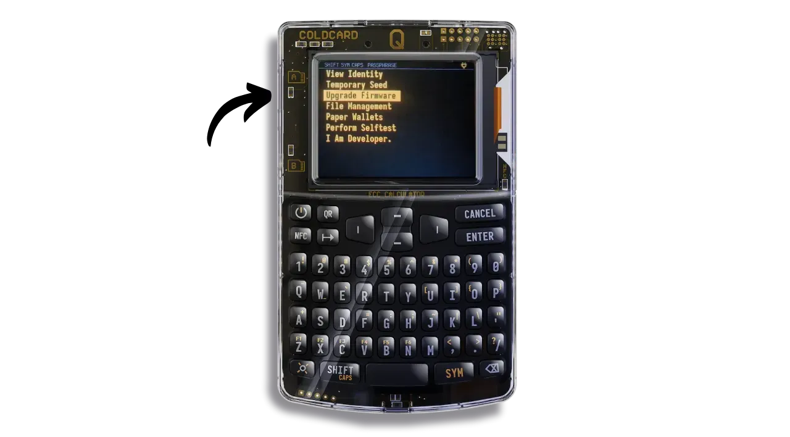

Vyberte možnost "*Zobrazit verzi*".

Můžete zkontrolovat aktuální verzi firmwaru karty COLDCARD. Například v mém případě je verze "*1.2.3Q*".

Zkontrolujte [na oficiálních stránkách COLDCARD](https://coldcard.com/downloads), zda není k dispozici novější verze. Kliknutím na "*Download*" stáhněte nový firmware.

V tomto okamžiku důrazně doporučujeme zkontrolovat integritu a pravost staženého firmwaru. Za tímto účelem stáhněte [dokument obsahující hashe všech verzí podepsaný vývojáři](https://raw.githubusercontent.com/Coldcard/firmware/master/releases/signatures.txt), ověřte podpis pomocí [veřejného klíče vývojáře](https://keybase.io/dochex) a ujistěte se, že hash uvedený v podepsaném dokumentu odpovídá hashi firmwaru staženého z webu. Pokud je vše v pořádku, můžete pokračovat v aktualizaci.

Pokud tento proces ověřování neznáte, doporučuji vám postupovat podle tohoto návodu:

https://planb.network/tutorials/others/general/integrity-authenticity-21d0420a-be02-4663-94a3-8d487f23becc
Vezměte kartu microSD a přeneste na ni soubor firmwaru (dokument ve formátu `.dfu`). Vložte kartu microSD do jednoho z portů karty COLDCARD.

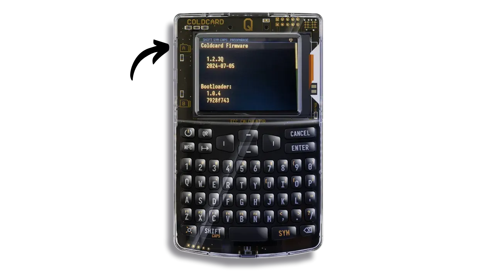

Poté v nabídce aktualizace firmwaru vyberte možnost "*Z MicroSD*".

Vyberte soubor odpovídající firmwaru.

Výběr potvrďte stisknutím tlačítka "*ENTER*".

Počkejte prosím na aktualizaci firmwaru.

Po dokončení aktualizace zadejte kód PIN a odemkněte zařízení.

Váš firmware je nyní aktuální.

## Parametry karty COLDCARD Q

Pokud chcete, můžete si nastavení karty COLDCARD prohlédnout v nabídce "*Nastavení*".

V této nabídce najdete různé možnosti přizpůsobení, například nastavení jasu obrazovky nebo výběr výchozí měrné jednotky.

V dalším tutoriálu se podíváme na další pokročilá nastavení:

https://planb.network/tutorials/wallet/hardware/coldcard-q-advanced-b8cc3f29-eea9-48fe-a953-b003d5b115e0
## Vytvoření peněženky Bitcoin

Nyní je čas vygenerovat novou peněženku Bitcoin! K tomu je třeba vytvořit mnemotechnickou frázi. Na kartě Coldcard máte k dispozici tři způsoby generování této fráze:

- Používejte pouze interní generátor náhodných čísel (TRNG);
- K přidání entropie použijte kombinaci TRNG a hodu kostkou;
- Používejte pouze hody kostkou.

**Začátečníkům a středně pokročilým uživatelům doporučujeme používat pouze interní generátor náhodných čísel karty COLDCARD**

Nedoporučuji variantu pouze s kostkami, protože špatné provedení může vést k rozsudku s nedostatečnou entropií, což ohrožuje bezpečnost vaší peněženky.

Nejlepší je však jistě druhá možnost, která kombinuje použití TRNG s externím zdrojem entropie. Tato metoda zaručuje minimální entropii, která je stejná jako u samotného TRNG, a přidává další úroveň zabezpečení pro případ možného selhání interního generátoru (ať už dobrovolného, nebo ne). Výběrem této možnosti, která kombinuje TRNG a házení kostkou, získáte výhodu větší kontroly nad generováním věty, aniž by se zvýšilo riziko v případě špatného provedení z vaší strany.

Klikněte na "*Nová slova*".

Délku trestu si můžete zvolit sami. Doporučuji zvolit větu o 12 slovech, protože je méně náročná na správu a nenabízí menší bezpečnost portfolia než věta o 24 slovech.

Na kartě COLDCARD se poté zobrazí fráze pro obnovení vygenerovaná pomocí TRNG. Chcete-li přidat další externí entropii, stiskněte klávesu "*4*".

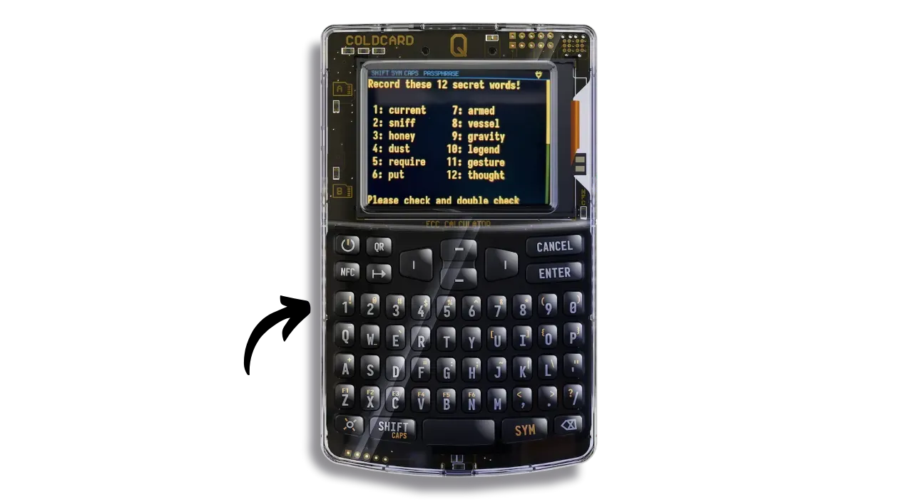

Tím se dostanete na stránku, kde můžete přidat entropii hodem kostkou. Proveďte co nejvíce hodů (doporučuje se minimálně 50, ale méně nevadí, protože již nyní využíváte entropie TRNG) a výsledky zaznamenejte pomocí klíčů "*1*" až "*6*". Po dokončení potvrďte stisknutím tlačítka "*ENTER*".

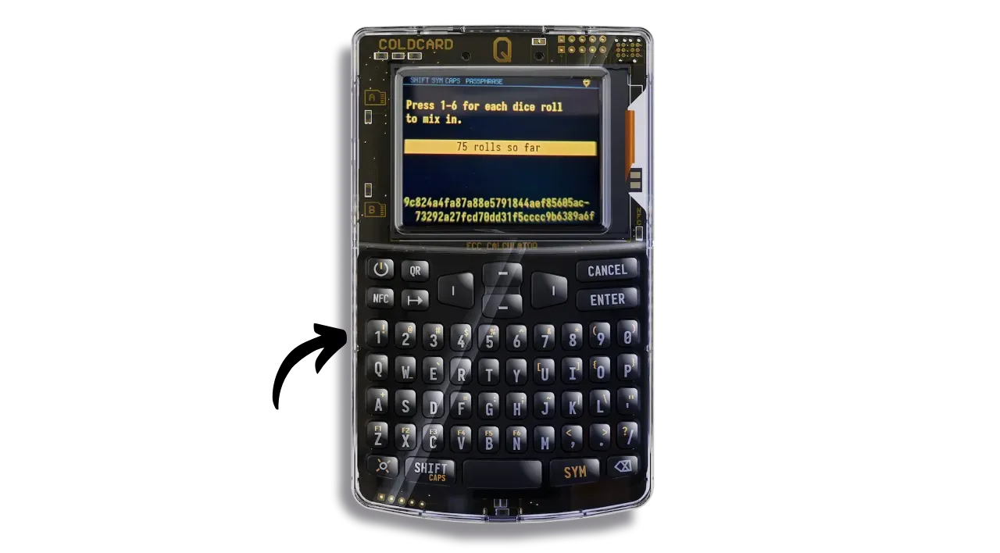

Na základě právě zadané entropie a entropie TRNG se zobrazí nová mnemotechnická fráze.

**Upozornění: Tato mnemotechnická pomůcka poskytuje plný a neomezený přístup ke všem vašim bitcoinům**. Kdokoli, kdo má tuto frázi, může ukrást vaše prostředky, a to i bez fyzického přístupu k vaší kartě COLDCARD. Tato fráze o 12 slovech obnovuje přístup k vašim bitcoinům v případě ztráty, krádeže nebo rozbití karty COLDCARD. Je proto velmi důležité ji pečlivě uložit a uchovávat na bezpečném místě.

Můžete si ji zapsat na karton dodaný s kartou COLDCARD nebo ji pro větší bezpečnost doporučuji vyrýt na podložku z nerezové oceli, která ji ochrání před nebezpečím požáru, povodně nebo zřícení. V žádném případě jej nikdy neukládejte na digitální médium, jinak byste mohli o své bitcoiny přijít.

Zapište slova uvedená na obrazovce na vybrané fyzické médium. V závislosti na vaší bezpečnostní strategii můžete zvážit vytvoření několika úplných fyzických kopií věty (především ji však nerozdělujte). Je důležité, aby byla slova očíslována a řazena za sebou.

Je zřejmé, že tato slova **nesmíte nikdy sdílet** na internetu, na rozdíl od tohoto návodu. Toto ukázkové portfolio bude použito pouze na Testnetu a po skončení výukového kurzu bude smazáno.

Po zapsání slov stiskněte tlačítko "*ENTER*".

Abyste se ujistili, že jste frázi uložili správně, systém vás požádá o potvrzení určitých slov. Na klávesnici vyberte číslo odpovídající každému slovu.

Vaše peněženka je nyní vytvořena! V pravém horním rohu obrazovky vidíte otisk svého hlavního soukromého klíče. Stiskněte tlačítko "*ENTER*".

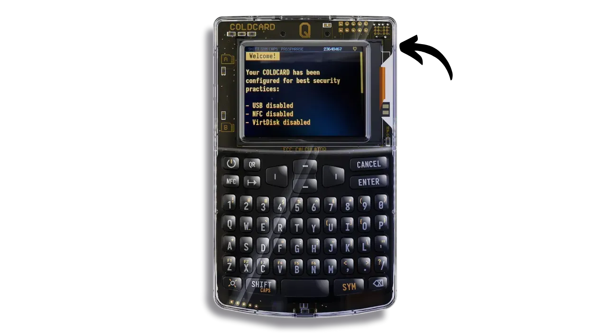

Nyní máte přístup do hlavní nabídky karty COLDCARD.

## Nastavení nového portfolia v aplikaci Sparrow

Existuje několik možností, jak navázat komunikaci mezi softwarem Sparrow Wallet a kartou COLDCARD. Nejjednodušší je použít kabel USB-C. Ve výchozím nastavení je však karta COLDCARD vybavena zakázanou komunikací přes kabel a NFC. Chcete-li je znovu aktivovat, přejděte do nabídky "*Nastavení*", poté do nabídky "*Zapnutí/vypnutí hardwaru*" a aktivujte požadovanou možnost komunikace.

Pokud chcete mít kartu COLDCARD zcela oddělenou od počítače, můžete zvolit nepřímou komunikaci "vzduchovou mezerou" pomocí kódů QR nebo karty microSD. Tuto metodu budeme používat v tomto návodu.

Přejděte na "*Rozšířené/Nástroje*".

Vyberte možnost "*Exportovat peněženku*".

Poté vyberte možnost "*Sparrow Wallet*".

Stisknutím tlačítka "*ENTER*" vygenerujete konfigurační soubor.

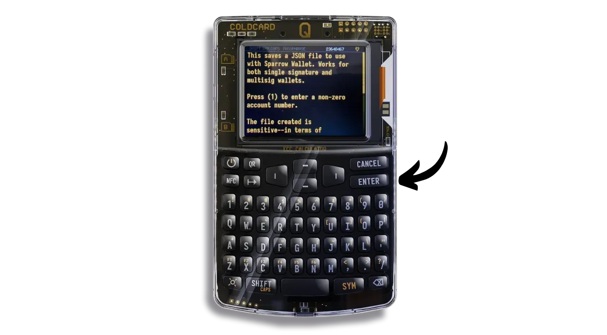

Poté vyberte, jak tento soubor do Sparrow odeslat. V tomto příkladu jsem vložil kartu microSD do slotu "*A*", takže vyberu tlačítko "*1*". Informace můžete také zobrazit jako QR kód na obrazovce karty COLDCARD stisknutím tlačítka "*QR*" a naskenováním tohoto QR kódu pomocí webové kamery počítače.

Spusťte aplikaci Sparrow Wallet a přeskočte úvodní stránky, abyste se dostali na hlavní obrazovku. Zkontrolováním přepínače v pravém dolním rohu obrazovky se ujistěte, že jste správně připojeni k uzlu.

Důrazně doporučujeme používat vlastní uzel Bitcoin. Pro tento návod používám veřejný uzel (žlutý), protože jsem na testnetu, ale pro produkční použití je nejlepší používat lokální Bitcoin Core (zelený) nebo server Electrum na vzdáleném uzlu (modrý).

Přejděte do nabídky "*Soubor*" a vyberte možnost "*Nová peněženka*".

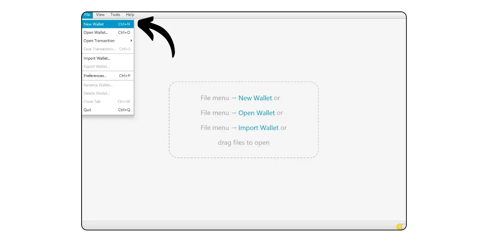

Pojmenujte svou peněženku a klikněte na "*Vytvořit peněženku*".

V rozevírací nabídce "*Typ skriptu*" vyberte typ skriptu, který zabezpečí vaše bitcoiny.

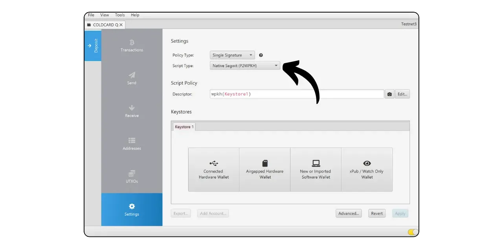

Klikněte na "*Airgapped Hardware Wallet*".

Na kartě "*Coldcard*" klikněte na "*Scan...*", pokud chcete naskenovat QR kód zobrazený na kartě COLDCARD, nebo na "*Import File...*" pro import souboru z microSD (jedná se o soubor `.json`).

Po importu zkontrolujte, zda se "*Master fingerprint*" zobrazený v aplikaci Sparrow shoduje s otiskem zobrazeným na kartě COLDCARD. Potvrďte vytvoření kliknutím na "*Apply*".

Nastavte si silné heslo pro zabezpečení přístupu do peněženky Sparrow. Toto heslo ochrání vaše veřejné klíče, adresy, značky a historii transakcí před neoprávněným přístupem.

Toto heslo je dobré uložit, abyste ho nezapomněli (např. ve správci hesel).

Vaše peněženka je nyní nastavena na Sparrow Wallet.

Než obdržíte své první bitcoiny do peněženky, **důrazně doporučuji provést test obnovy prázdné peněženky**. Zapište si nějaké referenční informace, například svůj xpub, a poté resetujte kartu COLDCARD Q, když je peněženka stále prázdná. Poté zkuste obnovit peněženku na kartě COLDCARD pomocí papírových záloh. Zkontrolujte, zda se xpub vygenerovaný po obnovení shoduje s tím, který jste si původně zapsali. Pokud ano, můžete si být jisti, že vaše papírové zálohy jsou spolehlivé.

Chcete-li se dozvědět více o tom, jak provést test obnovení, doporučuji vám prostudovat tento další návod:

https://planb.network/tutorials/wallet/backup/recovery-test-5a75db51-a6a1-4338-a02a-164a8d91b895
## Přijímání bitcoinů

Chcete-li získat své první bitcoiny, začněte zapnutím a odemknutím karty COLDCARD.

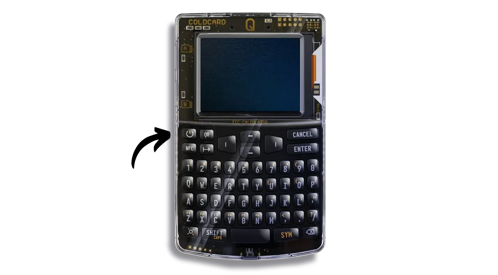

V aplikaci Sparrow Wallet klikněte na kartu "*Příjem*".

Před použitím adresy navržené aplikací Sparrow Wallet ji zkontrolujte na obrazovce COLDCARD. Tento postup vám umožní ověřit si, že adresa zobrazená na Sparrow není podvodná a že hardwarová peněženka skutečně obsahuje soukromý klíč potřebný k následnému utracení bitcoinů zajištěných touto adresou. Tím se vyhnete několika typům útoků.

Tuto kontrolu provedete kliknutím na nabídku "*Address Explorer*" na kartě COLDCARD.

Vyberte typ skriptu, který používáte ve Sparrow. V mém případě je to Segwit P2WPKH. Kliknu na něj.

Poté si můžete zobrazit různé odvozené adresy v pořadí.

Zkontrolujte, zda se adresa shoduje s adresou Sparrow. V mém případě je adresa s odvozovací cestou `m/84'/1'/0'/0/0` skutečně `tb1qwfwwvzssep4wyjg3vsgezmwa037ehvd4fhmjvr` ve Sparrow i COLDCARD.

Dalším způsobem, jak ověřit vlastnictví této adresy, je naskenovat její QR kód přímo do aplikace Sparrow z karty COLDCARD. Na domovské obrazovce karty COLDCARD vyberte možnost "*Scan Any QR Code*". Můžete také použít klávesu "*QR*" na klávesnici.

Naskenujte QR kód adresy zobrazené v aplikaci Sparrow Wallet.

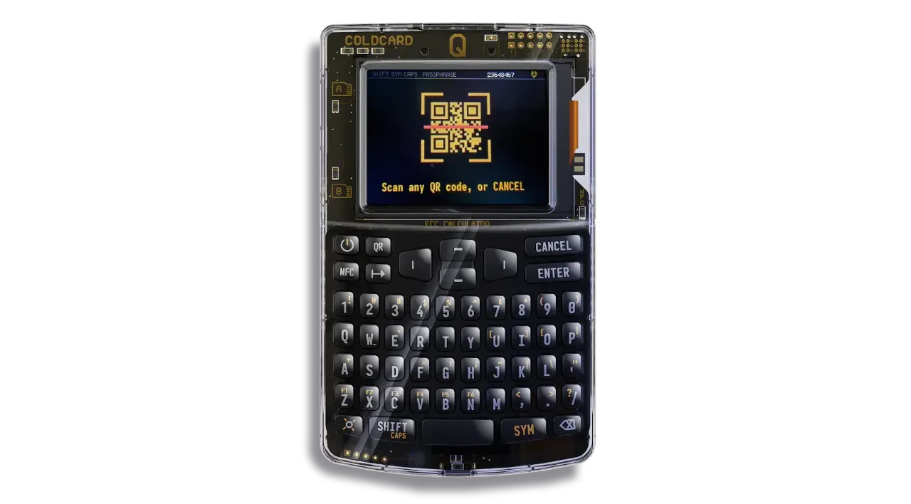

Ujistěte se, že adresa zobrazená na kartě COLDCARD odpovídá adrese uvedené v aplikaci Sparrow. Poté stiskněte tlačítko "*1*".

Adresa je tedy úspěšně potvrzena.

Nyní můžete přidat "*Label*" pro popis zdroje bitcoinů, které budou touto adresou zabezpečeny. Jedná se o dobrý postup, který vám umožní lépe spravovat UTXO.

Pro více informací o označování doporučuji také tento další návod:

https://planb.network/tutorials/privacy/on-chain/utxo-labelling-d997f80f-8a96-45b5-8a4e-a3e1b7788c52
Tuto adresu pak můžete použít k přijímání bitcoinů.

## Odeslat bitcoiny

Nyní, když jste obdrželi své první saty do peněženky zabezpečené kartou COLDCARD, můžete je také utratit!

Jako vždy začněte zapnutím a odemknutím karty COLDCARD Q, poté otevřete aplikaci Sparrow Wallet a přejděte na kartu "*Odeslat*", kde připravíte novou transakci.

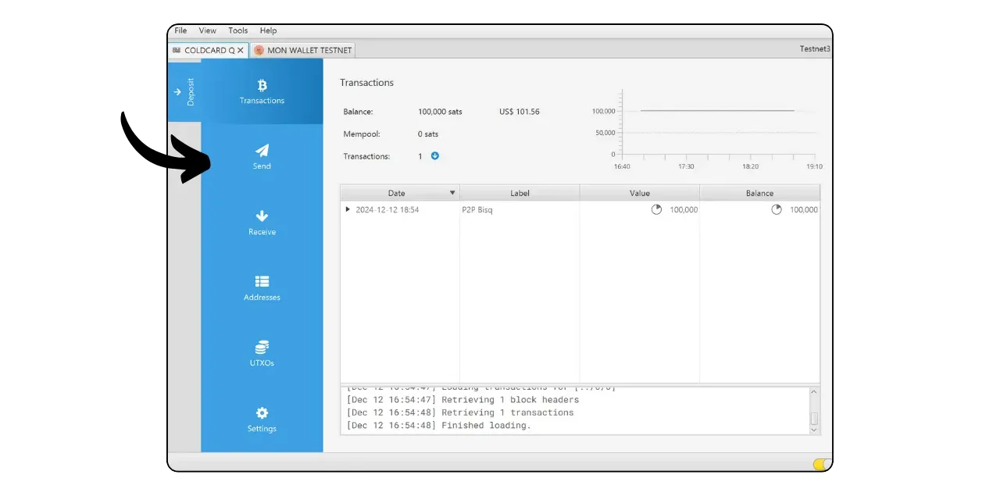

Pokud chcete "ovládat mince", tj. vybrat konkrétně, které UTXO se mají v transakci spotřebovat, přejděte na kartu "*UTXO*". Vyberte UTXO, které si přejete utratit, a poté klikněte na tlačítko "*Odeslat vybrané*". Budete přesměrováni na stejnou obrazovku v záložce "*Odeslat*", ale s již vybranými UTXO pro transakci.

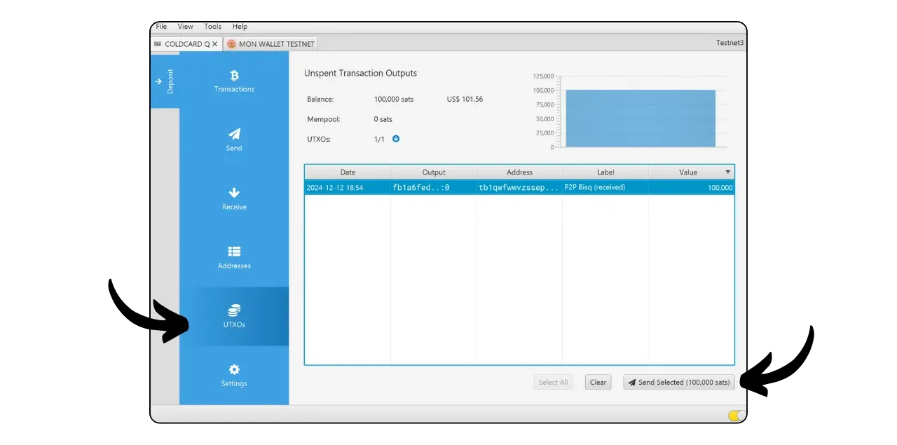

Zadejte cílovou adresu. Kliknutím na tlačítko "*+ Přidat*" můžete zadat i více adres.

Napište si "*název*", abyste si zapamatovali účel tohoto výdaje.

Vyberte částku, která má být na tuto adresu zaslána.

Upravte sazbu poplatků za transakci podle aktuálního trhu.

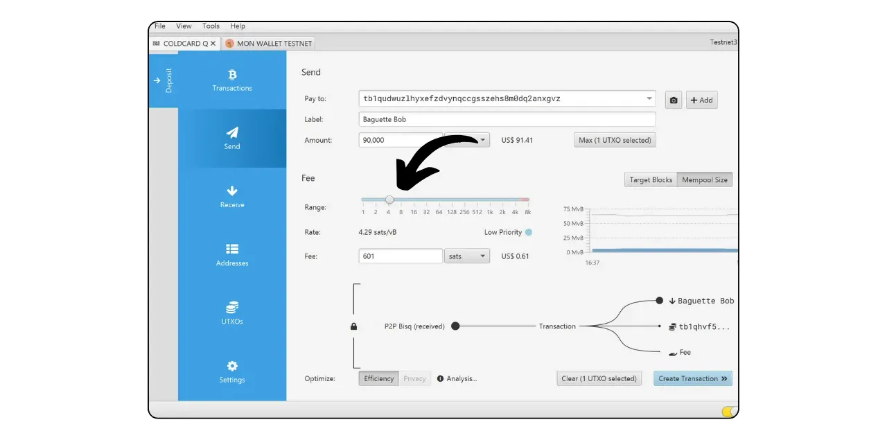

Ujistěte se, že jsou všechny parametry transakce správné, a klikněte na tlačítko "*Vytvořit transakci*".

Pokud vám vše vyhovuje, klikněte na "*Finalizovat transakci pro podpis*".

Po vytvoření transakce v aplikaci Sparrow je třeba ji podepsat pomocí karty COLDCARD. Pro přenos PSBT (nepodepsané transakce) do zařízení máte několik možností. Pokud je povolen drátový přenos dat, můžete transakci odeslat přímo prostřednictvím připojení USB-C, stejně jako v případě jakékoli jiné hardwarové peněženky. V tomto případě byste na Sparrow museli kliknout na tlačítko "*Podepsat*" v pravém dolním rohu. V mém příkladu je toto tlačítko zablokováno, protože karta COLDCARD není připojena kabelem.

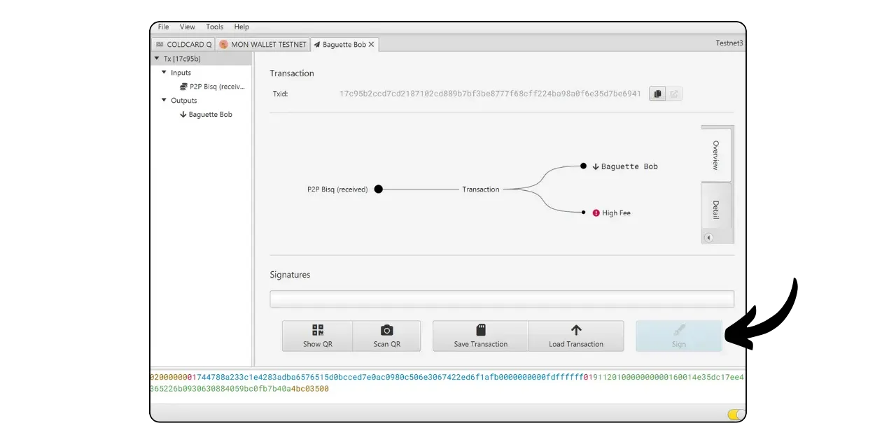

Pokud dáváte přednost připojení "vzduchovou mezerou" bez přímého kontaktu mezi hardwarovou peněženkou a počítačem, máte dvě možnosti. První a složitější možností je použití karty microSD. Vložte kartu microSD do počítače, zaznamenejte transakci pomocí tlačítka "*Uložit transakci*" na Sparrow a poté tuto kartu přeneste do portu na kartě COLDCARD.

Poté přejděte do nabídky "*Připraveno k podpisu*".

Zkontrolujte údaje o transakci na kartě COLDCARD, včetně adresy příjemce, odeslané částky a poplatku za transakci.

Pokud je vše v pořádku, podepište transakci stisknutím tlačítka "*ENTER*".

Poté vložte kartu microSD zpět do počítače a v aplikaci Sparrow klikněte na "*Načíst transakci*", abyste načetli podepsanou transakci z karty microSD. Poté budete moci provést závěrečnou kontrolu před nahráním do sítě Bitcoin.

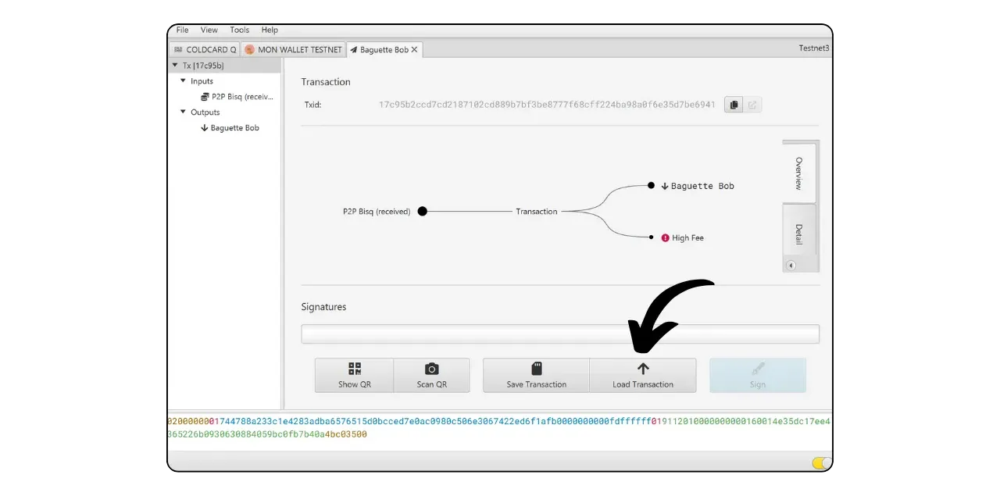

Druhý způsob podepisování pomocí karty COLDCARD v aplikaci Air-Gap, který je mnohem jednodušší než metoda microSD, spočívá v přímém skenování karty PSBT pomocí fotoaparátu zařízení. V aplikaci Sparrow vyberte možnost "*Show QR*".

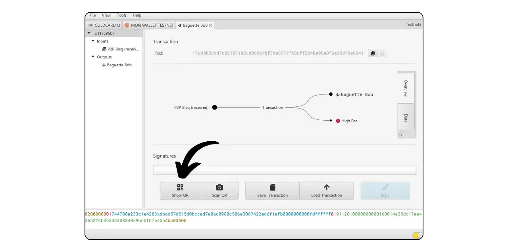

Na kartě COLDCARD vyberte možnost "*Scan Any QR Code*". Můžete také použít klávesu "*QR*" na klávesnici.

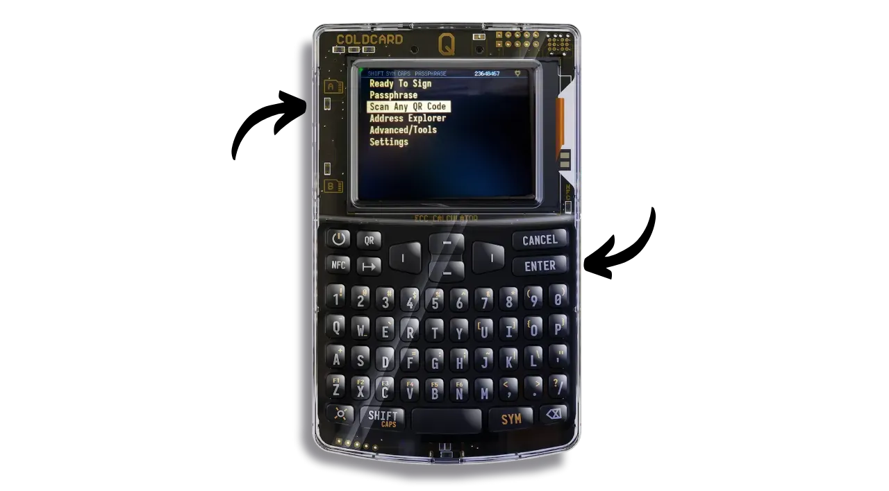

Pomocí fotoaparátu karty COLDCARD naskenujte kód QR zobrazený na obrazovce Sparrow.

Údaje o transakci se znovu zobrazí pro ověření. Stiskněte tlačítko "*ENTER*" a podepište, zda je vše k vaší spokojenosti.

Karta COLDCARD pak zobrazí podepsanou transakci jako kód QR. Tento QR kód naskenujte pomocí webové kamery počítače výběrem možnosti "*Scan QR*" na Sparrow.

Vaše podepsaná transakce je nyní viditelná v aplikaci Sparrow. Naposledy zkontrolujte, zda je vše v pořádku, a pak klikněte na "*Broadcast Transaction*" pro její odvysílání v síti Bitcoin.

Své transakce můžete sledovat na kartě "*Transakce*" ve Sparrow Wallet.

Blahopřejeme, nyní jste se seznámili se základním používáním karty COLDCARD Q se Sparrow Wallet!

Pokud pro vás byl tento návod užitečný, budu vám vděčný, když mi níže zanecháte zelený palec. Neváhejte prosím sdílet tento návod na svých sociálních sítích. Moc vám děkuji!

Doporučuji vám také podívat se na tento další tutoriál, ve kterém se zabýváme pokročilými možnostmi karty COLDCARD Q :

https://planb.network/tutorials/wallet/hardware/coldcard-q-advanced-b8cc3f29-eea9-48fe-a953-b003d5b115e0