Uma carteira de hardware é um dispositivo eletrónico dedicado à gestão e segurança das chaves privadas de uma carteira Bitcoin. Ao contrário das carteiras de software (ou hot wallets) instaladas em máquinas de uso geral frequentemente conectadas à Internet, as carteiras de hardware permitem que as chaves privadas sejam fisicamente isoladas, reduzindo o risco de pirataria e roubo.

O principal objetivo de uma carteira de hardware é reduzir ao máximo a funcionalidade do dispositivo, de modo a minimizar a sua superfície de ataque. Uma menor superfície de ataque também significa menos potenciais vectores de ataque, ou seja, menos pontos fracos no sistema que os atacantes poderiam explorar para obter acesso a bitcoins.

É aconselhável utilizar uma carteira de hardware para proteger os seus bitcoins, especialmente se detiver grandes quantidades, quer em valor absoluto quer em proporção do total dos seus activos.

As carteiras de hardware são utilizadas em conjunto com um software de gestão de carteiras num computador ou smartphone. Este último gere a criação de transacções, mas a assinatura criptográfica necessária para tornar estas transacções válidas é realizada exclusivamente dentro da carteira de hardware. Isto significa que as chaves privadas nunca são expostas a um ambiente potencialmente vulnerável.

As carteiras de hardware oferecem uma dupla proteção ao utilizador: por um lado, protegem os seus bitcoins contra ataques remotos, mantendo as chaves privadas offline e, por outro, oferecem geralmente uma maior resistência física às tentativas de extração das chaves. E é precisamente com base nestes dois critérios de segurança que podemos avaliar e classificar os diferentes modelos existentes no mercado.

Neste tutorial, gostaria de vos apresentar uma dessas soluções: o **COLDCARD Q**.

---
Como o COLDCARD Q oferece uma multiplicidade de funções, proponho dividir a sua utilização em 2 tutoriais. Neste primeiro tutorial, veremos a configuração inicial e as funções básicas do dispositivo. Depois, num segundo tutorial, veremos como tirar partido de todas as opções avançadas do seu COLDCARD.

https://planb.network/tutorials/wallet/hardware/coldcard-q-advanced-b8cc3f29-eea9-48fe-a953-b003d5b115e0
---
## Apresentação do COLDCARD Q

A COLDCARD Q é uma carteira de hardware exclusiva para Bitcoin desenvolvida pela empresa canadiana Coinkite, conhecida pelos seus anteriores modelos MK. O Q representa o seu produto mais avançado até à data e está posicionado como a derradeira carteira de hardware Bitcoin.

Em termos de hardware, o COLDCARD Q está equipado com todas as caraterísticas necessárias para uma experiência de utilização óptima:

- Um grande ecrã LCD simplifica a navegação e o funcionamento;
- Um teclado QWERTY completo;
- Câmara integrada para leitura de códigos QR;
- Duas ranhuras para cartões microSD ;
- Uma opção de alimentação totalmente isolada através de três pilhas AAA (não incluídas) ou através de um cabo USB-C ;
- Dois Secure Elements de dois fabricantes diferentes para maior segurança;
- A capacidade de comunicar através de NFC.

Na minha opinião, o COLDCARD Q tem apenas dois inconvenientes. Em primeiro lugar, devido às suas muitas funcionalidades, é bastante volumoso, medindo quase 13 cm de comprimento e 8 cm de largura, o que é quase o tamanho de um pequeno smartphone. Também é bastante espesso devido ao compartimento da bateria. Se procura uma carteira de hardware mais pequena e móvel, o MK4, muito mais compacto, pode ser uma melhor opção. A segunda desvantagem é obviamente o custo do dispositivo, que tem um preço de **$239,99** no site oficial, ou seja, mais $72 do que a MK4, o que coloca a Q em concorrência direta com carteiras de hardware de qualidade superior, como a Ledger Flex ou a Foundation's Passport.

No que respeita ao software, o COLDCARD Q está tão bem equipado como os outros dispositivos da Coinkite, com uma série de funcionalidades avançadas:

- Lance os dados para criar a sua própria frase de recuperação ;
- Código PIN ;
- Contagem decrescente para o bloqueio final do PIN ;
- BIP39 passphrase ;
- PIN de bloqueio final ;
- Contagem decrescente da ligação ;
- SeedXOR;
- BIP85...

Em suma, o COLDCARD Q oferece uma experiência de utilização melhorada em relação ao MK4 e pode ser ideal para utilizadores intermédios a avançados que procuram uma maior facilidade de utilização.

O COLDCARD Q está disponível para venda [no sítio Web oficial da Coinkite] (https://store.coinkite.com/store/coldcard). Também pode ser adquirido num retalhista.

## Preparar o tutorial

Depois de receber o seu COLDCARD, o primeiro passo é inspecionar a embalagem para se certificar de que não foi aberta. Se a embalagem estiver danificada, isso pode indicar que a carteira de hardware foi comprometida e pode não ser genuína.

Quando abrir a caixa, deverá encontrar os seguintes itens:

- O COLDCARD Q num saco selado;
- Um cartão para registar a sua frase mnemónica.

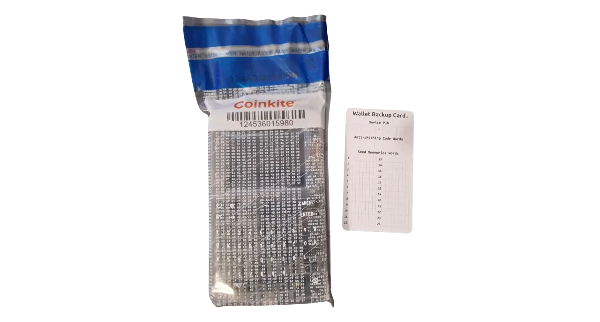

Certifique-se de que o saco não foi aberto ou danificado. Verifique também se o número no seu saco corresponde ao número no papel dentro do saco. Guarde este número para referência futura.

Se preferir alimentar o seu COLDCARD sem o ligar a um computador (air-gap), insira três pilhas AAA na parte de trás do dispositivo. Em alternativa, pode ligá-lo ao seu computador através de um cabo USB-C.

Para este tutorial, também vai precisar da Sparrow Wallet para gerir a sua carteira Bitcoin no seu computador. Descarregue a [Sparrow Wallet] (https://sparrowwallet.com/download/) a partir do site oficial. Aconselho-o vivamente a verificar a sua autenticidade (com GnuPG) e integridade (via hash) antes de prosseguir com a instalação. Se não sabe como o fazer, siga este tutorial:

https://planb.network/tutorials/others/general/integrity-authenticity-21d0420a-be02-4663-94a3-8d487f23becc
## Seleção do código PIN

Pode agora ligar o seu COLDCARD premindo o botão no canto superior esquerdo.

Prima o botão "*ENTER*" para aceitar as condições de utilização.

O seu COLDCARD Q apresentará então um número na parte superior do ecrã. Certifique-se de que este número corresponde ao número que se encontra no saco selado e no pedaço de plástico que se encontra no interior do saco. Isto garante que a sua embalagem não foi aberta entre o momento em que foi embalada pela Coinkite e o momento em que a abriu. Prima "*ENTER*" para continuar.

Navegar até ao menu "*Escolher código PIN*" e confirmar com a tecla "*ENTER*".

Este código PIN é utilizado para desbloquear o seu COLDCARD. Trata-se, portanto, de uma proteção contra o acesso físico não autorizado. Este código PIN não está envolvido na derivação das chaves criptográficas da sua carteira. Assim, mesmo sem acesso a este código PIN, a posse da sua frase mnemónica permitir-lhe-á recuperar o acesso aos seus bitcoins.

Os códigos PIN COLDCARD dividem-se em duas partes: um prefixo e um sufixo, cada um dos quais pode conter entre 2 e 6 dígitos, num total de 4 a 12 dígitos. Quando desbloqueia o seu COLDCARD, tem de introduzir primeiro o prefixo, após o que o aparelho lhe mostrará 2 palavras. De seguida, introduza o sufixo. Estas duas palavras ser-lhe-ão fornecidas durante esta etapa de configuração e devem ser guardadas com cuidado, uma vez que irá precisar delas sempre que desbloquear o seu COLDCARD. Se as duas palavras apresentadas durante o desbloqueio corresponderem às que guardou durante a configuração, isso confirmará que o seu dispositivo não foi comprometido desde a sua última utilização.

Clique novamente em "*Escolher PIN*"

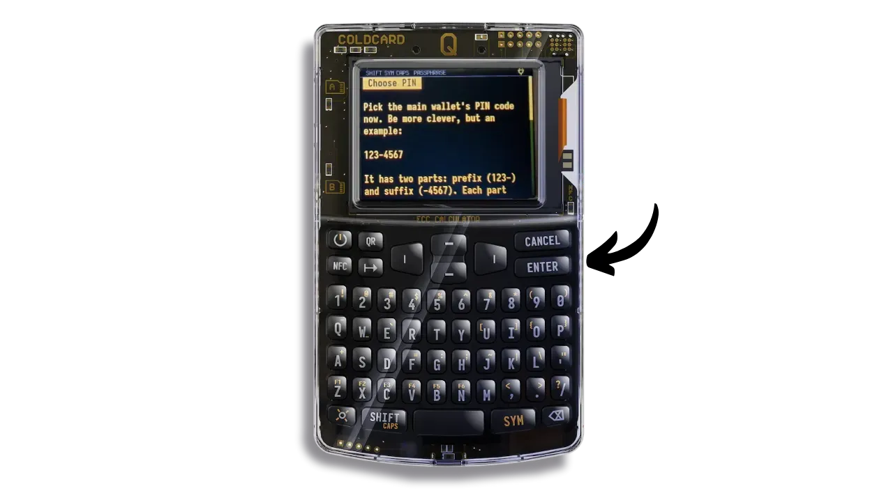

Confirmar que leu as advertências.

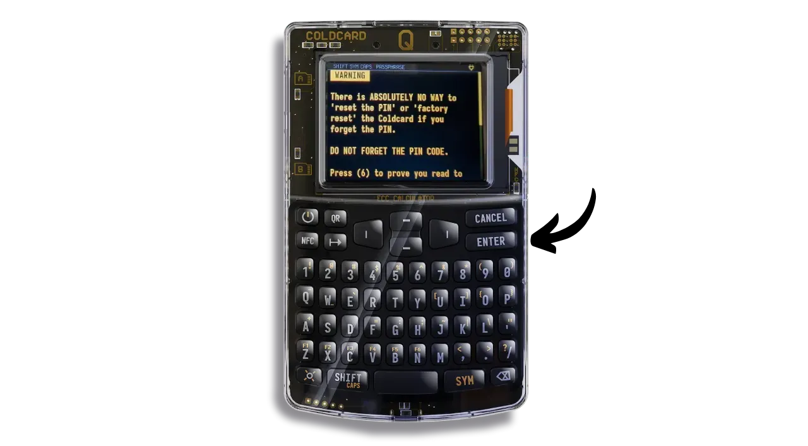

Agora vai escolher o seu código PIN. Recomendamos um código PIN longo e aleatório. Certifica-te de que guardas este código num local diferente daquele onde está guardado o teu COLDCARD. Pode utilizar o cartão fornecido na sua encomenda para registar este código.

Introduzir o prefixo escolhido e, em seguida, premir a tecla "*ENTER*" para confirmar a primeira parte do código PIN.

As duas palavras anti-phishing serão então apresentadas no seu ecrã. Guarde-as cuidadosamente para referência futura. Pode utilizar o cartão incluído no seu pacote para as anotar.

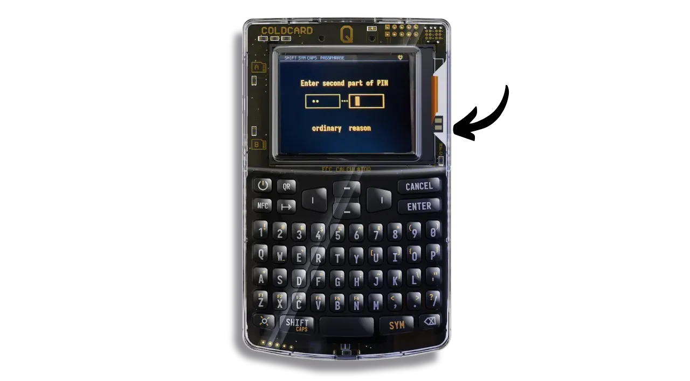

Em seguida, introduza a segunda parte do seu código PIN e prima "*ENTER*".

Confirme o seu PIN introduzindo-o uma segunda vez, verificando se as duas palavras anti-phishing correspondem às que guardou anteriormente.

A partir de agora, sempre que desbloquear o seu COLDCARD, lembre-se de verificar a validade das duas palavras anti-phishing que aparecem no ecrã depois de introduzir o prefixo do seu código PIN.

## Atualização do firmware

Quando utilizar o seu aparelho pela primeira vez, é importante verificar e atualizar o firmware. Para o fazer, aceda ao menu "*Avançado/Ferramentas*".

**Importante:** Se está a planear atualizar o seu firmware e não é a primeira vez que utiliza COLDCARD (ou seja, se já tem uma carteira criada em COLDCARD), certifique-se de que tem a sua frase mnemónica e que esta está funcional (bem como a frase-passe opcional, se aplicável). Isto é importante para evitar perder os seus bitcoins no caso de um problema durante a atualização do dispositivo.

Selecione "*Upgrade Firmware*".

Selecionar "*Mostrar versão*".

Pode verificar a versão atual do firmware da sua COLDCARD. Por exemplo, no meu caso, a versão é "*1.2.3Q*".

Verifique [no sítio Web oficial do COLDCARD] (https://coldcard.com/downloads) para ver se está disponível uma versão mais recente. Clique em "*Download*" para descarregar o novo firmware.

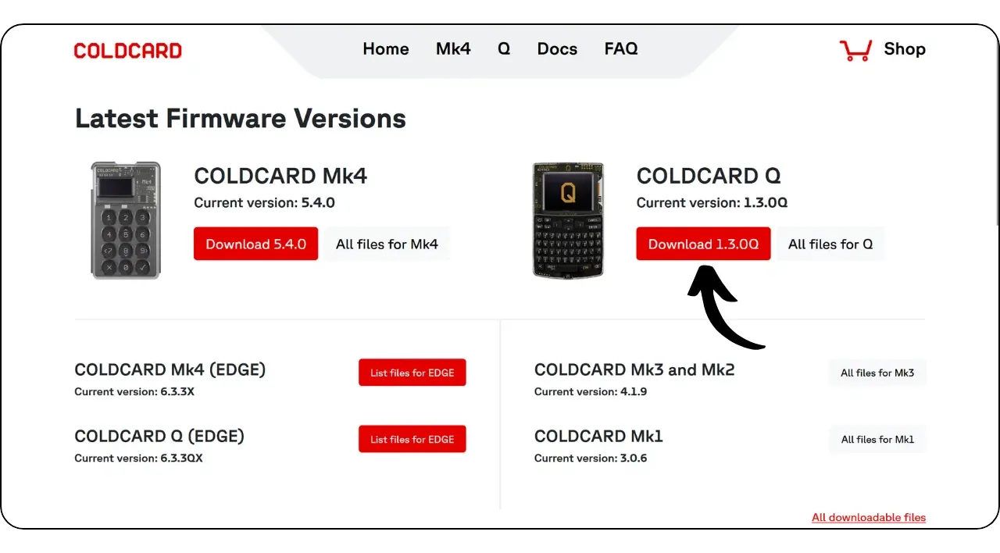

Neste ponto, recomendamos vivamente que verifique a integridade e autenticidade do firmware descarregado. Para tal, descarregue [o documento que contém os hashes de todas as versões, assinado pelos programadores] (https://raw.githubusercontent.com/Coldcard/firmware/master/releases/signatures.txt), verifique a assinatura com [a chave pública do programador] (https://keybase.io/dochex) e certifique-se de que o hash indicado no documento assinado corresponde ao do firmware descarregado do sítio. Se tudo estiver correto, pode prosseguir com a atualização.

Se não estiver familiarizado com este processo de verificação, recomendo que siga este tutorial:

https://planb.network/tutorials/others/general/integrity-authenticity-21d0420a-be02-4663-94a3-8d487f23becc
Pegue num cartão microSD e transfira para ele o ficheiro de firmware (documento em `.dfu`). Insira o cartão microSD numa das portas do seu COLDCARD.

Em seguida, no menu de atualização do firmware, selecione "*Do MicroSD*".

Selecionar o ficheiro correspondente ao firmware.

Confirme a sua seleção premindo o botão "*ENTER*".

Aguarde enquanto o firmware é atualizado.

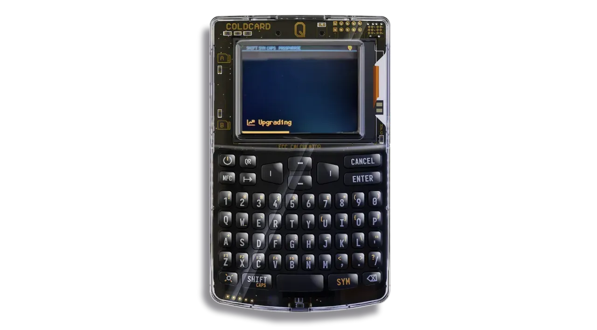

Quando a atualização estiver concluída, introduza o seu código PIN para desbloquear o dispositivo.

O seu firmware está agora atualizado.

## Parâmetros COLDCARD Q

Se desejar, pode explorar as definições do seu COLDCARD acedendo ao menu "*Definições*".

Neste menu, encontrará várias opções de personalização, como a definição do brilho do ecrã ou a seleção da unidade de medida predefinida.

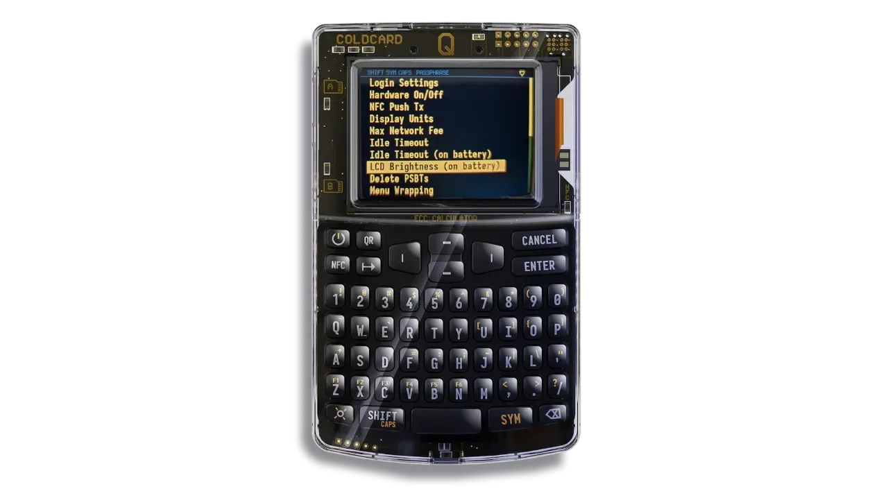

Veremos outras definições avançadas no próximo tutorial:

https://planb.network/tutorials/wallet/hardware/coldcard-q-advanced-b8cc3f29-eea9-48fe-a953-b003d5b115e0
## Criar uma carteira Bitcoin

Agora é hora de gerar uma nova carteira Bitcoin! Para isso, é necessário criar uma frase mnemónica. Na Coldcard, existem três métodos para gerar esta frase:

- Utilizar apenas o gerador interno de números aleatórios (TRNG);
- Utilize uma combinação de TRNG e lançamento de dados para adicionar entropia;
- Utilizar apenas os dados.

**Para os utilizadores principiantes e intermédios, recomendamos que utilizem apenas o gerador de números aleatórios interno do COLDCARD**

Não recomendo a opção de usar apenas dados, pois uma má execução pode levar a uma sentença com entropia insuficiente, pondo em risco a segurança da sua carteira.

No entanto, a melhor opção é certamente a segunda, que combina a utilização do TRNG com uma fonte de entropia externa. Este método garante uma entropia mínima equivalente à do TRNG sozinho, e acrescenta um nível extra de segurança no caso de uma eventual falha do gerador interno (voluntária ou não). Ao escolher esta opção, que combina TRNG e lançamento de dados, beneficia de um maior controlo sobre a geração da frase, sem aumentar os riscos em caso de má execução da sua parte.

Clique em "*Novas palavras-semente*".

Pode escolher o comprimento da sua frase. Recomendo que opte por uma frase de 12 palavras, pois é menos complexa de gerir e não oferece menos segurança de carteira do que uma frase de 24 palavras.

A COLDCARD apresentará então a frase de recuperação gerada pelo TRNG. Se desejar acrescentar entropia externa adicional, prima a tecla "*4*".

Isto levá-lo-á a uma página onde pode adicionar entropia lançando os dados. Faça o maior número de lançamentos possível (recomenda-se um mínimo de 50, mas menos não é um grande problema, pois já está a beneficiar da entropia do TRNG) e registe os resultados com as teclas "*1*" a "*6*". Quando terminar, prima "*ENTER*" para confirmar.

Será apresentada uma nova frase mnemónica, baseada na entropia que acabou de fornecer e na do TRNG.

**Aviso: Esta mnemónica dá acesso total e irrestrito a todos os seus bitcoins**. Qualquer pessoa na posse desta frase pode roubar os teus fundos, mesmo sem acesso físico ao teu COLDCARD. A frase de 12 palavras restaura o acesso aos teus bitcoins em caso de perda, roubo ou quebra do teu COLDCARD. Por isso, é muito importante guardá-la cuidadosamente e guardá-la num local seguro.

Pode escrevê-lo no cartão fornecido com o seu COLDCARD ou, para maior segurança, recomendo que o grave num suporte de aço inoxidável para o proteger do risco de incêndio, inundação ou desmoronamento. Em qualquer caso, nunca o guarde num suporte digital, caso contrário poderá perder os seus bitcoins.

Escreva as palavras apresentadas no ecrã no suporte físico da sua escolha. Dependendo da sua estratégia de segurança, pode considerar fazer várias cópias físicas completas da frase (mas, acima de tudo, não a divida). É importante manter as palavras numeradas e em ordem sequencial.

Obviamente, **nunca deve partilhar estas palavras** na Internet, ao contrário do que acontece neste tutorial. Este exemplo de portefólio será utilizado apenas na Testnet e será apagado no final do tutorial.

Depois de escrever as palavras, prima "*ENTER*".

Para se certificar de que guardou corretamente a sua frase, o sistema pede-lhe que confirme algumas palavras. Selecione no teclado o número correspondente a cada palavra.

A sua carteira está agora criada! No canto superior direito do ecrã, pode ver a impressão digital da sua chave mestra privada. Prima "*ENTER*".

Acede agora ao menu principal do seu COLDCARD.

## Criar uma nova carteira no Sparrow

Existem várias opções para estabelecer a comunicação entre o software Sparrow Wallet e o seu COLDCARD. A mais simples é usar um cabo USB-C. No entanto, por defeito, o COLDCARD tem as comunicações por cabo e NFC desactivadas. Para as reativar, vá a "*Configurações*", depois a "*Hardware On/Off*" e active a opção de comunicação desejada.

Se preferir manter o seu COLDCARD totalmente isolado do seu computador, pode optar por uma comunicação indireta "air-gap", utilizando códigos QR ou um cartão microSD. É este o método que vamos utilizar neste tutorial.

Aceder a "*Avançado/Ferramentas*".

Selecione "*Exportar carteira*".

Em seguida, selecione "*Sparrow Wallet*".

Premir "*ENTER*" para gerar o ficheiro de configuração.

Em seguida, escolha como enviar este ficheiro para o Sparrow. Neste exemplo, inseri um microSD na ranhura "*A*", por isso selecciono o botão "*1*". Também pode apresentar a informação como um código QR no ecrã do seu COLDCARD, premindo o botão "*QR*", e digitalizar este código QR com a webcam do seu computador.

Inicie a Sparrow Wallet e salte as páginas introdutórias para chegar ao ecrã principal. Certifique-se de que está corretamente ligado a um nó, verificando o interrutor no canto inferior direito do ecrã.

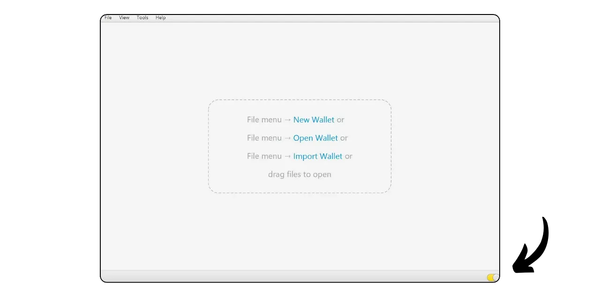

É altamente recomendável que você use seu próprio nó Bitcoin. Para este tutorial, estou a usar um nó público (amarelo), pois estou na testnet, mas para uso em produção, é melhor usar o Bitcoin Core localmente (verde) ou um servidor Electrum num nó remoto (azul).

Aceda ao menu "*File*" e selecione "*New Wallet*".

Dê um nome à sua carteira e clique em "*Create Wallet*" (Criar carteira).

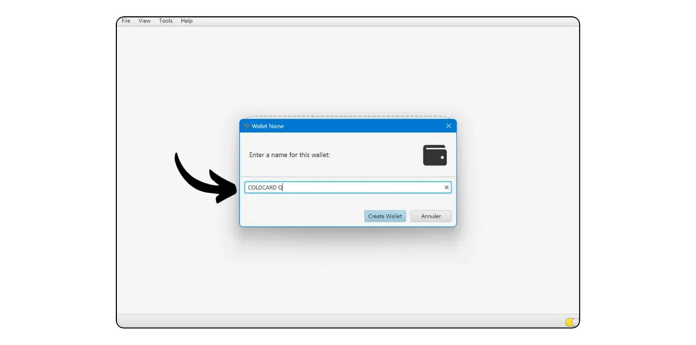

No menu pendente "*Script Type*" (Tipo de script*), escolha o tipo de script que irá proteger os seus bitcoins.

Clique em "*Airgapped Hardware Wallet*".

No separador "*Coldcard*", clique em "*Scan...*" se pretender digitalizar o código QR apresentado no seu COLDCARD, ou em "*Import File...*" para importar o ficheiro do microSD (este é o ficheiro `.json`).

Após a importação, verifique se a "*Master fingerprint*" apresentada no Sparrow corresponde à apresentada no seu COLDCARD. Confirme a criação clicando em "*Aplicar*".

Configure uma palavra-passe forte para proteger o acesso à sua Sparrow Wallet. Esta palavra-passe protegerá as suas chaves públicas, endereços, etiquetas e histórico de transacções contra o acesso não autorizado.

É uma boa ideia guardar esta palavra-passe para não se esquecer dela (por exemplo, num gestor de palavras-passe).

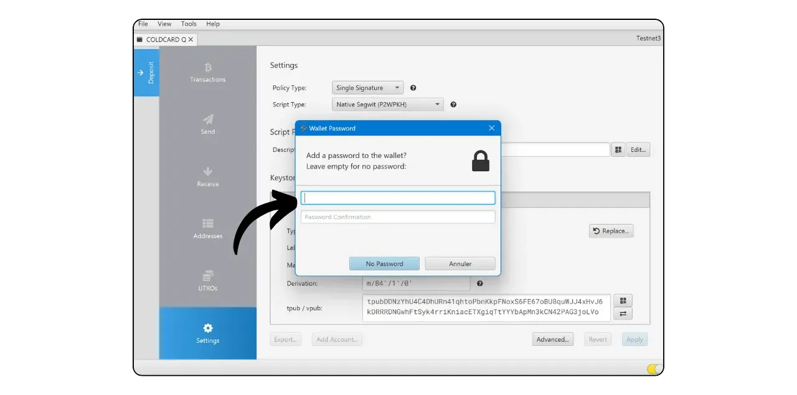

A sua carteira está agora configurada na Sparrow Wallet.

Antes de receberes os teus primeiros bitcoins na tua carteira, **aconselho-te vivamente a fazeres um teste de recuperação vazio**. Anote algumas informações de referência, como o seu xpub, e depois reinicie o seu COLDCARD Q enquanto a carteira ainda está vazia. Em seguida, tente restaurar a sua carteira para o COLDCARD utilizando as suas cópias de segurança em papel. Verifique se o xpub gerado após o restauro corresponde ao que escreveu originalmente. Se corresponder, pode ter a certeza de que as suas cópias de segurança em papel são fiáveis.

Para saber mais sobre como efetuar um teste de recuperação, sugiro que consulte este outro tutorial:

https://planb.network/tutorials/wallet/backup/recovery-test-5a75db51-a6a1-4338-a02a-164a8d91b895
## Receber bitcoins

Para receber os seus primeiros bitcoins, comece por ligar e desbloquear o seu COLDCARD.

Na Sparrow Wallet, clique no separador "*Receber*".

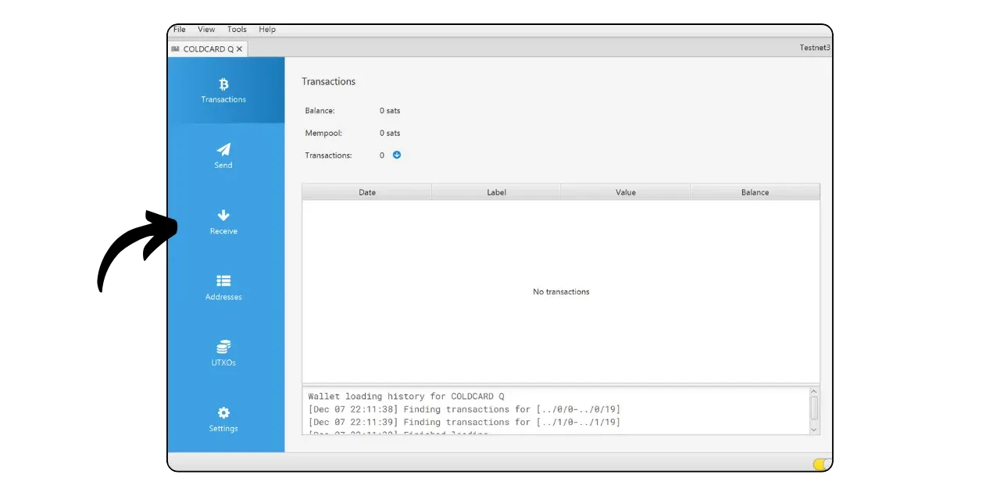

Antes de utilizar o endereço proposto pela Sparrow Wallet, verifique-o no ecrã do seu COLDCARD. Esta prática permite-lhe confirmar que o endereço apresentado na Sparrow não é fraudulento e que a carteira de hardware possui efetivamente a chave privada necessária para gastar posteriormente os bitcoins garantidos com este endereço. Isto ajuda-o a evitar vários tipos de ataques.

Para efetuar este controlo, clicar no menu "*Address Explorer*" do COLDCARD.

Selecione o tipo de script que está a utilizar no Sparrow. No meu caso, é o Segwit P2WPKH. Clico nele.

Pode então ver os seus diferentes endereços derivados por ordem.

Verifique com o Sparrow se o endereço corresponde. No meu caso, o endereço com o caminho de derivação `m/84'/1'/0'/0/0` é de facto `tb1qwfwwvzssep4wyjg3vsgezmwa037ehvd4fhmjvr` tanto no Sparrow como no COLDCARD.

Outra forma de verificar a propriedade deste endereço é digitalizar o respetivo código QR diretamente no Sparrow a partir do seu COLDCARD. No ecrã inicial do seu COLDCARD, selecione "*Digitalizar qualquer código QR*". Também pode usar a tecla "*QR*" do teclado.

Digitalize o código QR do endereço apresentado na Sparrow Wallet.

Certifique-se de que o endereço indicado no seu COLDCARD corresponde ao indicado no Sparrow. Em seguida, prima o botão "*1*".

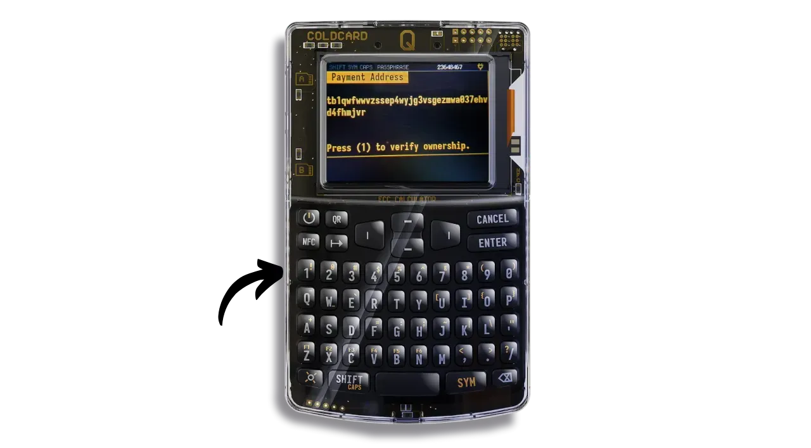

O endereço é assim confirmado com êxito.

Pode agora adicionar um "*Label*" para descrever a origem dos bitcoins que serão protegidos com este endereço. Esta é uma boa prática que lhe permite gerir melhor os seus UTXOs.

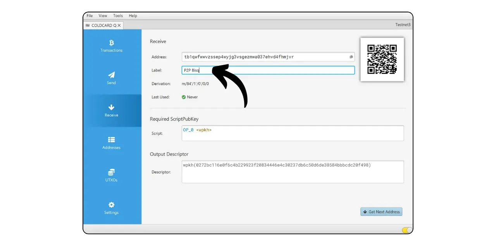

Para mais informações sobre etiquetagem, recomendo também este outro tutorial:

https://planb.network/tutorials/privacy/on-chain/utxo-labelling-d997f80f-8a96-45b5-8a4e-a3e1b7788c52
Pode então utilizar este endereço para receber bitcoins.

## Enviar bitcoins

Agora que já recebeste os teus primeiros sats na tua carteira segura COLDCARD, também os podes gastar!

Como sempre, comece por ligar e desbloquear o seu COLDCARD Q, depois abra a Sparrow Wallet e navegue até ao separador "*Enviar*" para preparar uma nova transação.

Se pretender "controlar a moeda", ou seja, escolher especificamente quais os UTXOs a consumir na transação, vá ao separador "*UTXOs*". Selecione os UTXOs que pretende gastar e clique em "*Enviar selecionados*". Será redireccionado para o mesmo ecrã no separador "*Enviar*", mas com os seus UTXOs já selecionados para a transação.

Introduzir o endereço de destino. Também pode introduzir vários endereços clicando no botão "*+ Adicionar*".

Escreva um "*Rótulo*" para se lembrar do objetivo desta despesa.

Selecione o montante a enviar para este endereço.

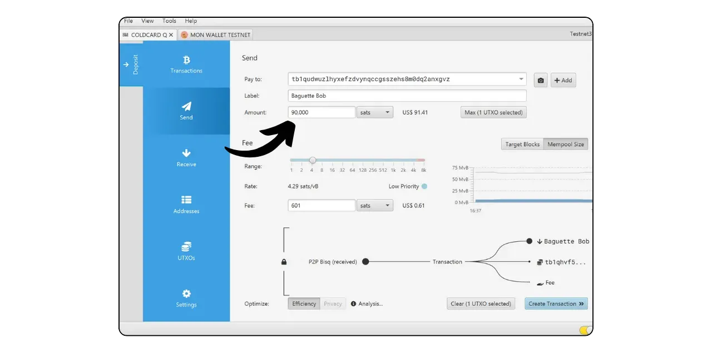

Ajuste a taxa da sua transação de acordo com o mercado atual.

Certifique-se de que todos os parâmetros da transação estão corretos e, em seguida, clique em "*Criar transação*".

Se tudo estiver a seu gosto, clique em "*Finalizar transação para assinatura*".

Depois de ter criado a sua transação no Sparrow, é altura de a assinar com o seu COLDCARD. Para transmitir o PSBT (transação não assinada) para o seu dispositivo, tem várias opções. Se a transmissão de dados com fios estiver activada, pode enviar a transação diretamente através de uma ligação USB-C, tal como faria com qualquer outra carteira de hardware. Neste caso, no Sparrow, teria de clicar no botão "*Sign*" no canto inferior direito. No meu exemplo, este botão está bloqueado porque o COLDCARD não está ligado por cabo.

Se preferir manter uma ligação "air-gap" sem contacto direto entre a carteira de hardware e o seu computador, tem 2 opções. A primeira, e mais complexa, é utilizar um cartão microSD. Insira o cartão microSD no seu computador, registe a transação através do botão "*Guardar transação*" no Sparrow e, em seguida, transfira este cartão para uma porta no seu COLDCARD.

Em seguida, aceda ao menu "*Pronto a assinar*".

Reveja os detalhes da transação no seu COLDCARD, incluindo o endereço de receção, o montante enviado e a taxa de transação.

Se tudo estiver correto, prima o botão "*ENTER*" para assinar a transação.

Em seguida, coloque o microSD de volta no seu computador e, no Sparrow, clique em "*Load Transaction*" para carregar a transação assinada a partir do microSD. Poderá então efetuar uma verificação final antes de a carregar para a rede Bitcoin.

O segundo método de assinatura com o seu COLDCARD no Air-Gap, que é muito mais simples do que o método do microSD, consiste em digitalizar o PSBT diretamente através da câmara do dispositivo. No Sparrow, selecione "*Mostrar QR*".

No COLDCARD, selecione "*Scan Any QR Code*". Também pode utilizar a tecla "*QR*" do teclado.

Utilize a câmara do COLDCARD para digitalizar o código QR apresentado no Sparrow.

Os detalhes da transação aparecerão novamente para verificação. Prima "*ENTER*" para assinar se tudo estiver a seu gosto.

O seu COLDCARD apresentará então a transação assinada como um código QR. Utilize a webcam do seu computador para digitalizar este código QR, selecionando "*Digitalizar QR*" no Sparrow.

A sua transação assinada está agora visível no Sparrow. Verifique uma última vez se tudo está correto e, em seguida, clique em "*Broadcast Transaction*" para a transmitir na rede Bitcoin.

Pode acompanhar a sua transação no separador "*Transacções*" da Sparrow Wallet.

Parabéns, está agora a par da utilização básica do COLDCARD Q com a Sparrow Wallet!

Se achou este tutorial útil, ficaria muito grato se deixasse um polegar verde abaixo. Não hesite em partilhar este tutorial nas suas redes sociais. Muito obrigado!

Também recomendo que dê uma vista de olhos a este outro tutorial no qual abordamos as opções avançadas do COLDCARD Q :

https://planb.network/tutorials/wallet/hardware/coldcard-q-advanced-b8cc3f29-eea9-48fe-a953-b003d5b115e0