A hardware wallet is an electronic device dedicated to managing and securing the private keys of a Bitcoin wallet. Unlike software wallets (or hot wallets) installed on general-purpose machines often connected to the Internet, hardware wallets enable private keys to be physically isolated, reducing the risk of piracy and theft.

The main objective of a hardware wallet is to reduce the device's functionality as much as possible in order to minimize its attack surface. Less attack surface also means fewer potential attack vectors, i.e. fewer weak points in the system that attackers could exploit to gain access to bitcoins.

It's advisable to use a hardware wallet to secure your bitcoins, especially if you hold large quantities, either in absolute value or as a proportion of your total assets.

Hardware wallets are used in conjunction with wallet management software on a computer or smartphone. The latter manages the creation of transactions, but the cryptographic signature required to make these transactions valid is performed solely within the hardware wallet. This means that private keys are never exposed to a potentially vulnerable environment.

Hardware wallets offer double protection for the user: on the one hand, they secure your bitcoins against remote attacks by keeping the private keys offline, and on the other, they generally offer greater physical resistance to attempts to extract the keys. And it is precisely on these 2 security criteria that we can judge and classify the different models on the market.

In this tutorial, I'd like to introduce you to one such solution: the **COLDCARD Q**.

---
As the COLDCARD Q offers a multitude of functions, I propose to divide its use into 2 tutorials. In this first tutorial, we'll look at the initial configuration and basic functions of the device. Then, in a second tutorial, we'll look at how to take advantage of all your COLDCARD's advanced options.

https://planb.network/tutorials/wallet/hardware/coldcard-q-advanced-b8cc3f29-eea9-48fe-a953-b003d5b115e0
---
## Introducing COLDCARD Q

The COLDCARD Q is a Bitcoin-only hardware wallet developed by Canadian company Coinkite, known for its previous MK models. The Q represents their most advanced product to date, and is positioned as the ultimate Bitcoin hardware wallet.

In terms of hardware, the COLDCARD Q is equipped with all the features required for an optimal user experience:

- A large LCD display simplifies navigation and operation;
- A full QWERTY keyboard;
- Integrated camera for scanning QR codes;
- Two microSD card slots ;
- A fully isolated power option via three AAA batteries (not included), or via a USB-C cable ;
- Two Secure Elements from two different manufacturers for added security;
- The ability to communicate via NFC.

In my opinion, the COLDCARD Q has only two drawbacks. Firstly, because of its many features, it's quite bulky, measuring almost 13 cm long and 8 cm wide, which is almost the size of a small smartphone. It's also rather thick because of the battery compartment. If you're looking for a smaller, more mobile hardware wallet, the much more compact MK4 might be a better option. The second drawback is obviously the cost of the device, which is priced at **$239.99** on the official website, i.e. $72 more than the MK4, which puts the Q in direct competition with premium hardware wallets like the Ledger Flex or Foundation's Passport.

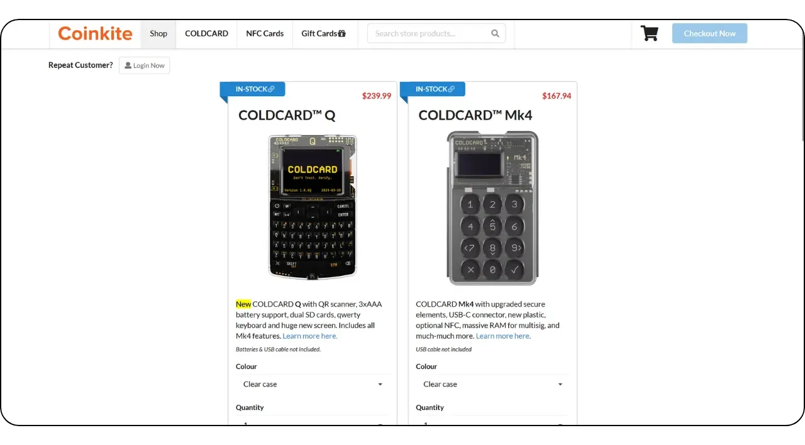

On the software side, the COLDCARD Q is as well equipped as Coinkite's other devices, with a host of advanced features:

- Dice Roll to generate your own recovery phrase ;
- PIN code ;
- Countdown to final PIN lock ;
- BIP39 passphrase ;
- Final locking PIN ;
- Connection countdown ;
- SeedXOR;
- BIP85...

In short, the COLDCARD Q offers an improved user experience over the MK4, and may be ideal for intermediate to advanced users looking for greater ease of use.

The COLDCARD Q is available for sale [on the official Coinkite website](https://store.coinkite.com/store/coldcard). It can also be purchased from a retailer.

## Preparing the tutorial

Once you've received your COLDCARD, the first step is to inspect the packaging to make sure it hasn't been opened. If the packaging is damaged, this may indicate that the hardware wallet has been compromised and may not be genuine.

When you open the box, you should find the following items:

- The COLDCARD Q in a sealed bag;
- A card to record your mnemonic phrase.

Make sure the bag has not been unsealed or damaged. Also check that the number on your bag matches the number on the paper inside the bag. Keep this number for future reference.

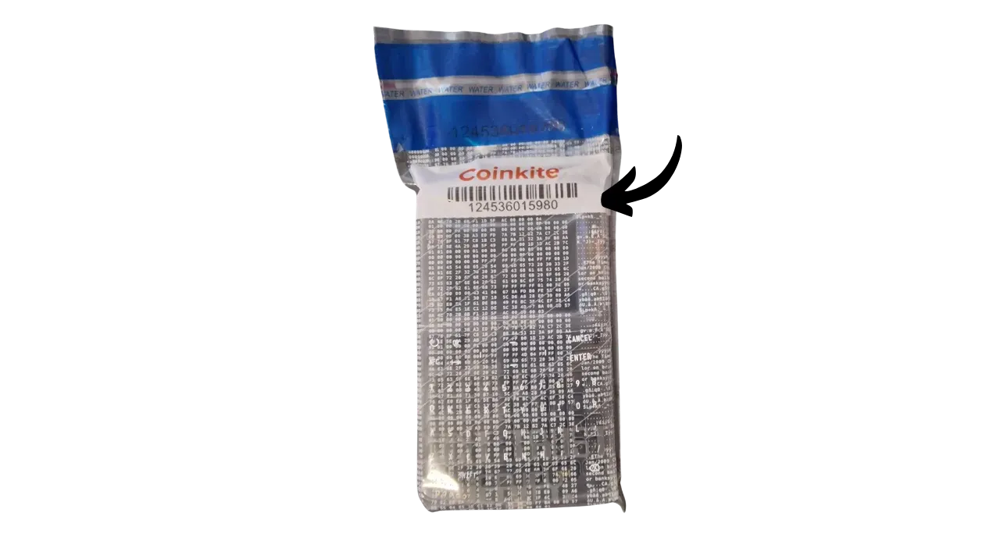

If you prefer to power your COLDCARD without connecting it to a computer (air-gap), insert three AAA batteries into the back of the device. Alternatively, you can connect it to your computer via a USB-C cable.

For this tutorial, you'll also need Sparrow Wallet to manage your Bitcoin wallet on your computer. Download [Sparrow Wallet](https://sparrowwallet.com/download/) from the official website. I strongly advise you to check both its authenticity (with GnuPG) and integrity (via hash) before proceeding with the installation. If you don't know how to do this, follow this tutorial:

https://planb.network/tutorials/others/general/integrity-authenticity-21d0420a-be02-4663-94a3-8d487f23becc
## PIN code selection

You can now switch on your COLDCARD by pressing the button in the top left-hand corner.

Press the "*ENTER*" button to accept the terms of use.

Your COLDCARD Q will then display a number at the top of the screen. Make sure this number matches the one on the sealed bag and on the piece of plastic inside the bag. This ensures that your package has not been opened between the time it was packaged by Coinkite and the time you opened it. Press "*ENTER*" to continue.

Navigate to the "*Choose PIN Code*" menu and confirm with the "*ENTER*" button.

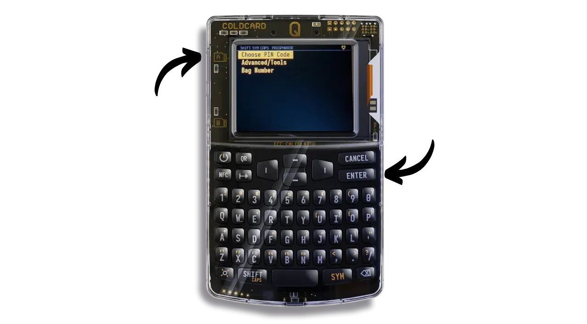

This PIN code is used to unlock your COLDCARD. It is therefore a protection against unauthorized physical access. This PIN code is not involved in the derivation of your wallet's cryptographic keys. So, even without access to this PIN code, possession of your mnemonic phrase will enable you to regain access to your bitcoins.

COLDCARD PIN codes are divided into two parts: a prefix and a suffix, each of which can contain between 2 and 6 digits, for a total of 4 to 12 digits. When you unlock your COLDCARD, you'll first need to enter the prefix, after which the device will show you 2 words. Then enter the suffix. These two words will be given to you during this configuration step, and should be carefully saved, as you'll need them every time you unlock your COLDCARD. If the two words displayed during unlocking match those you saved during configuration, this will confirm that your device has not been compromised since its last use.

Click again on "*Choose PIN*"

Confirm that you have read the warnings.

You will now choose your PIN code. We recommend a long, random PIN code. Make sure you keep this code in a different place from where your COLDCARD is stored. You can use the card supplied in your parcel to record this code.

Enter the prefix of your choice, then press the "*ENTER*" button to confirm the first part of the PIN code.

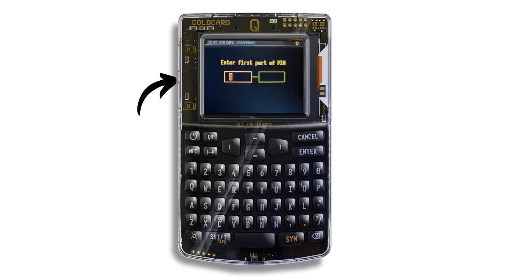

The two anti-phishing words will then be displayed on your screen. Save them carefully for future reference. You can use the card included in your package to write them down.

Then enter the second part of your PIN code and press "*ENTER*".

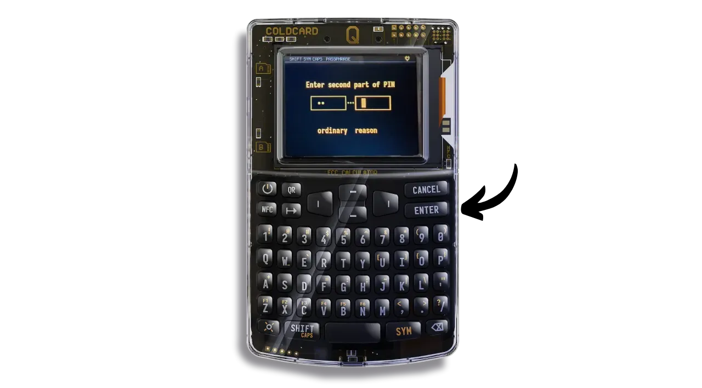

Confirm your PIN by entering it a second time, checking that the two anti-phishing words match those you saved earlier.

From now on, each time you unlock your COLDCARD, remember to check the validity of the two anti-phishing words that appear on the screen after you enter your PIN code prefix.

## Firmware update

When using your device for the first time, it is important to check and update the firmware. To do this, access the "*Advanced/Tools*" menu.

**Important:** If you are planning to upgrade your firmware and this is not your first time using COLDCARD (i.e. you already have a wallet created on COLDCARD), make sure you have your mnemonic phrase and that it is functional (as well as the optional passphrase, if applicable). This is important to avoid losing your bitcoins in the event of a problem during the device update.

Select "*Upgrade Firmware*".

Select "*Show Version*".

You can check the current firmware version of your COLDCARD. For example, in my case, the version is "*1.2.3Q*".

Check [on the official COLDCARD website](https://coldcard.com/downloads) to see if a newer version is available. Click on "*Download*" to download the new firmware.

At this point, we strongly recommend checking the integrity and authenticity of the downloaded firmware. To do this, download [the document containing the hashes of all versions, signed by the developers](https://raw.githubusercontent.com/Coldcard/firmware/master/releases/signatures.txt), verify the signature with [the developer's public key](https://keybase.io/dochex), and make sure that the hash indicated in the signed document matches that of the firmware downloaded from the site. If everything is correct, you can proceed with the update.

If you are not familiar with this verification process, I recommend you follow this tutorial:

https://planb.network/tutorials/others/general/integrity-authenticity-21d0420a-be02-4663-94a3-8d487f23becc
Take a microSD card and transfer the firmware file (document in `.dfu`) to it. Insert the microSD card into one of your COLDCARD's ports.

Then, in the firmware update menu, select "*From MicroSD*".

Select the file corresponding to the firmware.

Confirm your selection by pressing the "*ENTER*" button.

Please wait while the firmware is updated.

Once the update is complete, enter your PIN code to unlock the device.

Your firmware is now up to date.

## COLDCARD Q parameters

If you wish, you can explore your COLDCARD's settings by accessing the "*Settings*" menu.

In this menu, you'll find various customization options, such as setting the screen brightness or selecting the default unit of measurement.

We'll look at other advanced settings in the next tutorial:

https://planb.network/tutorials/wallet/hardware/coldcard-q-advanced-b8cc3f29-eea9-48fe-a953-b003d5b115e0
## Creating a Bitcoin wallet

Now it's time to generate a new Bitcoin wallet! To do this, you need to create a mnemonic phrase. On Coldcard, you have three methods for generating this phrase:

- Use only the internal random number generator (TRNG);
- Use a combination of TRNG and dice rolling to add entropy;
- Use dice rolls only.

**For beginners and intermediate users, we recommend using only the COLDCARD's internal random number generator**

I don't recommend the dice-only option, as poor execution can lead to a sentence with insufficient entropy, jeopardizing the security of your wallet.

However, the best option is surely the second, which combines the use of TRNG with an external entropy source. This method guarantees a minimum entropy equivalent to that of TRNG alone, and adds an extra level of security in the event of a possible failure of the internal generator (voluntary or not). By choosing this option, which combines TRNG and dice rolling, you benefit from greater control over the generation of the sentence, without increasing the risks in the event of poor execution on your part.

Click on "*New Seed Words*".

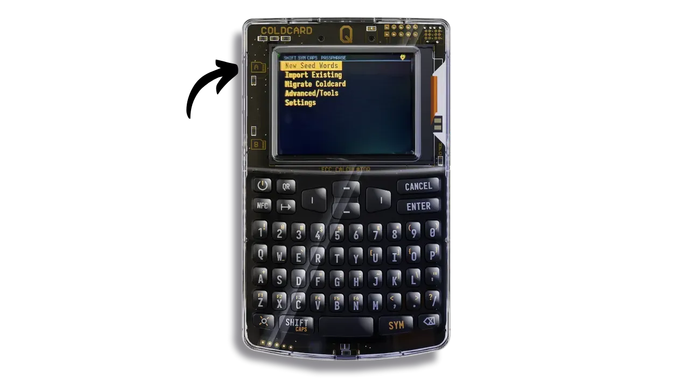

You can choose the length of your sentence. I recommend that you opt for a 12-word sentence, as it's less complex to manage and offers no less portfolio security than a 24-word sentence.

The COLDCARD will then display your TRNG-generated recovery phrase. If you wish to add additional external entropy, press the "*4*" key.

This will take you to a page where you can add entropy by rolling the dice. Make as many throws as possible (a minimum of 50 is recommended, but less is not a big deal as you're already benefiting from the entropy of the TRNG), and record the results with the "*1*" to "*6*" keys. When finished, press "*ENTER*" to confirm.

A new mnemonic phrase will be displayed, based on the entropy you've just provided and that of the TRNG.

**Warning: This mnemonic gives full, unrestricted access to all your bitcoins**. Anyone in possession of this phrase can steal your funds, even without physical access to your COLDCARD. The 12-word phrase restores access to your bitcoins in the event of loss, theft or breakage of your COLDCARD. It is therefore very important to save it carefully and store it in a secure place.

You can write it down on the cardboard supplied with your COLDCARD, or for added security, I recommend that you engrave it on a stainless steel support to protect it from the risk of fire, flood or collapse. In any case, never save it on a digital medium, otherwise you could lose your bitcoins.

Write down the words provided on the screen on the physical medium of your choice. Depending on your security strategy, you may consider making several complete physical copies of the sentence (but above all, don't split it up). It's important to keep the words numbered and in sequential order.

Obviously, **you must never share these words** on the Internet, unlike in this tutorial. This sample portfolio will be used only on Testnet and will be deleted at the end of the tutorial.

After writing down the words, press "*ENTER*".

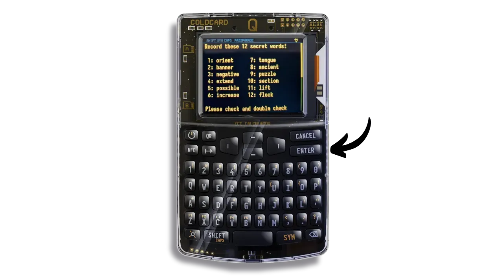

To make sure you've saved your phrase correctly, the system will ask you to confirm certain words. Select the number corresponding to each word on the keypad.

Your wallet is now created! In the top right-hand corner of the screen, you can see your master private key fingerprint. Press "*ENTER*".

You now access your COLDCARD's main menu.

## Setting up a new portfolio on Sparrow

There are several options for establishing communication between the Sparrow Wallet software and your COLDCARD. The most straightforward is to use a USB-C cable. However, by default, your COLDCARD has cable and NFC communications disabled. To reactivate them, navigate to "*Settings*", then "*Hardware On/Off*", and activate the desired communication option.

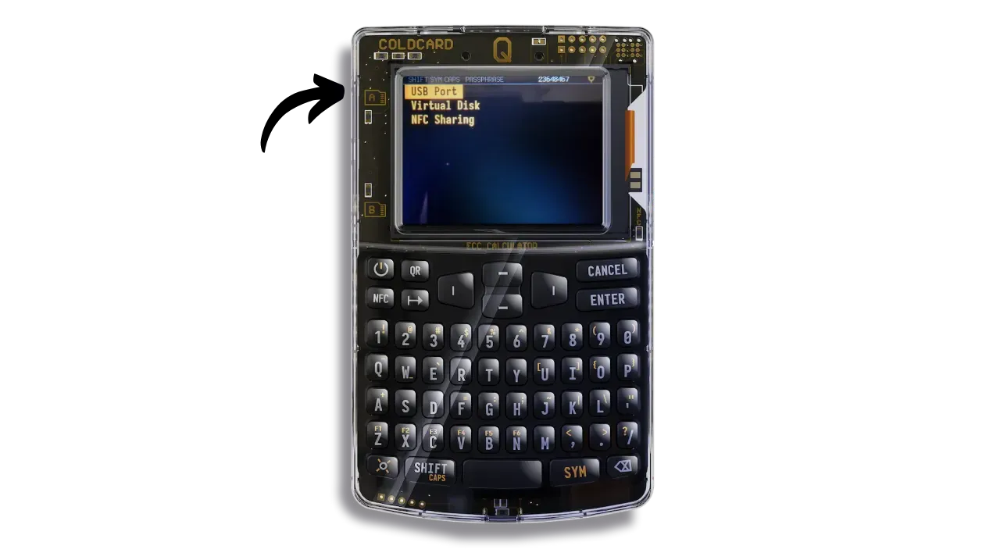

If you prefer to keep your COLDCARD totally isolated from your computer, you can opt for indirect "air-gap" communication, using QR codes or a microSD card. This is the method we'll be using in this tutorial.

Go to "*Advanced/Tools*".

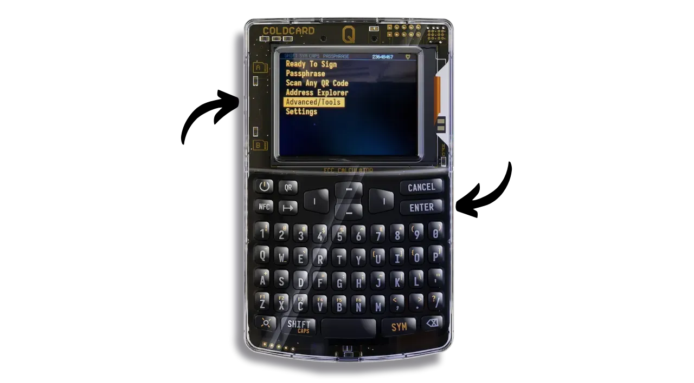

Select "*Export Wallet*".

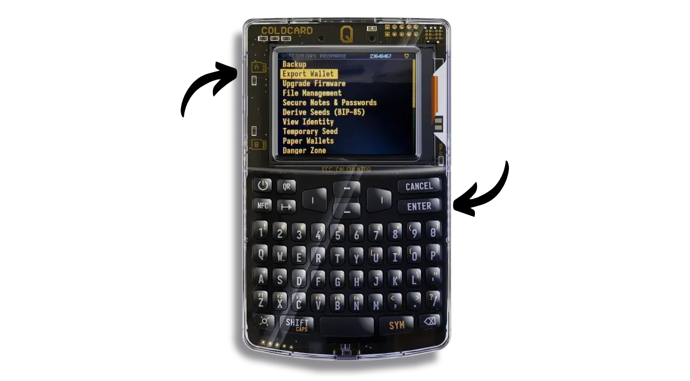

Then select "*Sparrow Wallet*".

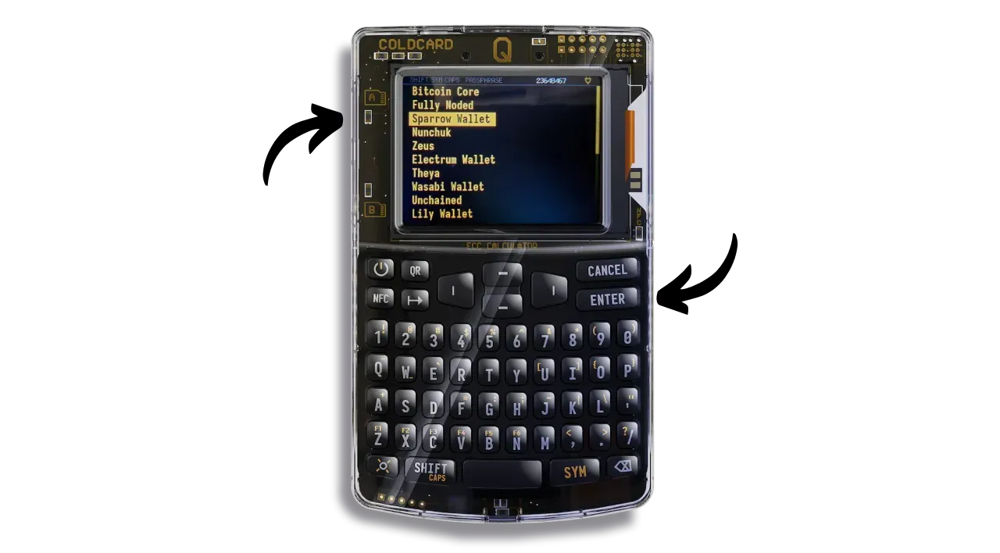

Press "*ENTER*" to generate the configuration file.

Then choose how to send this file to Sparrow. In this example, I've inserted a microSD in slot "*A*", so I'll select the "*1*" button. You can also display the information as a QR code on your COLDCARD screen by pressing the "*QR*" button, and scan this QR code with your computer's webcam.

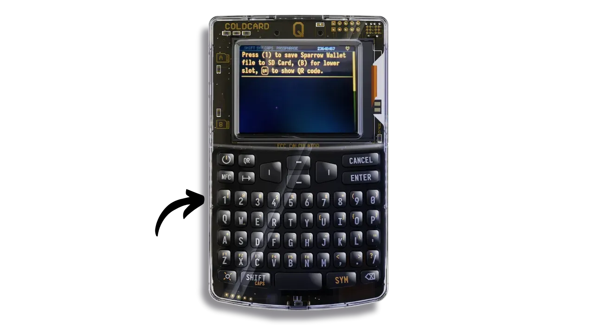

Launch Sparrow Wallet and skip the introductory pages to reach the main screen. Make sure you are correctly connected to a node by checking the switch at the bottom right of the screen.

It's strongly recommended that you use your own Bitcoin node. For this tutorial, I'm using a public node (yellow), as I'm on the testnet, but for production use, it's best to use Bitcoin Core locally (green) or an Electrum server on a remote node (blue).

Access the "*File*" menu and select "*New Wallet*".

Name your wallet and click on "*Create Wallet*".

In the "*Script Type*" drop-down menu, choose the type of script that will secure your bitcoins.

Click on "*Airgapped Hardware Wallet*".

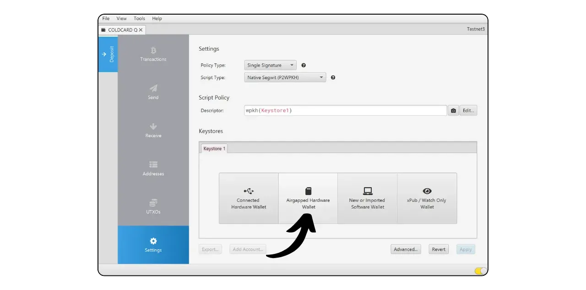

Under the "*Coldcard*" tab, click on "*Scan...*" if you plan to scan the QR code displayed on your COLDCARD, or "*Import File...*" to import the file from the microSD (this is the `.json` file).

After import, check that the "*Master fingerprint*" displayed on Sparrow matches the one displayed on your COLDCARD. Confirm the creation by clicking on "*Apply*".

Set up a strong password to secure access to your Sparrow Wallet. This password will protect your public keys, addresses, tags and transaction history from unauthorized access.

It's a good idea to save this password so you don't forget it (e.g. in a password manager).

Your wallet is now set up on Sparrow Wallet.

Before you receive your first bitcoins in your wallet, **I strongly advise you to perform an empty recovery test**. Write down some reference information, such as your xpub, then reset your COLDCARD Q while the wallet is still empty. Then try restoring your wallet to the COLDCARD using your paper backups. Check that the xpub generated after the restore matches the one you originally wrote down. If it does, you can rest assured that your paper backups are reliable.

To learn more about how to perform a recovery test, I suggest you consult this other tutorial:

https://planb.network/tutorials/wallet/backup/recovery-test-5a75db51-a6a1-4338-a02a-164a8d91b895
## Receive bitcoins

To receive your first bitcoins, start by switching on and unlocking your COLDCARD.

On Sparrow Wallet, click on the "*Receive*" tab.

Before using the address proposed by Sparrow Wallet, check it on your COLDCARD screen. This practice allows you to confirm that the address displayed on Sparrow is not fraudulent, and that the hardware wallet does indeed hold the private key needed to subsequently spend the bitcoins secured with this address. This helps you to avoid several types of attack.

To perform this check, click on the "*Address Explorer*" menu on the COLDCARD.

Select the type of script you are using on Sparrow. In my case, it's Segwit P2WPKH. I click on it.

You can then see your different derived addresses in order.

Check with Sparrow that the address matches. In my case, the address with derivation path `m/84'/1'/0'/0/0` is indeed `tb1qwfwwvzssep4wyjg3vsgezmwa037ehvd4fhmjvr` on both Sparrow and COLDCARD.

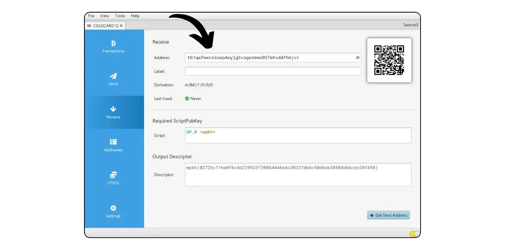

Another way to verify ownership of this address is to scan its QR code directly onto Sparrow from your COLDCARD. From your COLDCARD home screen, select "*Scan Any QR Code*". You can also use the "*QR*" key on the keyboard.

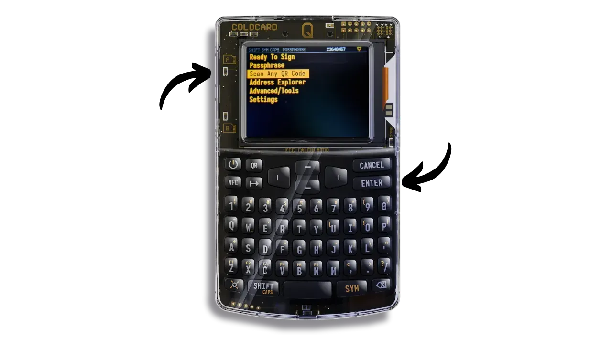

Scan the QR code of the address displayed on Sparrow Wallet.

Make sure the address displayed on your COLDCARD matches the one shown on Sparrow. Then press the "*1*" button.

The address is thus successfully confirmed.

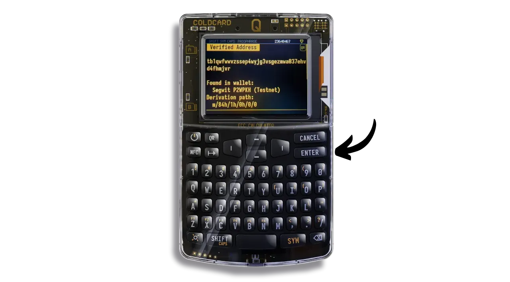

You can now add a "*Label*" to describe the source of bitcoins that will be secured with this address. This is a good practice that allows you to better manage your UTXOs.

For more information on labeling, I also recommend this other tutorial:

https://planb.network/tutorials/privacy/on-chain/utxo-labelling-d997f80f-8a96-45b5-8a4e-a3e1b7788c52
You can then use this address to receive bitcoins.

## Send bitcoins

Now that you've received your first sats in your COLDCARD-secured wallet, you can spend them too!

As always, start by switching on and unlocking your COLDCARD Q, then open Sparrow Wallet and navigate to the "*Send*" tab to prepare a new transaction.

If you wish to "coin control", i.e. choose specifically which UTXOs to consume in the transaction, go to the "*UTXOs*" tab. Select the UTXOs you wish to spend, then click on "*Send Selected*". You will be redirected to the same screen in the "*Send*" tab, but with your UTXOs already selected for the transaction.

Enter the destination address. You can also enter multiple addresses by clicking on the "*+ Add*" button.

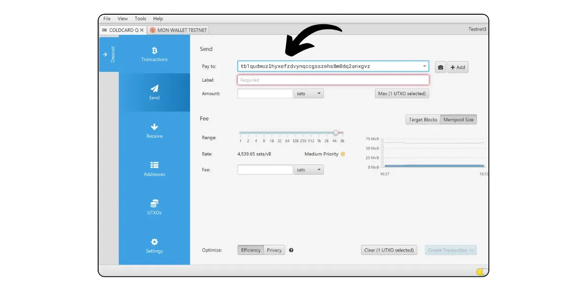

Write down a "*Label*" to remember the purpose of this expense.

Select the amount to be sent to this address.

Adjust the fee rate of your transaction according to the current market.

Make sure all your transaction parameters are correct, then click on "*Create Transaction*".

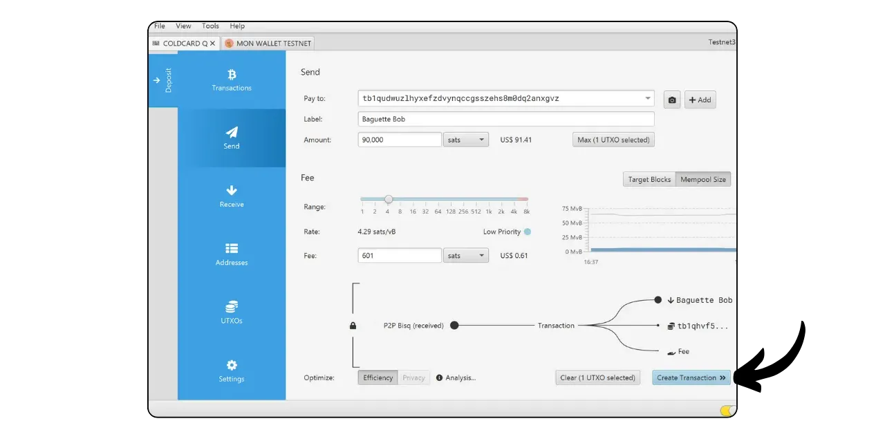

If everything is to your satisfaction, click on "*Finalize Transaction for Signing*".

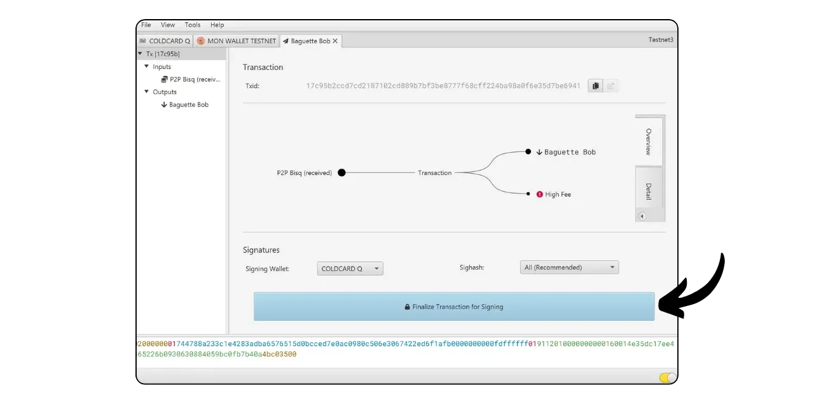

Once you've built your transaction in Sparrow, it's time to sign it with your COLDCARD. To transmit the PSBT (unsigned transaction) to your device, you have several options. If wired data transmission is enabled, you can send the transaction directly via a USB-C connection, just as you would with any other hardware wallet. In this case, on Sparrow, you'd have to click on the "*Sign*" button in the bottom right-hand corner. In my example, this button is blocked because the COLDCARD is not connected by cable.

If you prefer to maintain an "air-gap" connection without direct contact between the hardware wallet and your computer, you have 2 options. The first, and more complex, is to use a microSD card. Insert the microSD card into your computer, record the transaction via the "*Save Transaction*" button on Sparrow, then transfer this card to a port on your COLDCARD.

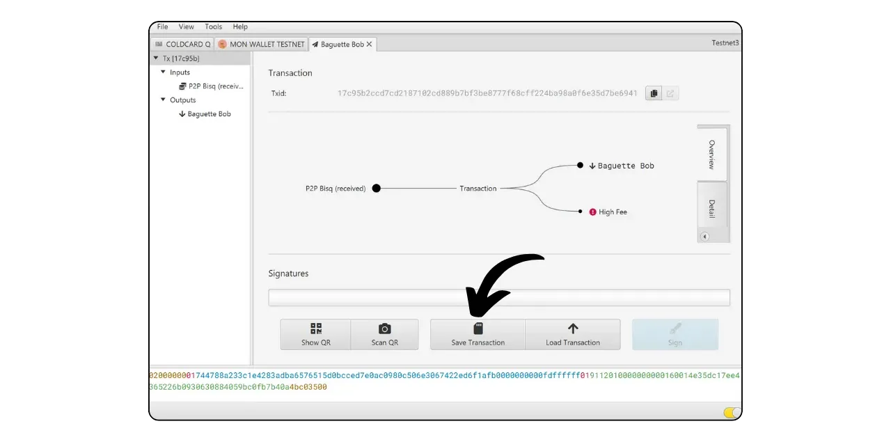

Then access the "*Ready To Sign*" menu.

Review the transaction details on your COLDCARD, including the receiving address, the amount sent and the transaction fee.

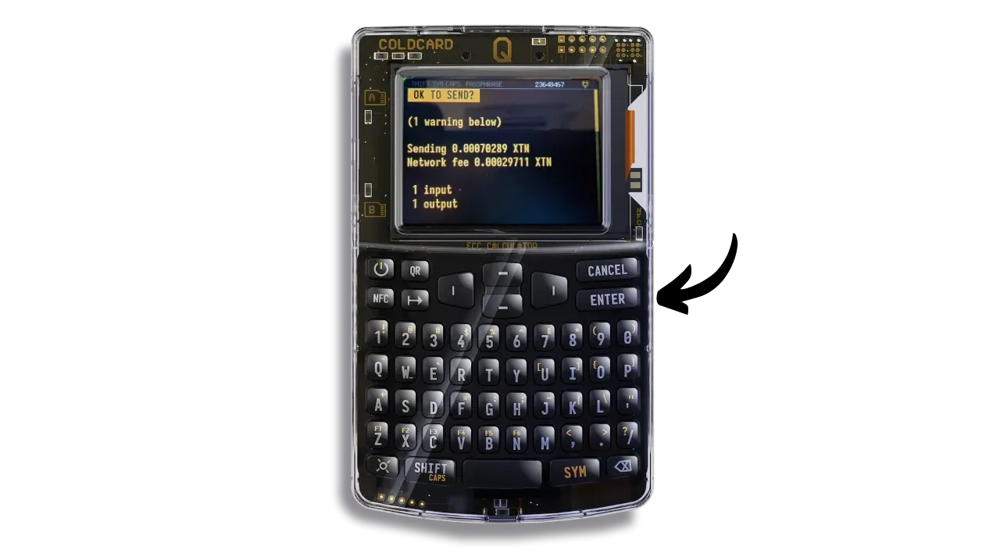

If everything is correct, press the "*ENTER*" button to sign the transaction.

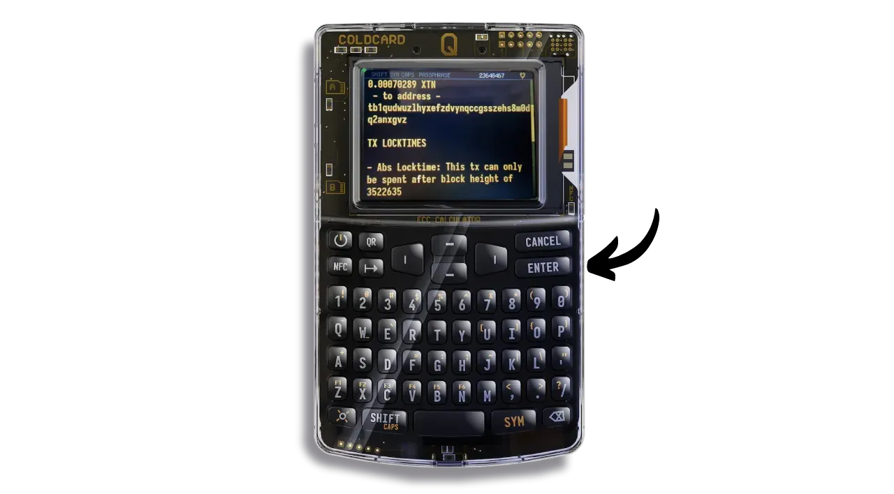

Then place the microSD back in your computer and on Sparrow, click on "*Load Transaction*" to load the signed transaction from the microSD. You'll then be able to perform a final check before uploading it to the Bitcoin network.

The second method of signing with your COLDCARD in Air-Gap, which is much simpler than the microSD method, is to scan the PSBT directly via the device's camera. On Sparrow, select "*Show QR*".

On the COLDCARD, select "*Scan Any QR Code*". You can also use the "*QR*" key on the keyboard.

Use the COLDCARD's camera to scan the QR code displayed on Sparrow.

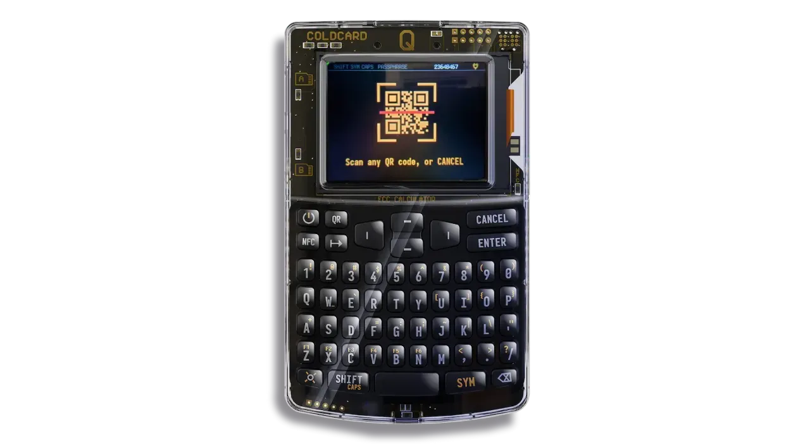

The transaction details will appear again for verification. Press "*ENTER*" to sign if all is to your satisfaction.

Your COLDCARD will then display the signed transaction as a QR code. Use your computer's webcam to scan this QR code by selecting "*Scan QR*" on Sparrow.

Your signed transaction is now visible on Sparrow. Check one last time that everything is correct, then click on "*Broadcast Transaction*" to broadcast it on the Bitcoin network.

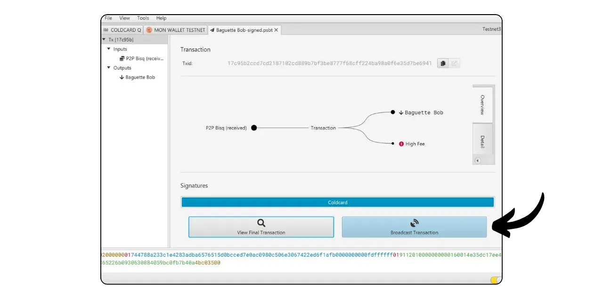

You can track your transaction in Sparrow Wallet's "*Transactions*" tab.

Congratulations, you're now up to speed on the basic use of COLDCARD Q with Sparrow Wallet!

If you found this tutorial useful, I'd be very grateful if you'd leave a green thumb below. Please feel free to share this tutorial on your social networks. Thank you very much!

I also recommend you take a look at this other tutorial in which we discuss the advanced options of the COLDCARD Q :

https://planb.network/tutorials/wallet/hardware/coldcard-q-advanced-b8cc3f29-eea9-48fe-a953-b003d5b115e0