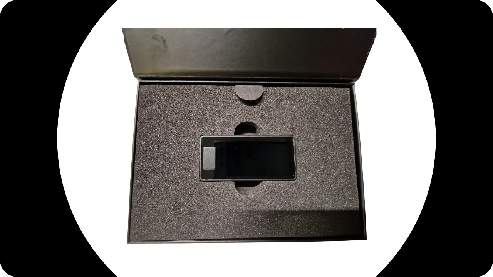
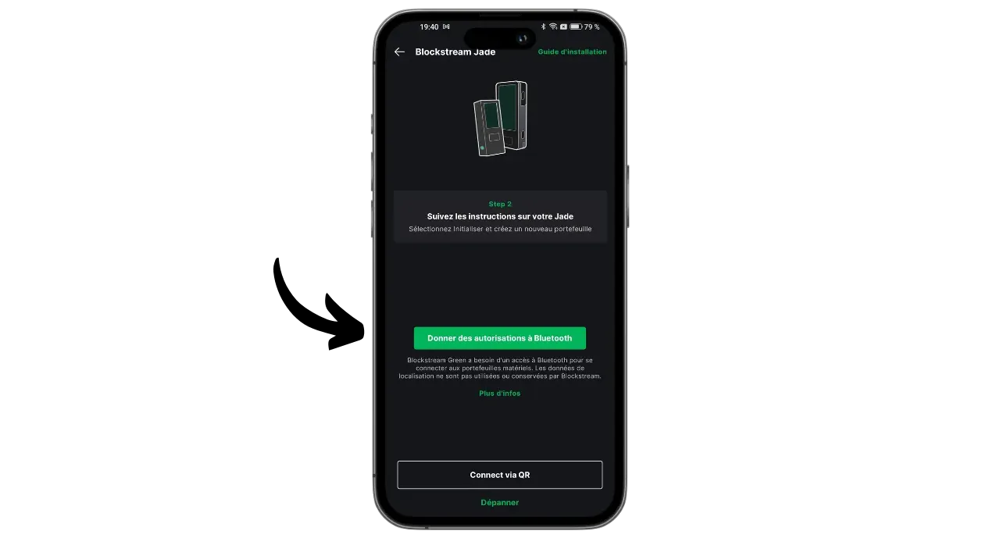
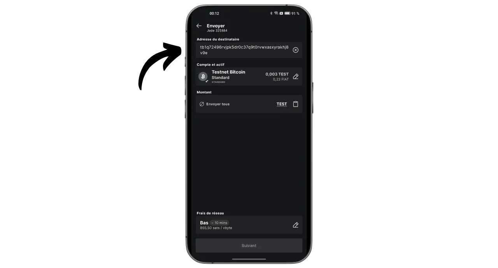

Jade Plus ist eine reine Bitcoin-Hardware-Wallet, die von Blockstream entwickelt wurde. Es ist der Nachfolger des klassischen Jade, mit Software-Verbesserungen, mehr Optionen und neu gestalteter Ergonomie für eine intuitivere Nutzung. Diese neue Version verfügt über einen großartigen 1,9-Zoll-LCD-Bildschirm mit einem größeren Farbumfang als sein Vorgänger. Auch die Tasten und die Menüführung wurden optimiert.

Der Jade Plus kann auf verschiedene Arten verwendet werden: über eine USB-C-Kabelverbindung, im "*Air-Gap*"-Modus mit einer Micro-SD-Karte (Adapter erforderlich), über Bluetooth oder sogar durch den Austausch von QR-Codes dank der integrierten Kamera. Diese Hardware-Wallet ist batteriebetrieben.

Sie ist ab 149,99 $ in der schwarzen Grundversion erhältlich, und der Preis kann um bis zu 20 $ für die Versionen "*Genesis Grey*" oder "*Lunar Silver*" steigen. Die Jade Plus ist daher eine interessante Wahl, mit fortschrittlichen Funktionen, die mit denen von High-End-Hardware-Geldbörsen wie Coldcard Q oder Passport V2 vergleichbar sind, aber zu einem ziemlich niedrigen Preis, nahe an Mittelklasse-Modellen.

Jade Plus ist mit den meisten Portfolioverwaltungsprogrammen kompatibel. Hier ist eine Übersicht über die Kompatibilität zum Zeitpunkt der Erstellung dieses Berichts (Januar 2025):

| Desktop | Mobile | USB | Bluetooth | QR | JadeLink | Verwaltungssoftware

| ------------------- | ------- | ------ | --- | ----------- | --- | -------- |

| Blockstream Green | 🟢 | 🟢 | 🟢 (Mobile) | 🟢 | 🔴 |

| Liana | 🟢 | 🔴 | 🟢 | 🔴 | 🔴 |

| Sperling | 🟢 | 🔴 | 🟢 | 🔴 | 🟢 | 🟢 |

| Nunchuk | 🟢 | 🟢 | 🔴 | 🔴 | 🟢 | 🟢 |

| Specter | 🟢 | 🔴 | 🔴 | 🟢 | 🟢 |

| BlueWallet | 🟢 | 🟢 | 🔴 | 🔴 | 🟢 | 🟢 |

| Electrum | 🟢 | 🔴 | 🟢 | 🔴 | 🔴 | 🔴 |

| Keeper | 🔴 | 🟢 | 🔴 | 🔴 | 🟢 | 🔴 |

In diesem Tutorial werden wir den Jade Plus mit der mobilen App Green Wallet von Blockstream über eine Bluetooth-Verbindung einrichten und verwenden. Diese Einrichtung ist ideal für Anfänger. Wenn Sie einen fortgeschritteneren Ansatz suchen, empfehle ich Ihnen einen Blick auf dieses Tutorial, in dem wir den Jade Plus mit Sparrow Wallet im QR-Code-Modus verwenden:

https://planb.network/tutorials/wallet/hardware/jade-plus-sparrow-938abf16-e10a-4618-860d-cd771373a262
## Das Sicherheitsmodell Jade Plus

Der Jade Plus verwendet ein Sicherheitsmodell, das auf einem "virtuellen Sicherheitselement" basiert, das durch ein "blindes Orakel" realisiert wird. Konkret kombiniert dieser Mechanismus die vom Benutzer gewählte PIN, ein auf dem Jade-Gerät gehostetes Geheimnis und ein vom Orakel (einem von Blockstream unterhaltenen Server) gehaltenes Geheimnis, um einen auf zwei Entitäten verteilten AES-256-Schlüssel zu erstellen. Während der Initiierung sichert ein ECDH-Austausch die Kommunikation mit dem Orakel und verschlüsselt die Recovery-Phrase auf der Hardware-Wallet. Wenn Sie auf den Seed zugreifen möchten, um Transaktionen zu signieren, benötigen Sie Zugang zu :

- Zum Jade Plus Gerät selbst;
- PIN zum Entsperren des Geräts ;
- Und zum Geheimnis des Orakels.

Der Hauptvorteil dieses Ansatzes ist das Fehlen einer einzigen Schwachstelle auf der Hardware-Ebene, denn wenn ein Angreifer jemals Zugang zu Ihrer Jade erhält, muss er, um die Schlüssel zu extrahieren, gleichzeitig die Jade und das Orakel kompromittieren. Dieses Modell bedeutet auch, dass Jade Plus vollständig quelloffen ist und die Einschränkungen vermeidet, die mit der Verwendung echter physischer Sicherheitselemente verbunden sind, wie sie z. B. bei Ledger verwendet werden.

Der Nachteil dieses Systems ist, dass die Nutzung von Jade Plus von dem von Blockstream unterhaltenen Orakel abhängt. Wenn dieses Orakel unzugänglich wird, ist es nicht mehr möglich, die Hardware-Wallet direkt mit der PIN zu verwenden. Dies bedeutet jedoch nicht, dass Ihre Bitcoins verloren sind, da sie immer noch mit Hilfe Ihrer Wiederherstellungsphrase, die Sie in Jade Plus im Modus "*stateless*" eingeben können, wiederhergestellt werden können. Um diese Abhängigkeit zu umgehen, können Sie auch Ihren eigenen Orakel-Server konfigurieren und verwalten.

## Auspacken des Jade Plus

Wenn Sie Ihr Jade Plus erhalten, überprüfen Sie, ob die Verpackung und das Siegel in gutem Zustand sind, um sicherzustellen, dass das Paket nicht geöffnet wurde.

In der Box finden Sie :

- Le Jade Plus;
- USB-C-Kabel;
- Karten, um Ihre mnemonische Phrase als Wörter oder als "*CompactSeedQR*" zu speichern;
- Einige Hinweise zur Verwendung ;
- Eine Schnur;
- Einige Aufkleber.

Das Gerät verfügt über 4 Navigationstasten:

- Die Taste unten rechts schaltet die Jade ein;
- Die große Taste auf der Vorderseite des Geräts wird zur Auswahl eines Elements verwendet;
- Mit den beiden kleinen Schaltflächen am oberen Rand können Sie nach links und rechts navigieren;
- Sie können ein Element auch auswählen, indem Sie gleichzeitig auf die beiden Schaltflächen am oberen Rand des Geräts klicken.

## Einrichten einer neuen Bitcoin-Brieftasche

Klicken Sie auf die Schaltfläche Start.

Klicken Sie auf "*Setup Jade*".

Wählen Sie "Einrichtung beginnen". Die Option "*Erweitertes Setup*" bewirkt das Gleiche, bietet jedoch Zugriff auf erweiterte Einstellungen.

Klicken Sie dann auf "*Neue Geldbörse erstellen*", um einen neuen Seed zu erzeugen.

Klicken Sie auf die Schaltfläche "*Fortfahren*", um Ihre neue Wiederherstellungsphrase anzuzeigen.

Ihr Jade Plus zeigt Ihre 12-Wort-Merkhilfe an. **Mit diesem Merksatz haben Sie uneingeschränkten Zugriff auf alle Ihre Bitcoins. Jeder, der im Besitz dieser Phrase ist, kann Ihr Geld stehlen, auch ohne physischen Zugang zu Ihrem Jade Plus. Die 12-Wort-Phrase stellt den Zugang zu Ihren Bitcoins im Falle von Verlust, Diebstahl oder Bruch Ihrer Jade wieder her. Es ist daher sehr wichtig, dass Sie sie sorgfältig aufbewahren und an einem sicheren Ort aufbewahren.

Sie können die Gravur auf dem mitgelieferten Karton anbringen. Für zusätzliche Sicherheit empfehle ich, die Gravur auf einem Edelstahlsockel anzubringen, um sie vor Feuer, Überschwemmung oder Einsturz zu schützen.

Für weitere Informationen über die richtige Art und Weise, wie Sie Ihre mnemotechnische Phrase speichern und verwalten können, empfehle ich Ihnen, diese andere Anleitung zu lesen, insbesondere wenn Sie Anfänger sind:

https://planb.network/tutorials/wallet/backup/backup-mnemonic-22c0ddfa-fb9f-4e3a-96f9-46e2a7954270
***Natürlich dürfen Sie diese Worte niemals im Internet weitergeben, wie ich es in diesem Tutorial tue. Dieses Musterportfolio wird nur im Testnet verwendet und am Ende des Tutoriums gelöscht

Klicken Sie auf den Pfeil auf der rechten Seite des Bildschirms, um die folgenden Wörter anzuzeigen.

Sobald Sie Ihren Satz gespeichert haben, fordert Jade Plus Sie auf, ihn zu bestätigen. Wählen Sie das richtige Wort entsprechend der Reihenfolge mit den Tasten oben auf dem Gerät aus und klicken Sie auf die mittlere Taste, um zum nächsten Wort zu gelangen.

## Verbindung zwischen Jade Plus und Green Wallet

In diesem Tutorial werden wir die Anwendung Green Wallet verwenden, um die auf dem Jade Plus gehostete Geldbörse zu verwalten. Diese Methode ist besonders für Anfänger geeignet. Wenn Sie Ihre Bitcoin-Wallet detaillierter verwalten möchten, können Sie auch Sparrow Wallet verwenden, das wir in einem separaten Tutorial behandeln werden:

https://planb.network/tutorials/wallet/hardware/jade-plus-sparrow-938abf16-e10a-4618-860d-cd771373a262
Eine Anleitung zur Installation und Einrichtung der Blockstream Green Anwendung finden Sie im ersten Teil dieses anderen Tutorials:

https://planb.network/tutorials/wallet/mobile/blockstream-green-e84edaa9-fb65-48c1-a357-8a5f27996143
Klicken Sie in der Anwendung Blockstream Green auf die Schaltfläche "*Ein neues Portfolio konfigurieren*".

Wählen Sie "*Auf Hardware-Wallet*".

Aktivieren Sie Bluetooth auf Ihrem Smartphone und klicken Sie dann auf die Schaltfläche "*Verbinden Sie Ihren Jade*".

Autorisieren Sie die Anwendung Green für den Zugriff auf Bluetooth-Verbindungen.

Die Anwendung sucht nach Ihrem Jade Plus.

Klicken Sie auf dem Jade Plus auf das Menü "*Bluetooth*".

Wählen Sie Ihr Gerät in der Anwendung Grün aus.

Bestätigen Sie den Pairing-Code auf Ihrem Jade Plus.

Green bietet Ihnen einen Test an, um sicherzustellen, dass Ihre Jade echt ist. Klicken Sie dazu auf die Schaltfläche.

Bestätigen Sie auf der Jade.

Grün bestätigt, dass Ihr Gerät echt ist.

## Einstellen des PIN-Codes

Klicken Sie auf die Schaltfläche "*Weiter*", um den PIN-Code für Ihre Jade auszuwählen.

Der PIN-Code entriegelt Ihre Jade. Er ist also ein Schutz gegen unbefugten physischen Zugriff. Dieser PIN-Code ist nicht an der Ableitung der kryptografischen Schlüssel Ihrer Brieftasche beteiligt. Selbst wenn Sie keinen Zugang zu diesem PIN-Code haben, können Sie mit der 12-Wort-Mnemonik wieder Zugang zu Ihren Bitcoins erhalten. Wir empfehlen, einen möglichst zufälligen PIN-Code zu wählen. Speichern Sie diesen Code an einem anderen Ort als Ihren Jade-Speicher (z. B. in einem Passwort-Manager).

Wählen Sie den 6-stelligen PIN-Code auf Ihrer Jade, indem Sie mit der rechten und linken Taste durch die Ziffern blättern und mit der mittleren Taste die Eingabe einer Ziffer bestätigen.

Bestätigen Sie Ihre PIN ein zweites Mal.

Ihre Bitcoin-Brieftasche wurde erstellt.

## Ein Bitcoin-Konto erstellen

Sie müssen nun ein Konto in Ihrem Portfolio erstellen. Klicken Sie auf die Schaltfläche "*Konto erstellen*".

Wählen Sie "*Standard*", wenn Sie ein klassisches Single-Sig-Portfolio erstellen möchten.

Weitere Informationen zur Option "*2FA*" finden Sie in diesem anderen Tutorial:

https://planb.network/tutorials/wallet/mobile/blockstream-green-2FA-37397d5c-5c27-44ad-a27a-c9ceac8c9df9
Ihr Konto wurde erstellt.

Wenn Sie Ihr grünes Portfolio personalisieren möchten, klicken Sie auf die drei kleinen Punkte oben rechts.

Mit der Option "*Umbenennen*" können Sie den Namen Ihres Portfolios anpassen, was besonders nützlich ist, wenn Sie mehrere Portfolios in derselben Anwendung verwalten. Mit dem Menü "*Einheit*" können Sie die Basiseinheit Ihres Portfolios ändern. Sie können zum Beispiel festlegen, dass es in Satoshis statt in Bitcoins angezeigt wird. Über das Menü "*Parameter*" schließlich haben Sie Zugriff auf weitere Optionen. Hier finden Sie z. B. Ihren erweiterten öffentlichen Schlüssel und seine Beschreibung, die nützlich ist, wenn Sie eine reine Uhrengeldbörse von Ihrer Jade aus einrichten möchten.

Um die Verbindung zu Ihrem Jade wiederherzustellen, nachdem Sie ihn ausgeschaltet haben, drücken Sie die Ein-/Ausschalttaste an der Unterseite des Geräts. Wählen Sie in der Anwendung Green Ihr Gerät auf der Startseite aus:

Geben Sie dann den PIN-Code auf Ihrer Jade ein, und die Verbindung wird wieder hergestellt.

Ihr Jade wird über das "virtuelle sichere Element" von Blockstream entsperrt (siehe erster Abschnitt dieser Anleitung). Dazu ist eine Bluetooth-Verbindung mit der Green-Anwendung erforderlich. Wenn Sie während des Entsperrens Schwierigkeiten mit der Bluetooth-Verbindung haben, versuchen Sie, die beiden Geräte zu trennen und erneut zu verbinden. Wenn das Problem weiterhin besteht, können Sie Ihre Jade trotzdem entsperren, indem Sie die Option "*QR Scan*" wählen und den Anweisungen [auf der Blockstream-Website] folgen (https://jadefw.blockstream.com/pinqr/index.html).

Bevor Sie Ihre ersten Bitcoins in Ihrem Wallet erhalten, **empfehle ich Ihnen dringend, einen leeren Recovery-Test** durchzuführen. Notieren Sie sich einige Referenzinformationen, wie z. B. Ihre xpub- oder erste Empfangsadresse, und löschen Sie dann Ihre Geldbörse in der Green-App und auf dem Jade Plus, solange sie noch leer ist (Optionen -> Gerät -> Werksreset). Versuchen Sie dann, Ihre Brieftasche mit Hilfe Ihrer Papier-Backups der mnemonischen Phrase wiederherzustellen. Überprüfen Sie, ob die nach der Wiederherstellung generierten Cookie-Informationen mit denen übereinstimmen, die Sie ursprünglich aufgeschrieben haben. Wenn dies der Fall ist, können Sie sicher sein, dass Ihre Sicherungskopien zuverlässig sind. Wenn Sie mehr darüber erfahren möchten, wie Sie eine Testwiederherstellung durchführen können, lesen Sie bitte diesen anderen Leitfaden:

https://planb.network/tutorials/wallet/backup/recovery-test-5a75db51-a6a1-4338-a02a-164a8d91b895
## Bitcoins erhalten

Nun, da Ihre Bitcoin-Brieftasche eingerichtet ist, können Sie Ihre ersten Sats empfangen! Klicken Sie einfach auf die Schaltfläche "*Empfangen*" in der grünen Anwendung.

Grün zeigt eine Empfangsadresse an, aber bevor Sie sie verwenden, müssen Sie sie auf der Jade überprüfen, um sicherzustellen, dass sie tatsächlich zu unserem Portfolio gehört. Klicken Sie dazu auf die Schaltfläche "*Auf dem Gerät überprüfen*".

Überprüfen Sie an der Jade, ob die Adresse mit der auf Grün übereinstimmt, und klicken Sie dann auf die Schaltfläche zur Bestätigung.

Sie können nun die Adresse mit dem Zahler teilen, um Bitcoins in Ihrer Brieftasche zu erhalten. Wenn die Transaktion im Netzwerk übertragen wird, erscheint sie in Ihrer Brieftasche. Warten Sie, bis Sie genügend Bestätigungen erhalten haben, um die Transaktion als endgültig zu betrachten.

## Bitcoins senden

Mit Bitcoins in Ihrer Brieftasche können Sie nun auch Bitcoins versenden. Klicken Sie auf "*Senden*".

Auf der nächsten Seite geben Sie die Adresse des Empfängers ein. Sie können sie manuell eingeben oder einen QR-Code scannen.

Wählen Sie den Zahlungsbetrag.

Am unteren Rand des Bildschirms können Sie den Gebührensatz für diese Transaktion auswählen. Sie haben die Wahl, ob Sie den Empfehlungen der Anwendung folgen oder Ihre eigenen Gebühren festlegen wollen. Je höher die Gebühr im Verhältnis zu anderen anstehenden Transaktionen ist, desto schneller wird Ihre Transaktion bearbeitet. Informationen zum Gebührenmarkt finden Sie unter [Mempool.space](https://mempool.space/) im Abschnitt "*Transaktionsgebühren*".

Klicken Sie auf "*Weiter*", um den Bildschirm mit der Transaktionsübersicht aufzurufen. Überprüfen Sie, ob die Adresse, der Betrag und die Gebühren korrekt sind.

Wenn alles gut geht, schieben Sie die grüne Schaltfläche am unteren Rand des Bildschirms nach rechts, um die Transaktion zu signieren und im Bitcoin-Netzwerk zu veröffentlichen.

Sie werden nun aufgefordert, die Transaktion an der Jade zu bestätigen.

Vergewissern Sie sich, dass die Adresse des Empfängers korrekt ist. Klicken Sie zur Bestätigung auf das Häkchen.

Prüfen Sie, ob der Gebührenbetrag korrekt ist, und bestätigen Sie dann.

Ihre Transaktion wurde unterzeichnet und von Green übertragen.

Herzlichen Glückwunsch, Sie wissen jetzt, wie Sie den Jade Plus mit der mobilen Anwendung Blockstream Green über eine Bluetooth-Verbindung einrichten und verwenden können. Wenn Sie diese Anleitung nützlich fanden, würde ich mich freuen, wenn Sie unten einen grünen Daumen hinterlassen würden. Sie können diesen Artikel auch gerne in Ihren sozialen Netzwerken teilen. Vielen Dank fürs Teilen!

Um einen Schritt weiter zu gehen, empfehle ich dieses Tutorial über den Jade Plus, in dem wir ihn mit der Sparrow Wallet-Software im QR-Modus konfigurieren. Sie erfahren auch, wie Sie die erweiterten Einstellungen Ihrer Hardware-Wallet nutzen können:

https://planb.network/tutorials/wallet/hardware/jade-plus-sparrow-938abf16-e10a-4618-860d-cd771373a262