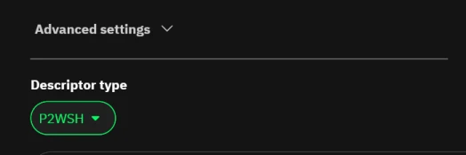
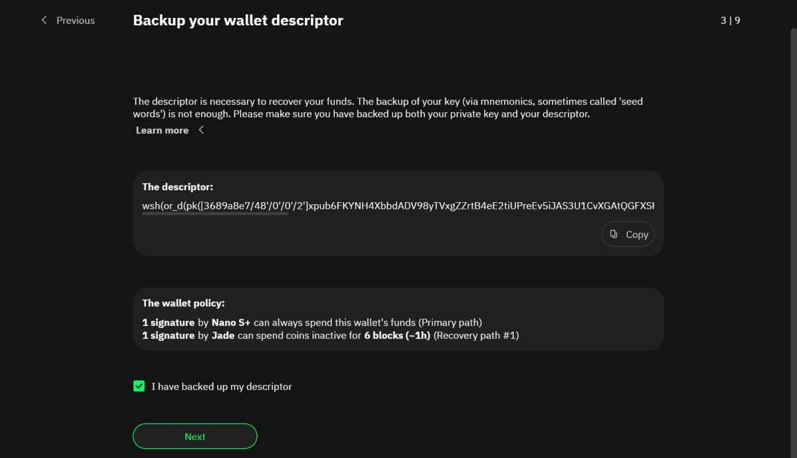
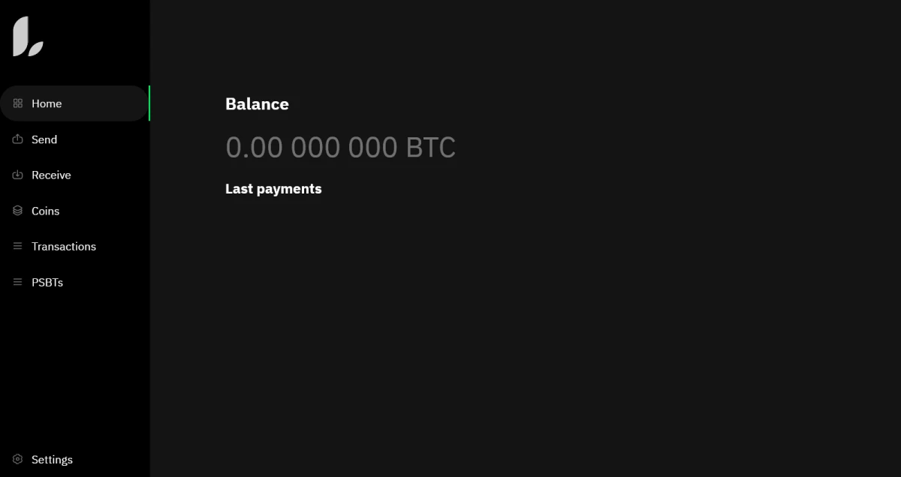
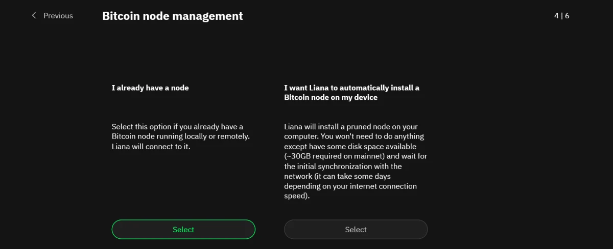

В этом руководстве мы шаг за шагом объясним, как пользоваться приложением Liana на компьютере. Среди прочего, вы узнаете, как настроить автоматический план преемственности, получать и отправлять биткоины в обычных ситуациях, а также получать средства из существующего портфеля через определенный период.

В январе 2025 года аппаратными кошельками, совместимыми с Liana, были: BitBox02, Blockstream Jade, Blockstream Jade Plus, COLDCARD MK4, COLDCARD Q, Ledger Nano S, Ledger Nano S Plus, Ledger Nano X, Ledger Flex, Specter DIY.

Если вы хотите восстановить средства с существующего кошелька Liana, прочитайте презентацию ниже и перейдите непосредственно к разделу "Восстановление биткоинов".

## Представляем вашему вниманию программное обеспечение Liana

Liana - это программный пакет с открытым исходным кодом, предназначенный для создания и управления расширенными портфелями, в частности, как часть автоматизированной системы наследования или надежного механизма резервного копирования. Проект разрабатывается с 2022 года компанией Wizardsardine, соучредителями которой являются Кевин Лоак и Антуан Пуансо. На официальном сайте Liana представлена как "простое портфолио для персонального хранения, с функциями восстановления и наследования". Программа работает на компьютерах - Linux, MacOS, Windows - и ее (открытый) исходный код доступен [на GitHub] (https://github.com/wizardsardine/liana).

Liana использует возможности программирования Биткойна для создания продвинутого кошелька. В частности, он использует преимущества временных блокировок (*timelocks*), которые позволяют тратить средства только по истечении определенного периода времени и которые участвуют в восстановлении биткоинов. Таким образом, кошелек Liana состоит из нескольких путей расходования средств:


- Основной путь трат, который всегда доступен;
- Как минимум один путь восстановления, который становится доступным через определенное время.

На диаграмме ниже показана работа портфеля с двумя направлениями расходов:


Эта операция позволяет настроить различные конфигурации, включая :


- План преемственности (или наследования), позволяющий наследникам получить средства в случае смерти пользователя. Для получения дополнительной информации по этому вопросу мы рекомендуем прочитать [часть 4](https://planb.network/courses/btc102/233c88d3-2e8e-5eba-ac06-efe67a209038) курса BTC102.
- Усиленное резервное копирование с временем восстановления, дающее пользователю возможность пользоваться своим кошельком без необходимости хранить соответствующую секретную фразу и рисковать его кражей, например, во время ограбления.
- Система безопасности для людей, начинающих работать с биткойном: они будут управлять собственным кошельком, а их "опекун" (например, родственник) оставит за собой право вернуть средства через определенный период.
- Многосторонняя схема подписи (*multisig*) с пониженными требованиями со временем, чтобы справиться с исчезновением одного или нескольких участников, например, партнеров компании.

Главная особенность Liana заключается в том, что она представляет собой стандартизированный способ гарантированного возврата средств в случае потери основного ключа, используемого для текущих расходов. Это огромное новшество для чистого хранения средств, которое сопряжено с риском, особенно если вы не очень хорошо осведомлены в этом вопросе. Таким образом, Лиана может побудить даже самых несклонных к риску пользователей отказаться от использования хранителя (например, обменной платформы) для хранения своих средств и вернуть себе право собственности на деньги, что соответствует этике биткойна в стиле шифропанк.

Конечно, у Лианы есть свои недостатки. Первый из них заключается в том, что вам придется регулярно обновлять свой кошелек, совершая транзакцию в блокчейне Биткойна. Это может быть хлопотно (в зависимости от того, как часто вы пользуетесь программой) и дорого (в зависимости от уровня комиссии на данный момент), но такова цена, которую вы платите за дополнительную безопасность.

Вторым негативным моментом может стать конфиденциальность. Если вы подключаете к конфигурации другого человека, он получает доступ ко всем вашим адресам и, следовательно, может следить за вашей деятельностью. Однако это не будет проблемой, если вы выберете усиленное резервное копирование или план наследования, при котором ваш наследник не будет сразу знать детали портфеля.

## Подготовка

В этом уроке мы создадим план преемственности. Мы будем использовать :


- Ledger Nano S Plus - для повседневных расходов;

https://planb.network/tutorials/wallet/hardware/ledger-nano-s-plus-75043cb3-2e8e-43e8-862d-ca243b8215a4

- Blockstream Jade, используемый для возврата средств;

https://planb.network/tutorials/wallet/hardware/jade-7d62bf0c-f460-4e68-9635-af9b731dabc3

- Два носителя (USB-накопители) для хранения дескриптора портфолио;
- Письмо о правопреемстве, содержащее инструкции по возврату средств;
- Пронумерованный запечатанный пакет, гарантирующий, что устройство для восстановления (Jade) не было использовано.

## Установка и настройка

Посетите официальный сайт Wizardsardine и загрузите Liana по адресу https://wizardsardine.com/liana/. Вы также можете скачать последнюю версию [из репозитория GitHub](https://github.com/wizardsardine/liana/releases), где вы можете проверить подлинность программы. В данном руководстве используется версия 0.9.


Чтобы узнать, как вручную проверить подлинность и целостность программного обеспечения перед установкой, мы рекомендуем вам ознакомиться с этим руководством:

https://planb.network/tutorials/others/general/integrity-authenticity-21d0420a-be02-4663-94a3-8d487f23becc
Установите программу на свой компьютер и запустите ее. Выберите опцию "*Создать новый кошелек Liana*", чтобы настроить свой кошелек.


Выберите тип портфеля. Если вы хотите создать расширенную резервную копию с временем восстановления, вы можете выбрать опцию "*Создать свою собственную*" и выбрать схему по умолчанию. Это будет работать практически так же, за исключением того, что вам не нужно будет сохранять фразу о восстановлении аппаратного кошелька.

Мы не учитываем здесь случай *Расширяющейся мультисигмы*, которая задает более сложную конфигурацию.

В рамках этого урока мы будем использовать простое наследование.


Далее следует краткое объяснение.


Прочитав объяснения, вы сможете настроить ключи от кошелька Liana. Это очень важный шаг, так как он определяет расходные характеристики вашего счета.


Прежде всего, в меню "Дополнительные настройки" вы можете выбрать "тип дескриптора", то есть способ, которым договор будет записан на цепочке. Вы можете выбрать один из двух типов: P2WSH (SegWit) или Taproot. В обоих случаях семантика условий расходования средств будет одинаковой. Хотя P2WSH делает контракт более понятным, Taproot превосходит его тем, что скрывает неиспользуемые условия и экономит затраты на их поиск.

Этот выбор необязателен: если вы сомневаетесь, оставьте вариант по умолчанию (P2WSH в случае версии 0.9, но это может быть изменено).



Далее настройте первичный ключ (*primary key*). Этот ключ (точнее, этот набор ключей) будет использоваться для текущего расходования средств, на которое не распространяются никакие временные условия. Нажав на кнопку "*Set*", вы можете выбрать соответствующее *устройство подписи*. В нашем случае мы выбрали аппаратный кошелек Ledger Nano S Plus.

Разрешите общий доступ к расширенному открытому ключу устройства. Дайте этому ключу значимое имя (в данном случае "Nano S+"). Обратите внимание, что все приложения, установленные на устройстве, будут продолжать работать в обычном режиме.


Затем задайте задержку окупаемости, то есть время, через которое средства могут быть потрачены по *наследственному ключу*. Эта задержка задается в блоках, каждый из которых отделяется в среднем 10 минутами. Она может составлять от 10 минут (1 блок) до примерно 15 месяцев (65 535 блоков). Этот верхний предел является ограничением протокола Bitcoin, поскольку время блокировки кодируется в 16 битах.

Если нет особых обстоятельств, выбирайте самый длительный срок выполнения заказа: 15 месяцев или 65 535 блоков. Это сэкономит ваши расходы. Тем не менее мы рекомендуем выполнять процедуру обновления (описанную в разделе "Обновление портфеля") раз в год, всегда в одно и то же время года, чтобы "ритуализировать" эту практику и не забывать о ней.

Здесь мы установили время восстановления в один час (6 блоков), чтобы провести наши тесты.


И наконец, настройте ключ к своему имуществу. Этот ключ (точнее, набор ключей) будет использоваться для возврата средств в случае вашего исчезновения. Нажмите кнопку "*Установить*", выберите устройство подписи и подтвердите совместное использование расширенного открытого ключа на нем.

Для этого урока мы выбрали Jade. Дайте ключу вызывающее имя (здесь "Jade"). Как и в случае с первым устройством, обычные учетные записи будут продолжать работать.


Когда все эти действия будут выполнены, проверьте, все ли в порядке, и нажмите "*Продолжить*", чтобы подтвердить свой выбор.


Следующий шаг - сохранение дескриптора портфеля. Это информация, необходимая для поиска средств на вашем счете. В отличие от мнемонической фразы, дескриптор не позволяет тратить средства, поэтому его разглашение создаст лишь проблему конфиденциальности (человек будет знать все ваши транзакции).

Сохраните две копии дескриптора на электронном носителе, например на USB-накопителе. Обязательно распечатайте две копии на бумаге, чтобы иметь к ним доступ в случае повреждения электронных носителей. Каждая резервная копия должна быть связана с устройством подписи.



Наш дескриптор (который анализируется в конце учебника) выглядит следующим образом:

```plaintext
wsh(or_d(pk([3689a8e7/48'/0'/0'/2']xpub6FKYNH4XbbdADV98yTVxgZZrtB4eE2tiUPreEv5iJAS3U1CvXGAtQGFXSHyFYdYNn9wNa9KU1pwfYoxQhwq4sPXGihD725VncdSy66v9WQa/<0;1>/*),and_v(v:pkh([42e629dd/48'/0'/0'/2']xpub6DpQGv9LkwAQXvghWASvsfA7t1BVj7bGDQ939v32iB6aUJsMRB6inckim26gRp74NBdS2zuyfHNXDZ9dTuNXkFFiz6QvwEeVvBuC2cnRWQd/<0;1>/*),older(6))))#8alrve5h
```

Последним шагом в начальной конфигурации портфеля является проверка дескриптора в каждом из аппаратных портфелей, которые служат устройствами подписи.


Сделайте то же самое для каждого подписывающего устройства. Вам нужно будет проверить и подтвердить, что дескриптор был добавлен в каждый портфель оборудования.


Информация о вашем кошельке зарегистрирована, осталось только настроить способ подключения к сети Bitcoin. Вы можете использовать свой собственный узел (локальный или удаленный) или воспользоваться инфраструктурой WizardSardine. В последнем случае вам нужно будет привязать к кошельку адрес электронной почты, с помощью которого вы сможете получить дескриптор. WizardSardine будет иметь доступ ко всем вашим транзакциям. Поэтому рекомендуется выбрать первый вариант.


Мы решили использовать собственный узел. Вы можете использовать существующий узел или установить на свою машину *урезанный узел*. Если у вас нет доступа к другому узлу, установите свой собственный узел на своей машине, что займет некоторое время (порядка нескольких дней).


Для этого урока мы использовали существующий (публичный) сервер Electrum. Но будьте осторожны! Он имел доступ ко всем нашим действиям с кошельком Liana. Поэтому используйте собственную ноду, если хотите защитить свою конфиденциальность.


После завершения настройки узла на главном экране должен отобразиться только что созданный кошелек Liana.

Воспользуйтесь возможностью хранить устройство восстановления в безопасном месте. Оно должно храниться в стратегически важном месте, чтобы его могли найти ваши наследники в случае вашей смерти.

Для дополнительной безопасности вы можете поместить компоненты, используемые для восстановления, в запечатанный пакет (*tamper-evident bag*) и записать его серийный номер. Это гарантирует, что никто не имел к нему доступа и что ваше устройство остается в силе.

В нашем примере мы собрали следующие элементы:


- Blockstream Jade - устройство для подписи наследства;
- Кабель USB для подключения и подзарядки устройства;
- Бумажная резервная копия предложения на случай неисправности или повреждения устройства (обратите внимание, что носитель может быть и металлическим, а значит, защищенным от внешних воздействий, как, например, в случае с капсулами Cryptosteel);
- USB-носитель, содержащий дескриптор портфеля ;
- Бумажная резервная копия дескриптора на случай неисправности или повреждения USB-носителя (эта резервная копия здесь не сфотографирована);
- Письмо о правопреемстве с описанием действий, которые необходимо предпринять для возврата средств.


И мы поместили эти предметы под печать!


## Получение средств

На главном экране Лианы отображается ваш баланс и операции (прошлые и текущие), связанные с вашим портфелем. В нашем случае баланс равен нулю, что вполне нормально.



Чтобы получить средства, перейдите на вкладку "*Получение*" и нажмите на "*Генерировать адрес*". На экране должен появиться новый адрес. Он длиннее, чем в обычных портфелях: это адрес, привязанный к отдельному контракту (P2WSH или Taproot).


Вам необходимо проверить этот адрес на вашем аппаратном портфеле, нажав на кнопку "*Проверить на аппаратном устройстве*".


После отправки средств транзакция появляется на главном экране (сначала как неподтвержденная, затем как подтвержденная). В данном тесте мы отправили 50 000 сатоши (чуть больше 50 долларов на момент перевода). Разумеется, в вашем случае сумма перевода должна быть на порядок выше этой величины из-за комиссии за транзакцию.


Вы можете проверить статус истечения срока действия ваших средств, перейдя на вкладку "*Монеты*". На этой вкладке отображаются различные монеты (UTXO) в вашем кошельке. Здесь мы видим, что срок действия монеты в 50 000 сатоши, созданной в результате нашей транзакции, истекает в тот же день (через час).


Чтобы лучше понять модель представления UTXO, используемую в биткойне, вы можете ознакомиться с первой частью курса по конфиденциальности в биткойне, написанного Лоиком Морелем:

https://planb.network/courses/btc204
## Текущие расходы

Текущие расходы - это нормальная ситуация для использования Liana. Отправка биткоинов с помощью мастер-ключа работает так же, как и во всех классических биткоин-кошельках, таких как Electrum или Sparrow.

Чтобы произвести оплату, перейдите на вкладку "*Отправить*" и введите основную информацию: BTC-адрес получателя, сумму для отправки и желаемую ставку оплаты. Для удобства можно также добавить описание (сохраняется локально). В нашем примере мы отправили 10 000 сатоши некоему Бобу по курсу 4 сат/ов, или $0,67 на момент транзакции.

Лиана также предлагает "управление монетами": вы указываете, какую монету (UTXO) вы хотите потратить. Здесь мы выбрали созданную ранее монету в 50 000 сатоши.


Затем подпишите транзакцию с помощью устройства подписи, связанного с мастер-ключом, нажав на кнопку "*Подписать*". Вам нужно будет проверить и подтвердить транзакцию на вашем аппаратном кошельке. Здесь мы использовали Nano S Plus для подписания транзакции.


Наконец, транслируйте транзакцию в сеть, нажав "*Broadcast*". Обратите внимание, что отправка средств обнуляет время восстановления использованных монет.


Транзакция появится на главном экране, а ваш баланс будет обновлен.


## Обновление портфолио

Как объяснялось выше, кошелек Liana требует, чтобы вы регулярно обновляли свои средства, совершая транзакцию на блокчейне. Если вы этого не сделаете, ваши средства могут быть восстановлены вашим наследником (или вторым устройством в случае расширенного резервного копирования). Такая ситуация не является чрезвычайно опасной, но она лишает цель создания этого механизма: сохранить контроль над своими биткоинами, не прибегая к помощи доверенной третьей стороны, и в то же время воспользоваться системой безопасности.

Предупреждение появится до того, как истечет срок действия ваших средств (или их части), которые можно будет потратить с помощью ключа восстановления. В нем будет указано, что ваш "путь восстановления" (*путь восстановления*) скоро будет доступен. Учитывая короткое время восстановления (один час), это сообщение отображается непосредственно в нашем случае.


Когда срок истечет, появится кнопка, предлагающая обновить соответствующие средства.


Чтобы обновить монеты, перейдите на вкладку "*Монеты*" и нажмите на кнопку "*Обновить монету*" в соответствующем поле для монет. Если у вас несколько монет, то в целях конфиденциальности обновлять их следует по одной и через относительно короткие промежутки времени. Чтобы сократить расходы, вы можете объединить средства, отправив весь портфель на новый адрес получения, но это повлияет на конфиденциальность.


Укажите желаемую ставку комиссии за транзакцию. Поскольку это перевод самому себе, вы можете установить довольно низкую ставку комиссии, особенно если сделаете это за несколько дней до истечения срока действия.


Транзакция (с пометкой "*самостоятельный перевод*") будет видна только на вкладке "*Транзакции*".


После подтверждения ваша монета в безопасности! Вы можете спокойно отдыхать до следующего срока годности.

## Восстановление биткоина

При восстановлении средств из портфеля Liana вы можете столкнуться с одной из двух ситуаций. Возможно, у вас есть доступ к компьютеру, на котором установлено программное обеспечение, и в этом случае вам нужно лишь открыть его (что и произойдет в случае расширенной модели резервного копирования). Однако у вас может не быть доступа к этому компьютеру, поэтому здесь мы начнем с нуля. Обратите внимание, что процедура восстановления одинакова в обоих случаях.

Чтобы начать работу, загрузите Liana с [официального сайта Wizardsardine] (https://wizardsardine.com/liana/) или с [репозитория GitHub] (https://github.com/wizardsardine/liana/releases), где вы можете проверить подлинность программы. Установите программу и запустите ее. В нашем случае используется версия 0.9, поэтому визуальные эффекты могут измениться. На экране приветствия выберите опцию "Добавить существующий кошелек Liana".


Настройте способ подключения к сети. Вы можете использовать свой собственный узел (локальный или удаленный) или воспользоваться инфраструктурой WizardSardine. В последнем случае вам понадобится адрес электронной почты создателя портфеля, чтобы средства могли быть найдены автоматически. Если у вас нет такой информации, выберите первый вариант.


Если вы используете собственный узел, импортируйте дескриптор портфеля. Это техническое описание счета, позволяющее получить информацию о средствах, хранящихся на нем. В нашем случае это следующая информация:

```plaintext
wsh(or_d(pk([3689a8e7/48'/0'/0'/2']xpub6FKYNH4XbbdADV98yTVxgZZrtB4eE2tiUPreEv5iJAS3U1CvXGAtQGFXSHyFYdYNn9wNa9KU1pwfYoxQhwq4sPXGihD725VncdSy66v9WQa/<0;1>/*),and_v(v:pkh([42e629dd/48'/0'/0'/2']xpub6DpQGv9LkwAQXvghWASvsfA7t1BVj7bGDQ939v32iB6aUJsMRB6inckim26gRp74NBdS2zuyfHNXDZ9dTuNXkFFiz6QvwEeVvBuC2cnRWQd/<0;1>/*),older(6))))#8alrve5h
```


Затем Лиана попросит вас ввести мнемоническую фразу. Если у вас есть работающее устройство подписи (аппаратный кошелек), пропустите эту часть. Если устройство отсутствует или повреждено, но у вас есть соответствующие 12 или 24 слова, вы все равно можете воспользоваться этой опцией. Чтобы подстраховаться (если сумма, которую нужно восстановить, велика), мы все же советуем приобрести новый аппаратный кошелек и использовать мнемонику для восстановления ключей на нем.

В нашем случае мы используем аппаратный кошелек Blockstream Jade в качестве устройства восстановления и решили пропустить ("*Skip*") этот шаг.


Проверьте и сохраните дескриптор в устройстве подписи, выбрав его на экране. Если аппаратный кошелек не отображается, проверьте, что он подключен и разблокирован. Проверьте и подтвердите, что эта информация была добавлена в ваше устройство.


Настройте свой узел. Вы можете использовать существующий узел или установить *разрезанный узел* на вашу машину. В нашем случае мы использовали существующий узел.



Для этого урока мы использовали публичный сервер Electrum. Однако он имел доступ ко всем нашим действиям с кошельком Liana. Если вы хотите защитить свою конфиденциальность, лучше использовать собственную ноду.


После настройки узла вы попадаете на главный экран кошелька, где можно просмотреть баланс и прошлые транзакции, связанные со счетом. Вы также можете узнать, можно ли получить средства. Здесь мы видим, что монета может быть получена.


Чтобы восстановить средства в портфеле, перейдите в раздел "Настройки" ("*Settings*") слева внизу и нажмите на "*Восстановление*".


Потратьте монету в кошельке, отметив соответствующее поле. Укажите BTC-адрес, на который вы хотите отправить средства, а также размер комиссии за транзакцию. Затем нажмите на кнопку "*Следующее*".


Подпишите транзакцию, нажав на кнопку "*Подписать*" и подтвердив ее на аппаратном кошельке.


Затем передайте его по сети, нажав на кнопку "*Передача*".


Транзакция должна появиться на главном экране. После подтверждения восстановление завершено!


## Видео

Если вы хотите узнать больше о Liana, есть несколько видеоматериалов, которые дадут вам более четкое представление о том, как она работает. Вот видеопрезентация Liana с Кевином Лоаком и Антуаном Пуансо:


А вот учебник по использованию Лианы с Антуаном Пуансо:


Манипуляции, показанные в нем, аналогичны тем, что представлены в этом учебнике.

## Бонус: дескрипторный анализ

Дескриптор - это человекочитаемая символьная строка, исчерпывающе описывающая набор адресов. Он сочетает в себе ряд важных сведений для поиска частей (UTXO) расширенного портфеля. Способ написания дескриптора основан на [Miniscript syntax](https://bitbox.swiss/blog/understanding-bitcoin-miniscript-part-2/), языке сценариев, разработанном Эндрю Поелстра, Питером Вуйлем и Санкетом Канджалкаром в 2019 году.

Чтобы лучше понять, почему эта символьная строка важна, давайте проанализируем дескриптор в нашем примере, который является :

```plaintext
wsh(or_d(pk([3689a8e7/48'/0'/0'/2']xpub6FKYNH4XbbdADV98yTVxgZZrtB4eE2tiUPreEv5iJAS3U1CvXGAtQGFXSHyFYdYNn9wNa9KU1pwfYoxQhwq4sPXGihD725VncdSy66v9WQa/<0;1>/*),and_v(v:pkh([42e629dd/48'/0'/0'/2']xpub6DpQGv9LkwAQXvghWASvsfA7t1BVj7bGDQ939v32iB6aUJsMRB6inckim26gRp74NBdS2zuyfHNXDZ9dTuNXkFFiz6QvwEeVvBuC2cnRWQd/<0;1>/*),older(6))))#8alrve5h
```

Из этого дескриптора можно извлечь следующую информацию:


- `wsh` (сокращение от *witness script hash*): Это тип создаваемого транзакционного вывода. Если бы мы решили использовать Taproot, идентификатор был бы `tr`.
- `or_d`: Это логический оператор, указывающий, что для принятия расхода должно быть выполнено *одно из двух* следующих условий (символ `_d` указывает на особый синтаксис).
- `pk` (сокращение от *публичный ключ*): Этот оператор проверяет заданную подпись по следующему открытому ключу и выдает ответ в виде булевых значений (TRUE или FALSE).
- `[3689a8e7/48'/0'/0'/2']`: Этот элемент включает в себя *отпечаток* главного ключа для основного аппаратного кошелька (в данном случае Nano S Plus), а также путь к связанному расширенному закрытому ключу (на основе которого создаются все остальные закрытые ключи).
- `xpub6FKY ... WQa`: Это расширенный открытый ключ, связанный с основным аппаратным портфелем (здесь Nano S Plus)
- `/<0;1>/*`: Это пути деривации для получения простых ключей и адресов: `0` для приема, `1` для внутренних операций (*change*), с "подстановочным знаком" (`*`), позволяющим последовательно деривировать несколько адресов настраиваемым способом, подобно управлению "лимитом пробелов" в классическом портфельном ПО.
- and_v`: Это логический оператор, указывающий, что для принятия расхода должны быть выполнены *следующие два* условия (символ `_v` указывает на особый синтаксис).
- `v:pkh` (сокращение от *verify: public key hash*): Этот оператор проверяет заданную подпись и открытый ключ на соответствие хэшу открытого ключа (*hash*), который следует за ним. По сути, это та же проверка, что и для скриптов P2PKH и P2WPKH.
- `[42e629dd/48'/0'/0'/2']`: Это тот же элемент, что и выше (состоящий из трассировки и пути деривации), за исключением того, что указывается трассировка мастер-ключа портфеля аппаратного восстановления (в данном случае Jade).
- `xpub6DpQ ... WQd`: Это расширенный открытый ключ, связанный с аппаратным кошельком восстановления (здесь Jade).
- `older(6)` : Этот оператор проверяет, что созданный транзакционный вывод должен иметь возраст строго больше 6 блоков, чтобы быть потраченным.

Последний элемент данных (`8alrve5h`) является контрольной суммой дескриптора и соответствует идентификатору портфеля.

Сценарии, созданные в этом портфолио, будут иметь следующий вид:

```plaintext
<primary_key> CHECKSIG IFDUP NOTIF DUP HASH160 <recovery_key_hash> EQUALVERIFY CHECKSIGVERIFY <locktime> CHECKSEQUENCEVERIFY ENDIF
```

Поскольку безопасность вашего кошелька Bitcoin также зависит от вашего понимания того, как он работает, я предлагаю вам подробно изучить механизмы работы детерминированных и иерархических кошельков, пройдя этот бесплатный учебный курс по Plan ₿ Network :

https://planb.network/courses/cyp201