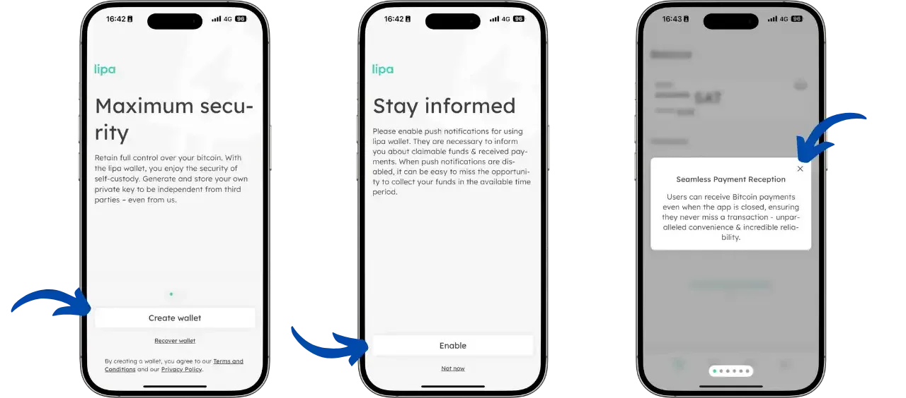
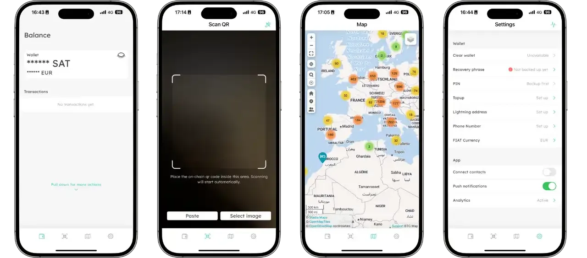
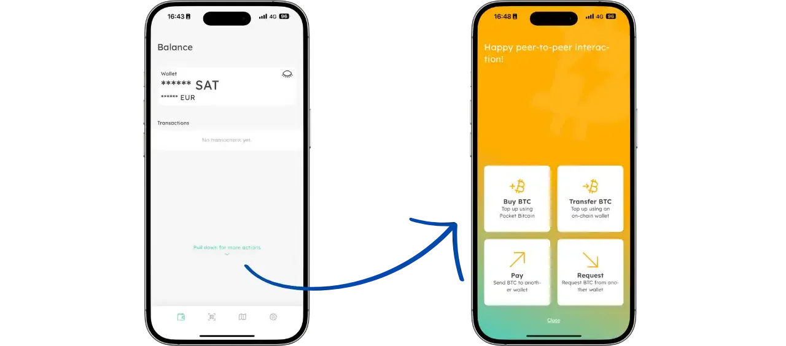
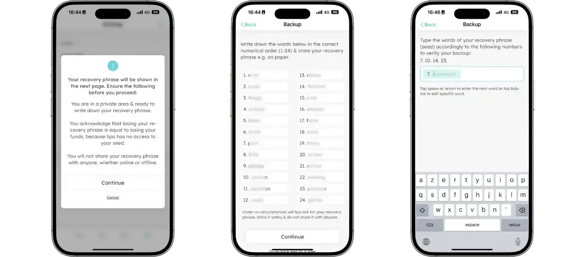
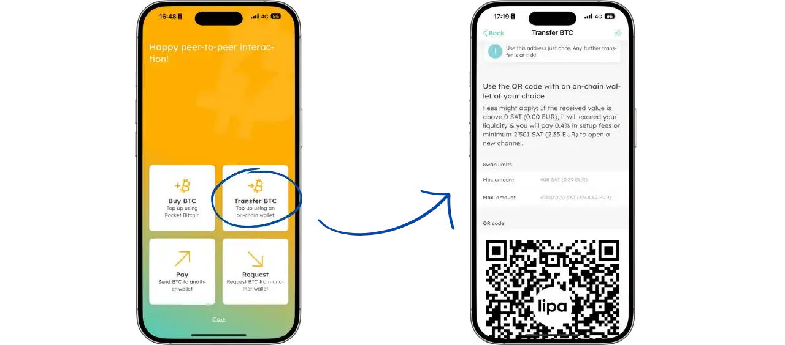
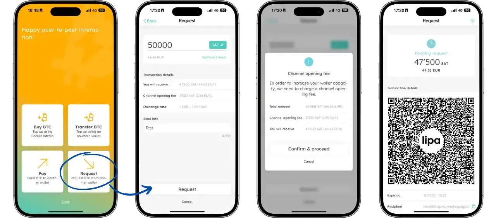
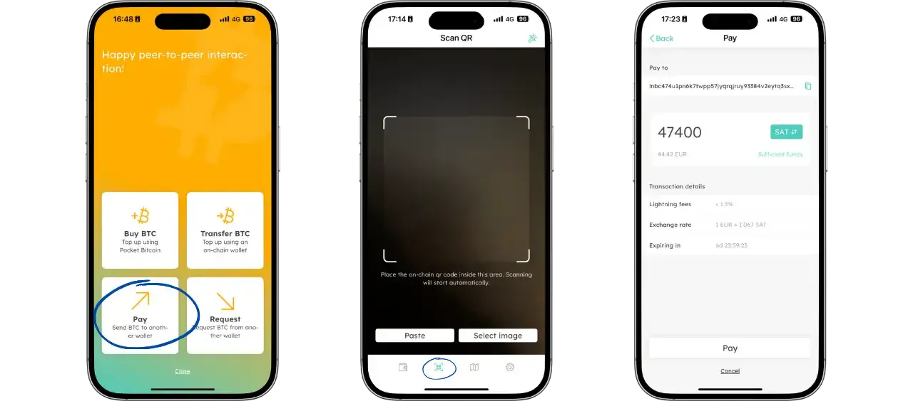
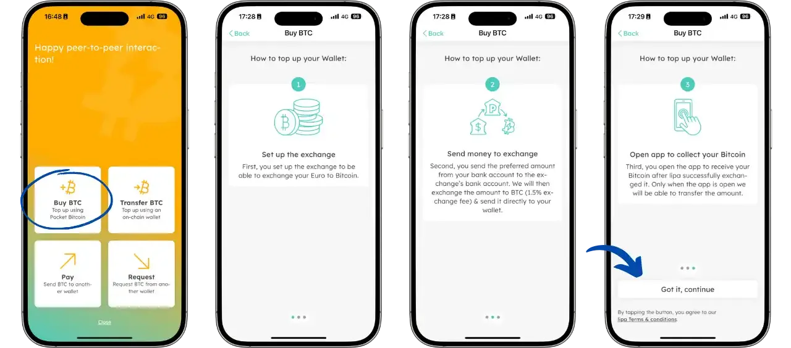
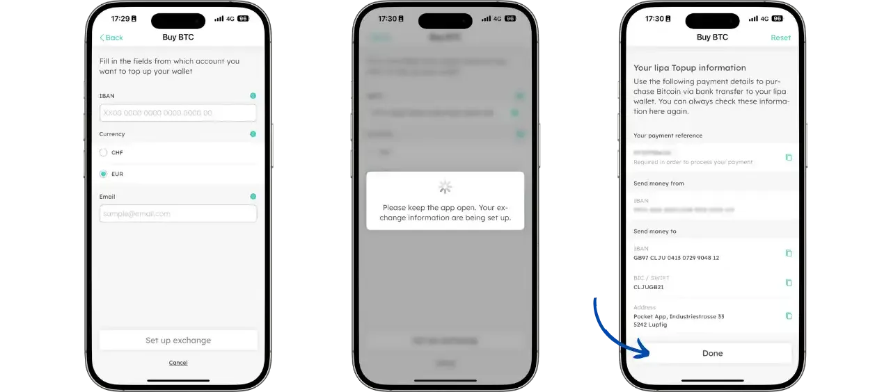
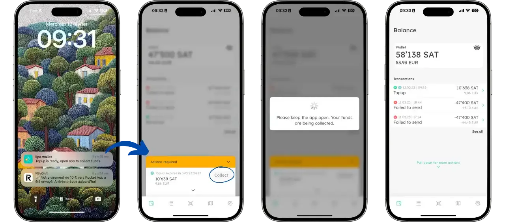

Un portefeuille Bitcoin Lightning est une application mobile permettant d'effectuer des transactions instantanées et à faibles coûts sur le réseau Lightning de Bitcoin. Contrairement aux transactions sur la blockchain principale (on-chain), les paiements Lightning sont quasi-instantanés et ne nécessitent que des frais minimes, ce qui les rend particulièrement adaptés aux petits paiements du quotidien.

Les portefeuilles Lightning, comme tous les portefeuilles mobiles, sont considérés comme des portefeuilles "chauds" car ils sont connectés à Internet. Ils sont donc principalement destinés à la gestion de petits montants pour vos dépenses courantes. Pour des montants plus importants, il est préférable d'utiliser des solutions de stockage plus sécurisées comme les hardware wallets.

Dans ce tutoriel, nous allons découvrir **Lipa**, un portefeuille Lightning simple et efficace développé en Suisse.

## Présentation de Lipa

Lipa est un portefeuille Lightning non-custodial qui se distingue par sa simplicité d'utilisation et son interface épurée. Développé par une équipe suisse, il met l'accent sur la confidentialité et la facilité d'utilisation pour les débutants.

Parmi ses principales caractéristiques :
- Interface utilisateur intuitive
- Gestion autonome des canaux Lightning
- Support du protocole LNURL
- Possibilité d'acheter des bitcoins directement dans l'application
- Sauvegarde chiffrée sur le cloud
- Support multilingue

## Installation et configuration de Lipa

La première étape consiste à télécharger l'application Lipa. Pour le moment, elle n'est disponible que sur iOS (version 15.0 minimum) :
- [Pour Apple](https://apps.apple.com/app/lipa-bitcoin-lightning/id1602180066)

La version Android est actuellement en cours de développement et sera bientôt disponible.

Une fois l'application lancée, vous arriverez sur l'écran d'accueil qui vous propose deux options :
- Créer un nouveau portefeuille
- Restaurer un portefeuille existant à partir d'une sauvegarde

Après avoir choisi votre option, l'application vous invite à activer les notifications. Cette étape est importante car les notifications sont nécessaires pour :
- Recevoir des alertes lors de la réception de paiements, même lorsque l'application est fermée
- Être informé des étapes lors de l'achat de bitcoin via leur solution intégrée

L'application présente ensuite ses principales fonctionnalités à travers une série d'écrans d'introduction :

- **Réception de paiements transparente** : Les utilisateurs peuvent recevoir des paiements Bitcoin même lorsque l'application est fermée, garantissant une fiabilité et une commodité inégalées.

- **Adresses Lightning non-custodiales** : Lipa supporte désormais les adresses Lightning non-custodiales, renforçant la confidentialité et la sécurité en donnant aux utilisateurs un contrôle total sur leurs bitcoins.

- **Contrôle des données analytiques** : La transparence et la confidentialité étant primordiales, les utilisateurs peuvent consulter les types de données collectées et choisir leurs préférences de partage.

- **Envoi via numéro de téléphone** : Plus besoin d'adresses complexes - sélectionnez simplement un contact, entrez le montant, et envoyez des bitcoins directement vers leur numéro de téléphone.

L'application bénéficie également d'améliorations continues en termes de stabilité, de sécurité et de fiabilité pour garantir une expérience utilisateur optimale.

## Navigation dans l'application

L'interface de Lipa est organisée autour de 4 onglets principaux accessibles via la barre de navigation en bas de l'écran :

- **Accueil** : Affiche votre solde actuel et l'historique de vos transactions
- **Scanner** : Permet de scanner des QR codes pour effectuer des paiements
- **Carte** : Affiche une carte interactive des commerces acceptant Bitcoin dans votre région
- **Paramètres** : Accès aux réglages de l'application, à la sauvegarde et aux préférences

Un menu supplémentaire est accessible en tirant l'écran d'accueil vers le bas :

Ce geste révèle des fonctionnalités additionnelles comme :
- L'achat de bitcoins
- Le dépôt de bitcoins on-chain
- La création de factures Lightning pour recevoir des bitcoins
- Le paiement de factures Lightning

## Sauvegarder votre portefeuille

La sauvegarde de votre portefeuille est une étape cruciale. Lipa propose une sauvegarde chiffrée sur le cloud, ce qui facilite la récupération de vos fonds en cas de perte de votre téléphone.

## Recevoir des bitcoins

Pour recevoir des bitcoins, cliquez sur le bouton "Recevoir". Vous pouvez générer une facture Lightning (QR code) pour un montant spécifique ou utiliser une adresse Lightning statique.

L'application affichera un QR code que l'expéditeur pourra scanner pour effectuer le paiement.

## Envoyer des bitcoins

Pour envoyer des bitcoins, cliquez sur le bouton "Envoyer". Vous pouvez scanner un QR code ou coller une facture Lightning.

## Acheter des bitcoins

Lipa permet d'acheter des bitcoins directement dans l'application via des partenaires de confiance.

Sélectionnez le montant désiré et votre méthode de paiement.

Confirmez votre achat et suivez les instructions pour finaliser la transaction.

## Avantages et inconvénients

### Avantages
- Interface très simple et intuitive
- Transactions Lightning instantanées
- Frais de transaction minimes
- Sauvegarde cloud sécurisée
- Achat de bitcoins intégré
- Application non-custodial

### Inconvénients
- Limité au réseau Lightning (pas de transactions on-chain)
- Nécessite une connexion Internet active
- Capacité de stockage limitée (à utiliser pour de petits montants)
- Gestion automatique des canaux (moins de contrôle pour l'utilisateur avancé)

Lipa est un excellent choix pour débuter avec Bitcoin Lightning, particulièrement adapté aux utilisateurs recherchant une solution simple pour les paiements quotidiens. Sa facilité d'utilisation et son interface épurée en font un portefeuille idéal pour les débutants, tout en offrant les fonctionnalités essentielles pour une utilisation quotidienne du réseau Lightning.
